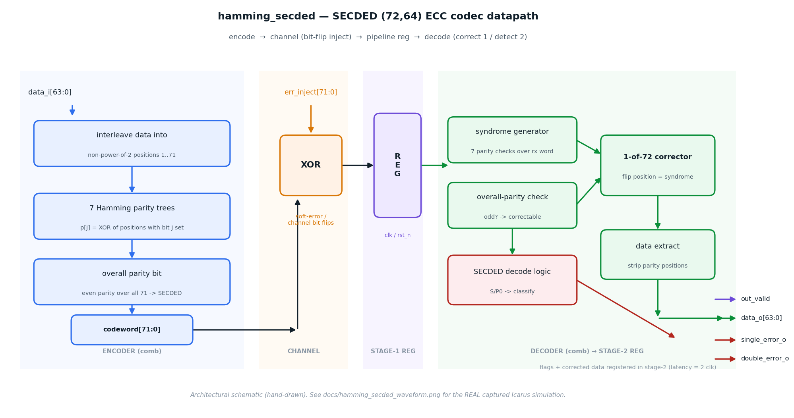
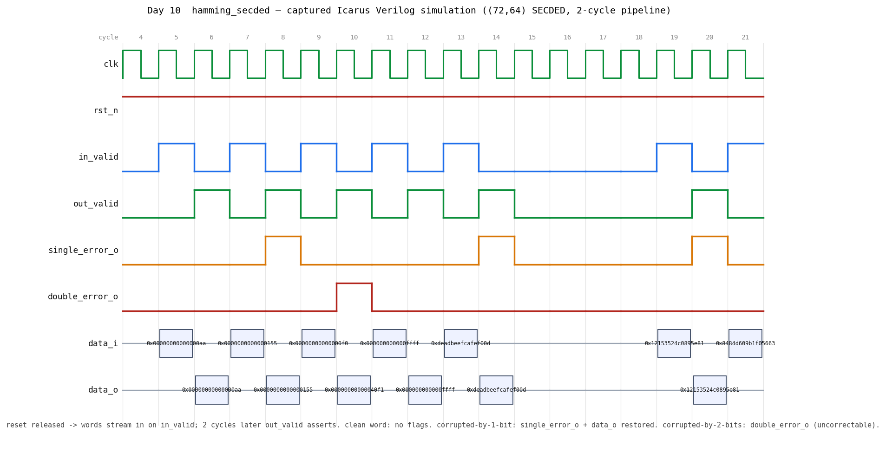

# Day 10 — SECDED Hamming ECC Codec (`hamming_secded`)

A parameterized **SECDED** (Single-Error-Correcting, Double-Error-Detecting)
Hamming code **encoder/decoder** — the exact class of error-correcting code that
protects DRAM, CPU caches, register files, and on-chip SRAM against soft errors
(cosmic-ray / alpha-particle bit flips).

For the default `DATA_WIDTH = 64` this realizes the classic **(72, 64)** SECDED
code: 64 data bits + 7 Hamming parity bits + 1 overall parity bit = a 72-bit
codeword. It **corrects any single-bit error** in the stored word and **detects
(but cannot correct) any double-bit error** — the industry-standard guarantee
for ECC memory.

---

## Circuit / block diagram



*Datapath: the combinational **encoder** interleaves the data bits into the
non-power-of-two codeword positions, computes the 7 Hamming parity trees and the
overall parity bit, and emits a 72-bit codeword. A **channel** XOR injects an
`err_inject` bit-flip mask (modeling soft errors). The corrupted word is captured
in the **stage-1 pipeline register**, then the combinational **decoder**
regenerates the syndrome and overall-parity check, steers a **1-of-72 corrector**,
strips the parity positions, and classifies the result — all registered in
**stage-2** (total latency = 2 clocks). This image is a hand-drawn architectural
schematic, not a simulator screenshot.*

---

## Features

- **True SECDED**: corrects 1-bit errors, detects 2-bit errors, on any 72-bit
  codeword — the standard used by ECC DIMMs.
- **Parameterized** on `DATA_WIDTH`; the parity-bit count `PBITS` and codeword
  width are derived at elaboration from the Hamming inequality
  `2^p ≥ DATA_WIDTH + p + 1`, so `DATA_WIDTH = 8/16/32/64/…` all just work.
- **Standard extended-Hamming construction**: power-of-two positions
  (1, 2, 4, 8, …) hold Hamming parity; every other position holds a data bit; an
  extra overall-parity bit upgrades plain SEC to SECDED.
- **Clean split**: a pure-combinational `hamming_secded_enc` and
  `hamming_secded_dec` (both directly usable as write-path / read-path ECC in a
  memory controller), wired by a **2-stage pipelined top** with a built-in
  error-injection XOR for verification and demonstration.
- **Reset-safe**, `default_nettype none`, no latches, lint-friendly generate-free
  combinational loops.

---

## Parameters

| Parameter | Default | Meaning |
|-----------|---------|---------|
| `DATA_WIDTH` | `64` | User data width in bits. |
| `PBITS` *(derived)* | `7` | Hamming parity bits: smallest `p` with `2^p ≥ DATA_WIDTH + p + 1`. |
| `CW` *(derived)* | `72` | Codeword width = `DATA_WIDTH + PBITS + 1` (incl. overall parity). |

## Ports (top-level `hamming_secded`)

| Port | Dir | Width | Description |
|------|-----|-------|-------------|
| `clk` | in | 1 | Clock. |
| `rst_n` | in | 1 | Active-low synchronous-release async reset. |
| `in_valid` | in | 1 | Assert to feed `data_i` into the pipeline this cycle. |
| `data_i` | in | `DATA_WIDTH` | Data word to encode. |
| `err_inject` | in | `CW` | XOR mask applied to the codeword — models channel / soft-error bit flips (drive `0` for the clean path). |
| `out_valid` | out | 1 | High when `data_o`/flags are valid (2 cycles after `in_valid`). |
| `data_o` | out | `DATA_WIDTH` | Decoded data — **corrected** for single-bit errors. |
| `single_error_o` | out | 1 | A single-bit error was detected **and corrected**. |
| `double_error_o` | out | 1 | A double-bit error was detected (**uncorrectable**). |
| `error_o` | out | 1 | `single_error_o | double_error_o` — any error seen. |

The sub-modules `hamming_secded_enc` (`data_i → code_o`) and
`hamming_secded_dec` (`code_i → data_o + flags`) expose the pure codec if you
want to place the encoder on a RAM's write path and the decoder on its read path.

---

## ASCII block diagram

```
                          err_inject[CW-1:0]  (bit-flip mask)
                                   │
 data_i ─► ┌───────────────────┐   ▼   ┌────────┐   ┌─────┐   ┌────────────────────────┐
           │  ENCODER (comb)    │  XOR  │ stage1 │   │     │   │      DECODER (comb)      │
           │ interleave + 7     ├──►(+)─┤  reg   ├──►│     ├──►│ syndrome gen (7 checks)  │
           │ parity trees +     │       │ (72b)  │   │     │   │ overall-parity check     │
           │ overall parity     │       └────────┘   │     │   │ 1-of-72 corrector        │
           └───────────────────┘                     │     │   │ data extract + classify  │
                                                      └─────┘   └───────────┬──────────────┘
                                                       stage2               │
                                       out_valid ◄───── reg ◄───────────────┤
                                       data_o[63:0], single/double/error ◄──┘
```

`(+)` is the channel XOR; `S` = syndrome (7-bit error position), `P0` = overall
parity. Decode rule: `P0=1` → odd errors → correct position `S`; `P0=0 & S≠0`
→ even errors → **double**, flag uncorrectable; `P0=0 & S=0` → no error.

---

## Simulation timing



*A **real waveform captured from Icarus Verilog** (`make icarus` → VCD → PNG). The
directed front sequence shows, at 2-cycle latency: a **clean word** (`0xAA`)
passing through with no flags; `0x155` **corrupted by 1 data-bit** coming out
**restored** with `single_error_o` asserted; `0xF0` **corrupted by 2 bits** raising
`double_error_o` (uncorrectable); a clean `0xFFFF`; and `0xDEADBEEFCAFEF00D` with
the **overall-parity bit** flipped — data still intact, `single_error_o` asserted.
64-bit buses are shown only in their valid cycle for readability. This is a genuine
simulator dump, not a hand-drawn diagram.*

---

## How it works

**Encoding.** The 64 data bits are dropped into the codeword's non-power-of-two
positions (1..71). Each Hamming parity bit at position `2^j` is the XOR of every
codeword position whose index has bit `j` set — so parity `p[j]` covers exactly
the positions that carry a `1` in binary bit `j`. Finally, one overall parity bit
makes the whole 72-bit word even parity.

**Decoding.** The decoder recomputes the 7 parity checks over the received word;
their concatenation is the **syndrome `S`**. For a clean word `S = 0`. A single
flipped bit at position `e` forces `S = e` (its binary address) — that's the
elegance of Hamming codes. The **overall parity `P0`** distinguishes odd vs even
error counts:

| `P0` | `S` | Meaning | Action |
|------|-----|---------|--------|
| 0 | 0 | no error | pass through |
| 1 | ≠0 | single error at data/parity position `S` | flip bit `S`, `single_error_o` |
| 1 | 0 | the overall-parity bit itself flipped | data intact, `single_error_o` |
| 0 | ≠0 | double error | **uncorrectable**, `double_error_o` |

The corrector flips the one bit addressed by `S`, then the data bits are stripped
back out of the non-power-of-two positions.

---

## What the testbench checks

`tb_hamming_secded.sv` is **self-checking** — the TB is the golden model. It
classifies every transaction by how many codeword bits `err_inject` flips and
predicts the exact result, using a scoreboard queue to absorb the 2-cycle
pipeline latency:

- **0 flips** → `data_o == data_i`, no flags.
- **1 flip** → `data_o == data_i` (**corrected**), `single_error_o=1`, `double_error_o=0`.
- **2 flips** → `double_error_o=1`, `single_error_o=0` (data don't-care — uncorrectable).

Stimulus: a directed front sequence (for the waveform), an **exhaustive
single-error sweep over every one of the 72 codeword bits**, a broad double-error
sweep over distinct bit pairs, and **4000 randomized** transactions with random
data and random 0/1/2-bit injection. A watchdog aborts on hang. It prints
`RESULT: *** PASS ***` only if every check matches.

**Verified with Icarus Verilog 13.0** (`make icarus`): **4149 checks, 0
mismatches, `RESULT: *** PASS ***`.**

---

## Run it

```bash
make icarus      # Icarus Verilog (used to capture the waveform above)
# or
make verilator   # Verilator
make vcs         # Synopsys VCS
make questa      # Siemens Questa / ModelSim
```

Regenerate the images from the captured VCD:

```bash
make icarus
python3 docs/render_waveform.py hamming_secded.vcd docs/hamming_secded_waveform.png
python3 docs/render_block_diagram.py
```
