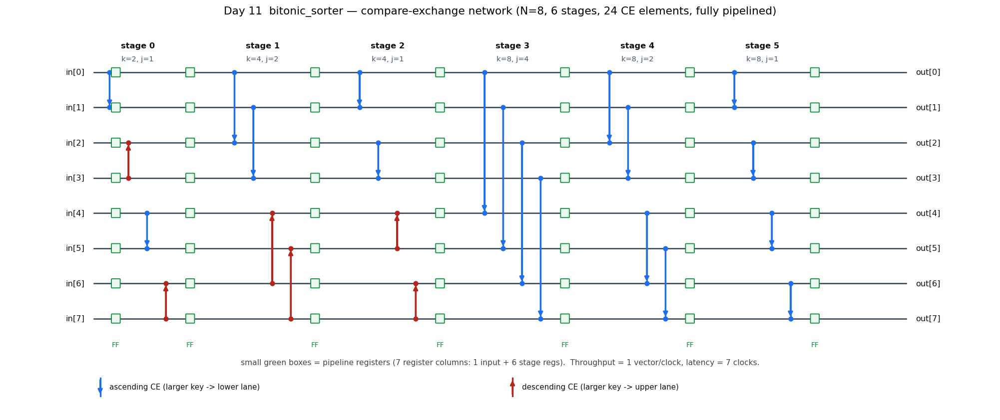
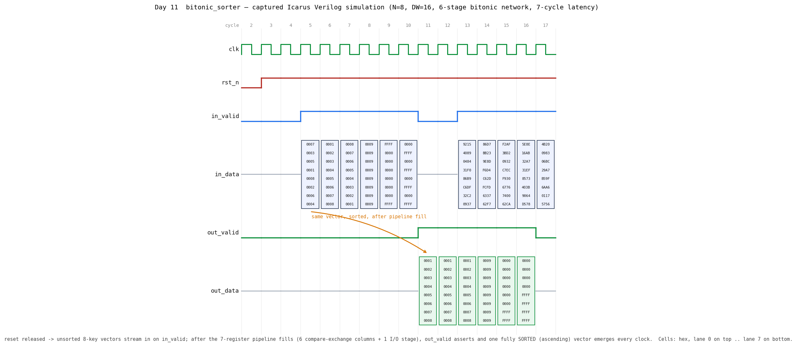

# Day 11 — Pipelined Bitonic Sorting Network (`bitonic_sorter`)

A fully-pipelined, parameterizable **bitonic sorting network** in SystemVerilog.
It sorts a fixed-size vector of `N` keys every clock cycle using a
*data-independent* arrangement of compare-exchange (CE) elements — the classic
way to sort in hardware at line rate.

Unlike a comparison sort in software (data-dependent branches, variable time), a
sorting network is a fixed mesh of compare-and-swap cells. That makes it
constant-latency, stall-free, and trivially timing-closable — exactly what you
want in a high-throughput datapath (packet schedulers, median/rank filters,
top-K engines, priority selection).

---

## Overview

* Sorts an `N`-element vector of `DW`-bit keys, **`N` a power of two**.
* **Bitonic construction**: `S = log2(N)·(log2(N)+1)/2` compare-exchange columns
  with `(N/2)·S` CE elements. For `N=8` → `L=3`, `S=6` stages, `24` CEs.
* **Fully pipelined**: one register column per CE stage plus an input register,
  so the block accepts a brand-new vector **every cycle** and, after the fill
  latency, produces a sorted vector **every cycle** (throughput = 1 vector/clk).
* **Constant latency** = `S + 1` clocks (`7` for `N=8`), independent of the data.
* Supports **signed or unsigned** keys and **ascending or descending** order.
* The entire network (stage list, every CE pair and its direction) is derived
  from `N` at elaboration by constant functions — no hand-wired tables.

---

## Parameters

| Parameter   | Type  | Default | Description                                             |
|-------------|-------|---------|---------------------------------------------------------|
| `N`         | `int` | `8`     | Number of keys per vector. **Must be a power of two, ≥2.** |
| `DW`        | `int` | `16`    | Key width in bits.                                      |
| `SIGNED`    | `bit` | `0`     | `1` = compare keys as two's-complement, `0` = unsigned. |
| `ASCENDING` | `bit` | `1`     | `1` = smallest key lands at index `0`; `0` = largest.   |

## Ports

| Port        | Dir | Width           | Description                                             |
|-------------|-----|-----------------|---------------------------------------------------------|
| `clk`       | in  | 1               | Clock.                                                  |
| `rst_n`     | in  | 1               | Active-low asynchronous reset (clears the valid pipe).  |
| `in_valid`  | in  | 1               | `in_data` carries a fresh vector this cycle.            |
| `in_data`   | in  | `N×DW` (packed) | Unsorted input vector, element `i` = `in_data[i]`.      |
| `out_valid` | out | 1               | `out_data` is a valid sorted vector this cycle.         |
| `out_data`  | out | `N×DW` (packed) | Sorted output vector, `out_data[0]` = smallest (asc).   |

`in_data` / `out_data` are packed arrays `[N-1:0][DW-1:0]`; element `i` occupies
bits `[DW*i +: DW]`.

---

## Circuit diagram (compare-exchange network)

The built circuit for `N=8`: 8 lanes flow left→right through 6 CE stages, with a
pipeline-register column (`FF`) after every stage (plus an input register).



*Schematic drawn directly from the RTL's `(k, j)` stage formulas (not a
simulator screenshot). Blue = ascending compare-exchange, red = descending; a
CE's arrow points to the lane that receives the larger key.*

### ASCII block diagram

```
                 stage 0     stage 1     stage 2     stage 3     stage 4     stage 5
                 (k2,j1)     (k4,j2)     (k4,j1)     (k8,j4)     (k8,j2)     (k8,j1)
 in[0] ─FF─┬───────CE──FF──────CE──FF──────CE──FF──────CE──FF──────CE──FF──────CE──FF── out[0]
 in[1] ─FF─┤        │           │           │           │           │           │        out[1]
 in[2] ─FF─┤   compare-exchange columns of a bitonic network; each CE reads two lanes,   out[2]
 in[3] ─FF─┤   writes back {min,max} in the direction set by (i & k); a register         out[3]
 in[4] ─FF─┤   column (FF) after every stage makes it a fully-pipelined datapath.        out[4]
 in[5] ─FF─┤        │           │           │           │           │           │        out[5]
 in[6] ─FF─┤        │           │           │           │           │           │        out[6]
 in[7] ─FF─┴───────CE──FF──────CE──FF──────CE──FF──────CE──FF──────CE──FF──────CE──FF── out[7]

 latency  =  S + 1  =  7 clocks        throughput  =  1 vector / clock
```

---

## How it works

The bitonic recurrence (0-indexed, ascending) is:

```
for (k = 2;  k <= N;  k <<= 1)          // size of the bitonic sub-sequence
  for (j = k>>1;  j > 0;  j >>= 1)      // CE distance  -> ONE pipeline stage each
    for (i = 0;  i < N;  i++)
      l = i ^ j;                         // CE partner lane
      if (l > i)
        ascending_pair = ((i & k) == 0);
        compare_exchange(a[i], a[l], ascending_pair);
```

Each `(k, j)` pair is exactly **one pipeline stage** of this module. Within a
stage every lane `i` pairs with `l = i ^ j`; the lane comparison feeds a
`{min, max}` swap whose direction is fixed by the constant `(i & k)` (folded with
the `ASCENDING` knob). Because the wiring depends only on lane indices — never on
the data — the stage is pure combinational logic between two register banks.

The module computes the stage geometry at elaboration:

* `L = $clog2(N)` levels, `S = L·(L+1)/2` stages.
* `p_of_stage`, `k_of_stage`, `j_of_stage` map a linear stage index to its
  `(k, j)`; each CE element's partner, "is-low-lane", and direction are all
  `localparam`s, so the synthesizer sees plain muxes and comparators.
* One `always_ff` shifts the data (`stg[0..S]`) and a valid bit (`vpipe[0..S]`)
  down the pipe together, so `out_valid` tracks the vector that produced it.

Signed vs. unsigned is a single `$signed()` cast on the comparison; ascending vs.
descending flips every CE direction via one XOR on the constant.

---

## Simulation timing



*A **genuine captured waveform**: `make icarus` runs the testbench, dumps
`bitonic_sorter.vcd`, and `docs/render_waveform.py` parses that VCD with
matplotlib. It is not a hand-drawn mockup.* Each vector cell stacks its 8 lane
values (hex), lane 0 on top. After reset, unsorted vectors stream in on
`in_valid`; the very first vector `{0007,0003,0005,0001,0008,0002,0006,0004}`
comes out fully sorted `{0001,0002,…,0008}` once the 7-register pipeline fills,
and a sorted vector then appears on **every** clock (the all-`0009` and
mixed `0000/FFFF` vectors that follow are also sorted correctly).

---

## Running it

From this folder, with any one simulator:

```bash
make icarus      # Icarus Verilog (open source)
make verilator   # Verilator
make vcs         # Synopsys VCS
make questa      # Siemens Questa / ModelSim
```

Regenerate the images after a run (needs `matplotlib`):

```bash
make icarus
python3 docs/render_waveform.py         # -> docs/bitonic_sorter_waveform.png (from the VCD)
python3 docs/render_block_diagram.py    # -> docs/bitonic_sorter_block.png
```

### Expected output

```
 bitonic_sorter  N=8 DW=16 SIGNED=0 ASCENDING=1
 latency = 7 cycles (6 stages)
 vectors sent    = 307
 vectors checked = 307
 mismatches      = 0
RESULT: *** PASS ***
```

---

## What the testbench checks

`tb_bitonic_sorter.sv` is **self-checking** against a software golden model:

* **Golden model** — an independent bubble sort (`golden_sort`) computes the
  expected sorted vector for whatever `SIGNED` / `ASCENDING` the DUT is built
  with; the result is pushed into a scoreboard queue when a vector is accepted.
* **Scoreboard** — on every `out_valid` the DUT vector is popped-and-compared
  element-by-element (`!==`, so `X`/`Z` also fail). A `out_valid` with an empty
  queue is flagged as a spurious output; leftover expected vectors at the end are
  flagged as dropped outputs.
* **Stimulus** — directed corner cases first (already-sorted, reverse-sorted,
  all-equal, min/max extremes, alternating `0/FFFF`), then **400 randomized**
  vectors, all with **randomly gapped `in_valid`** to exercise the valid pipeline
  and back-to-back throughput. Inputs are launched on the negedge (non-blocking)
  so the captured waveform is race-free.
* **Watchdog** — an independent timeout aborts a hung run with a `FAIL`.
* Prints `RESULT: *** PASS ***` only if `errors == 0`, every accepted vector was
  checked, and the pipeline drained clean.

> Verified with Icarus Verilog 13.0: **307/307 vectors, 0 mismatches, PASS**
> (unsigned/ascending). The signed + descending configuration was also run and
> passes.
