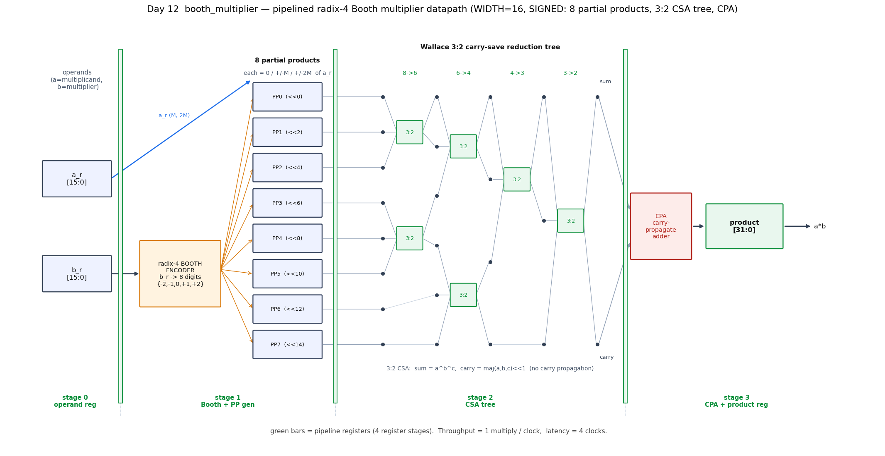
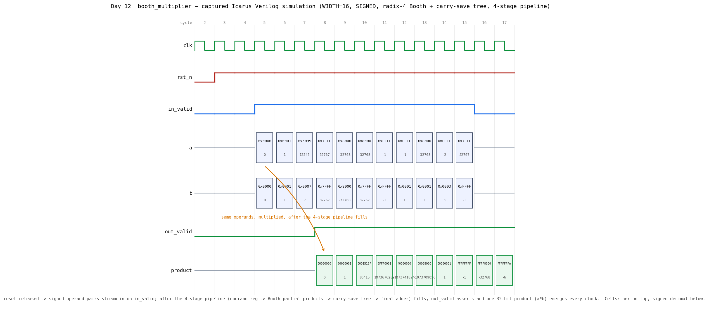

# Day 12 — Pipelined Radix-4 Booth Multiplier (`booth_multiplier`)

A fully-pipelined, parameterizable **signed/unsigned multiplier** in
SystemVerilog built the way real high-speed multipliers are built: **radix-4
(modified) Booth recoding** to halve the number of partial products, a
**Wallace-style 3:2 carry-save reduction tree** to add them with no carry
propagation, and a single **carry-propagate adder (CPA)** at the end to resolve
the result.

A naïve `WIDTH × WIDTH` multiply generates `WIDTH` partial products and adds them
with a chain of adders — slow, and the ripple carries dominate the delay. This
design attacks both problems: Booth recoding cuts the partial-product count to
`≈WIDTH/2`, and the carry-save tree squashes all of them down to a redundant
`{sum, carry}` pair in `O(log N)` full-adder delays with **zero carry
propagation** until the very last stage. It accepts a new operand pair **every
clock** and, after the fixed fill latency, produces a full double-width product
**every clock**.

---

## Overview

* Computes the exact `2·WIDTH`-bit product of two `WIDTH`-bit operands.
* **Radix-4 modified Booth encoding** — the multiplier is scanned two bits at a
  time (with a 1-bit overlap) and recoded into signed digits
  `d ∈ {−2, −1, 0, +1, +2}`, so only `G = ⌈WIDTH/2⌉`-ish partial products are
  generated instead of `WIDTH`. For `WIDTH=16` → **8 partial products**.
* Each partial product is `0`, `±M`, or `±2M` (a shift + optional two's-complement
  negate of the multiplicand `M`), placed at its column weight `2^(2i)`.
* **Wallace 3:2 carry-save tree** reduces the `G` addends to a redundant
  `{sum, carry}` pair: `8 → 6 → 4 → 3 → 2` for `WIDTH=16`.
* **Fully pipelined** into 4 register stages → throughput = **1 multiply / clock**,
  constant **latency = 4 clocks**, data-independent.
* Supports **signed** (two's-complement) or **unsigned** operands via one
  parameter; unsigned operands are widened by an extra zero MSB so the same
  signed Booth engine handles both.
* The whole network (partial-product count, tree schedule) is derived from
  `WIDTH` at elaboration — no hand-wired tables.

---

## Parameters

| Parameter | Type  | Default | Description                                                    |
|-----------|-------|---------|----------------------------------------------------------------|
| `WIDTH`   | `int` | `16`    | Operand width in bits. **Must be ≥ 2.** Any width is supported. |
| `SIGNED`  | `bit` | `1`     | `1` = two's-complement operands, `0` = unsigned operands.      |

## Ports

| Port        | Dir | Width        | Description                                        |
|-------------|-----|--------------|----------------------------------------------------|
| `clk`       | in  | 1            | Clock.                                             |
| `rst_n`     | in  | 1            | Active-low asynchronous reset (clears the pipeline). |
| `in_valid`  | in  | 1            | `a`/`b` carry a fresh operand pair this cycle.     |
| `a`         | in  | `WIDTH`      | Multiplicand.                                      |
| `b`         | in  | `WIDTH`      | Multiplier.                                        |
| `out_valid` | out | 1            | `product` is a valid result this cycle.            |
| `product`   | out | `2·WIDTH`    | Full double-width product `a·b`.                   |

---

## Circuit diagram (built datapath)

The built circuit for `WIDTH=16` signed: operands flow left→right through the 4
pipeline stages — operand registers → Booth encoder + 8 partial-product
generators → the 3:2 carry-save reduction tree → the final CPA and product
register.



*Schematic drawn directly from the RTL: the 8 partial products, and the exact
`8→6→4→3→2` reduction schedule of 3:2 CSA blocks, are the same ones
`booth_multiplier.sv` builds (its `csa_reduce` function). This is a datapath
schematic, **not** a simulator screenshot. Green bars = pipeline registers.*

### ASCII block diagram

```
              stage 0          stage 1                 stage 2               stage 3
           ┌───────────┐  ┌──────────────────┐  ┌──────────────────┐  ┌──────────────┐
   a  ────►│  a_r  ─────┼─►│  partial-product │  │  Wallace 3:2     │  │              │
           │ (M, 2M)    │  │  generators      │  │  carry-save tree │  │   CPA        │
           │            │  │  PP0..PP7        │─►│                  │  │  (sum+carry) │──► product
   b  ────►│  b_r  ─────┼─►│  radix-4 Booth   │  │  8→6→4→3→2       │─►│              │      (a·b)
           │            │  │  encoder         │  │  → {sum, carry}  │  │              │
           └─────FF─────┘  └───────FF─────────┘  └───────FF─────────┘  └──────FF──────┘
             operand reg     Booth + PP gen         CSA tree            CPA + product reg

   latency = 4 clocks              throughput = 1 multiply / clock
```

---

## How it works

**1. Radix-4 Booth recoding.** Append a `0` below the LSB of the multiplier and
scan overlapping bit-triples `{b[2i+1], b[2i], b[2i−1]}`. Each triple encodes one
signed digit:

```
   b[2i+1] b[2i] b[2i-1]   digit d      partial product
        0     0     0        0            0
        0     0     1       +1           +M
        0     1     0       +1           +M
        0     1     1       +2          +2M
        1     0     0       -2          -2M
        1     0     1       -1           -M
        1     1     0       -1           -M
        1     1     1        0            0
```

In RTL this is three signals per group: `two = |d|==2`, `one = |d|==1`,
`neg = d<0`. The partial product is `two ? 2M : (one ? M : 0)`, negated with a
two's-complement unary minus when `neg`, then shifted left by `2i` to its column.

**2. Carry-save reduction.** Adding `G` numbers with normal adders would chain
`G` carry propagations. Instead a tree of **3:2 compressors** (columns of full
adders) reduces three addends to two every level, with **no carry propagation**:

```
   sum   = a ^ b ^ c
   carry = ((a & b) | (a & c) | (b & c)) << 1     // carry has weight 2
```

The RTL's `csa_reduce` function replays a fixed schedule — compress triples from
index 0, pass leftovers through — until only two redundant vectors remain
(`8→6→4→3→2` for `WIDTH=16`). The schedule depends only on the elaboration
constant `G`, so a synthesizer unrolls it into a fixed adder tree.

**3. Final add.** A single carry-propagate adder resolves the redundant
`{sum, carry}` pair into the binary product. Because every intermediate operation
is exact modulo `2^(2·WIDTH)` and the true product fits in `2·WIDTH` bits, the low
`2·WIDTH` bits are the exact signed/unsigned answer.

**Signed vs. unsigned** is handled by the operand extension: signed operands are
sign-extended, unsigned operands get an extra `0` MSB (so their top bit is a
magnitude bit, not a sign bit) and the *same* signed Booth+CSA engine runs, with
the low `2·WIDTH` bits taken as the result.

Each stage is separated by a pipeline register (`a_r`/`b_r`, `pp_r`,
`{sum_r, carry_r}`, `product`), and a valid bit is shifted alongside the data so
`out_valid` marks the multiply that produced it.

---

## Simulation timing



*A **genuine captured waveform**: `make icarus` runs the testbench, dumps
`booth_multiplier.vcd`, and `docs/render_waveform.py` parses that VCD with
matplotlib. It is not a hand-drawn mockup.* Each cell shows the value in hex with
the signed decimal underneath. After reset, signed operand pairs stream in on
`in_valid`; once the 4-stage pipeline fills, `out_valid` asserts and one 32-bit
product appears **every clock**. The directed corner cases are visible end-to-end:
`12345 × 7 = 86415` (`0x0001518F`), `32767² = 0x3FFF0001`, `(−32768)² =
0x40000000`, `−32768 × 32767 = 0xC0008000`, `−1 × −1 = 1`, `−1 × 1 = 0xFFFFFFFF`,
and `−2 × 3 = 0xFFFFFFFA`.

---

## Running it

From this folder, with any one simulator:

```bash
make icarus      # Icarus Verilog (open source)
make verilator   # Verilator
make vcs         # Synopsys VCS
make questa      # Siemens Questa / ModelSim
```

Regenerate the images after a run (needs `matplotlib`):

```bash
make icarus
python3 docs/render_waveform.py      booth_multiplier.vcd docs/booth_multiplier_waveform.png
python3 docs/render_block_diagram.py                       # -> docs/booth_multiplier_block.png
```

### Expected output

```
-----------------------------------------------------------
 booth_multiplier  WIDTH=16 SIGNED=1
 products sent    = 404
 products checked = 404
 mismatches       = 0
RESULT: *** PASS ***
-----------------------------------------------------------
```

---

## What the testbench checks

`tb_booth_multiplier.sv` is **self-checking** against an independent software
golden model:

* **Golden model** — a plain SystemVerilog `*` on the same operands (honouring
  `SIGNED`). This is a genuinely independent oracle: the DUT builds the product
  from Booth digits and a carry-save tree, the reference just uses the language
  operator. The expected product is pushed into a scoreboard queue when an
  operand pair is accepted.
* **Scoreboard** — on every `out_valid` the DUT product is popped-and-compared
  with `!==` (so `X`/`Z` also fail). Because the checker is queue-based it is
  latency-agnostic. An `out_valid` with an empty queue is flagged as a spurious
  output; leftover expected products at the end are flagged as dropped outputs.
* **Stimulus** — directed corner cases first (`0`, `±1`, `max·max`, `min·min`,
  `min·max`, `−1·−1`, `−1·1`, `−2·3`, …), then **500 randomized** operand pairs,
  all with **randomly gapped `in_valid`** to exercise the valid pipeline and
  back-to-back throughput. Inputs are launched on the negedge (non-blocking) so
  the captured waveform is race-free.
* **Watchdog** — an independent timeout aborts a hung run with a `FAIL`.
* Prints `RESULT: *** PASS ***` only if `errors == 0`, every accepted operand
  pair was checked, and the pipeline drained clean.

> Verified with Icarus Verilog 13.0: **404/404 products, 0 mismatches, PASS**
> (16-bit signed). The design was also swept across signed **and** unsigned modes
> and widths `{2, 7, 8, 16, 32}` (odd and even) against the same golden model —
> all configurations pass.
