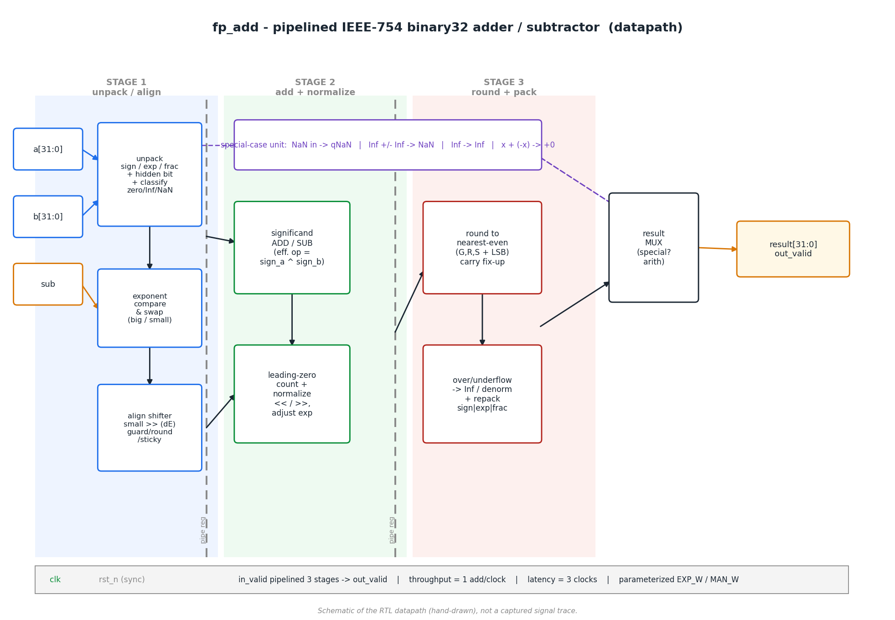
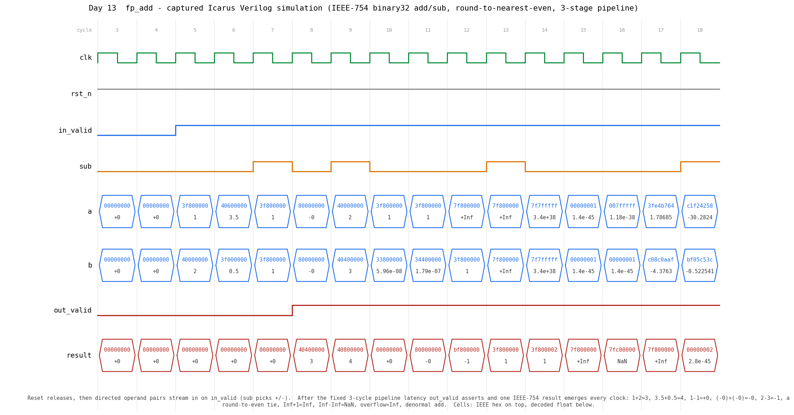

# Day 13 — Pipelined IEEE-754 Single-Precision Floating-Point Adder (`fp_add`)

A fully-pipelined **IEEE-754 binary32 (single-precision) adder / subtractor** in
SystemVerilog, built the way a real FPU add pipe is built: unpack and classify,
exponent-compare and align, add or subtract the significands, leading-zero
normalize, and **round to nearest, ties-to-even** — with correct handling of all
the awkward cases the standard demands.

Floating-point addition looks trivial (`a + b`) and is anything but. The mantissas
must be **aligned** to a common exponent before they can be added; a subtraction of
near-equal numbers can **cancel** almost every bit and needs a wide left-shift to
renormalize; the low bits that fall off the end during alignment must be squeezed
into **guard / round / sticky** bits so the result rounds correctly; and the whole
thing has to do something sensible for **signed zeros, subnormals (gradual
underflow), infinities and NaNs**. This design does all of that at a throughput of
**one add per clock**.

---

## Circuit diagram



*Datapath schematic of the three pipeline stages and the special-case bypass
(hand-drawn, not a signal trace).*

---

## Overview

* Computes `result = a ± b` for two IEEE-754 **binary32** operands, returned as a
  32-bit IEEE bit pattern. `sub` selects add (`0`) or subtract (`1`).
* **Round to nearest, ties-to-even (RNE)** — the IEEE-754 default rounding mode —
  implemented with guard/round/sticky bits and a mantissa-carry fix-up.
* **Gradual underflow**: subnormal *inputs* are handled (hidden bit = `exp != 0`,
  effective exponent forced to 1) and subnormal *results* are produced instead of
  flushing to zero. The subnormal→normal promotion by rounding is handled for free.
* **Signed zeros**: `x + (−x) → +0` (RNE), but `(−0) + (−0) → −0`.
* **Infinities / NaNs**: `Inf ± finite → Inf`, `Inf − Inf → NaN`, and any NaN input
  propagates to a canonical quiet NaN — all resolved in a special-case unit that
  bypasses the arithmetic datapath.
* **Overflow → ±Inf** and **mantissa carry-out on rounding** (e.g. `1.111… → 10.0`)
  both bump the exponent correctly.
* **3-stage pipeline**: latency = 3 clocks, throughput = 1 add/clock, fully
  data-independent (constant latency regardless of operands).
* **Width-generic**: `EXP_W` / `MAN_W` parameters — the same RTL elaborates a
  bfloat16 (`8/7`) or a binary64 (`11/52`) adder; the defaults are binary32.

---

## Parameters

| Parameter | Type  | Default | Description                                                         |
|-----------|-------|---------|---------------------------------------------------------------------|
| `EXP_W`   | `int` | `8`     | Exponent field width. `8` for IEEE binary32.                        |
| `MAN_W`   | `int` | `23`    | Fraction (mantissa) field width. `23` for IEEE binary32.            |

Derived internally: total width `W = 1+EXP_W+MAN_W`, significand `SIG = MAN_W+1`
(incl. hidden bit), aligned width `AW = SIG+3` (three guard/round/sticky bits).

## Ports

| Port        | Dir | Width          | Description                                          |
|-------------|-----|----------------|------------------------------------------------------|
| `clk`       | in  | 1              | Clock.                                               |
| `rst_n`     | in  | 1              | Active-low **synchronous** reset (clears valid bits).|
| `in_valid`  | in  | 1              | `a`/`b`/`sub` carry a fresh operation this cycle.     |
| `sub`       | in  | 1              | `0` = `a + b`, `1` = `a − b`.                         |
| `a`         | in  | `EXP_W+MAN_W+1`| Operand A (IEEE bit pattern).                        |
| `b`         | in  | `EXP_W+MAN_W+1`| Operand B (IEEE bit pattern).                        |
| `out_valid` | out | 1              | `result` is valid this cycle (in_valid delayed 3).   |
| `result`    | out | `EXP_W+MAN_W+1`| `a ± b`, correctly-rounded IEEE bit pattern.         |

---

## Block diagram (ASCII)

```
             STAGE 1 (unpack/align)      | STAGE 2 (add/normalize)  | STAGE 3 (round/pack)
                                         |                          |
 a ─▶┌─────────┐   ┌──────────┐          |                          |
     │ unpack  │──▶│ exponent │          |    ┌──────────────┐      |
 b ─▶│ +hidden │   │ compare  │──┐       |    │ significand  │      |   ┌───────────┐
     │ +classify│  │  & swap  │  │       | ┌─▶│  ADD / SUB   │──┐   |   │  round to │
 sub▶└────┬────┘   └──────────┘  │       | │  └──────────────┘  │   | ┌▶│ near-even │─┐
          │        ┌──────────┐  │ big   | │                    ▼   | │ └───────────┘ │
          └───────▶│  align   │──┘ small | │  ┌──────────────┐  norm| │               ▼
                   │  shifter │──────────╪─┘  │ leading-zero │──────╪─┘  ┌───────────┐
                   │ (G/R/S)  │          |    │  normalize   │      |    │over/under │
                   └──────────┘          |    └──────────────┘      |    │ flow+pack │─┐
                                         |                          |    └───────────┘ │
   ┌───────────────────────────────────────────────────────────┐   |                  ▼
   │ special-case: NaN→qNaN | Inf−Inf→NaN | Inf→Inf | x+(-x)→+0 │───╪──────▶┌────────┐
   └───────────────────────────────────────────────────────────┘   |       │ result │─▶ result
                                         |                          |       │  MUX   │   out_valid
           <── pipe reg ──>              |     <── pipe reg ──>      |       └────────┘
```

---

## How it works

**Stage 1 — unpack, classify, align.**
Each operand is split into sign / exponent / fraction. The hidden bit is
reconstructed (`1` for normals, `0` for subnormals) and the effective exponent of a
subnormal is read as `1` so the same datapath handles it. Zero / Inf / NaN are
detected and the correct special result is precomputed. `sub` is folded in by
flipping operand B's sign (subtract = add of a negated operand). The operand with
the larger magnitude becomes *big*; the smaller significand is right-shifted by the
exponent difference, and **every bit shifted past the 3 guard bits is OR-ed into the
sticky bit** so no information is lost for rounding.

**Stage 2 — add / subtract, then normalize.**
If the effective signs match, the aligned significands are **added** (a carry-out
shifts right one place and bumps the exponent); if they differ they are
**subtracted** (*big ≥ small* is guaranteed, so the result is non-negative). A
**leading-zero count** then left-shifts the result to renormalize — clamped so the
exponent never drops below the minimum, which is what produces subnormal results
instead of garbage.

**Stage 3 — round and repack.**
Round-to-nearest-even uses the guard bit plus `(round | sticky | lsb)`; a rounding
carry that overflows the significand (`1.111… → 10.0`) renormalizes and bumps the
exponent. Finally the result is repacked: exponent ≥ all-ones → **Inf**, hidden bit
set → **normal**, otherwise **subnormal / zero**. A last mux selects the
special-case result when one applies.

---

## Simulation timing



*Genuine waveform **captured from an Icarus Verilog run** (`make icarus` → VCD →
`docs/render_waveform.py`). This is not a mockup.* After `rst_n` releases, the
directed corner-case pairs stream in on `in_valid` (`sub` selects +/−). Following
the fixed **3-cycle latency**, `out_valid` asserts and one IEEE-754 result appears
every clock — you can read them straight off the `result` row:

| a | op | b | result | why |
|---|----|---|--------|-----|
| `1.0` | + | `2.0` | `3.0` (`40400000`) | basic add |
| `3.5` | + | `0.5` | `4.0` (`40800000`) | carry into a new exponent |
| `1.0` | − | `1.0` | `+0` (`00000000`) | exact cancellation → **+0** |
| `−0`  | + | `−0`  | `−0` (`80000000`) | signed-zero rule |
| `2.0` | − | `3.0` | `−1.0` (`bf800000`) | result sign from the larger operand |
| `1.0` | + | `2⁻²⁴` | `1.0` (`3f800000`) | **round-to-even tie** stays even |
| `1.0` | + | `3·2⁻²⁴` | `1.0000002` (`3f800002`) | guard/round/sticky rounds up |
| `+Inf`| + | `1.0` | `+Inf` (`7f800000`) | infinity absorbs finite |
| `+Inf`| − | `+Inf`| `NaN` (`7fc00000`) | invalid → NaN |
| `max` | + | `max` | `+Inf` (`7f800000`) | overflow → Inf |
| `2⁻¹⁴⁹`| + | `2⁻¹⁴⁹`| `2⁻¹⁴⁸` (`00000002`) | subnormal + subnormal |

---

## What the testbench checks

`tb_fp_add.sv` is **self-checking against an independent golden model — the host
FPU** — reached through Icarus' `$bitstoshortreal` / `$shortrealtobits`. Because a
`double` holds the exact sum of two `float`s, computing `a ± b` in `shortreal` and
rounding back to 32 bits yields the correctly-rounded IEEE single result, an oracle
that shares **no logic** with the DUT.

* **Directed corner cases** with **hand-computed** expected hex (independent of the
  FPU): 3.0, signed zeros, a round-to-even tie, a round-up, `Inf ± Inf`, NaN
  propagation, overflow, and subnormal add / subnormal→normal promotion.
* **Randomized streams** — several thousand operand pairs biased toward the
  interesting exponent ranges: near-cancellation (`exp ≈ 126–130`), the wide normal
  range, subnormals (`exp 0–2`), near-overflow (`exp 250–255`), and fully-random
  patterns that also inject Inf/NaN.
* A **scoreboard FIFO** absorbs the 3-cycle latency and checks in-order; a
  **valid-gating** burst inserts idle cycles to confirm `out_valid` tracks
  `in_valid`. NaN results compare NaN-equal; everything else is **bit-exact**
  (including the sign of zero). A cycle-count **timeout** guards against hangs.

The bench prints `RESULT: *** PASS ***` only if **every** check passes and the
scoreboard drains empty.

### Latest simulation result (Icarus Verilog)

```
checks = 4212   errors = 0
RESULT: *** PASS ***
```

---

## Run it

From this folder:

```bash
make icarus      # Icarus Verilog  (used for the captured waveform above)
# or
make verilator   # Verilator
make vcs         # Synopsys VCS
make questa      # Siemens Questa / ModelSim
```

Regenerate the documentation images from a fresh simulation:

```bash
make waveform    # runs the sim, then renders both PNGs in docs/
```

Requires `python3` with `matplotlib` for the image scripts.
