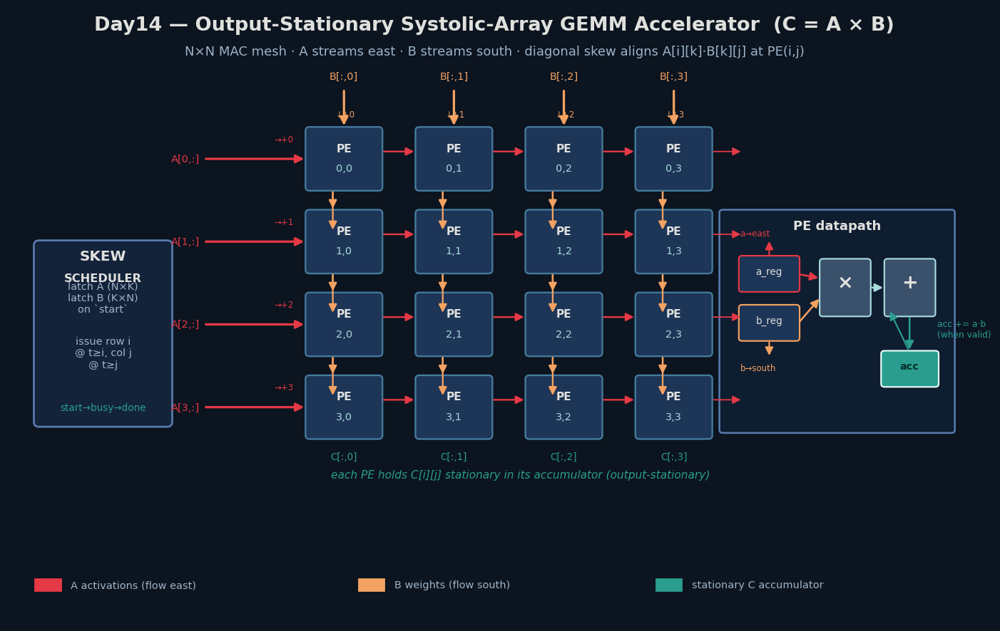
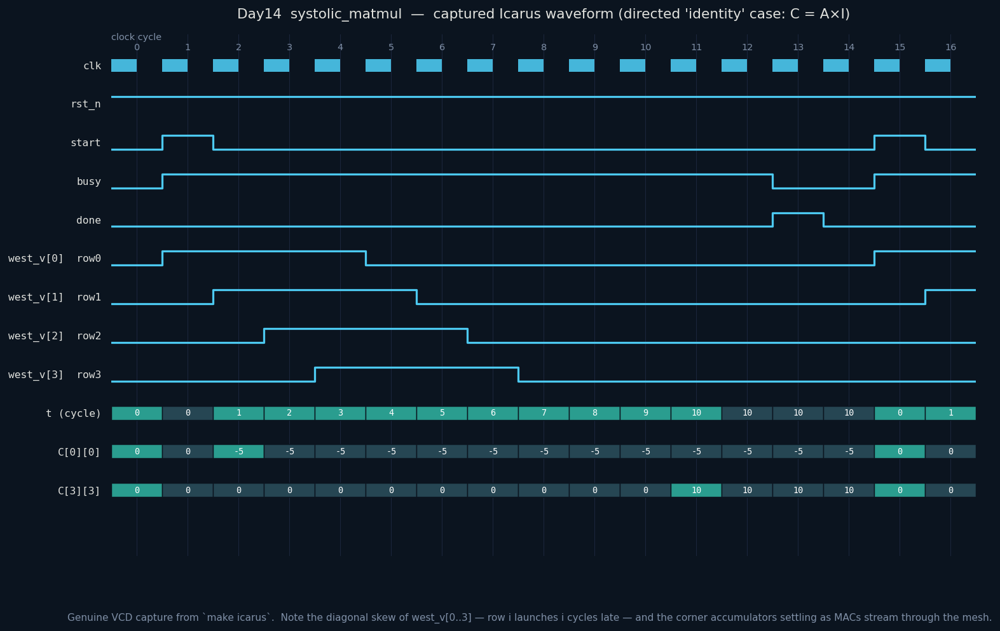

# Day 14 — Output-Stationary Systolic-Array GEMM Accelerator

A parameterized **N × N systolic array** that computes the signed integer matrix
product **C = A × B** — the canonical "TPU tile" dataflow. Every processing
element (PE) owns one output element `C[i][j]` and keeps it **stationary** in a
local accumulator, while operands are *streamed* through the mesh over
nearest-neighbour links only: **A rows march east, B columns march south**. A
built-in **skew scheduler** launches the operands on a diagonal schedule so that,
at each PE, the matching activation `A[i][k]` and weight `B[k][j]` arrive on the
same clock edge and get multiply-accumulated — no global buses, no crossbars,
just local register-to-register hops. This is the structure behind modern
matrix-multiply engines in ML accelerators.

---

## Circuit diagram



*Schematic (hand-drawn with matplotlib, not a simulator screenshot): the 4×4 MAC
mesh, the west/north skewed operand feeds, the skew scheduler, and a single PE's
datapath (input registers → multiplier → stationary accumulator → east/south
forwarding).*

---

## Features

- **Output-stationary dataflow** — each PE accumulates its own `C[i][j]`; results
  never move, minimizing accumulator read/write traffic.
- **True systolic wiring** — every inter-PE link is a single pipeline register to
  an immediate neighbour (east or south). No fan-out trees, no shared buses.
- **Automatic space-time skew** — the scheduler issues row *i* of A delayed by *i*
  cycles and column *j* of B delayed by *j* cycles, guaranteeing operand
  alignment purely from propagation delay.
- **Signed MAC** — full 2's-complement multiply-accumulate; accumulator width is
  auto-sized to `2·DW + ⌈log₂(K+1)⌉` so no overflow can occur.
- **Operand capture** — A and B are latched into local memories on `start`, so the
  caller may release the source buffers immediately.
- **Simple handshake** — `start` → `busy` → one-cycle `done` pulse; accumulators
  self-clear on each launch (verified by a back-to-back regression).
- **Fully parameterized** (`N`, `K`, `DW`), reset-safe, `default_nettype none`
  lint-clean.

---

## Parameters

| Parameter | Default | Meaning |
|-----------|---------|---------|
| `N`   | 4  | Array dimension — rows and columns of the result `C` (and of the PE mesh) |
| `K`   | 4  | Contraction (inner) dimension: `A` is `N×K`, `B` is `K×N` |
| `DW`  | 8  | Signed operand bit width |
| `ACC_W` | *derived* | Accumulator/result width = `2·DW + ⌈log₂(K+1)⌉` (do not override) |

## Ports

| Port | Dir | Width | Description |
|------|-----|-------|-------------|
| `clk`    | in  | 1 | Clock |
| `rst_n`  | in  | 1 | Active-low **synchronous** reset |
| `start`  | in  | 1 | Pulse: latch `A`/`B`, clear accumulators, begin streaming |
| `busy`   | out | 1 | High while the mesh is streaming |
| `done`   | out | 1 | One-cycle pulse: `c_flat` holds the finished product |
| `a_flat` | in  | `N*K*DW` | Row-major `A`; `A[i][k] = a_flat[(i*K+k)*DW +: DW]` |
| `b_flat` | in  | `K*N*DW` | Row-major `B`; `B[k][j] = b_flat[(k*N+j)*DW +: DW]` |
| `c_flat` | out | `N*N*ACC_W` | Row-major `C`; `C[i][j] = c_flat[(i*N+j)*ACC_W +: ACC_W]` |

---

## Block diagram (ASCII)

```
                 B[:,0]  B[:,1]  B[:,2]  B[:,3]      (weights, skewed, flow south)
                   |       |       |       |
        A[0,:] -> PE(0,0)-PE(0,1)-PE(0,2)-PE(0,3) ->
                   |       |       |       |
        A[1,:] -> PE(1,0)-PE(1,1)-PE(1,2)-PE(1,3) ->    (activations flow east)
                   |       |       |       |
        A[2,:] -> PE(2,0)-PE(2,1)-PE(2,2)-PE(2,3) ->
                   |       |       |       |
        A[3,:] -> PE(3,0)-PE(3,1)-PE(3,2)-PE(3,3) ->
                   |       |       |       |
                 C[:,0]  C[:,1]  C[:,2]  C[:,3]      (results held in-place)

   PE(i,j):   a_in --[a_reg]--+--> a_out (east)
                              |
              b_in --[b_reg]--+--> b_out (south)
                              |
                        acc += a_in * b_in   (when the activation-valid strobe is high)
```

---

## How it works

**Space-time skew.** With one register per hop, an activation injected at the
west edge of row *i* at cycle *t* reaches `PE(i,j)` at cycle *t + j*; a weight
injected at the north of column *j* at cycle *t* reaches `PE(i,j)` at cycle
*t + i*. To make `A[i][k]` and `B[k][j]` collide at `PE(i,j)`, the scheduler
launches:

```
west feed, row i, cycle t  ->  A[i][ t - i ]      (valid while 0 ≤ t-i < K)
north feed, col j, cycle t  ->  B[ t - j ][j]      (valid while 0 ≤ t-j < K)
```

Then both operands for contraction index *k* land at `PE(i,j)` on cycle
`i + j + k`, where the PE multiplies them and adds to its stationary accumulator.
An **accumulate-enable strobe travels east alongside each activation**, so a PE
only accumulates on cycles carrying a real operand.

**Latency.** The last MAC — `PE(N-1,N-1)`, `k = K-1` — fires at cycle
`2(N-1) + (K-1)`; `done` pulses one drain cycle later. For the default 4×4, K=4
tile that is a full 4×4×4 product every invocation with a ~11-cycle latency.

**No overflow.** Each product is `2·DW` bits and at most `K` of them are summed,
so `ACC_W = 2·DW + ⌈log₂(K+1)⌉` bits is always sufficient — proven exhaustively
by the extreme-magnitude directed case (`±128` operands).

---

## Simulation timing



*Genuine waveform **captured from a real Icarus Verilog run** (`make icarus`
dumps `systolic_matmul.vcd`; `docs/render_waveform.py` renders it). This is not a
mockup.* The trace shows the opening directed **identity** case (`C = A × I`):

- `start` pulses, `busy` rises, and the space-time counter `t` ramps 0 → 10.
- **The diagonal skew is directly visible**: `west_v[0]` (row 0) asserts one
  cycle before `west_v[1]`, which precedes `west_v[2]`, then `west_v[3]` — each
  row launched one cycle later, the hallmark of a systolic array.
- The corner accumulators settle to their final values — `C[0][0] = -5` and
  `C[3][3] = 10` — as MACs stream through, matching `A × I = A`.
- `done` pulses once the pipeline drains, and a second `start` (right edge)
  begins the next GEMM with accumulators cleared.

---

## What the testbench checks

`tb_systolic_matmul.sv` is fully self-checking against an **independent golden
model** (a `longint` triple-loop signed matmul):

- **Directed cases** — `A × I = A` (identity), all-zero, all-ones (`= K`),
  negative/mixed-sign operands (exercises the signed MAC), and extreme
  magnitudes (`±128`, stresses accumulator headroom).
- **Back-to-back regression** — two consecutive GEMMs confirm accumulators clear
  on every `start` (no leakage from the previous run).
- **Randomized campaign** — 40 fresh full-range signed operand matrices.
- Every one of the **752 element comparisons** is scoreboarded; a hard
  `fork/join` **timeout** guards against a missing `done`.

Run result (Icarus Verilog):

```
Day14 systolic_matmul : N=4 K=4 DW=8 ACC_W=19
  case identity  ... OK      case extremes    ... OK
  case all_zero  ... OK      case b2b_first   ... OK
  case all_ones  ... OK      case b2b_second  ... OK
  case mixed_sign... OK      case rand_0..39  ... OK
--------------------------------------------------
Total element checks : 752
Mismatches           : 0
RESULT: *** PASS ***
```

---

## Run instructions

From inside `Day14/`:

```bash
make icarus      # Icarus Verilog (used to capture the waveform above)
make verilator   # or Verilator
make vcs         # or Synopsys VCS
make questa      # or Siemens Questa / ModelSim

make waveform    # re-run the sim and regenerate docs/*.png
make clean
```
