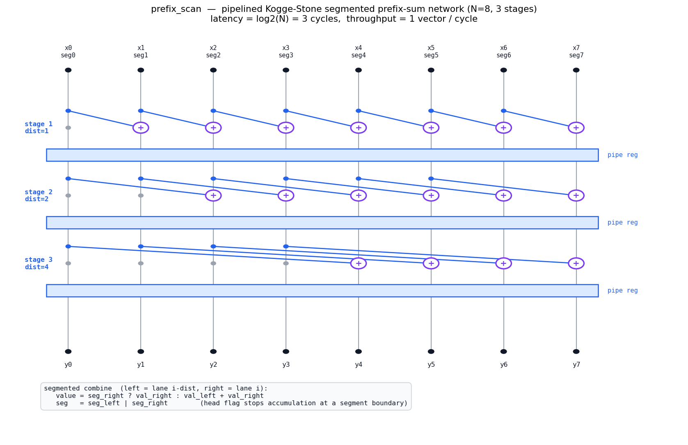
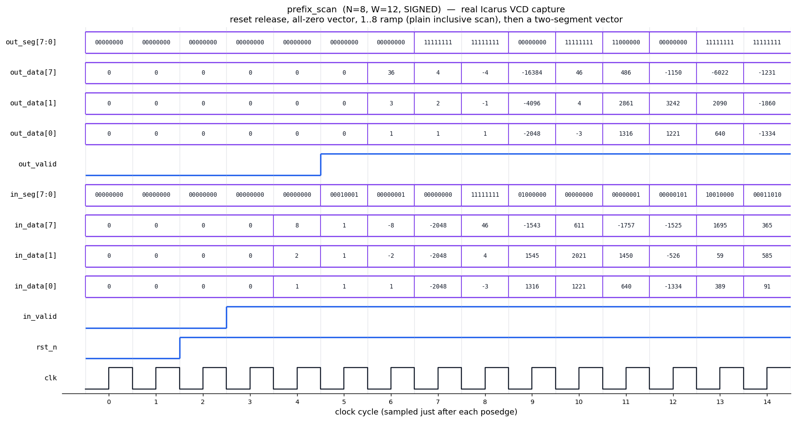

# Day 15 — Pipelined Kogge-Stone Parallel Prefix-Sum (Segmented Scan) Engine

A hardware **parallel prefix-sum (scan)** engine — one of the fundamental
building blocks GPUs lean on to accelerate *stream compaction*, *radix-sort
digit counting*, *histogram / partitioning* and *sparse (segmented) reductions*.
A GPU executes a warp-wide scan every time it compacts a sparse array, assigns
output slots in a filter, or reduces per-segment partial sums; this module is
the spatial (unrolled, pipelined) form of that primitive.

The design implements a **work-in-log-depth Kogge-Stone network**: `N` lanes are
scanned in parallel through `log2(N)` combine stages, each separated by a
pipeline register, so it accepts **one input vector every clock** at a fixed
latency of `log2(N)` cycles.

It is a **segmented** scan: every lane carries a *segment-head* flag, and the
running sum restarts at each flagged boundary. With all head flags cleared the
network degenerates to an ordinary full-vector inclusive prefix sum — so the
one datapath serves both plain and segmented scan.

---

## Circuit diagram



*Hand-drawn schematic of the generated hardware for `N=8`: three combine stages
at Kogge-Stone distances 1, 2 and 4, a pipeline-register bank after every stage,
and the segmented-combine operator applied at each `+` node. Grey dots are
pass-through lanes with no partner within reach at that stage.*

---

## How it works

Each lane holds a pair `(value, seg_flag)`. The **segmented-combine operator**
merges an earlier (left) lane into the current (right) lane:

```
value = seg_right ? value_right : value_left + value_right
seg   = seg_left | seg_right
```

If the current lane already sits at/after a segment head, it keeps its own value
(the sum does not cross the boundary); otherwise it accumulates the partner.

The **Kogge-Stone** schedule applies this operator across doubling distances:

```
stage 1 : lane i combines with lane i-1     (distance 1)
stage 2 : lane i combines with lane i-2     (distance 2)
stage 3 : lane i combines with lane i-4     (distance 4)
...       (distance 2^(k-1) at stage k)
```

After `log2(N)` stages, lane `i` holds the inclusive sum of every lane `j ≤ i`
that lies in the same segment as `i`. Result lanes are widened to
`WACC = W + clog2(N)` bits so a full `N`-element sum can never overflow. Values
are sign- or zero-extended on entry according to the `SIGNED` parameter.

The output segment flag is the OR-scan of the input head flags
(`out_seg[i] = OR(in_seg[0..i])`), which the combine operator computes for free.

### Block diagram (ASCII)

```
 x0 x1 x2 x3 x4 x5 x6 x7      in_seg[7:0]
  |  |  |  |  |  |  |  |
  |  +  +  +  +  +  +  +      stage 1  (distance 1)   <- lane i += lane i-1
  |__|__|__|__|__|__|__|      pipeline register
  |  |  +  +  +  +  +  +      stage 2  (distance 2)   <- lane i += lane i-2
  |__|__|__|__|__|__|__|      pipeline register
  |  |  |  |  +  +  +  +      stage 3  (distance 4)   <- lane i += lane i-4
  |__|__|__|__|__|__|__|      pipeline register
  |  |  |  |  |  |  |  |
 y0 y1 y2 y3 y4 y5 y6 y7      out_seg[7:0]
```

---

## Parameters

| Parameter | Default | Meaning |
|-----------|---------|---------|
| `N`       | `8`     | Number of parallel lanes. Power of two, ≥ 2. |
| `W`       | `12`    | Element width in bits. |
| `SIGNED`  | `1`     | `1` = signed elements (sign-extended), `0` = unsigned (zero-extended). |

Derived: `S = clog2(N)` combine/pipeline stages; `WACC = W + clog2(N)` result
width.

## Ports

| Port        | Dir | Width          | Description |
|-------------|-----|----------------|-------------|
| `clk`       | in  | 1              | Clock. |
| `rst_n`     | in  | 1              | Async active-low reset (clears the pipeline). |
| `in_valid`  | in  | 1              | Input vector is valid this cycle. |
| `in_data`   | in  | `N*W`          | `N` packed elements; lane 0 in the LSBs. |
| `in_seg`    | in  | `N`            | Per-lane segment-head flag (1 = start of a new segment). |
| `out_valid` | out | 1              | Result valid (`in_valid` delayed by `S` cycles). |
| `out_data`  | out | `N*WACC`       | `N` packed inclusive prefix sums; lane 0 in the LSBs. |
| `out_seg`   | out | `N`            | Per-lane segment flag after the scan (OR-scan of `in_seg`). |

**Throughput** 1 vector / cycle **·** **Latency** `S = log2(N)` cycles.

---

## Simulation timing



*Real waveform captured from the Icarus Verilog run (`make icarus` dumps
`prefix_scan.vcd`; `docs/render_waveform.py` parses that VCD and renders the
timing diagram — it is a genuine captured trace, **not** a hand-drawn mock-up).
Signals are sampled just after each posedge.*

The trace shows the reset release followed by the first directed vectors:

* **cycle 4** — the `1..8` ramp is driven with no segment boundaries; **cycle 6**
  the output is the plain inclusive scan `1, 3, 6, 10, 15, 21, 28, 36`.
* **cycle 5** — an all-ones vector with `in_seg = 0001_0001` (heads at lanes 0
  and 4); the result is `1,2,3,4 | 1,2,3,4` — the running sum restarts at lane 4,
  demonstrating segmentation. `out_seg` becomes all-ones (OR-scan of the heads).

> Note: because the testbench drives new stimulus just after each posedge, the
> input value visible at cycle *N* is the one captured into stage 1 at that edge,
> so the diagram shows the result two sample-columns later; the true register
> latency of the pipeline is `log2(N) = 3` cycles (verified by the scoreboard).

---

## What the testbench checks

`tb_prefix_scan.sv` is **self-checking** against a behavioural golden model
(a sequential segmented inclusive scan computed in SystemVerilog):

* **Golden reference** recomputed for every driven vector; expected packed
  results are queued and popped as `out_valid` pulses, which naturally absorbs
  the pipeline latency.
* **Directed corner cases**: all-zero vector; the `1..N` ramp (plain inclusive
  scan); a two-segment all-ones vector; signed alternating negatives; the
  overflow-edge case (every lane the most-negative value); and every lane its
  own segment (identity scan).
* **Randomized stimulus**: 200 vectors of full-width random data with ~25 %
  random segment-head flags.
* Checks both `out_data` (all `N` lanes) and `out_seg` on every transaction, and
  confirms that the number of results emitted equals the number driven.
* A global cycle **timeout** guards against a hang; a VCD is dumped for the
  waveform renderer.
* Prints `RESULT: *** PASS ***` only if every check matches.

Latest Icarus run: **`drove=206  checked=206  errors=0  → RESULT: *** PASS ***`**.

---

## Run it

From inside `Day15/`:

```bash
make icarus       # Icarus Verilog (used to capture the committed waveform)
# or
make verilator    # or: make vcs / make questa
```

Regenerate the docs images from a fresh simulation:

```bash
make waveform     # runs the sim, then renders both PNGs from the VCD
```

Requires `python3` with `matplotlib` for the image renderers.
