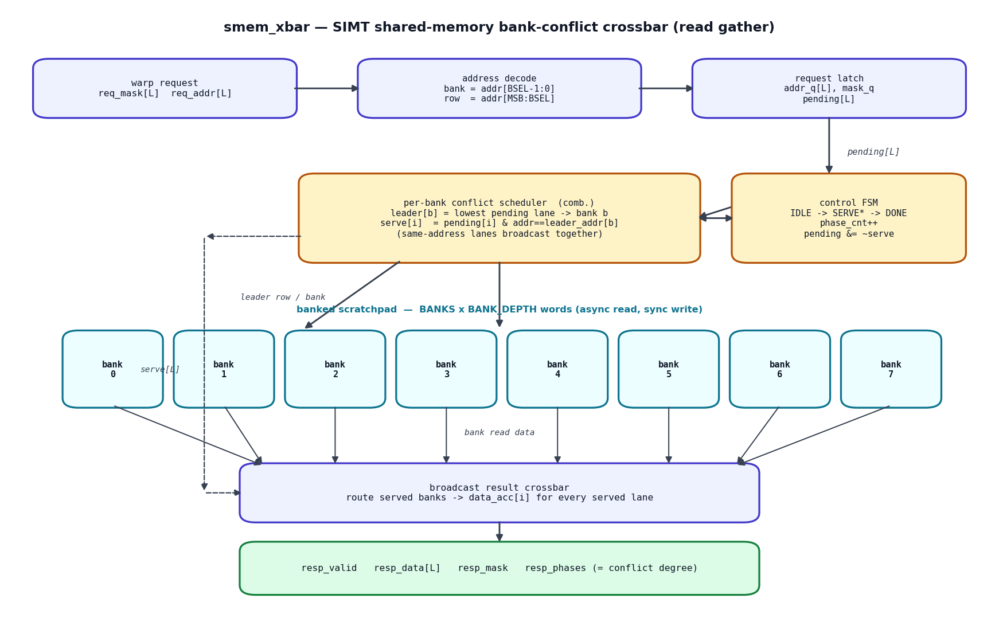
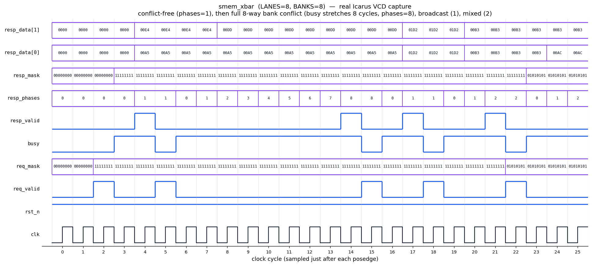

# Day 16 — SIMT Shared-Memory Bank-Conflict Resolution Crossbar

A synthesizable model of the hardware behind the single most-taught GPU
performance concept: **shared-memory bank conflicts**. On an NVIDIA SM the
on-chip shared memory (CUDA `__shared__` / the LDS) is sliced into `BANKS`
word-interleaved banks. A warp issues `LANES` addresses in one instruction and
the load/store unit must satisfy them through the bank crossbar. This unit
implements a warp-wide **read gather** and reproduces the exact
conflict/broadcast serialization rules from the CUDA C Programming Guide.

- **Conflict-free** — the active lanes hit `LANES` different banks → **1 phase**
  (full bandwidth).
- **K-way conflict** — `K` lanes hit the *same* bank at *different* addresses →
  the access serializes over **K phases**.
- **Broadcast** — several lanes hit the *same* bank at the *same* address → they
  are satisfied together in **1 phase** (the hardware broadcast optimization).

The unit reports `resp_phases`, the number of memory phases actually used —
i.e. the **bank-conflict degree** — which is exactly what a profiler surfaces.

---

## Circuit diagram



*Hand-drawn schematic of the RTL (not a simulator screenshot).* Each cycle of
the `SERVE` state the combinational scheduler picks, per bank, the lowest-index
still-pending lane as that bank's **leader**, reads that one address from the
banked scratchpad, and satisfies the leader plus every other pending lane
requesting the identical address (broadcast). Served lanes are cleared from
`pending`; the FSM loops until `pending == 0`.

---

## Features

- Parameterized warp width (`LANES`), bank count (`BANKS`), per-bank depth
  (`BANK_DEPTH`) and word width (`DATA_W`).
- Word-interleaved bank mapping (`bank = addr[BSEL-1:0]`,
  `row = addr[MSB:BSEL]`) — successive words fall in successive banks, matching
  real GPU shared memory.
- Per-bank leader-select conflict scheduler with **broadcast** collapsing of
  same-address lanes.
- Guaranteed forward progress: every occupied bank retires at least its leader
  per phase, so the gather completes in
  `phases = max over banks (# distinct addresses to that bank)` cycles.
- Per-lane active mask (predicated / partial warps) and a legal **empty warp**
  (0 phases).
- Scalar write/init port for loading the scratchpad; banks modeled async-read
  (like a GPU register file / small LDS) so one conflict phase == one clock.
- Fully reset-safe, single always_ff FSM, flat packed lane buses for simulator
  portability.

---

## Parameters

| Parameter | Default | Meaning |
|-----------|---------|---------|
| `LANES` | 8 | Warp width (addresses issued per request) |
| `BANKS` | 8 | Number of shared-memory banks (power of two) |
| `BANK_DEPTH` | 32 | Words per bank (power of two) |
| `DATA_W` | 16 | Word width (bits) |
| `ADDR_W` | *derived* | `clog2(BANKS*BANK_DEPTH)` — flat word address width |
| `PHW` | *derived* | `clog2(LANES+1)` — phase-count width |

## Ports

| Port | Dir | Width | Description |
|------|-----|-------|-------------|
| `clk` | in | 1 | Clock |
| `rst_n` | in | 1 | Active-low async reset |
| `we` | in | 1 | Scratchpad write enable (init/store) |
| `waddr` | in | `ADDR_W` | Write word address |
| `wdata` | in | `DATA_W` | Write data |
| `req_valid` | in | 1 | Launch a warp gather (accepted only when idle) |
| `req_mask` | in | `LANES` | Per-lane active mask (1 = lane participates) |
| `req_addr` | in | `LANES*ADDR_W` | Packed per-lane word address (lane 0 = LSBs) |
| `busy` | out | 1 | High while a gather is in progress |
| `resp_valid` | out | 1 | One-cycle result strobe |
| `resp_mask` | out | `LANES` | Lanes that were served (= `req_mask`) |
| `resp_data` | out | `LANES*DATA_W` | Packed per-lane gathered word |
| `resp_phases` | out | `PHW` | Memory phases used = **bank-conflict degree** |

---

## Block diagram (ASCII)

```
  req_mask[L]                    per-bank conflict scheduler (comb.)
  req_addr[L] ─► address ─► req  ┌───────────────────────────────────┐
                decode     latch │ leader[b] = lowest pending lane→b  │◄─► control FSM
             (bank,row)  pending │ serve[i]  = pending[i] & addr ==   │    IDLE→SERVE*→DONE
                                 │             leader_addr[bank(i)]   │    phase_cnt++
                                 └───────────────┬───────────────────┘    pending &= ~serve
                             leader row/bank ►    │  ► serve[L]
                                  ┌───────┬───────┴───────┬───────┐
                                  │bank 0 │bank 1 │ ... │bank B-1 │  async-read scratchpad
                                  └───┬───┴───┬───┴──────┴───┬────┘
                                      ▼       ▼              ▼
                                 ┌──────────────────────────────┐
                                 │  broadcast result crossbar   │  route served banks →
                                 └──────────────┬───────────────┘  data_acc[i] per lane
                                                ▼
                        resp_valid  resp_data[L]  resp_mask  resp_phases
```

---

## Simulation timing



*Real waveform captured from the Icarus Verilog run (`make icarus`), rendered
from the dumped VCD by `docs/render_waveform.py` — not a hand-drawn mock-up.*
The window shows four back-to-back directed warps:

1. **Conflict-free** (`req_valid` @ cycle 2) — lane *i* → bank *i*: `busy` for a
   single cycle, `resp_phases = 1`.
2. **Full 8-way bank conflict** (`req_valid` @ cycle 5) — all 8 lanes → bank 0 at
   distinct rows: `busy` stretches **8 cycles**, `resp_phases` climbs
   1→2→…→8 as one lane retires per phase.
3. **Full broadcast** — all lanes → one address: `resp_phases = 1`.
4. **Mixed broadcast + conflict** — `resp_phases = 2`.

---

## How it works

1. **Decode.** Each lane's flat address splits into `bank = addr[BSEL-1:0]` and
   `row = addr[ADDR_W-1:BSEL]`. Word-interleaving means adjacent words are in
   adjacent banks — the same layout that makes strided CUDA access patterns
   conflict.
2. **Latch.** On `req_valid` (only in `IDLE`) the mask and addresses are latched
   and `pending` is seeded with `req_mask`.
3. **Schedule (per phase, combinational).** For every bank the lowest-index
   pending lane becomes the **leader** and fixes that bank's address for the
   phase. `serve[i]` asserts for the leader and any pending lane in the same
   bank requesting the *identical* address (broadcast). Lanes wanting a
   different address in a busy bank wait.
4. **Read + route.** The banks are read at the leader rows and the
   `broadcast result crossbar` writes `data_acc[i]` for every served lane.
5. **Retire.** `pending &= ~serve`, `phase_cnt++`. Because each occupied bank
   retires ≥1 lane per phase, `pending` strictly shrinks and the gather ends in
   at most `LANES` phases. When `pending == 0`, `resp_valid` pulses with
   `resp_data`, `resp_mask` and `resp_phases`.

---

## What the testbench checks

`tb_smem_xbar.sv` is fully self-checking against a software golden model:

- **Golden data** — every active lane's `resp_data` is compared to
  `mem_ref[addr]` (a mirror of the scratchpad kept in the TB).
- **Golden phases** — the expected phase count is computed independently by
  grouping active lanes per bank and counting *distinct* addresses (same-address
  lanes collapse), then taking the max across banks; compared to `resp_phases`.
- **Served mask** — `resp_mask` must equal `req_mask`.
- **Directed corners** — conflict-free (1), full 8-way conflict (8), full
  broadcast (1), mixed broadcast+conflict (2), partial mask (4), empty mask (0).
- **Randomized** — 200 random warps (random masks + random addresses) checked
  against the golden model.
- **Timeouts** — a bounded per-warp wait plus a global watchdog guard against
  hangs.

The bench prints `RESULT: *** PASS ***` only when every check passes.

### Captured result (Icarus Verilog)

```
--- directed cases ---
  conflict-free          mask=11111111 phases=1 (exp 1)
  8-way conflict         mask=11111111 phases=8 (exp 8)
  full broadcast         mask=11111111 phases=1 (exp 1)
  mixed bcast+conflict   mask=11111111 phases=2 (exp 2)
  partial mask           mask=01010101 phases=4 (exp 4)
  empty mask             mask=00000000 phases=0 (exp 0)
--- randomized warps --- (200 warps)
  checks run : 1285
  errors     : 0
  RESULT: *** PASS ***
```

---

## Run it

From this folder:

```bash
make icarus      # Icarus Verilog (used to capture the waveform above)
# or: make verilator / make vcs / make questa
make waveform    # re-run the sim and regenerate docs/*.png
```

---

## Why this matters for GPU / accelerator work

Bank-conflict serialization and broadcast are the mechanism every CUDA
programmer tunes around when laying out `__shared__` tiles (padding to avoid
strided conflicts, exploiting broadcast for uniform reads). Modeling the
crossbar in RTL — the leader-select scheduler, the pending-mask retire loop, and
the phase counter that quantifies the conflict degree — is a compact tour of the
datapath + control that lives inside an SM's LSU.
