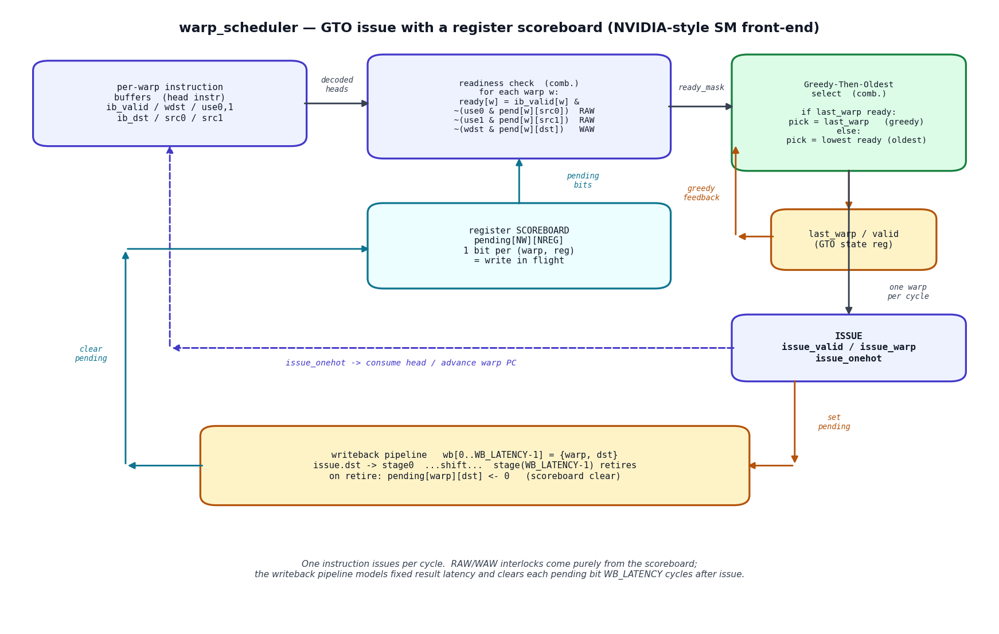
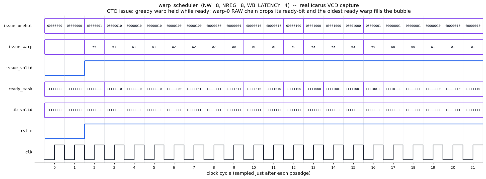

# Day 17 — GPU Warp Scheduler (Greedy-Then-Oldest) with a Register Scoreboard

A synthesizable model of the **instruction-issue front-end of an NVIDIA-class
streaming-multiprocessor (SM) warp scheduler**. Every cycle the unit looks at
the decoded head instruction of each of `NW` resident warps, decides which
warps are *ready* to issue, and dispatches **exactly one** of them using the
**Greedy-Then-Oldest (GTO)** policy — the scheduler GPGPU-Sim uses to model
real NVIDIA SMs.

Correctness of a warp's results without a heavyweight out-of-order engine comes
from an **in-order register scoreboard**: a `pending[warp][reg]` bit is set when
a warp issues a write, travels a fixed-latency writeback pipeline, and is
cleared on retire. A warp is interlocked while any register it *reads* (RAW) or
the register it *writes* (WAW) is still pending. This is exactly the hazard
mechanism behind an SM sub-partition's `dispatch` stall counters.

- **Greedy** — keep issuing from the same warp as long as it stays ready
  (maximises instruction-level locality, minimises scheduler churn / control
  divergence overhead), **then**
- **Oldest** — when that warp stalls, fall back to the oldest ready warp. All
  warps are resident from reset, so "oldest" is the lowest warp id.

Why it matters for GPUs: latency hiding on a GPU *is* warp scheduling. When one
warp stalls on a long-latency dependency the scheduler must instantly find
another ready warp to keep the SIMT datapath busy — this block is that decision,
in hardware, in one cycle.

---

## Circuit diagram



*Hand-drawn schematic of the RTL (not a simulator screenshot).* The readiness
check reads the scoreboard and the per-warp head instructions to build
`ready_mask`; the GTO selector picks `last_warp` if it is still ready (greedy)
else the lowest ready warp (oldest); the issued destination is pushed into the
writeback pipeline, which sets and — `WB_LATENCY` cycles later — clears the
matching scoreboard bit.

---

## Features

- Parameterized warp count (`NW`), per-warp register count (`NREG`) and
  issue→writeback latency (`WB_LATENCY`).
- Per-warp **register scoreboard** giving in-order **RAW and WAW** interlocks
  (each warp has its own private register file, exactly like a SIMT lane group).
- **Greedy-Then-Oldest** issue arbitration with a single-cycle combinational
  ready→select path and a registered `last_warp` for the greedy hold.
- Fixed-latency **writeback shift pipeline** that models result latency and
  guarantees every pending bit clears in bounded time → **no deadlock**: a warp
  can only stall on its *own* in-flight writes, which always retire.
- One instruction issued per cycle, with `issue_valid`, `issue_warp` and a
  one-hot `issue_onehot` consume strobe.
- `ready_mask` exposed for observability (profiler-style stall visibility).
- Fully reset-safe (async-reset, issue gated by `rst_n`), single `always_ff`,
  flat packed per-warp buses for simulator portability, `default_nettype none`.

---

## Parameters

| Parameter | Default | Meaning |
|-----------|---------|---------|
| `NW` | 8 | Number of resident warps |
| `NREG` | 8 | Architectural registers tracked per warp (scoreboard width) |
| `WB_LATENCY` | 4 | Cycles from issue to writeback (how long a dest stays pending) |
| `WIDW` | *derived* | `clog2(NW)` — warp-id width |
| `RIDW` | *derived* | `clog2(NREG)` — register-id width |

## Ports

| Port | Dir | Width | Description |
|------|-----|-------|-------------|
| `clk` | in | 1 | Clock |
| `rst_n` | in | 1 | Active-low async reset |
| `ib_valid` | in | `NW` | Per-warp: a decoded head instruction is available |
| `ib_wdst` | in | `NW` | Per-warp: instruction writes a destination register |
| `ib_use0` | in | `NW` | Per-warp: instruction reads source-0 |
| `ib_use1` | in | `NW` | Per-warp: instruction reads source-1 |
| `ib_dst` | in | `NW*RIDW` | Per-warp destination register index (warp0 = LSBs) |
| `ib_src0` | in | `NW*RIDW` | Per-warp source-0 register index |
| `ib_src1` | in | `NW*RIDW` | Per-warp source-1 register index |
| `issue_valid` | out | 1 | A warp issues this cycle |
| `issue_warp` | out | `WIDW` | Which warp issued |
| `issue_onehot` | out | `NW` | One-hot `issue_warp` — consume strobe for that warp's IB |
| `ready_mask` | out | `NW` | Warps eligible to issue this cycle |

---

## Block diagram (ASCII)

```
             decoded head instrs (per warp)
                        │
       ib_valid/wdst/use0,1/dst/src0,src1
                        ▼
        ┌───────────────────────────────┐        ┌───────────────────┐
        │  readiness check (comb.)       │◄───────│  register          │
        │  ready[w] = ib_valid[w] &      │ pending│  SCOREBOARD        │
        │   ~(use0 & pend[w][src0])  RAW │  bits  │  pending[NW][NREG] │
        │   ~(use1 & pend[w][src1])  RAW │        └───────▲───────────┘
        │   ~(wdst & pend[w][dst])   WAW │                │ clear (retire)
        └───────────────┬───────────────┘                │
                ready_mask │                              │
                          ▼                               │
        ┌───────────────────────────────┐                │
        │  Greedy-Then-Oldest select     │   set pending  │
        │  greedy: last_warp if ready    │────────────────┤
        │  else  : lowest ready (oldest) │                │
        └───────────────┬───────────────┘                │
                        │ issue_warp / valid / onehot     │
                        ▼                                  │
        ISSUE ───────────────────────────► writeback pipe ┘
          │  issue_onehot                   wb[0..WB_LATENCY-1]
          └─► consume head / advance warp PC (environment)
```

---

## Simulation timing



*Real waveform captured from the Icarus Verilog run* (`make icarus` dumps
`warp_scheduler.vcd`; `docs/render_waveform.py` parses that VCD — it is **not** a
hand-drawn mock-up). The window shows two cycles held in reset followed by the
directed stimulus:

- **cyc 0** — all warps ready, no greedy history → the **oldest** warp `W0`
  issues (it writes `r1`, so `pending[0][r1]` is set).
- **cyc 1** — `W0`'s next instruction reads `r1` (still pending) → `W0` drops
  out of `ready_mask` (bit 0 clears); GTO falls back to the oldest ready warp
  `W1`.
- **cyc 1–3** — **greedy** holds `W1` while its independent instructions keep it
  ready (`W1, W1, W1`), then `W2, W2, W2`, then later `W3, W3, W3`.
- **cyc 5** — `W0` has become ready again, but the **greedy** rule keeps issuing
  `W2` because `W2` is still ready — greedy beats oldest.
- The `issue_onehot` row is the one-hot of `issue_warp`; `ready_mask` bit 0
  visibly toggles as `W0` walks its RAW dependency chain.

---

## How it works

1. **Readiness (combinational).** For each warp the unit indexes the scoreboard
   with the head instruction's source and destination register ids and clears
   that warp's ready bit on any RAW (`use && pending[src]`) or WAW
   (`wdst && pending[dst]`) hit, gated by `ib_valid`.
2. **Selection (combinational GTO).** If `last_valid` and `ready_mask[last_warp]`
   the same warp is re-picked (greedy); otherwise a lowest-index priority encoder
   over `ready_mask` picks the oldest ready warp. `issue_valid = |ready_mask`
   (and is held low during reset).
3. **Issue + scoreboard set (sequential).** On issue with a destination,
   `pending[warp][dst]` is set and `{warp,dst}` enters stage 0 of the writeback
   pipeline. `last_warp` is updated for the next cycle's greedy check.
4. **Writeback + scoreboard clear (sequential).** Each cycle the writeback
   pipeline shifts; the entry leaving stage `WB_LATENCY-1` clears its pending
   bit. Because a WAW-blocked destination can never be issued, a set and a clear
   never collide on the same `{warp,reg}`.

Because a warp only ever stalls on its own in-flight writes — which are
guaranteed to retire in `WB_LATENCY` cycles — the scheduler makes forward
progress on any well-formed program with no possibility of deadlock.

---

## What the testbench checks

`tb_warp_scheduler.sv` runs a fully **independent golden model** (its own
scoreboard, writeback pipeline and GTO state) alongside the DUT and, every
cycle:

- **Golden match** — DUT `issue_valid` / `issue_warp` must equal the golden
  model's independently computed decision.
- **P1 safety** — a warp is *never* issued while any register it reads, or the
  register it writes, is still pending (no RAW/WAW hazard escape); `issue_onehot`
  must be the exact one-hot of `issue_warp`.
- **P2 greedy** — if warp `X` issued last cycle and is still ready, `X` must
  issue again this cycle.
- **P3 progress** — if any warp is ready, exactly one warp must issue.

Stimulus is a **directed prefix** (a RAW dependency chain on warp 0, independent
back-to-back streams on warps 1–3, and a WAW pair on warp 4) that produces the
clean waveform above, followed by **pseudo-random per-warp programs** whose
sources are biased toward recently written registers to force realistic RAW/WAW
stalls and greedy/oldest fallbacks. Each warp's PC advances only when the DUT
actually issues it; at the end every warp must have issued **exactly** its
program length. A watchdog guards against any hang.

Result on the last run (Icarus Verilog): all warps drained, **86 issues, 0
checker errors → `RESULT: *** PASS ***`.**

---

## Run it

```bash
make icarus       # Icarus Verilog (used to capture the committed waveform)
# or
make verilator    # Verilator
make vcs          # Synopsys VCS
make questa       # Siemens Questa / ModelSim

make waveform     # re-run the sim and regenerate docs/*.png from the fresh VCD
make clean
```
