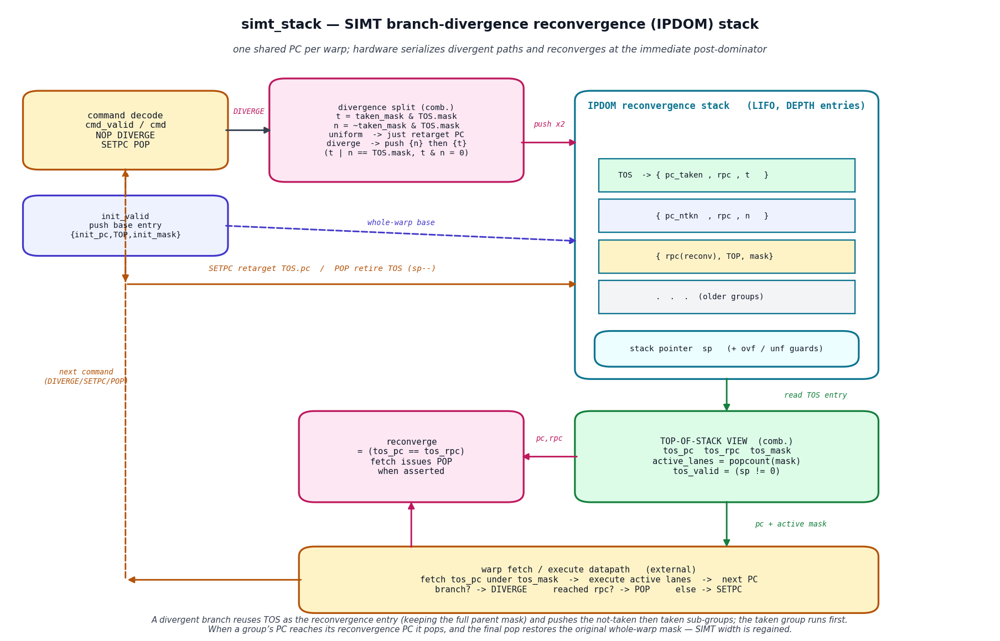
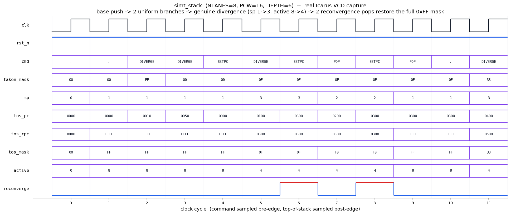

# Day 18 — SIMT Branch-Divergence Reconvergence (IPDOM) Stack

A synthesizable **SIMT reconvergence stack** — the control-flow heart of a
single-instruction, multiple-thread GPU core. A *warp* of `NLANES` threads
shares one program counter, so when a data-dependent branch sends some lanes one
way and the rest the other, the hardware must **serialize** the two paths and
then **reconverge** the warp back to full width the instant control flow
re-merges. Without reconvergence the lanes stay permanently split and SIMT
efficiency collapses.

This is the classic **immediate-post-dominator (IPDOM) stack** used by
NVIDIA-style SIMT cores (and modelled in GPGPU-Sim). It is a companion to
[`Day16`](../Day16) (shared-memory bank-conflict crossbar) and
[`Day17`](../Day17) (warp scheduler + scoreboard): together they form the
issue → control-flow → memory front-end of an SM.

---

## Circuit diagram



*Hand-drawn schematic of the RTL in [`simt_stack.sv`](simt_stack.sv) — command
decode, the LIFO of `{pc, rpc, mask}` entries with its stack pointer, the
divergence-split combinational logic, the reconvergence comparator, and the
top-of-stack view the fetch stage consumes. This is a schematic, not a
simulator screenshot.*

---

## What it does

Each stack entry is a **`{ pc, rpc, active_mask }`** token describing one
lane-group that is momentarily executing on its own:

| Field | Meaning |
|-------|---------|
| `pc`   | next PC this group fetches |
| `rpc`  | **reconvergence PC** = the immediate post-dominator (IPDOM) of the branch — where this group finishes and rejoins (compiler-provided) |
| `mask` | which lanes belong to this group |

The **top of stack (TOS)** is the group that runs *now*: the fetch unit fetches
`tos_pc` and executes only the lanes in `tos_mask`. `active_lanes =
popcount(tos_mask)` is a direct measure of the SIMT divergence penalty — it
drops below `NLANES` exactly while the warp is diverged.

### Divergence protocol (one divergent branch, current group = TOS)

```
t = taken_mask & TOS.mask        // lanes that take the branch
n = ~taken_mask & TOS.mask       // lanes that fall through
if      (t == TOS.mask)  TOS.pc <- pc_taken       // uniform: all take  (no push)
else if (t == 0)         TOS.pc <- pc_notaken     // uniform: none take (no push)
else begin                                        // genuine divergence:
   TOS.pc <- rpc                                  //   TOS becomes the reconv entry
                                                  //   (keeps the full parent mask)
   push { pc_notaken, rpc, n }                    //   not-taken group
   push { pc_taken,   rpc, t }                    //   taken group runs first
end
```

**Lane conservation is exact:** `(t | n) == TOS.mask` and `(t & n) == 0`, so no
lane is ever lost or duplicated across a divergence.

### Reconvergence

A group advances with `SETPC`. When its `pc` reaches its `rpc` the combinational
output **`reconverge`** asserts and the fetch stage issues `POP`: the group
retires and the entry beneath resumes. The **final** `POP` restores the
reconvergence entry, which still carries the *original whole-warp mask* — the
warp is full-width again. Nested divergence just pushes deeper; each level
reconverges at its own IPDOM.

Two sticky guards protect the LIFO: `ovf` (push beyond `DEPTH`) and `unf`
(pop past empty).

---

## Parameters

| Parameter | Default | Meaning |
|-----------|---------|---------|
| `NLANES`  | 8  | threads per warp (active-mask width) |
| `PCW`     | 16 | program-counter width |
| `DEPTH`   | 32 | maximum simultaneously-live lane-groups (LIFO depth) |

> The testbench instantiates `DEPTH = 6` on purpose so the overflow guard is
> reachable with an 8-lane warp (the deepest live path splits `8→4→2`).

## Ports

| Port | Dir | Width | Description |
|------|-----|-------|-------------|
| `clk` / `rst_n` | in | 1 | clock, active-low async reset |
| `init_valid` | in | 1 | push the whole-warp base entry |
| `init_mask` | in | `NLANES` | base active mask (e.g. all-ones) |
| `init_pc` | in | `PCW` | base entry PC (its `rpc` = all-ones sentinel) |
| `cmd_valid` | in | 1 | command strobe |
| `cmd` | in | 2 | `0`=NOP `1`=DIVERGE `2`=SETPC `3`=POP |
| `taken_mask` | in | `NLANES` | DIVERGE: lanes taking the branch |
| `pc_taken` / `pc_notaken` | in | `PCW` | DIVERGE: taken / fall-through PCs |
| `rpc` | in | `PCW` | DIVERGE: reconvergence PC (IPDOM) |
| `next_pc` | in | `PCW` | SETPC: new PC for the TOS group |
| `tos_valid` | out | 1 | stack non-empty → warp live |
| `tos_pc` / `tos_rpc` | out | `PCW` | TOS PC and its reconvergence PC |
| `tos_mask` | out | `NLANES` | active-lane mask to execute |
| `active_lanes` | out | `clog2(NLANES+1)` | `popcount(tos_mask)` |
| `reconverge` | out | 1 | `tos_pc == tos_rpc` → fetch should POP |
| `sp` | out | `clog2(DEPTH+1)` | number of live entries |
| `ovf` / `unf` | out | 1 | sticky overflow / underflow flags |

---

## Block diagram (ASCII)

```
                      DIVERGE                          push {n} then {t}
 command  ───────────► divergence split ─────────────►┌───────────────────────────┐
 decode                t = taken & TOS.mask            │   IPDOM reconvergence     │
 (cmd_valid/cmd)       n = ~taken & TOS.mask           │   stack  (LIFO, DEPTH)    │
    │  SETPC/POP                                       │  TOS: {pc_taken, rpc, t}  │
    │  retarget/retire ────────────────────────────►  │       {pc_ntkn , rpc, n}  │
 init_valid ─ push base {init_pc, TOP, init_mask} ───► │       {rpc     , TOP,mask}│
                                                       │  sp  (+ ovf / unf guards) │
                                                       └────────────┬──────────────┘
                                                        read TOS    ▼
   reconverge = (tos_pc == tos_rpc) ◄────pc,rpc──── TOP-OF-STACK VIEW (comb.)
             │                                       tos_pc/tos_rpc/tos_mask
             │                                       active_lanes = popcount(mask)
             ▼                pc + active mask            │
   warp fetch / execute  ◄──────────────────────────────┘
   branch?→DIVERGE   reached rpc?→POP   else→SETPC ── next command ─┐
             └──────────────────────────────────────────────────────┘
```

---

## Simulation timing



*Genuine waveform **captured from the Icarus run** (`make icarus` dumps
`simt_stack.vcd`; `docs/render_waveform.py` parses that real VCD — it is **not**
a hand-drawn mock-up). For each cycle the applied command is sampled just before
the posedge and the resulting top-of-stack view just after it.*

Reading the trace (`NLANES=8, DEPTH=6`):

| cyc | command | effect |
|-----|---------|--------|
| 1 | init | base pushed: `sp=1`, `mask=FF`, `active=8`, `rpc=FFFF` (sentinel) |
| 2 | DIVERGE `taken=FF` | **uniform-taken** → `tos_pc=0010`, no push (`sp=1`) |
| 3 | DIVERGE `taken=00` | **uniform-not-taken** → `tos_pc=0050`, no push |
| 4 | SETPC | park base `pc=0000` |
| 5 | DIVERGE `taken=0F` | **genuine divergence** → `sp=3`, taken group `pc=0100 mask=0F active=4`, `rpc=0300` |
| 6 | SETPC `0300` | `tos_pc == rpc` → **`reconverge=1`** |
| 7 | POP | retire taken group → not-taken group `pc=0200 mask=F0 active=4` |
| 8 | SETPC `0300` | **`reconverge=1`** again |
| 9 | POP | retire → base reconv entry restored: `mask=FF active=8` — **warp whole again** |
| 11 | DIVERGE `taken=33` | start of the nested-divergence directed test |

`active` visibly halves from 8 → 4 during the divergence and returns to 8 at
reconvergence — the SIMT efficiency story in one signal.

---

## What the testbench checks

[`tb_simt_stack.sv`](tb_simt_stack.sv) runs an **independent golden reference
stack** (kept in plain TB arrays, coded in a different style from the RTL)
stepped in lock-step with the DUT. After **every** command it compares the
DUT's `sp / tos_valid / tos_pc / tos_rpc / tos_mask / active_lanes / reconverge
/ ovf / unf` bit-for-bit against the reference.

Coverage:

- **uniform-taken** and **uniform-not-taken** branches (retarget PC, no push)
- **genuine divergence** (push not-taken then taken, taken on top)
- **full reconvergence** back to the original whole-warp mask
- **nested divergence** (a divergent branch inside a divergent path)
- **lane conservation** (`t|n == parent`, `t&n == 0`) enforced by the reference
- **stack overflow** guard — a deep `8→4→2` split beyond `DEPTH`
- **stack underflow** guard — pop past empty
- **4000 cycles** of constrained-random *legal* commands

The TB has a timeout watchdog and prints `RESULT: *** PASS ***` only when every
check matches.

### Verification result

Run under **Icarus Verilog** (`iverilog -g2012`) on this machine:

```
[directed] uniform branches
[directed] single genuine divergence + reconvergence
[directed] nested divergence
[random] 4000 constrained-legal commands
[directed] overflow guard (deep split beyond DEPTH=6)
  overflow correctly asserted, stack frozen at sp=5
[directed] underflow guard (pop past empty)
  underflow correctly asserted
--------------------------------------------------------------
checks run : 36279
errors     : 0
RESULT: *** PASS ***
```

## Run it

```bash
make icarus      # Icarus Verilog  (used for the captured waveform above)
make verilator   # or Verilator
make vcs         # or Synopsys VCS
make questa      # or Siemens Questa/ModelSim

make waveform    # re-run the sim and regenerate both docs/*.png
```

---

## Why this design is interesting

- **The canonical GPU control-flow structure.** Branch divergence is the #1
  performance pitfall in SIMT programming; this is the exact hardware that
  manages it and bounds the penalty.
- **Reconvergence is subtle.** Reusing TOS as the IPDOM entry (so the parent
  mask survives the divergence and is restored on the final pop) is the trick
  that makes an unbounded number of nested branches reconverge correctly with a
  bounded stack.
- **A measured divergence penalty.** `active_lanes` exposes, cycle-by-cycle,
  how many of the `NLANES` are actually doing work — the quantity every GPU
  programmer is implicitly fighting.
