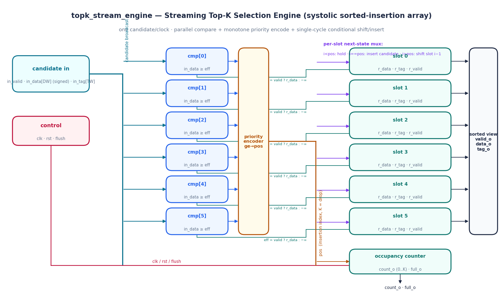
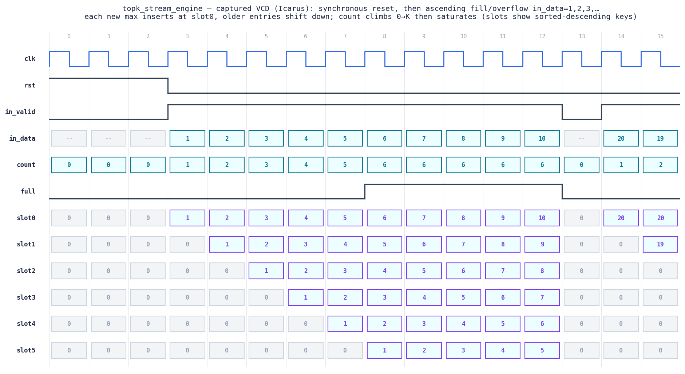

# Day 19 — Streaming Top-K Selection Engine (`topk_stream_engine`)

A **systolic sorted-insertion register array** that keeps the **K largest**
`(data, tag)` pairs seen in a one-element-per-cycle stream. Every cycle a new
candidate is compared against **all K stored entries in parallel** and slotted
into its sorted position in a **single clock** — throughput is **1 element per
cycle**, latency **1 cycle**, and the internal array is *always* sorted so no
re-sort pass is ever needed.

This is a genuine hardware primitive on both sides of the "GPU-for-HFT" world:

* **GPU / ML** — top-K sampling for LLM decoding, beam search, k-NN selection,
  radix-select. GPUs spend real cycles on "keep the K best scores from a stream
  of candidates"; this is that datapath in silicon.
* **HFT** — the core of a **top-of-book / best-N-quote** engine. The `tag` field
  carries the order or quote ID, so as prices stream in the hardware maintains
  the N best resting orders *and* remembers which order each is — a market-data
  feature that must keep up at line rate with deterministic latency.

---

## Circuit diagram



*Structural schematic of the built RTL (hand-drawn, not a simulator capture).*
The incoming candidate is **broadcast** to `K` comparators. Each comparator `i`
compares `in_data` against the slot's **effective key** (`r_data` if the slot is
valid, otherwise `−∞`). Because the slots are sorted descending, the comparator
outputs `ge[]` form a **monotone** `0…0 1…1` pattern, so a **priority encoder**
turns them into a single insertion index `pos` (`pos == K` ⇒ candidate is
smaller than everything and is dropped). `pos` then drives a **per-slot
next-state mux**: slots above `pos` hold, the slot at `pos` takes the candidate,
and slots below `pos` shift down from their neighbour — a one-shot ordered
insertion. An occupancy counter tracks `count_o` / `full_o`.

---

## Features

* **Running Top-K** — retains the K largest keys of an unbounded stream; once
  full, a new key is admitted only if it is larger than the current minimum,
  which is then displaced.
* **Single-cycle ordered insertion** — parallel compare → monotone priority
  encode → conditional shift/insert. No multi-cycle bubble sort, no re-sort.
* **Tag/payload tracking** — each key carries a `TW`-bit tag (order ID, lane
  index, pointer) that travels with it, so winners stay identifiable.
* **Signed keys** — data is treated as signed; empty slots act as `−∞`.
* **Newer-wins tie rule** — on equal keys the incoming element is placed *ahead*
  of the existing equal one (`>=` compare), a well-defined total order
  (key desc, then arrival order desc).
* **Synchronous reset + `flush`** — clears the whole array in one cycle.
* Fully **parameterized** (`K`, `DW`, `TW`), **no latches**, flattened packed
  state for portability across simulators and synthesis.

---

## Parameters

| Parameter | Default | Meaning                                    |
|-----------|---------|--------------------------------------------|
| `K`       | 8       | number of largest entries retained         |
| `DW`      | 16      | data / key width (signed)                   |
| `TW`      | 8       | tag / payload width                         |

Derived: `CW = $clog2(K+1)` — width of the position / occupancy counter.

## Ports

| Port       | Dir | Width        | Description                                        |
|------------|-----|--------------|----------------------------------------------------|
| `clk`      | in  | 1            | clock                                              |
| `rst`      | in  | 1            | synchronous, active-high reset (clears array)      |
| `flush`    | in  | 1            | synchronous clear of all entries                   |
| `in_valid` | in  | 1            | candidate valid this cycle                         |
| `in_data`  | in  | `DW` (signed)| candidate key                                      |
| `in_tag`   | in  | `TW`         | candidate tag / payload / ID                       |
| `valid_o`  | out | `K`          | per-slot valid (slot 0 = current maximum)          |
| `data_o`   | out | `K*DW`       | sorted keys; slot `i` = `data_o[i*DW +: DW]`        |
| `tag_o`    | out | `K*TW`       | sorted tags;  slot `i` = `tag_o[i*TW +: TW]`        |
| `count_o`  | out | `CW`         | number of valid entries (0..K)                     |
| `full_o`   | out | 1            | asserted when `count_o == K`                       |

---

## Block diagram (ASCII)

```
                 in_valid, in_data[DW], in_tag[TW]
                              │  (broadcast to all K comparators)
        ┌─────────────────────┼───────────────────────────────────────┐
        │        ┌────────┐    │                                        │
        ├───────►│ cmp[0] │  in_data ≥ eff[0]  ──┐                      │
        │        └────────┘                      │                      │
        │        ┌────────┐                      │   ┌───────────────┐  │
        ├───────►│ cmp[1] │  in_data ≥ eff[1]  ──┤   │   priority     │  │
        │        └────────┘                      ├──►│   encoder      │──┼─► pos
        │           ...        (monotone ge[])   │   │   ge → pos     │  │  (K = drop)
        │        ┌────────┐                      │   └───────────────┘  │
        └───────►│cmp[K-1]│  in_data ≥ eff[K-1]──┘                      │
                 └────────┘                                             │
   eff[i] = r_valid[i] ? r_data[i] : -infinity                          │
                                                                        ▼
     per-slot next-state mux, i = 0..K-1:                       ┌──────────────┐
        i <  pos : hold  slot i                                 │  pos decode  │
        i == pos : insert {in_data, in_tag, 1}                  └──────┬───────┘
        i >  pos : shift  slot i-1  ─────────────┐                     │
                                                 ▼                     ▼
   ┌────────┐   ┌────────┐   ┌────────┐        ┌──────────┐     ┌──────────────┐
   │ slot 0 │◄─►│ slot 1 │◄─►│  ...   │◄──────►│ slot K-1 │     │ occupancy    │
   │ (max)  │   │        │   │        │        │  (min)   │     │ count_o/full │
   └───┬────┘   └───┬────┘   └───┬────┘        └────┬─────┘     └──────────────┘
       ▼            ▼            ▼                   ▼
   valid_o / data_o / tag_o   (sorted-descending view, slot 0 = maximum)
```

---

## Simulation timing



*Genuine captured waveform — parsed directly from the VCD produced by the
Icarus Verilog run (`make icarus`), **not** a hand-drawn mock-up.* The window
shows synchronous reset for the first cycles, then the directed **ascending
fill/overflow** stream `in_data = 1, 2, 3, …`. Because each new value is the
current maximum it is inserted at **slot 0** and the older entries shift down;
`count` climbs `0 → K` and then **saturates** (with `full` asserted) while the
array keeps only the K largest. At cycle 13 a `flush` clears everything
(`count → 0`), after which the descending-fill sequence (`20, 19, …`) begins —
now each new value lands one slot lower (`20` at slot 0, `19` at slot 1),
exercising tail-insertion as well.

---

## How it works

1. **Effective key.** An empty slot must never win a comparison, so its key is
   treated as the most-negative value (`−∞`). A valid slot presents its stored
   `r_data`.
2. **Parallel compare.** All `K` comparators evaluate `in_data >= eff[i]`
   simultaneously. Since the stored keys are sorted descending, the boolean
   vector `ge[]` is guaranteed **monotone** (`0…0` then `1…1`).
3. **Priority encode.** `pos` = index of the first set bit of `ge[]`
   (or `K` if none). That is exactly where the candidate belongs.
4. **Conditional shift/insert.** In one clock the next state of every slot is:
   hold (`i < pos`), take the candidate (`i == pos`), or copy the neighbour
   above (`i > pos`). When the array was already full this pushes the old
   minimum out the bottom; otherwise occupancy grows by one.
5. **Invariant.** The array is sorted descending after every cycle, and because
   the effective keys are monotone the retained set equals the *global* top-K
   under the total order (key desc, arrival order desc) — so a simple running
   insertion is provably equivalent to fully re-sorting the whole stream.

---

## What the testbench checks

`tb_topk_stream_engine.sv` is **self-checking** against an independent golden
model — a plainly-coded scalar behavioral running Top-K (descending-sorted
fixed array with the same newer-wins tie rule), structurally different from the
DUT's parallel one-shot compare/shift datapath, so it validates it rather than
mirroring it. **Every cycle** the DUT's full sorted view is checked slot-by-slot:
`valid_o`, `data_o`, `tag_o`, `count_o`, and `full_o`.

Stimulus:

* **Reset** and post-reset empty state.
* **Ascending fill + overflow** (`1 … K+4`) — head insertion, saturation.
* **Descending fill** (`20 … `) — tail insertion, worst-case position sweep.
* **Duplicates** (repeated `50` with distinct tags, interleaved) — the
  newer-wins tie rule and tag tracking.
* **Negative keys** and a **mid-stream flush**.
* **4000 randomized candidates** over the full signed range, with periodic
  flushes.

On success it prints `RESULT: *** PASS ***`. A global watchdog fails the run on
timeout.

**Last local run (Icarus Verilog):** `checks=4045 errors=0` → `RESULT: *** PASS ***`.

---

## Run it

```bash
# Icarus Verilog (open source)
make icarus

# Verilator
make verilator

# Synopsys VCS
make vcs

# Siemens Questa / ModelSim
make questa
```

Regenerate the docs images from a fresh simulation:

```bash
make waveform    # runs the sim, then renders the VCD + block diagram to docs/
```

Requires `matplotlib` for the image scripts
(`python3 -m pip install --user matplotlib`).
