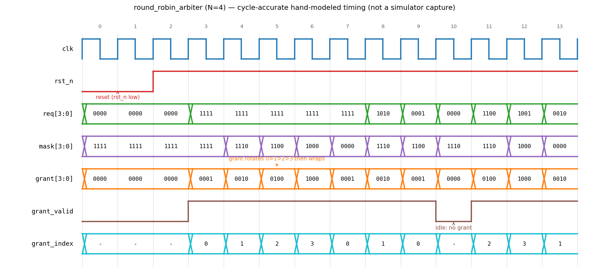

# Day 2 — Parameterized Round-Robin Arbiter

An `N`-way **round-robin arbiter** in SystemVerilog with a fully self-checking
testbench. When several requesters ask for a shared resource in the same cycle,
the arbiter grants exactly one of them and, crucially, **rotates** priority so
that no requester is starved by a busier, higher-priority neighbour.

Arbiters show up everywhere shared resources are multiplexed — bus masters,
memory ports, crossbar switches, network-on-chip routers. Round-robin is the
classic "fair" policy: after requester *g* wins, the next cycle's priority
starts at *g+1* and wraps around.

---

## Features

- Parameterized number of requesters `N`.
- One grant per cycle, emitted as a **one-hot** `grant` bus plus a binary
  `grant_index`.
- **Fair rotation**: priority advances to just past the last winner, wrapping
  around — bounded wait time for every requester.
- Purely **combinational grant** (single-cycle latency); one small registered
  priority mask holds the rotation state.
- Reset-safe (`mask` resets to all-ones → first arbitration is plain
  lowest-index priority) and lint-friendly.
- Idle-safe: `grant` is all-zero and `grant_valid` low when no request is
  asserted.

---

## Parameters

| Parameter | Default | Description                          |
|-----------|---------|--------------------------------------|
| `N`       | 4       | Number of requesters (`>= 2`)        |

## Ports

| Port          | Dir | Width          | Description                                   |
|---------------|-----|----------------|-----------------------------------------------|
| `clk`         | in  | 1              | System clock                                  |
| `rst_n`       | in  | 1              | Active-low asynchronous reset                 |
| `req`         | in  | `N`            | Request lines, one bit per requester          |
| `grant`       | out | `N`            | One-hot grant (all-zero when idle)            |
| `grant_valid` | out | 1              | High when a grant is issued (`\|req`)          |
| `grant_index` | out | `$clog2(N)`    | Binary index of the granted requester         |

---

## Block diagram

```
        req[N-1:0]
            │
            ▼
   ┌──────────────────┐      ┌───────────────────┐
   │  req & mask      │────▶│  isolate lowest   │
   │  (priority       │      │  set bit          │──┐
   │   region)        │      │  x & (~x+1)       │  │
   └──────────────────┘      └───────────────────┘  │
            │  (none pending in region?)             ▼
            └───────────── fallback ─────────▶  one-hot grant ──▶ grant / index
                        (wrap: use raw req)          │
                                                     ▼
                                        ┌────────────────────────┐
                                        │  priority mask (FF)     │
                                        │  mask <= ~((grant<<1)-1)│◀── rotation
                                        └────────────────────────┘
```

---

## Simulation timing



*Cycle-accurate timing (`N=4`): after reset, all four requesters assert
(`req=1111`) and the grant rotates `0→1→2→3` and then **wraps** back to `0`,
with the internal priority `mask` shrinking each cycle. Sparse patterns
(`1010`, `0001`, …) show the wrap-around fallback, and an idle cycle
(`req=0000`) drops `grant_valid` with `grant` held at zero.*

> Note: this diagram was produced by **cycle-accurate hand-modeling** of the RTL
> in Python (matplotlib), **not** captured from an HDL simulator — none was
> installed in the build environment. The model in `docs/` re-implements the
> exact mask arithmetic of `round_robin_arbiter.sv`. Running `make verilator`
> (or `vcs`/`questa`/`icarus`) emits a real `round_robin_arbiter.vcd` you can
> open in GTKWave.

## How it works

- **Priority region.** A registered `mask` marks the requesters that currently
  have priority — those "ahead" of the last winner. `req & mask` keeps only
  those pending requests.
- **Pick one winner.** The lowest-set-bit trick `x & (~x + 1)` isolates a single
  request bit, guaranteeing a one-hot grant.
- **Wrap-around.** If nobody in the priority region is asking (`req & mask == 0`),
  the arbiter falls back to the raw `req` — i.e. it wraps around to the lowest
  index. This is what makes cycle 7 in the waveform grant requester 0 again.
- **Rotate.** After granting one-hot bit *g*, the mask is updated to
  `~((grant << 1) - 1)`, i.e. only bits **strictly greater than** *g* keep
  priority next cycle. On idle cycles the mask holds, so rotation never drifts.

---

## Files

| File                          | Description                                |
|-------------------------------|--------------------------------------------|
| `round_robin_arbiter.sv`      | RTL design under test                      |
| `tb_round_robin_arbiter.sv`   | Self-checking testbench + reference model  |
| `Makefile`                    | Run targets for common simulators          |
| `docs/…_waveform.png`         | Hand-modeled timing diagram                |

---

## Run the simulation

```bash
# Verilator (open source)
make verilator

# Synopsys VCS
make vcs

# Siemens Questa / ModelSim
make questa
```

Expected output ends with:

```
Checks performed : <N>
Errors           : 0
RESULT: *** PASS ***
```

A `round_robin_arbiter.vcd` waveform is also produced for viewing in GTKWave.

---

## What the testbench checks

The golden reference is an **independent** implementation — a rotating priority
*pointer* that scans requesters in round-robin order — deliberately different
from the DUT's mask-based scheme, so agreement is a meaningful cross-check.
Every cycle the scoreboard verifies:

1. **Idle** — no requests ⇒ `grant_valid` low and `grant == 0`.
2. **Single requester** held high is granted every cycle with a stable index.
3. **Full contention** (`req=1111`) ⇒ grant rotates `0,1,2,3,0,…` — fairness.
4. **Sparse / wrapping** patterns exercise the mask wrap-around fallback.
5. `grant` is always **one-hot** when valid, all-zero when idle.
6. `grant_index` matches the one-hot `grant`.
7. 300 cycles of **randomized** request vectors, fully scoreboarded against the
   reference pointer model.
