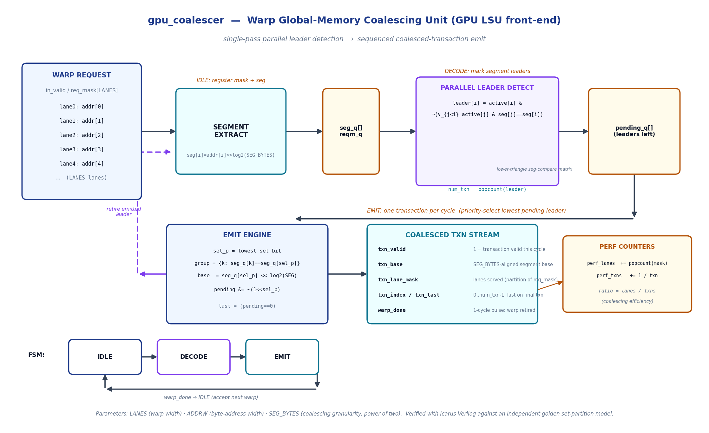
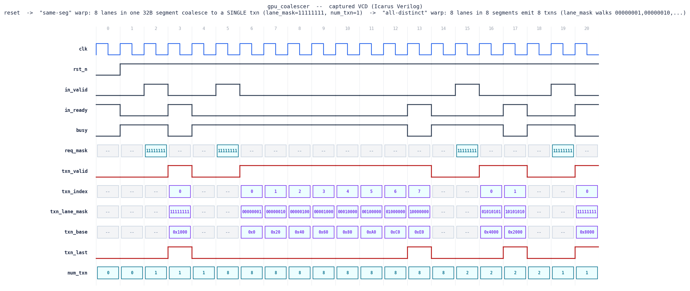

# Day 20 — Warp Global-Memory Coalescing Unit (`gpu_coalescer`)

A synthesizable **GPU load/store-unit (LSU) front-end** that performs *memory
coalescing*: it takes a **warp** of per-lane byte addresses and reduces them to
the **minimum number of aligned memory transactions** before they hit the
L2/DRAM. Every lane whose address falls inside the same `SEG_BYTES`-aligned
segment (a cache line / sector) is served by a *single* transaction.

Coalescing is the single biggest determinant of the DRAM bandwidth a GPU kernel
actually achieves — a perfectly coalesced warp touches memory once, a fully
scattered warp pays `LANES` separate transactions. The same primitive shows up
in low-latency **HFT market-data gathers**, where a scattered read of an order
book is exactly a set of lane addresses that you want to fold into as few
cache-line fetches as possible.

---

## Features

- **Warp-parallel coalescing** — one `req_mask` + `LANES` byte addresses in,
  a stream of coalesced transactions out.
- **Single-pass parallel leader detection** (not an iterative retire loop):
  a lane "leads" its segment iff no lower-indexed active lane shares the same
  segment id. `num_txn = popcount(leaders)` = number of distinct segments.
- **Exact partition guarantee** — the per-transaction `txn_lane_mask`s are
  pairwise **disjoint** and their union is exactly `req_mask`; every served
  lane's address lies inside the transaction's segment.
- **Aligned bases** — `txn_base` is the `SEG_BYTES`-aligned segment base.
- **Deterministic ordering** — transactions are emitted in ascending
  leader-lane order (`txn_index = 0..num_txn-1`, `txn_last` on the final one).
- **Coalescing-efficiency counters** — `perf_lanes / perf_txns` = average
  lanes served per transaction (1.0 = uncoalesced worst case, `LANES` = perfect).
- **Corner-case clean** — empty warp (0 transactions), single active lane,
  duplicate addresses, partial masks.
- Fully **parameterized** (`LANES`, `ADDRW`, `SEG_BYTES`), reset-safe, and
  lint-friendly (`` `default_nettype none ``).

---

## Parameters

| Parameter   | Default | Description |
|-------------|---------|-------------|
| `LANES`     | `8`     | Warp width — lanes presented per request. |
| `ADDRW`     | `32`    | Byte-address width per lane. |
| `SEG_BYTES` | `32`    | Coalescing granularity (cache-line/sector size), power of two. |
| `LOG2_SEG`  | *derived* | `$clog2(SEG_BYTES)` — number of intra-segment offset bits. |
| `SEGW`      | *derived* | `ADDRW - LOG2_SEG` — segment-id width. |
| `CNTW`      | *derived* | `$clog2(LANES+1)` — width of transaction counts/indices. |

## Ports

| Port            | Dir | Width          | Description |
|-----------------|-----|----------------|-------------|
| `clk`           | in  | 1              | Clock. |
| `rst_n`         | in  | 1              | Active-low synchronous-style reset. |
| `in_valid`      | in  | 1              | A warp is being presented this cycle. |
| `in_ready`      | out | 1              | Unit is idle and can accept a warp. |
| `req_mask`      | in  | `LANES`        | Per-lane active bit. |
| `addr`          | in  | `LANES*ADDRW`  | Flattened lane addresses; lane *i* = `addr[i*ADDRW +: ADDRW]`. |
| `txn_valid`     | out | 1              | A coalesced transaction is valid this cycle. |
| `txn_base`      | out | `ADDRW`        | `SEG_BYTES`-aligned base address of the transaction. |
| `txn_lane_mask` | out | `LANES`        | Lanes served by this transaction (partition of `req_mask`). |
| `txn_index`     | out | `CNTW`         | Transaction index, `0..num_txn-1`. |
| `txn_last`      | out | 1              | Asserted on the final transaction of the warp. |
| `num_txn`       | out | `CNTW`         | Total transactions for the accepted warp. |
| `warp_done`     | out | 1              | One-cycle pulse when the warp is fully retired. |
| `busy`          | out | 1              | High while decoding/emitting (not idle). |
| `perf_lanes`    | out | 32             | Running count of active lanes accepted. |
| `perf_txns`     | out | 32             | Running count of transactions emitted. |

---

## Block diagram (ASCII)

```
  WARP REQUEST                                             COALESCED TXN STREAM
  in_valid, req_mask[LANES]                                (one per cycle)
  addr[LANES][ADDRW]
        │
        ▼
  ┌───────────────┐   seg_q[],reqm_q   ┌──────────────────────┐
  │ SEGMENT       │──────────────────▶ │ PARALLEL LEADER       │
  │ EXTRACT       │   (registered on   │ DETECT                │
  │ seg=addr>>L2  │    accept, IDLE)   │ leader[i]=active[i] & │
  └───────────────┘                    │  ¬(∨_{j<i} same seg)  │
                                       │ num_txn=popcount()    │  DECODE
                                       └──────────┬───────────┘
                                                  ▼
                                       ┌──────────────────────┐
                                       │ pending_q[] (leaders) │
                                       └──────────┬───────────┘
        ┌── retire emitted leader ◀───────────────┤   EMIT (1 txn / cycle)
        │                                          ▼
  ┌─────┴─────────┐   txn_valid/base/mask   ┌──────────────────┐
  │ EMIT ENGINE   │────────────────────────▶│  txn_* outputs   │──▶ perf
  │ sel_p=lowest  │  index/last/warp_done   │  + perf counters │    counters
  │ group,base    │                         └──────────────────┘
  └───────────────┘
```

## Circuit / datapath diagram



*Schematic of the built RTL (hand-drawn with matplotlib — not a simulator
screenshot). Warp addresses → segment extract → parallel leader detection
(lower-triangular segment-compare matrix) → pending-leader register → priority
select / group gather → coalesced transaction stream, with the IDLE→DECODE→EMIT
FSM and the coalescing-efficiency perf counters.*

---

## How it works

The unit runs a 3-state FSM: **IDLE → DECODE → EMIT**.

1. **IDLE (accept).** When `in_valid & in_ready`, the warp is registered:
   `reqm_q ← req_mask` and, for each lane, `seg_q[i] ← addr[i] >> log2(SEG_BYTES)`.
   Registering the request first means the leader detection reads only *stable*
   latched values — no combinational-at-the-clock-edge sampling hazards.
   `perf_lanes` is bumped by `popcount(req_mask)`.

2. **DECODE (mark leaders).** From the registered warp, a purely combinational
   network computes, for every lane,
   `leader[i] = active[i] & ¬(∨_{j<i} active[j] & seg[j]==seg[i])` — i.e. the
   **lowest-indexed active lane of each distinct segment** is a leader.
   `num_txn = popcount(leader)` is the number of coalesced transactions. If no
   lane is active, the warp retires immediately with `num_txn = 0`.

3. **EMIT (stream).** Each cycle the priority selector picks the lowest set bit
   `sel_p` of the pending-leaders register and drives one transaction:
   - `txn_base = seg_q[sel_p] << log2(SEG_BYTES)` (aligned segment base),
   - `txn_lane_mask = { k : active[k] & seg_q[k]==seg_q[sel_p] }` (all lanes in
     that segment),
   - `txn_index` counts up; `txn_last` asserts when the last leader is emitted.
   The emitted leader is cleared from `pending_q`; when it empties, `warp_done`
   pulses and the FSM returns to IDLE. `perf_txns` increments once per transaction.

Because leaders are the first appearance of each segment (scanning lanes
`0..LANES-1`), the emitted transactions are in the same first-appearance order,
and the lane masks form an exact partition of the active lanes — provably the
minimum transaction count for the warp.

---

## Simulation timing



**This is a genuine captured waveform** — the VCD is produced by the actual
Icarus Verilog run (`make icarus`) and rendered to PNG by
[`docs/render_waveform.py`](docs/render_waveform.py); it is **not** a hand-drawn
mock-up. The window shows synchronous reset followed by the opening directed
warps:

- **`same-seg`** — all 8 lanes address the same 32-byte segment → a **single**
  coalesced transaction: `txn_lane_mask = 11111111`, `txn_base = 0x1000`,
  `num_txn = 1`, `txn_last` on that one cycle.
- **`all-distinct`** — each lane in its own segment → **8 back-to-back**
  transactions with `txn_index` walking `0..7`, `txn_lane_mask` walking
  `00000001, 00000010, …, 10000000`, and `txn_base = 0x00, 0x20, … 0xE0`.
- Then the interleaved warp shows two transactions with masks `01010101` /
  `10101010` (even vs. odd lanes) — coalescing into `num_txn = 2`.

---

## What the testbench checks

[`tb_gpu_coalescer.sv`](tb_gpu_coalescer.sv) is **self-checking** against an
**independent golden set-partition model** built inside the TB (it does not reuse
the DUT's logic). For every warp it:

- rebuilds the expected transaction set (distinct segments, in first-appearance
  order) and compares **`num_txn`**, each **`txn_base`**, and each
  **`txn_lane_mask`** against the DUT stream;
- asserts **`txn_index`** counts `0..num_txn-1` and **`txn_last`** is set only on
  the final transaction;
- asserts the **partition property** — masks are pairwise disjoint and their
  union equals `req_mask`;
- checks the **`perf_lanes` / `perf_txns`** counters accumulate correctly.

Stimulus = directed corners (all-same-segment, all-distinct, interleaved,
unit-stride, large-stride, partial mask, empty warp, single lane, identical
addresses) **plus 300 randomized warps** (mixed clustered/scattered), a global
watchdog timeout, and a VCD dump. It prints `RESULT: *** PASS ***` only if every
check passed.

Latest run (Icarus Verilog):

```
warps run          : 309
total active lanes : 1289
total transactions : 702
coalescing ratio   : 1.83 lanes/txn (higher = better)
errors             : 0
RESULT: *** PASS ***
```

---

## Run it

```bash
# Icarus Verilog (used to capture the committed waveform)
make icarus

# or Verilator / VCS / Questa
make verilator
make vcs
make questa

# regenerate the docs images from a fresh simulation
make waveform
```

Requires `iverilog`/`vvp` (or another SystemVerilog simulator) and, for the
images, `python3` with `matplotlib`.
