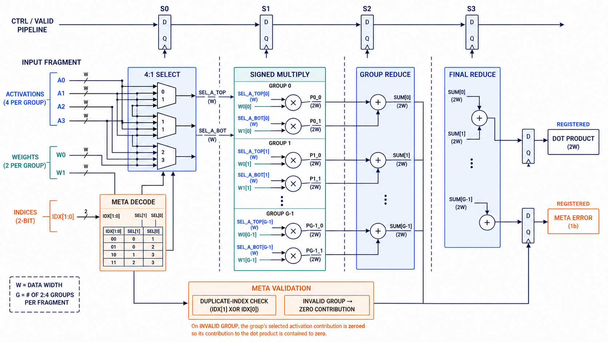
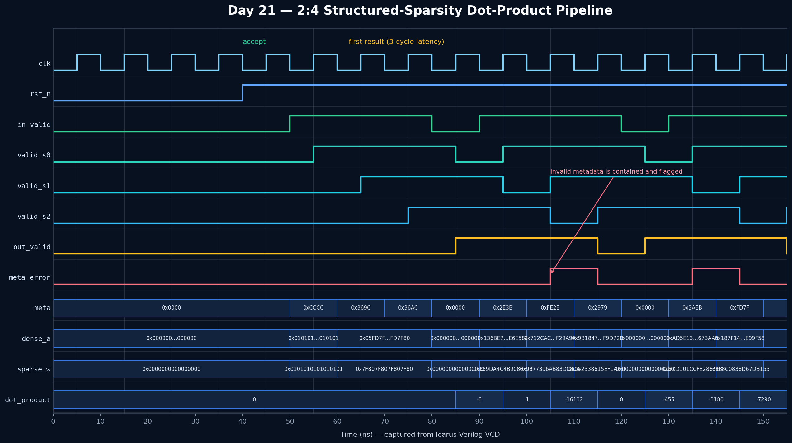

# Day 21 — Pipelined 2:4 Structured-Sparsity Dot-Product Engine

`sparse_dot2of4` is a synthesizable GPU-accelerator datapath for the compressed
inner products used by **2:4 structured-sparse matrix multiplication**. In each
group of four dense activations, metadata chooses the two activations whose
weights are nonzero. The RTL decodes those indices, multiplies the selected
activation/weight pairs, and reduces all products to one signed dot product.

The microarchitecture mirrors work done near sparse Tensor Core operand paths:
compressed weights save storage and bandwidth, while dedicated selection and
reduction hardware recovers useful MAC throughput without first expanding a
dense weight vector.

## Features

- One complete sparse fragment accepted every clock; no input backpressure.
- Three-cycle registered latency with decode/select, multiply, local-reduce,
  and final-reduce stages.
- `GROUPS` independent 2:4 groups and `2*GROUPS` signed multipliers.
- Packed, synthesis-friendly activation, weight, and metadata buses.
- Full-precision signed products and an overflow-safe widened reduction result.
- Duplicate-index validation for every group.
- Fault containment: an invalid group's contribution is forced to zero while
  valid groups continue to contribute; `meta_error` accompanies the result.
- Reset-safe valid pipeline and lint-friendly `` `default_nettype none ``.

## Parameters

| Parameter | Default | Description |
|---|---:|---|
| `GROUPS` | `4` | Number of independent 2:4 groups in one input fragment. |
| `DW` | `8` | Signed activation and nonzero-weight width. |
| `PROD_W` | `2*DW` | Full signed product width; derived. |
| `SUM_W` | `PROD_W+$clog2(2*GROUPS)+1` | Widened final dot-product width; derived. |

## Ports

| Port | Dir | Width | Description |
|---|---|---:|---|
| `clk` | in | 1 | Rising-edge clock. |
| `rst_n` | in | 1 | Active-low asynchronous reset. |
| `in_valid` | in | 1 | Qualifies one input fragment. |
| `dense_a` | in | `GROUPS*4*DW` | Four packed signed activations per group. |
| `sparse_w` | in | `GROUPS*2*DW` | Two packed signed nonzero weights per group. |
| `meta` | in | `GROUPS*4` | Two 2-bit activation indices per group. |
| `out_valid` | out | 1 | Qualifies `dot_product` and `meta_error`. |
| `dot_product` | out | `SUM_W` | Signed sparse dot-product result. |
| `meta_error` | out | 1 | One or more groups used duplicate indices. |

## ASCII block diagram

```text
 dense_a: 4 activations/group ─┐
 meta: two 2-bit indices/group ├─▶ [S0 META DECODE + 4:1 SELECT]
 sparse_w: 2 weights/group ────┘                │ 2 selected pairs/group
                                                ▼
                                      [S1 SIGNED MULTIPLIERS]
                                           2 × GROUPS products
                                                │
                                                ▼
                                      [S2 PER-GROUP ADDERS]
                                           GROUPS local sums
                                                │
                                                ▼
                                      [S3 FINAL REDUCTION] ──▶ dot_product

 duplicate index/group ─▶ zero that group's selected operands ─▶ meta_error
 valid pipeline         ─▶ S0 ─▶ S1 ─▶ S2 ─▶ S3             ─▶ out_valid
```

## Circuit diagram



The circuit illustration shows the implemented left-to-right datapath:
metadata-controlled activation muxes, two signed multipliers per 2:4 group,
local pair reduction, final cross-group reduction, registered outputs, and the
duplicate-index containment path. It is a schematic, not a simulator capture.

## How it works

1. **S0 — metadata decode and select.** Each 4-bit group metadata field contains
   two 2-bit indices. Legal, distinct indices select two of the group's four
   dense activations. The two compressed weights are registered alongside them.
   If the indices match, both selected activations for that group are replaced
   by zero and the error bit is set.
2. **S1 — signed multiply.** Each selected activation is multiplied by its
   compressed nonzero weight. There are exactly two multipliers per group, so
   the design never reconstructs or multiplies a four-element dense weight row.
3. **S2 — local reduction.** Each group's two full-width products are added
   with one guard bit.
4. **S3 — final reduction.** All group sums are sign-extended into `SUM_W` and
   combined. The dot product, result valid, and metadata error are registered
   together. Independent fragments may occupy every pipeline stage at once.

For group `g`, with metadata indices `i0` and `i1`, the legal contribution is:

```text
group_sum[g] = dense_a[g][i0] * sparse_w[g][0]
             + dense_a[g][i1] * sparse_w[g][1]
dot_product  = Σ group_sum[g]
```

## Simulation timing



This is a **genuine captured waveform** rendered from the VCD produced by the
Icarus Verilog simulation. It shows reset, back-to-back fragment acceptance,
the valid bit advancing through `S0/S1/S2`, the fixed three-cycle result
latency, packed metadata/operand buses, signed results, a bubble, and an invalid
metadata case whose aligned output asserts `meta_error`.

## What the testbench checks

`tb_sparse_dot2of4.sv` is self-checking against an independent scalar golden
model. It verifies:

- the dot product for every valid fragment, including signed arithmetic;
- exact three-cycle valid/data/error alignment;
- throughput-one behavior under back-to-back traffic and inserted bubbles;
- all legal activation index pairs across randomized groups;
- duplicate-index detection and per-group zero-contribution containment;
- reset behavior and pipeline drain; and
- a global timeout to catch deadlock.

Directed vectors cover unity operands, signed extremes, mixed index pairs, and
malformed metadata. Randomized stimulus adds 1,000 attempted cycles with signed
8-bit operands, bubbles, and injected duplicate indices. The latest Icarus run
checked 787 accepted fragments and printed:

```text
Fragments checked: 787
RESULT: *** PASS ***
```

## Run it

```bash
cd Day21
make icarus

# Alternatives
make verilator
make vcs
make questa
```

The testbench writes `sparse_dot2of4.vcd` for waveform inspection.
