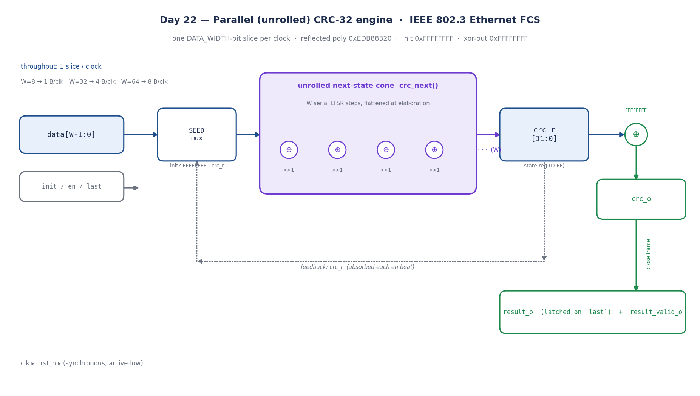
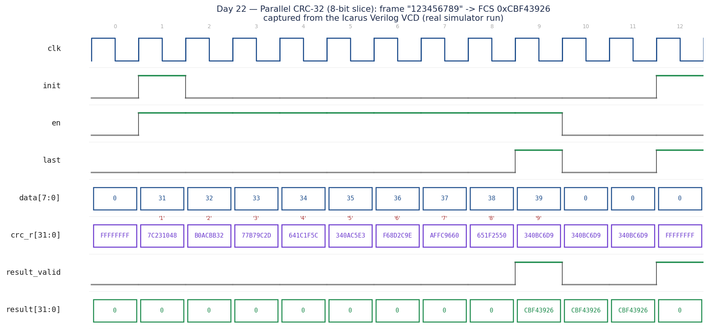

# Day 22 — Parameterized Parallel CRC-32 Engine (IEEE 802.3 / Ethernet FCS)

A **width-generic, unrolled CRC-32 generator/checker** — the frame-integrity
block that sits at the bottom of every Ethernet MAC, SmartNIC, and low-latency
market-data feed handler. Instead of clocking the textbook bit-serial LFSR once
per bit, the state-transition function is **unrolled `DATA_WIDTH` times at
elaboration** into a single combinational GF(2) cone, so the engine consumes a
full `DATA_WIDTH`-bit slice of the frame **every clock** — the standard trick
for hitting line rate on an FPGA.

```
W = 8   →  1 byte / clock   (~1  Gb/s @ 125 MHz)
W = 32  →  4 bytes / clock  (~10 GbE-class)
W = 64  →  8 bytes / clock  (~25/40 GbE-class)
```

Why it matters for FPGA / HFT shops: CRC/FCS is on the critical path of every
packet in and out of the wire. A 10G/25G tick-to-trade NIC checks the FCS of an
inbound market-data frame and generates the FCS of an outbound order at line
rate with a fixed, deterministic latency — exactly what a parallel CRC gives
you.

---

## Algorithm

Reflected CRC-32, identical to Ethernet FCS / zlib / PKZIP:

| Parameter    | Value                                  |
|--------------|----------------------------------------|
| Polynomial   | `0x04C11DB7` (reflected `0xEDB88320`)  |
| Init         | `0xFFFFFFFF`                           |
| Reflect in   | yes (LSB-first)                        |
| Reflect out  | yes                                    |
| XOR out      | `0xFFFFFFFF`                           |
| Check value  | `"123456789"` → **`0xCBF43926`**       |

The reflected formulation lets a single primitive step be unrolled cleanly:

```
fb  = crc[0] ^ data_bit
crc = (crc >> 1) ^ (fb ? 0xEDB88320 : 0)
```

`crc_next()` applies this step for bits `0 … W-1` of the slice inside a
fixed-bound `for` loop, which the synthesizer flattens into the familiar CRC
"F/G matrix" combinational logic — no loop, no multi-cycle iteration.

### Byte / bit ordering contract (matches the wire)
- Within a `DATA_WIDTH` bus, **bit 0 is processed first**, bit `W-1` last.
- A byte stream packs `byte0 → data[7:0]`, `byte1 → data[15:8]`, … so processing
  bits `0…W-1` in order equals *byte0 LSB-first, then byte1, …* — Ethernet order.

---

## Parameters & ports

### Parameter

| Name         | Default | Meaning                                    |
|--------------|---------|--------------------------------------------|
| `DATA_WIDTH` | `32`    | bits consumed per clock (8/16/32/64 …)     |

### Ports

| Signal            | Dir | Width        | Description                                                |
|-------------------|-----|--------------|------------------------------------------------------------|
| `clk`             | in  | 1            | clock                                                       |
| `rst_n`           | in  | 1            | active-low **synchronous** reset (state → `0xFFFFFFFF`)    |
| `init`            | in  | 1            | seed the running CRC to `0xFFFFFFFF` (start of frame)      |
| `en`              | in  | 1            | this beat carries a valid `DATA_WIDTH`-bit slice           |
| `last`            | in  | 1            | this beat closes the frame → registered result next cycle  |
| `data`            | in  | `DATA_WIDTH` | input slice (bit 0 processed first)                        |
| `crc_o`           | out | 32           | live running CRC (post XOR-out), valid every cycle         |
| `result_o`        | out | 32           | finished frame CRC, latched on `last`                      |
| `result_valid_o`  | out | 1            | one-cycle strobe, asserted the cycle after `last`          |

`init`, `en`, and `last` compose freely: `init & en` starts and absorbs in one
beat, `en & last` makes the final data slice, and a single beat with
`init & last` (`en=0`) closes an **empty** frame (`result = 0x00000000`).

---

## Block / circuit diagram



*Datapath: the `init`-aware **seed mux** selects `0xFFFFFFFF` (start of frame) or
the fed-back `crc_r`; the **unrolled `crc_next()` cone** advances the state by a
whole `W`-bit slice combinationally; the result is registered in `crc_r`, run
through the output XOR to give the live `crc_o`, and latched into `result_o`
(with a `result_valid_o` strobe) when `last` closes the frame. Hand-drawn
schematic — not a synthesis screenshot.*

```
                 +----------+     +------------------------+     +---------+
 data[W-1:0] --->| SEED mux |---->|  crc_next()  (W steps  |---->|  crc_r  |
                 | init?    |     |  unrolled GF(2) cone)  |     | [31:0]  |
     +---------->| FFFFFFFF |     +------------------------+     +----+----+
     |           |  : crc_r |                                         |
     |           +----------+                                    ^XOR FFFFFFFF
     |                                                           |    |
     +--------------------- feedback (crc_r) --------------------+    v
                                                                    crc_o
                                                  last ─► result_o + result_valid_o
```

---

## Simulation timing



**Real captured waveform** (Icarus Verilog VCD, not a hand-drawn mock-up),
`DATA_WIDTH = 8`, streaming the canonical check message `"123456789"`:

- cycle 0: `init & en` seeds and absorbs `'1'` (`0x31`) — `crc_r` leaves
  `FFFFFFFF` and becomes `7C231048`;
- cycles 1-8: bytes `'2' … '9'` stream one per clock, `crc_r` walking
  `B0ACBB32 → 77B79C2D → … → 340BC6D9`;
- the `'9'` beat asserts `last`; **one cycle later** `result_valid_o` strobes
  and `result_o = 0xCBF43926` — the published CRC-32 check value. ✔

The waveform PNG is rendered directly from the simulator's VCD by
[`docs/make_waveform.py`](docs/make_waveform.py) (sampled at each rising edge).

---

## How it works

1. **Seed mux** — `cur_state = init ? 0xFFFFFFFF : crc_r`. Folding `init` into
   the *combinational* current-state makes a single-beat frame
   (`init & last` together) behave exactly like a multi-beat frame; the result
   path always sees a correctly-seeded CRC.
2. **Unrolled cone** — `crc_comb = crc_next(cur_state, data)` advances the CRC
   by all `DATA_WIDTH` bits in one combinational shot.
3. **State register** — on `en`, `crc_r ← crc_comb`; on `init` without data,
   `crc_r ← 0xFFFFFFFF`; `rst_n` forces the seed synchronously.
4. **Output stage** — `crc_o = crc_r ^ 0xFFFFFFFF` is live every cycle; `last`
   registers `result_o` from the *pre-writeback* value (`crc_comb` if the
   closing beat carries data, else `cur_state`) and pulses `result_valid_o`.

Because the recurrence is a feedback loop, the accumulation itself can't be
pipelined — the parallelism comes entirely from the **wide unrolled datapath**,
which is precisely how production line-rate CRCs are built.

---

## What the testbench checks

`tb_crc32_parallel.sv` is fully self-checking against an **independent
bit-serial reference** (`ref_crc32`, deliberately coded a different way than the
DUT so a shared bug can't hide). It drives two instances — an 8-bit-slice and a
32-bit-slice engine — and scores:

1. **IEEE check vector** `"123456789"` → `0xCBF43926` (hard-coded expectation);
2. **empty frame** → `0x00000000`;
3. **directed patterns** — 16×`0x00`, 16×`0xFF`, a `0x00…0x1F` ramp, single byte;
4. **60 randomized byte-granular frames** (`W=8`, lengths 1-40);
5. **60 randomized 4-byte-slice frames** (`W=32`);
6. **cross-check** — the same message through the `W=8` and `W=32` engines must
   produce the identical CRC.

It dumps a VCD, has a global timeout, and prints `RESULT: *** PASS ***` only if
every one of the **127** comparisons matches.

```
[160000] IEEE '123456789'             OK  crc=cbf43926
[190000] empty frame                  OK  crc=00000000
...
checks=127 errors=0
RESULT: *** PASS ***
```

> Verified with Icarus Verilog (`iverilog -g2012` / `vvp`) — all 127 checks pass.

---

## Run it

```bash
make icarus     # iverilog + vvp   (verified here)
make verilator  # verilator --binary --timing
make vcs        # Synopsys VCS
make questa     # Siemens Questa
```

Regenerate the figures:

```bash
cd docs
python3 make_waveform.py   # parses ../crc32_parallel.vcd -> waveform PNG
python3 make_diagram.py    # block/circuit diagram PNG
```

---

## Files

| File                         | Purpose                                            |
|------------------------------|----------------------------------------------------|
| `crc32_parallel.sv`          | RTL — parameterized unrolled CRC-32 engine         |
| `tb_crc32_parallel.sv`       | self-checking TB (bit-serial golden + IEEE vector) |
| `Makefile`                   | icarus / verilator / vcs / questa targets          |
| `docs/crc32_parallel_diagram.png`  | block / circuit diagram                       |
| `docs/crc32_parallel_waveform.png` | captured VCD waveform                         |
| `docs/make_waveform.py`      | VCD → waveform renderer                             |
| `docs/make_diagram.py`       | diagram renderer                                   |
