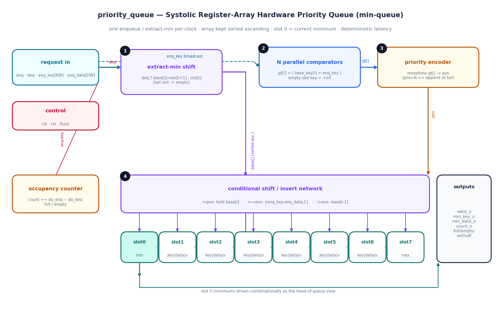
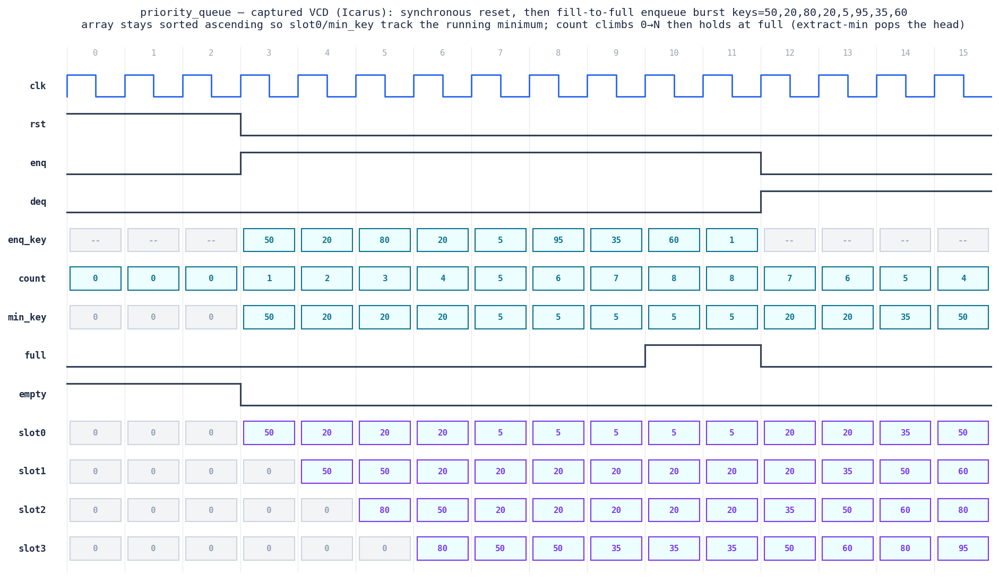

# Day 23 — Systolic Register-Array Hardware Priority Queue (`priority_queue`)

A fixed-capacity **hardware priority queue** (min-queue) built as a **systolic
shift-register array**. It supports a **single-cycle enqueue**, a **single-cycle
extract-min**, and even **both in the same cycle** (a *replace-min*) — one
operation per clock at **deterministic, data-independent latency**. There is no
multi-cycle sift-up/sift-down like a binary heap in memory: the whole N-entry
array re-sorts itself in **one clock** from purely local (neighbour) datapaths.

The entries are held **sorted ascending by key**, so **slot 0 is always the
current minimum** (highest priority) and is available combinationally as the
head. Empty slots act as `+∞` and stay at the tail, so valid entries are always
packed at the low indices.

This is a workhorse primitive on both sides of the "FPGA-for-finance / line-rate
networking" world:

* **HFT** — the heart of a **price-time order book** (best bid / best ask is an
  extract-min / extract-max), **event & timer wheels**, and **deadline
  scheduling** where the next order to act on must pop with fixed latency. The
  `data` field carries the order/quote ID, so the winning entry stays
  identifiable.
* **FPGA NIC / switch** — **packet schedulers** (strict-priority, earliest-
  deadline-first), **QoS / traffic shapers**, and **coalescing timers**, where a
  new descriptor must be inserted and the most-urgent one dequeued every cycle
  at line rate.

---

## Circuit diagram



*Structural schematic of the built RTL (hand-drawn, not a simulator capture).*
Each cycle flows through four combinational stages. **(1) extract-min shift** —
if `deq`, every entry shifts toward index 0 (`base[i] = slot[i+1]`, tail →
empty), otherwise `base[]` is the current array; either way `base[]` is sorted
ascending. **(2) N parallel comparators** broadcast `enq_key` against every
`base` slot's effective key (empty = `+∞`) to form `gt[i] = (base_key[i] >
enq_key)`. Because `base` is sorted, `gt[]` is a **monotone** `0…0 1…1` vector.
**(3) priority encoder** turns `gt[]` into the single insertion index `pos`
(`pos == N` ⇒ append at the tail). **(4) conditional shift/insert network**
writes the N register slots in one shot: below `pos` hold, at `pos` drop in the
new entry, above `pos` shift the neighbour up. An occupancy counter tracks
`count_o` / `full_o` / `empty_o`, and slot 0 drives the head-of-queue view.

---

## Features

* **O(1) enqueue and extract-min** — insert into sorted position *and* pop the
  minimum, each in a **single clock**, with latency independent of occupancy or
  key values. No heap-in-RAM sift loop, no re-sort pass.
* **Replace-min in one cycle** — asserting `enq` and `deq` together pops the
  head and inserts a new entry with net-zero occupancy change (ideal for
  "swap the current best" scheduler patterns).
* **Always-sorted invariant** — the array is sorted ascending after *every*
  cycle, so `min_key_o` / `min_data_o` are the true global minimum at all times,
  and `slot_*_o` exposes the whole ordered array.
* **Fair tie rule (FIFO among equals)** — insertion uses a **strict `>`**
  comparison, so equal-priority entries extract in **arrival order** — the
  behaviour price-time order books and packet schedulers require.
* **Payload tracking** — each key carries a `DW`-bit payload (order ID, pointer,
  descriptor index) that travels with it.
* **Guarded + observable** — `full_o` / `empty_o` block illegal ops; an ignored
  enqueue-on-full raises `overflow_o` and an ignored dequeue-on-empty raises
  `underflow_o` (registered 1-cycle pulses).
* **Synchronous reset + `flush`** — clears the whole queue in one cycle.
* Fully **parameterized** (`N`, `KW`, `DW`), **no latches**, flattened packed
  state for portability across simulators and synthesis.

---

## Parameters

| Parameter | Default | Meaning                                       |
|-----------|---------|-----------------------------------------------|
| `N`       | 8       | queue capacity (number of slots)              |
| `KW`      | 16      | key / priority width (unsigned)               |
| `DW`      | 16      | data / payload width (order ID, pointer, …)   |

Derived: `CW = $clog2(N+1)` — width of the occupancy counter.

## Ports

| Port          | Dir | Width      | Description                                        |
|---------------|-----|------------|----------------------------------------------------|
| `clk`         | in  | 1          | clock                                              |
| `rst`         | in  | 1          | synchronous, active-high reset (clears queue)      |
| `flush`       | in  | 1          | synchronous clear of all entries                   |
| `enq`         | in  | 1          | enqueue `{enq_key, enq_data}` this cycle           |
| `deq`         | in  | 1          | extract-min (pop slot 0) this cycle                |
| `enq_key`     | in  | `KW`       | priority of the new entry (unsigned)               |
| `enq_data`    | in  | `DW`       | payload of the new entry                           |
| `valid_o`     | out | 1          | head valid (`count_o != 0`)                        |
| `min_key_o`   | out | `KW`       | smallest key currently held (slot 0)               |
| `min_data_o`  | out | `DW`       | payload of the minimum                             |
| `slot_valid_o`| out | `N`        | per-slot valid (slot 0 = min)                      |
| `slot_key_o`  | out | `N*KW`     | sorted keys; slot `i` = `slot_key_o[i*KW +: KW]`   |
| `slot_data_o` | out | `N*DW`     | sorted payloads; slot `i` = `slot_data_o[i*DW +: DW]` |
| `count_o`     | out | `CW`       | number of valid entries (0..N)                     |
| `full_o`      | out | 1          | asserted when `count_o == N`                       |
| `empty_o`     | out | 1          | asserted when `count_o == 0`                       |
| `overflow_o`  | out | 1          | registered pulse: enqueue ignored (was full)       |
| `underflow_o` | out | 1          | registered pulse: dequeue ignored (was empty)      |

Operation select per cycle: `enq` only → insert; `deq` only → extract-min;
`enq & deq` → replace-min; neither → hold.

---

## Block diagram (ASCII)

```
      enq, deq, enq_key[KW], enq_data[DW]           clk / rst / flush
            │        │                                     │
            │        ▼                                     ▼
            │   ┌──────────────────┐   base[]        ┌──────────────┐
            │   │ (1) extract-min  │  (sorted asc)   │  occupancy   │
            │   │     shift-down   │────────┬───────►│  counter     │
            │   │ deq? slot[i+1]   │        │        │ count/full/  │
            │   │      : slot[i]   │        │        │   empty      │
            │   └──────────────────┘        │        └──────────────┘
            │ enq_key                       │
            │ (broadcast)                   │
            ▼                               │
     ┌───────────────┐   gt[]  ┌──────────────────┐
     │ (2) N parallel│  (mono- │ (3) priority     │
     │   comparators │  tone)  │     encoder      │──► pos  (N ⇒ append)
     │ gt[i]=        │────────►│  first set bit   │
     │  base_key[i]  │         └──────────────────┘
     │   > enq_key   │                    │ pos
     └───────────────┘                    ▼
   ┌──────────────────────────────────────────────────────────────────┐
   │ (4) conditional shift / insert network                            │
   │   i <  pos : hold  base[i]                                        │
   │   i == pos : insert {enq_key, enq_data, 1}                        │
   │   i >  pos : shift  base[i-1]  (toward the tail)                  │
   └──────────────────────────────────────────────────────────────────┘
        │        │        │                         │
        ▼        ▼        ▼                         ▼
   ┌────────┐┌────────┐┌────────┐             ┌──────────┐
   │ slot 0 ││ slot 1 ││  ...   │  ◄────────► │ slot N-1 │
   │ (min)  ││        ││        │             │  (max)   │
   └───┬────┘└────────┘└────────┘             └──────────┘
       ▼
  valid_o / min_key_o / min_data_o        (slot 0 = current minimum)
  slot_valid_o / slot_key_o / slot_data_o (whole sorted-ascending view)
```

---

## Simulation timing



*Genuine captured waveform — parsed directly from the VCD produced by the
Icarus Verilog run (`make icarus`), **not** a hand-drawn mock-up.* The window
shows synchronous **reset** for the first cycles, then a **fill-to-full**
enqueue burst with keys `50, 20, 80, 20, 5, 95, 35, 60`. Because the array is
kept **sorted ascending**, `slot0` / `min_key` always show the running minimum:
`min_key` becomes `50`, then `20` when the smaller key arrives, then `5` and
holds while `5` is resident. `count` climbs `0 → 8` and `full` asserts. When the
`deq` extract-min stream begins, the head pops in ascending order and `min_key`
walks up `5 → 20 → 35 → 50 …` as `count` falls — a live demonstration that the
minimum is always at slot 0 with deterministic latency.

---

## How it works

1. **Effective key.** An empty slot must never win a comparison and must sort to
   the tail, so its effective key is `+∞` (all-ones). A valid slot presents its
   stored key.
2. **Extract-min shift (`base[]`).** If `deq` is honoured, every entry shifts one
   slot toward index 0, dropping the old minimum and freeing the tail; otherwise
   `base[]` is just the current array. A sorted-ascending array stays sorted
   after this shift.
3. **Parallel compare.** All `N` comparators evaluate `base_key[i] > enq_key`
   simultaneously. Since `base` is sorted ascending, the vector `gt[]` is
   guaranteed **monotone** (`0…0` then `1…1`).
4. **Priority encode.** `pos` = index of the first set bit of `gt[]` (or `N` if
   none). That is exactly where the new key belongs; **strict `>`** places it
   *after* any equal-key entries, giving FIFO order among equal priorities.
5. **Conditional shift/insert.** In one clock the next state of every slot is:
   hold `base[i]` (`i < pos`), take the new entry (`i == pos`), or copy the
   neighbour below (`i > pos`, shift toward the tail). Occupancy updates by
   `+do_enq − do_deq`.
6. **Invariant.** The array is sorted ascending after every cycle, so slot 0 is
   the exact global minimum at all times — a running priority queue that never
   needs a re-sort pass.

---

## What the testbench checks

`tb_priority_queue.sv` is **self-checking** against an independent golden model —
a plainly-coded scalar behavioral min-priority-queue (ascending-sorted array +
occupancy counter) that applies the same `{enq, deq}` request with the same
accept rules (full blocks a lone enqueue, empty blocks any pop, `enq & deq` is a
replace-min) and the same strict-`>` tie rule. It is written in a sequential
shift style, structurally different from the DUT's parallel base-shift +
monotone-priority-encode + one-shot insert datapath, so it validates the DUT
rather than mirroring it. **Every operation** the full DUT state is checked:
head view (`valid_o`, `min_key_o`, `min_data_o`), the whole sorted array
(`slot_valid_o` / `slot_key_o` / `slot_data_o`), occupancy (`count_o`,
`full_o`, `empty_o`), and the `overflow_o` / `underflow_o` status pulses.

Stimulus:

* **Reset** and post-reset empty state.
* **Fill to full** with mixed-order keys (incl. a duplicate) — sorted insertion
  at head, middle, and tail positions.
* **Overflow** — enqueue while full is ignored and raises `overflow_o`.
* **Drain to empty** — extract-min must return keys in ascending order.
* **Underflow** — dequeue while empty is ignored and raises `underflow_o`.
* **Ascending then descending streams** — worst-case insertion-position sweeps.
* **Replace-min** (`enq & deq`) on partial, and the empty case (acts as a plain
  enqueue).
* **Interleaved enqueue/dequeue** holding a partial queue, incl. duplicate keys
  to exercise the FIFO tie rule.
* **Mid-stream flush.**
* **4000 randomized operations** with random `{enq, deq}` and keys, periodic
  flushes.

On success it prints `RESULT: *** PASS ***`. A global watchdog fails the run on
timeout.

**Last local run (Icarus Verilog):** `checks=4082 errors=0` → `RESULT: *** PASS ***`.

---

## Run it

```bash
# Icarus Verilog (open source)
make icarus

# Verilator
make verilator

# Synopsys VCS
make vcs

# Siemens Questa / ModelSim
make questa
```

Regenerate the docs images from a fresh simulation:

```bash
make waveform    # runs the sim, then renders the VCD + circuit diagram to docs/
```

Requires `matplotlib` for the image scripts
(`python3 -m pip install --user matplotlib`).
