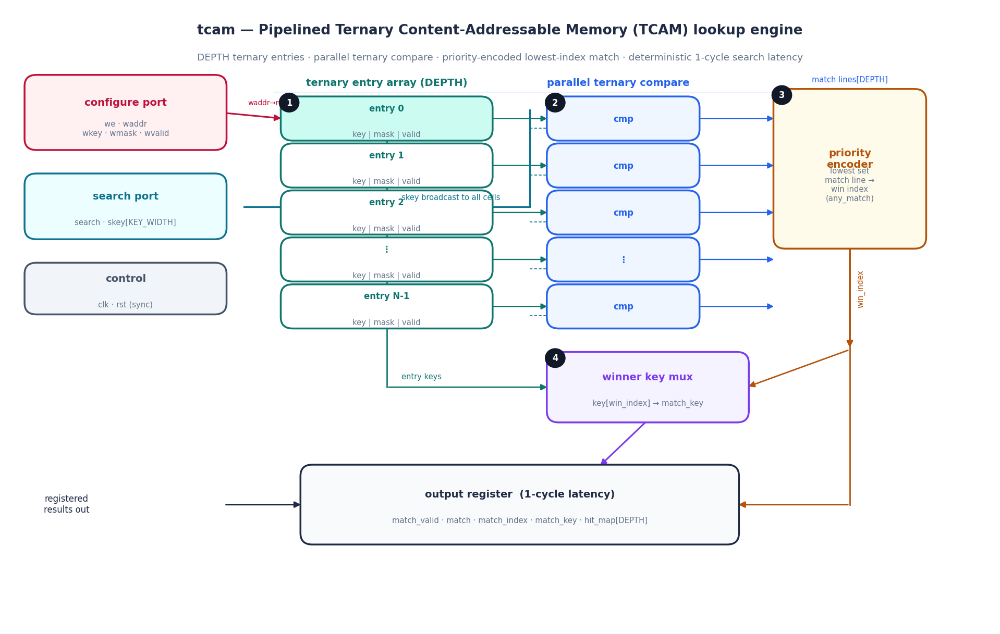
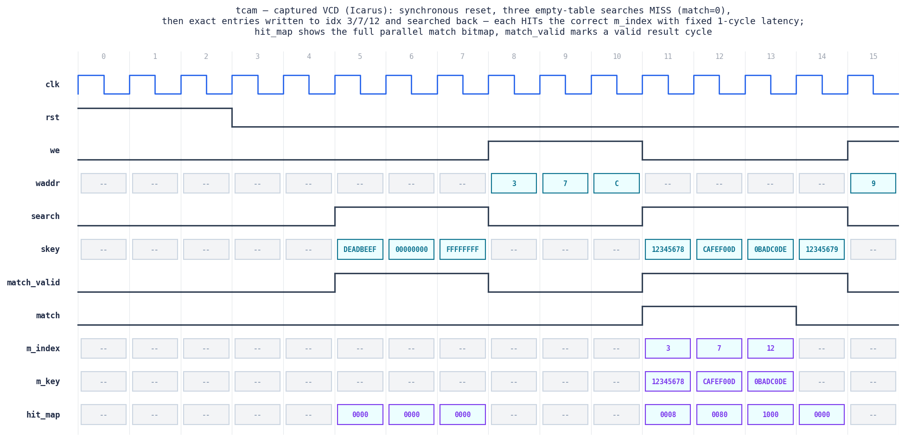

# Day 24 — Pipelined Ternary CAM (TCAM) Lookup Engine (`tcam`)

A parameterized **Ternary Content-Addressable Memory**: a `DEPTH`-entry table
where each entry stores a `KEY_WIDTH`-bit **ternary pattern** — a value plus a
per-bit **care mask** — and a valid bit. Where ordinary RAM maps *address → data*,
a CAM maps *data → address*: you present a search key and the hardware compares
it against **every entry in parallel in one shot**. "Ternary" means each stored
bit is `0`, `1`, or **don't-care** (`X`), so a single entry can match a whole
range of keys. The `DEPTH` parallel match lines are **priority-encoded** so the
**lowest index wins**, returning one deterministic winner every clock.

This is the canonical "search in hardware" primitive on both sides of the
**FPGA-for-finance / line-rate networking** world:

* **HFT / FPGA trading** — constant-latency **symbol → internal-ID** lookup at
  the feed-handler front-end, **order/quote tag** matching, and rule-based
  classification of incoming market-data messages. Every lookup returns in a
  **fixed number of cycles**, occupancy-independent — exactly the determinism a
  tick-to-trade path needs.
* **FPGA NIC / switch** — **ACLs** and firewall/flow tables, and, with
  contiguous-prefix masks ordered longest-first, **longest-prefix-match (LPM)
  routing** and policy classification at line rate. TCAM *is* the classic
  router forwarding-table engine.

---

## Circuit diagram



*Structural schematic of the built RTL (hand-drawn, not a simulator capture).*
The lookup flows through four stages. **(1) ternary entry array** — `DEPTH`
registered rows, each `{key, mask, valid}`, written one-per-cycle through the
configure port. **(2) parallel ternary compare** — the search key `skey` is
broadcast to every entry and each cell computes
`match[i] = valid[i] & (((skey ^ key[i]) & mask[i]) == 0)` (mask bit `1` = care,
`0` = wildcard). **(3) priority encoder** reduces the `DEPTH` match lines to the
**lowest** set index (`win_index`) plus an `any_match` flag. **(4) winner key
mux** reads back `key[win_index]`. The winner and the full match bitmap are
**registered once**, giving a deterministic **1-cycle** search latency
independent of occupancy or key values.

---

## Features

* **Massively-parallel single-shot search** — one search key is compared against
  **all `DEPTH` entries simultaneously**; there is no per-entry iteration, so
  lookup latency is a fixed **1 cycle** regardless of how full the table is or
  where the match lives.
* **True ternary matching** — every stored bit can be `0`, `1`, or don't-care via
  the per-entry `mask`. One entry with a partial mask covers an entire subnet /
  key range (`mask=0` ⇒ a **default / catch-all** entry that matches everything).
* **Priority-encoded lowest-index winner** — when several entries match, the
  **lowest index wins**, giving well-defined semantics and, with entries loaded
  **longest-prefix-first**, a ready-made **LPM** engine.
* **Full parallel hit bitmap** — `hit_map_o` exposes *all* matching entries (not
  just the winner), useful for multi-match / rule-coverage statistics.
* **One-per-cycle configure port** — write `{key, mask, valid}` to any entry;
  clearing `valid` retires an entry, and re-writing a `key`/`mask` re-targets it.
* **Line-rate throughput** — accepts a new search **every clock**; results stream
  out with fixed 1-cycle latency (a back-to-back search burst is exercised in
  the testbench).
* **Fully parameterized & reset-safe** — `DEPTH` and `KEY_WIDTH` are generics,
  synchronous active-high reset clears all valid bits, and the RTL is
  `default_nettype none`, lint-friendly, and free of latches.

---

## Parameters

| Parameter    | Default | Description                                             |
|--------------|---------|---------------------------------------------------------|
| `DEPTH`      | 16      | Number of TCAM entries (match lines).                   |
| `KEY_WIDTH`  | 32      | Width of the ternary key / mask in bits.                |
| `IDXW`       | derived | `$clog2(DEPTH)` — width of the entry-index outputs.     |

## Ports

| Signal          | Dir | Width         | Description                                             |
|-----------------|-----|---------------|---------------------------------------------------------|
| `clk`           | in  | 1             | Clock; everything synchronous to the rising edge.       |
| `rst`           | in  | 1             | Synchronous active-high reset (clears all valid bits).  |
| `we`            | in  | 1             | Configure-write enable (one entry per cycle).           |
| `waddr`         | in  | `IDXW`        | Entry index to configure.                               |
| `wkey`          | in  | `KEY_WIDTH`   | Stored value bits for the entry.                        |
| `wmask`         | in  | `KEY_WIDTH`   | Care mask: bit `1` = must-match, bit `0` = wildcard.    |
| `wvalid`        | in  | 1             | Entry valid bit (`0` invalidates the entry).            |
| `search`        | in  | 1             | Search-request strobe.                                  |
| `skey`          | in  | `KEY_WIDTH`   | Key to look up.                                          |
| `match_valid_o` | out | 1             | High the cycle a search result is presented.            |
| `match_o`       | out | 1             | At least one valid entry matched.                       |
| `match_index_o` | out | `IDXW`        | Winning (lowest) matching entry index.                  |
| `match_key_o`   | out | `KEY_WIDTH`   | Stored value of the winning entry.                      |
| `hit_map_o`     | out | `DEPTH`       | Full parallel match bitmap (all matching entries).      |

---

## Block diagram (ASCII)

```
 configure ─(we,waddr,wkey,wmask,wvalid)─┐
                                         v
        ┌───────────────── ternary entry array (DEPTH) ─────────────────┐
        │  entry0 {key,mask,valid}   entry1 ...   ...   entryN-1         │
        └───────┬───────────────┬───────────────────────────┬───────────┘
                │ key/mask/valid per row                     │ entry keys
   skey ────────┼──────── broadcast to every cell ───────────┼────────────┐
                v                                             │            │
        ┌───────────────── parallel ternary compare ─────────┘            │
        │ match[i] = valid[i] & ((skey ^ key[i]) & mask[i] == 0)          │
        └───────┬──────────────── match lines[DEPTH] ────────┬────────────┘
                v                                            v
        ┌──────────────┐   win_index   ┌──────────────────────────┐
        │  priority    │──────────────▶│  winner key mux          │
        │  encoder     │   any_match    │  key[win_index]->match_key
        └──────┬───────┘                └───────────┬──────────────┘
               │ index / match / hit_map            │ match_key
               v                                     v
        ┌──────────────── output register (1-cycle latency) ─────────────┐
        │ match_valid · match · match_index · match_key · hit_map[DEPTH]  │
        └────────────────────────────────────────────────────────────────┘
```

---

## Simulation timing



*Genuine captured waveform — parsed straight from `tcam.vcd`, which is produced
by the actual Icarus Verilog run (`make icarus`). This is **not** a hand-drawn
mock-up.* The window shows: synchronous **reset** (cycles 0–2); three
**empty-table searches** (`DEADBEEF`, `00000000`, `FFFFFFFF`) that all **MISS**
(`match=0`, `hit_map=0000`); three exact-match **entry writes** to indices
**3 / 7 / 12** (`we` high, `waddr` = 3/7/C); then exact **searches** that **HIT**
the correct `m_index` (3, 7, 12) with `m_key` echoing the stored value and
`hit_map` showing the one-hot match line (`0008`, `0080`, `1000`) — each with a
fixed **1-cycle** latency. The final search `12345679` is a near-miss and
correctly drops `match` back to 0.

---

## How it works

**Ternary compare.** For a search key `skey` and entry `i`, the effective
comparison masks off the don't-care bits before comparing:
`((skey ^ key[i]) & mask[i]) == 0`. Any bit where `mask[i]=0` contributes zero to
the XOR-and-mask regardless of its stored/searched value, so it is a wildcard.
Gated by `valid[i]`, this yields one **match line** per entry, all computed in a
single combinational cone in parallel.

**Priority encoding.** The `DEPTH` match lines feed a priority encoder that
selects the **lowest** set index as `win_index` and asserts `any_match` if any
line is high. A downward scan (`i = DEPTH-1 … 0`) lets the `i==0` assignment win,
implementing "lowest index has highest priority." Because entries can be loaded
in priority order (e.g. longest-prefix first), this directly realizes LPM /
first-match-wins policy.

**Registered result.** The combinational match/encoder/read-back result is
registered on the clock edge that samples `search`, so `match_valid_o`,
`match_o`, `match_index_o`, `match_key_o`, and `hit_map_o` appear **exactly one
cycle** after the request — occupancy-independent, deterministic latency, and a
clean pipeline register for timing closure on wide keys or deep tables.

**Write coherency.** The configure port writes `{key, mask, valid}` with
nonblocking semantics, so a write becomes visible to the **next** cycle's search
— a same-cycle search still sees the pre-write contents. The testbench models
this exact ordering in its golden shadow.

---

## Run it

```bash
# Icarus Verilog (open source)
make icarus

# or Verilator / VCS / Questa
make verilator
make vcs
make questa

# regenerate the docs images from a fresh simulation
make waveform
```

A passing run prints:

```
tcam: DEPTH=16 KEY_WIDTH=32  checks=2556  errors=0
RESULT: *** PASS ***
```

> **Simulator status:** verified with **Icarus Verilog** (`iverilog -g2012`) on
> this machine — **2556 checks, 0 errors**. The waveform image is the real
> captured VCD from that run.

---

## What the testbench checks

`tb_tcam.sv` keeps an **independent golden shadow** of every entry and, for each
search, performs a **linear priority scan** to derive the expected
`{match, index, stored-key, full hit bitmap}`. It samples the DUT's registered
result one cycle after each request and compares all four, using the pre-write
shadow state (matching the RTL's nonblocking-write ordering). Coverage:

1. **Reset** — all entries invalid; searches miss.
2. **Empty-table miss** — searches with no valid entries return `match=0`.
3. **Exact matches** — full-care entries at scattered indices, searched back to
   the correct index; a near-miss key returns no hit.
4. **Priority** — two entries with identical keys; the **lower index** wins and
   `hit_map` shows *both* set.
5. **Wildcard default route** — a `mask=0` entry matches everything; a specific
   low-index entry still wins, unrelated keys fall through to the default.
6. **Longest-prefix-match** — `/24`, `/16`, `/8` prefix-mask entries ordered
   longest-first; keys resolve to the longest matching prefix.
7. **Invalidate** — clearing `valid` retires an entry so it stops matching.
8. **Overwrite** — re-keying an entry moves its match target.
9. **Throughput burst** — back-to-back searches (one lookup per clock).
10. **Randomized storm** — 3,000 cycles of interleaved random writes (full-care,
    partial-care, full-wildcard, and sparse masks; mostly-valid) and random
    searches, every result checked against the golden model.

Every mismatch increments an error counter and prints a diagnostic; the run ends
with `RESULT: *** PASS ***` only if **all 2556 checks pass**. A global timeout
guards against a hang, and the RTL carries an internal assertion that the winning
index is always set in the hit bitmap.
