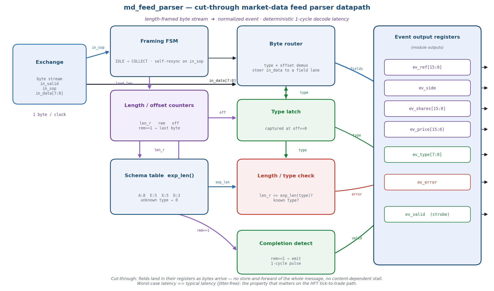
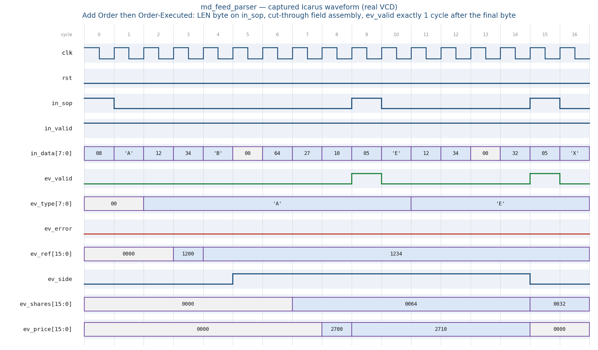

# Day 25 — Cut-Through Streaming Market-Data Feed Parser

A **line-rate market-data feed handler datapath**: the very front door of every
HFT *tick-to-trade* pipeline. Raw exchange bytes arrive off the wire and are
turned into normalized, field-aligned **market-data events** *inline on the
FPGA* — with **deterministic, jitter-free latency**, never shipped to a CPU to
be parsed.

The block ingests a **length-framed byte stream** (1 byte / clock) and emits a
decoded event **exactly one cycle after the final message byte**, independent of
message type or field values. It is **cut-through**: fields are assembled *on
the fly* as bytes land, so there is **no store-and-forward** of the whole
message and **no content-dependent stall** — *worst-case latency == typical
latency*. That equality is the single most important property in HFT hardware,
and this design is built around it.

Message set (a compact, faithful **NASDAQ-ITCH-style** schema): **Add Order**
(`A`), **Order Executed** (`E`), **Order Cancel** (`X`), **Order Delete** (`D`).

---

## Why this matters for ultra-low-latency / HFT

In high-frequency trading the metric that wins is not throughput — it is the
**deterministic worst-case latency** from *a bit landing on the wire* to *an
order leaving the wire* (the "tick-to-trade" loop). CPUs cannot do this
predictably: interrupts, cache misses, NIC→kernel→user copies, and scheduler
jitter add microseconds of *variance*. So the winning shops parse the feed **in
the FPGA fabric**, on the MAC's receive datapath, at line rate. This block is
that parse stage. The lessons it teaches — each called out again inline below —
are the core of low-latency hardware design:

| # | Ultra-low-latency principle | How this design embodies it |
|---|-----------------------------|------------------------------|
| 1 | **Latency ≠ throughput; determinism is king** | Every message decodes in a fixed 1 cycle after its last byte. No data-dependent branch changes that number. |
| 2 | **Cut-through, not store-and-forward** | Fields are written into their registers *as the bytes stream in*. We never wait for "end of packet" to start decoding. |
| 3 | **Do the work inline on the wire** | A pure combinational demux + registered accumulate — no RAM buffering, no DMA, no CPU. Fits directly behind a 10/25G MAC. |
| 4 | **Fail without stalling (self-resync)** | A bad/garbled/over-length frame still produces exactly one `ev_error` event and the parser re-frames on the next `in_sop`. A corrupt feed can never wedge the pipeline. |
| 5 | **Normalize early** | Downstream (book-build, strategy) sees one clean event bus regardless of message type — no per-type wiring downstream. |
| 6 | **Big-endian wire assembly** | Exchange protocols are network-byte-order; multi-byte fields are assembled MSB-first exactly as they arrive. |

> On a real 10G/25G NIC you would widen the datapath (e.g. 8 or 64 bytes/clock)
> and unroll the same offset-demux across lanes. The *technique* here — offset ×
> type steering, cut-through accumulate, deterministic emit, self-resync — is
> exactly what scales up. The 1-byte datapath keeps the golden model and the
> waveform crisp.

---

## Features

- **Length-framed streaming input** — `[LEN][body…]`; the `LEN` byte is flagged
  by `in_sop`. `body[0]` is always the message **type** char.
- **Cut-through field assembly** — a `(type × offset)` demux steers each incoming
  byte straight into its destination field register; no whole-message buffer.
- **Deterministic 1-cycle decode latency** — `ev_valid` pulses exactly one clock
  after the final byte, *always* (measured on the real waveform below).
- **Normalized event bus** — `{type, ref, side, shares, price}` plus `error`;
  fields that don't apply to a message type are driven to 0.
- **Robust error handling & self-resync** — unknown type char *or* a `LEN` that
  doesn't match the type's schema ⇒ one `ev_error` event; a mid-message `in_sop`
  aborts the in-flight message and re-frames. No stalls, no lock-ups.
- **Simulator-portable** — pure synthesizable SystemVerilog, `default_nettype
  none`, latch-free, no vendor primitives.

---

## Wire protocol (simplified ITCH-style, big-endian fields)

```
Framing :  [ LEN ] [ body[0] body[1] ... body[LEN-1] ]      (LEN flagged by in_sop)
           body[0] == message type char.

 'A' Add Order    LEN=8 :  'A'  refH refL  side  shH shL  prH prL
 'E' Order Exec   LEN=5 :  'E'  refH refL  shH shL
 'X' Order Cancel LEN=5 :  'X'  refH refL  shH shL
 'D' Order Delete LEN=3 :  'D'  refH refL

 side byte : 'B' => buy/bid (ev_side=1) ; anything else => sell/ask (0)
```

Any unknown type, or a `LEN` that mismatches the type's schema, still yields one
event with `ev_error = 1`.

---

## Ports

| Signal      | Dir | Width | Description |
|-------------|-----|-------|-------------|
| `clk`       | in  | 1     | Clock. |
| `rst`       | in  | 1     | Synchronous, active-high reset. |
| `in_valid`  | in  | 1     | A stream byte is present this cycle. |
| `in_sop`    | in  | 1     | This byte is a message **LENGTH** byte (start-of-message frame). |
| `in_data`   | in  | 8     | The stream byte. |
| `ev_valid`  | out | 1     | 1-cycle strobe: a message was decoded this cycle. |
| `ev_type`   | out | 8     | Raw message type char (`'A'`/`'E'`/`'X'`/`'D'`). |
| `ev_error`  | out | 1     | Unknown type **or** length/schema mismatch (fields are don't-care). |
| `ev_ref`    | out | 16    | Order reference number. |
| `ev_side`   | out | 1     | `1`=buy/bid, `0`=sell/ask (meaningful for **Add** only). |
| `ev_shares` | out | 16    | Shares (Add = order qty; Exec/Cancel = executed/cancelled qty). |
| `ev_price`  | out | 16    | Price (meaningful for **Add** only). |

> **A note on parameterization.** A wire parser's field map is *fixed by the
> exchange protocol* — the 16-bit `ref`/`shares`/`price` fields are
> protocol-constants, not tunable knobs, and pretending otherwise would be
> dishonest RTL. The reusable, parameterizable ideas here are the **datapath
> techniques** (cut-through assembly, deterministic emit, self-resync framing),
> which port directly to a wider datapath or a different schema.

---

## Block diagram (built circuit)



*Datapath of the built circuit. The framing FSM + counters drive a `(type ×
offset)` byte router that steers each byte into its field register (cut-through
accumulate). In parallel, a schema table (`exp_len`) plus a length/type check
raise `ev_error`, and a completion detector (`rem==1`) fires the 1-cycle
`ev_valid` strobe. All results converge on the normalized event output
registers.*

ASCII sketch of the same dataflow:

```
                       in_sop            +-----------------+
   in_valid ─────────────────────────►  |   Framing FSM   |
   in_sop   ─────────────────────────►  | IDLE → COLLECT   |──load len──┐
                                         +-----------------+            ▼
                                                              +-------------------+
                                                              | len_r / rem / off |
                                                              +---------+---------+
                                              off / type                │ len_r        rem==1
                                                  ▼                      ▼                │
   in_data[7:0] ──────────►  +-----------------+   +-------------------+ +--------------+ │
                             |   Byte router   |   | Schema exp_len()  | | Completion   |◄┘
                             | type×offset dmux|   |  A:8 E:5 X:5 D:3   | | detect       |
                             +--------+--------+   +---------+---------+ +------+-------+
                          fields │        ▲ type            │ exp_len          │ ev_valid
                                 ▼        │                 ▼                  │
                    ev_ref / ev_side /  [Type latch]   [Len/type check]─error  │
                    ev_shares / ev_price   │ ev_type         │                 │
                                 └─────────┴─────────────────┴─────────────────┘
                                                   ▼
                                    Normalized event output registers
                        { ev_valid, ev_type, ev_error, ev_ref, ev_side, ev_shares, ev_price }
```

---

## Simulation timing



**This is a *real captured waveform*** — the testbench dumps a VCD from the
Icarus Verilog run and a small Python/matplotlib VCD parser renders it (not a
hand-drawn mock-up). It shows the directed window: an **Add Order** immediately
followed (back-to-back) by an **Order Executed**.

Reading it (cycle numbers from the figure):

- **cyc 0** — `in_sop=1`, `in_data=08`: the **LENGTH** byte of the Add message.
- **cyc 1–8** — the body streams in: `'A' 12 34 'B' 00 64 27 10`.
- **cut-through in action** — watch `ev_ref`: `0000 → 1200` (after `refH=12`) →
  `1234` (after `refL=34`); `ev_side` flips to 1 after the `'B'`; `ev_price`
  goes `2700 → 2710` as its two bytes land. The fields are assembled *as the
  bytes arrive*, never buffered whole.
- **cyc 9** — `ev_valid` pulses: the Add is decoded (`ref=1234, side=buy,
  shares=0064, price=2710`) — **exactly one cycle after the final byte**. In the
  *same* cycle the next message's `LEN=05` byte is already on `in_sop`
  (back-to-back, zero bubble).
- **cyc 15** — `ev_valid` pulses again for the Exec (`type='E', ref=1234,
  shares=0032`), with `ev_side`/`ev_price` normalized to 0 for a non-Add event.

`ev_error` stays low throughout — both messages are well-formed. The **constant
9-cycle-in → 1-cycle-out** cadence is the deterministic latency the whole
design exists to guarantee.

---

## How it works

1. **Framing.** `in_sop` marks a `LEN` byte. The FSM captures `len_r`, seeds the
   down-counter `rem = LEN` and offset `off = 0`, and enters `COLLECT`. A `LEN`
   of 0 carries no event. A new `in_sop` at *any* time re-frames — this is the
   **self-resync** that makes a dropped/garbled byte harmless.
2. **Type capture.** `off==0` latches the type char. From then on the
   `(type, off)` pair selects which field register the incoming byte belongs to.
3. **Cut-through accumulate.** Each body byte is written *directly* into its
   destination register (`ev_ref[15:8]`, `ev_ref[7:0]`, `ev_side`, …). Multi-byte
   fields are big-endian: the high byte lands first. No message buffer exists.
4. **Completion & deterministic emit.** When `rem==1` (the final byte), the next
   clock asserts `ev_valid` for one cycle. Because the last field byte and the
   `ev_valid` set both happen on that edge (non-blocking), the field registers
   are already final when a consumer samples `ev_valid` — a clean, hazard-free,
   **fixed 1-cycle** hand-off.
5. **Error / normalize.** In parallel, `exp_len(type)` and the `len_r` comparison
   produce `ev_error` (unknown type or wrong length). Fields that don't apply to
   the decoded type (`side`/`price` for non-Add, `shares` for Delete) are driven
   to 0 so the event bus is always clean.

The whole path is combinational demux + single-level registers — the critical
path is short and, crucially, **the same length for every message**.

---

## What the testbench checks

`tb_md_feed_parser.sv` is fully **self-checking** against an **independent
golden reference** (a separate schema decoder), using an ordered pointer-based
scoreboard (no SV queues, so it runs on Icarus / Verilator / VCS / Questa
alike):

- **Directed corners:** one of each message type; an **unknown type**; an Add
  with the **wrong length**; a Delete that is **over-length**; a **mid-message
  abort/resync**; and **back-to-back** messages with random idle gaps.
- **Randomized:** 2000 messages with random types (incl. unknown), random field
  values, ~15% deliberately corrupted lengths to exercise the error path, and
  random inter-byte gaps (`in_valid` de-asserted).
- **Per event it verifies:** `ev_error` matches the golden expectation and, for
  well-formed messages, every field (`type`, `ref`, `side`, `shares`, `price`).
- **Ordering & completeness:** exactly one event per message, in order; at the
  end the scoreboard must be fully drained (pushed == popped).
- **Liveness:** a cycle **watchdog** `$fatal`s if the DUT ever stalls.

On success it prints `RESULT: *** PASS ***`.

### Latest run (Icarus Verilog 13.0)

```
-------------------------------------------------------
Messages driven : 2020
Events checked  : 2020
Mismatches      : 0
RESULT: *** PASS ***
-------------------------------------------------------
```

---

## Run it

From this folder:

```bash
make icarus      # Icarus Verilog  (open-source)
make verilator   # Verilator
make vcs         # Synopsys VCS
make questa      # Mentor Questa / Cadence Xcelium (qrun)
```

Then, to view the captured waveform in a viewer:

```bash
make waves       # opens md_feed_parser.vcd in gtkwave
```

## Files

```
Day25/
├── md_feed_parser.sv        # RTL: cut-through feed parser
├── tb_md_feed_parser.sv     # self-checking TB (independent golden + scoreboard)
├── Makefile                 # icarus / verilator / vcs / questa targets
├── docs/
│   ├── md_feed_parser_block.png     # datapath / circuit diagram
│   └── md_feed_parser_waveform.png  # REAL captured waveform (from the VCD)
└── README.md
```
