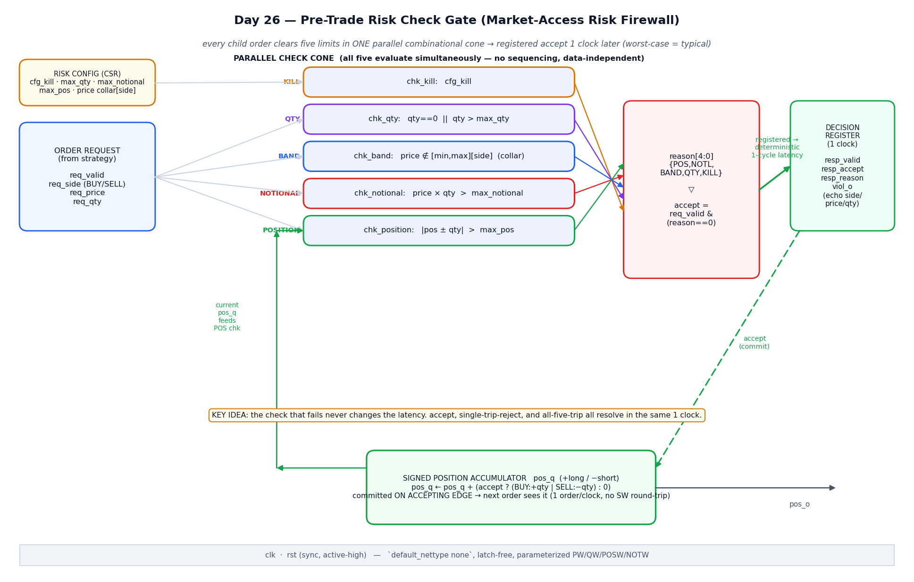
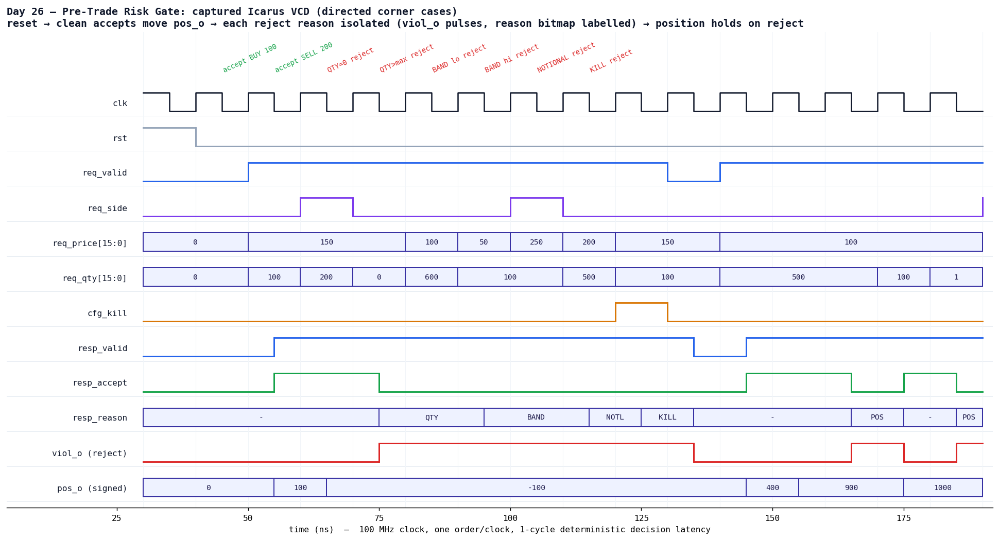

# Day 26 — Pre-Trade Risk Check Gate (Market-Access "Risk Firewall")

The **mandatory last hop of the HFT tick-to-trade path**. Day 25 built the
*front door* (a cut-through feed parser that turns exchange bytes into
normalized market-data events). This is the **back door**: the hardware gate
that every child order a strategy wants to fire **must clear before it is
allowed onto the wire**.

In production this block is the hardware embodiment of the regulatory
pre-trade risk controls — **SEC Rule 15c3-5** ("Market Access Rule") and
**MiFID II RTS 6**. An exchange or broker will not let an order out that has
not been checked for fat-finger size, price sanity, notional exposure, and net
position. Because those checks sit *directly in series* with order egress,
their latency is added to **every** order — so they belong in the FPGA, as one
wide parallel combinational cone whose answer is registered exactly **one clock
later**.

---

## Why this is an ultra-low-latency lesson (the point of the day)

| Software risk check | This hardware gate |
|---|---|
| Runs on a core in the egress path → adds **µs of jitter** (context switch, cache miss, GC/allocator pause) | One combinational cone → **1 clock**, always |
| Latency depends on *which* branch/limit fired, cache state, load | **Deterministic**: accept, one-limit-reject, all-five-reject → **same cycle count** |
| Position update needs a lock / round-trip | Signed accumulator committed **on the accepting edge**, 1 order/clock, no round-trip |
| Worst case ≫ typical | **Worst-case latency == typical latency** |

> **The real product is not "fast" — it is *deterministic*.** In HFT the tail
> of the latency distribution is what loses fills. A gate that is usually 40 ns
> but occasionally 4 µs is useless; a gate that is *always* 1 clock is gold.
> Every design choice here (parallel checks, no data-dependent stall, registered
> output, single-cycle commit) exists to flatten that tail to zero.

---

## Features

- **Five limits checked fully in parallel** in a single combinational cone —
  no sequencing between checks, no data-dependent branch:
  - **KILL** — global kill-switch / trading-halt → reject everything
  - **QTY** — `qty == 0` **or** `qty > max_qty` (fat-finger size)
  - **BAND** — `price` outside the per-side price collar `[min,max]`
  - **NOTIONAL** — `price × qty > max_notional` (capital-at-risk per order)
  - **POSITION** — `|position after this fill| > max_pos` (net exposure)
- **`reason[4:0]` bitmap** `{POS,NOTIONAL,BAND,QTY,KILL}` — every failing limit
  is reported, not just the first, so host risk logging sees the full picture.
- **Deterministic 1-clock latency**, occupancy- and outcome-independent. The
  decision is **registered**; `resp_valid` fires exactly one cycle after the
  request regardless of accept/reject or which checks tripped.
- **Running signed net-position accumulator** (`+` long / `−` short), committed
  **only on accept**, on the accepting clock edge — so a back-to-back
  one-order/clock burst has each order correctly see the position left by its
  predecessor (no software round-trip, no race).
- **Rejected orders never move the position** — proven directly in the TB.
- Per-side price collar, request echo (`side/price/qty`) for the egress stage,
  and a one-cycle `viol_o` reject pulse for perf counters / alarms.
- Clean, synthesizable, **`default_nettype none`**, latch-free, fully
  parameterized (`PW/QW/POSW/NOTW`), lint-friendly.

---

## Parameters

| Parameter | Default | Meaning |
|-----------|---------|---------|
| `PW`   | 16 | Price field width (unsigned ticks) |
| `QW`   | 16 | Quantity field width (unsigned shares) |
| `POSW` | 32 | Signed running-position accumulator width |
| `NOTW` | `PW+QW` (32) | Notional (`price×qty`) / `max_notional` width |

## Ports

| Signal | Dir | Width | Description |
|--------|-----|-------|-------------|
| `clk` | in | 1 | Clock |
| `rst` | in | 1 | Synchronous, active-high reset (clears position + outputs) |
| `cfg_kill` | in | 1 | Kill-switch / trading halt — reject all orders |
| `cfg_max_qty` | in | `QW` | Max shares per order |
| `cfg_max_notional` | in | `NOTW` | Max `price×qty` per order |
| `cfg_max_pos` | in | `POSW` | Max absolute net position |
| `cfg_price_min` | in | `2×PW` | Per-side price collar low  `[0]=BUY, [1]=SELL` |
| `cfg_price_max` | in | `2×PW` | Per-side price collar high `[0]=BUY, [1]=SELL` |
| `req_valid` | in | 1 | Candidate order valid this cycle |
| `req_side` | in | 1 | `0 = BUY`, `1 = SELL` |
| `req_price` | in | `PW` | Order price (ticks) |
| `req_qty` | in | `QW` | Order quantity (shares) |
| `resp_valid` | out (reg) | 1 | Decision valid (1 clock after `req_valid`) |
| `resp_accept` | out (reg) | 1 | `1` = order cleared, safe to send |
| `resp_reason` | out (reg) | 5 | Reject bitmap `{POS,NOTIONAL,BAND,QTY,KILL}` |
| `resp_side/price/qty` | out (reg) | 1/`PW`/`QW` | Request echoed to the egress stage |
| `pos_o` | out | `POSW` (signed) | Live net position (`+` long / `−` short) |
| `viol_o` | out (reg) | 1 | One-cycle pulse when an order is rejected |

---

## ASCII block diagram

```
                RISK CONFIG (CSR, static)
     cfg_kill · max_qty · max_notional · max_pos · collar[side]
                              │
   ORDER REQUEST              │        ┌─────────── PARALLEL CHECK CONE ───────────┐
   req_valid ───────────────►├───────►│ chk_kill : cfg_kill                        │
   req_side  ───────────────►│        │ chk_qty  : qty==0 || qty>max_qty           │
   req_price ───────────────►│        │ chk_band : price ∉ [min,max][side]         │
   req_qty   ───────────────►│        │ chk_notl : price×qty > max_notional        │
                             │        │ chk_pos  : |pos ± qty| > max_pos  ◄──┐      │
                             │        └───────────────┬──────────────────────┼──────┘
                             │                        ▼                      │
                             │            reason[4:0]={POS,NOTL,BAND,QTY,KILL}│
                             │                        │                      │
                             │       accept = req_valid & (reason == 0)      │
                             │                        │                      │
                             │            ┌───────────┴───────────┐          │
                             │            ▼                       ▼          │
                             │   ┌──────────────────┐   ┌───────────────────┐│
                             └──►│ DECISION REGISTER │   │ SIGNED POSITION   ││
                                 │  (1 clock)        │   │ ACCUMULATOR pos_q │┘
                                 │ resp_valid/accept │   │ += accept ?       │
                                 │ resp_reason/viol_o│   │   (BUY:+qty|SELL:-qty):0
                                 │ echo side/price/qty│  │ committed on accept edge
                                 └──────────────────┘   └─────────► pos_o
```

A rendered version with the accept-commit and position-feedback paths:



*Circuit / datapath block diagram of the pre-trade risk gate. Rendered with
matplotlib (schematic, not a simulator screenshot). The five checks form one
parallel combinational cone; `accept` gates the position commit; the current
`pos_q` feeds back into the POSITION check so back-to-back orders stay correct.*

---

## Simulation timing



*Directed-corner-case window, **captured from a real Icarus Verilog run**: the
testbench dumps `risk_gate.vcd` and the VCD is parsed and rendered to PNG (this
is a genuine simulator capture, not a hand-drawn timing diagram). Reading it:
after reset, two clean orders move `pos_o` (`0 → +100 → −100`); then each reject
reason is isolated — `QTY=0`, `QTY>max`, `BAND` low/high, `NOTIONAL`, and
`KILL` (note `cfg_kill` asserted) — each firing a one-cycle `viol_o` pulse with
the `resp_reason` bitmap labelled, while `pos_o` **holds** through every reject.
The decision is always registered exactly **one clock** after the request.*

---

## How it works

1. **Parallel check cone (combinational).** Every cycle, the request and the
   *current committed* position `pos_q` fan out into five independent boolean
   checks that all resolve at once. There is no ordering between them and no
   data-dependent path length — that is what makes the latency flat.
2. **Reason bitmap + accept.** The five check results are packed into
   `reason[4:0]`. `accept = req_valid & (reason == 0)`: an order clears only if
   **no** limit trips. The full bitmap is kept so the host sees *every* reason.
3. **Notional.** `notional = price × qty` (a `PW+QW`-bit product) is compared
   against `max_notional`. *(Kept combinational here for a clean single-cycle
   cone; at aggressive clocks you would pipeline this multiply — see below.)*
4. **Position math with head-room.** The prospective position
   `pos_next = pos_q ± qty` is computed in a **one-bit-wider signed** domain so
   the add cannot wrap before the range check; its magnitude is compared to
   `max_pos`. This catches both long (`+`) and short (`−`) overflow.
5. **Register + commit.** On the clock edge the decision is registered
   (`resp_*`, `viol_o`) and, **iff accepted**, `pos_q` advances by `+qty` (BUY)
   or `−qty` (SELL). Because the commit and the decision share the same edge,
   the *next* cycle's request already sees the updated position — one order per
   clock, back-to-back, with no hazard and no external round-trip.

**Latency is exactly one clock, always.** Accept, a single-limit reject, and an
all-five-limit reject are indistinguishable in timing. That determinism is the
whole reason the block lives in hardware on the egress path.

*Synthesis note:* the only wide arithmetic is the `price×qty` multiply and the
position add/compare. For a high-Fmax target you would register the multiply
into a second pipeline stage (making the gate a fixed **2**-clock latency);
the accumulator commit would then key off the stage-2 accept. The determinism
property is preserved — only the constant changes.

---

## Running it

From inside `Day26/`:

```bash
make icarus      # Icarus Verilog (used to capture the waveform above)
# or
make verilator   # Verilator (lint + fast cycle sim)
make vcs         # Synopsys VCS
make questa      # Cadence Xcelium / Mentor Questa
```

Expected tail of the Icarus run:

```
Day26 risk_gate : 4025 checks, 0 errors
RESULT: *** PASS ***
```

*(This design was simulated with Icarus Verilog 13.0 and passes all 4025
checks; the committed waveform PNG is rendered from that run's VCD.)*

---

## What the testbench checks

`tb_risk_gate.sv` runs an **independent golden model** — it re-implements the
five checks and the signed-position accumulator in plain TB code and compares,
every cycle, against the DUT's registered decision. Because the gate has a
deterministic 1-clock latency and takes one order/clock, the checker is a
1-deep pipeline: the prediction for the request driven at cycle *T* is compared
to the DUT outputs at cycle *T+1*.

Coverage:

- **Reset** — position cleared, no spurious `resp_valid`.
- **Each reject reason isolated** — KILL; QTY (zero *and* over-max); BAND (low
  *and* high, per side); NOTIONAL; POSITION (long *and* short overflow).
- **Clean accepts** that move the running position both directions.
- **Rejected order does not move the position** — a POS-reject is followed by an
  order that only fits if the position stayed put (it does).
- **Back-to-back one-order/clock bursts** — exercises the position hazard across
  the 1-clock pipe (each order sees its predecessor's commit).
- **Bubbles** (`req_valid = 0`) and **live kill-switch** assert/de-assert.
- **4000 randomized orders** — random side/price/qty with occasional kill and
  bubbles; the golden model tracks the position random-walk exactly, and a final
  check confirms `pos_o` equals the model's committed position.

Total: **4025 checks, 0 errors** on Icarus Verilog. The bench prints
`RESULT: *** PASS ***` only if every comparison matched, and has a global
timeout guard.
