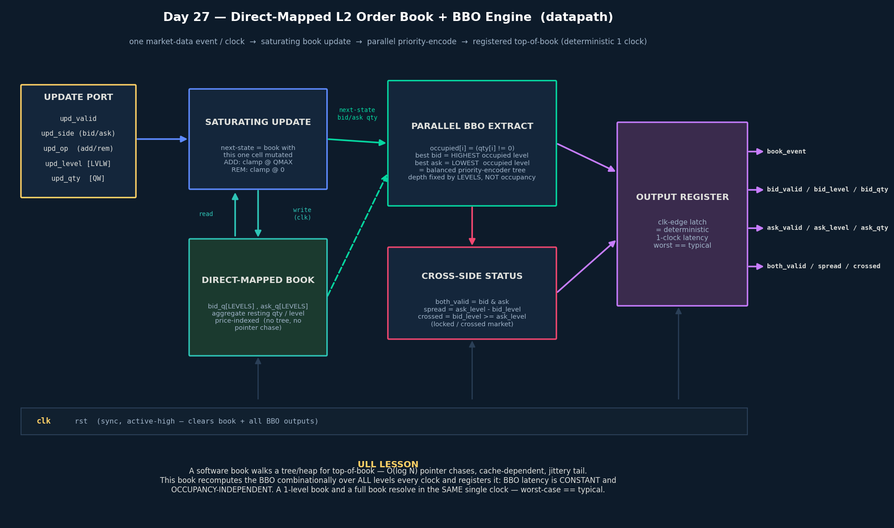
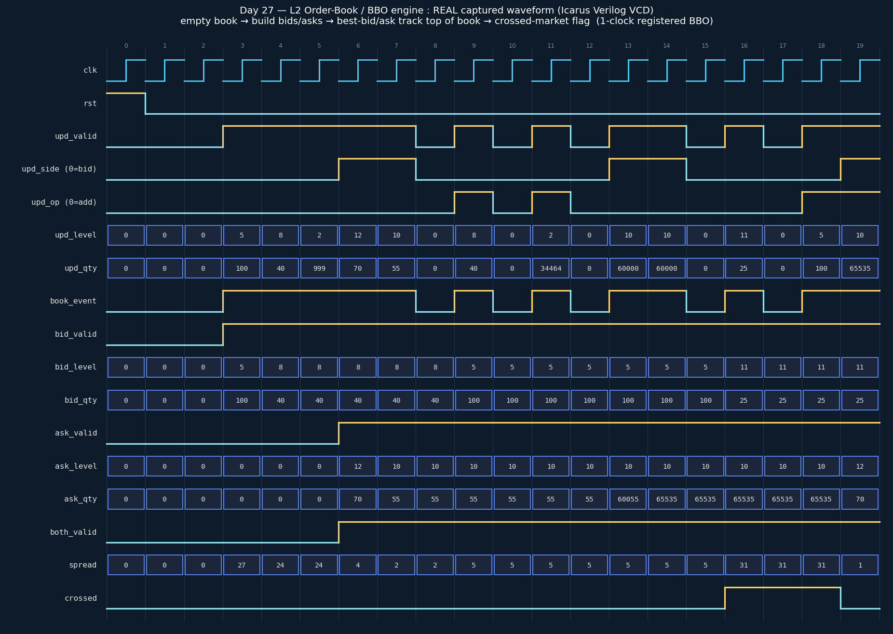

# Day 27 — Direct-Mapped L2 Limit Order Book + BBO (Best-Bid/Offer) Engine

The **compute heart of the HFT tick-to-trade path**. Day 25 built the *front
door* (a cut-through feed parser that turns exchange bytes into normalized
market-data events). Day 26 built the *back door* (the pre-trade risk gate every
order must clear before egress). This day builds the piece **in between** that
those two exist to serve: the **live order book**, and the one pair of numbers
every strategy reads on every single tick — the **BBO**: the best (highest)
resting **bid** price and the best (lowest) resting **ask** price, with their
sizes.

In software, an order book is a balanced tree / skip-list / heap of price
levels, and "what is the top of book?" is a pointer walk — `O(log N)` chases
whose latency depends on tree shape and cache state. That variability is exactly
the latency **tail** HFT loses fills to. This block instead holds the book as a
**direct-mapped array indexed by price level** and recomputes the BBO
**combinationally over ALL levels every clock** with a parallel priority encoder,
registering the answer exactly **one clock** after the event that changed it.

---

## Why this is an ultra-low-latency lesson (the point of the day)

| Software order book | This hardware book |
|---|---|
| Top-of-book = tree/heap walk → **`O(log N)` pointer chases**, cache-miss jitter | BBO = one combinational sweep of **all levels every clock** |
| Latency depends on tree shape, depth, cache state | **Occupancy-independent**: 1-level book and full book → **same 1 clock** |
| Insert/erase rebalances nodes → data-dependent work | Direct-mapped array cell: **saturating add/sub, always 1 clock** |
| Worst case ≫ typical (the tail that loses fills) | **Worst-case latency == typical latency** |

> **The product is determinism, not just speed.** A BBO engine that is usually
> 30 ns but occasionally 500 ns (a cache miss deep in the tree) is worthless for
> quoting; a BBO engine that is *always* exactly one clock is what lets the
> strategy and the risk gate downstream have a fixed, budgetable latency. Every
> choice here — direct-mapped storage, parallel priority-encode, registered
> output — exists to flatten the tail to zero.

This is the same idea as the priority queue (Day 23) and Top-K engine (Day 19),
but specialized to the L2-book question a quoter actually asks: *not* "give me
the sorted book," just "**where is the top, right now, deterministically?**"

---

## Features

- **Direct-mapped, price-indexed book** — `bid_q[LEVELS]` / `ask_q[LEVELS]` hold
  the aggregate resting quantity at each price level. No tree, no heap, no
  pointer chasing, no rebalancing.
- **One market-data event per clock** on a simple port: `{side, op, level, qty}`
  where `op` is **ADD** (`+qty`, aggregate a new/again-resting order) or
  **REMOVE** (`−qty`, a cancel / execution / delete drains size).
- **Saturating quantity arithmetic** — ADD clamps at `QMAX` (no wrap), REMOVE
  clamps at `0` (a cancel bigger than the resting size just empties the level).
- **Parallel BBO extraction every cycle** — an `occupied[i] = (qty[i] != 0)`
  bitmap feeds two priority encoders: **best bid = highest** occupied level,
  **best ask = lowest** occupied level. In silicon this is a balanced
  reduction/priority tree whose depth is fixed by `LEVELS`, **not** by how many
  levels are populated.
- **Same-cycle coherency** — the BBO is computed from the *next-state* book (the
  book with this cycle's event already applied), so a back-to-back
  one-event/clock burst never reads a stale top of book.
- **Cross-side status** — `both_valid`, `spread = ask_level − bid_level`, and a
  **`crossed`** flag (`bid_level ≥ ask_level`, i.e. a locked/crossed market) —
  all derived in the same combinational cone.
- **Deterministic 1-clock latency** — every output is **registered**; the top of
  book on cycle `N+1` reflects the event applied on the edge of cycle `N`,
  regardless of book occupancy or which side moved.
- Clean, synthesizable, **`` `default_nettype none ``**, latch-free, fully
  parameterized (`LEVELS`, `QW`), lint-friendly.

---

## Parameters

| Parameter | Default | Meaning |
|-----------|---------|---------|
| `LEVELS` | 16 | Number of price levels (buckets) per side; a power of two |
| `QW`     | 16 | Resting-quantity width per level (`QMAX = 2^QW − 1`) |
| `LVLW`   | `$clog2(LEVELS)` | *(derived)* price-level index width — do not override |

## Ports

| Signal | Dir | Width | Description |
|--------|-----|-------|-------------|
| `clk` | in | 1 | Clock |
| `rst` | in | 1 | Synchronous, active-high reset — clears the whole book + all BBO outputs |
| `upd_valid` | in | 1 | Apply a book event this cycle |
| `upd_side` | in | 1 | `0` = BID book, `1` = ASK book |
| `upd_op` | in | 1 | `0` = ADD (`+qty`), `1` = REMOVE (`−qty`) |
| `upd_level` | in | `LVLW` | Price bucket (index) to touch |
| `upd_qty` | in | `QW` | Delta quantity (saturating) |
| `book_event` | out | 1 | Registered echo of `upd_valid` (an event landed) |
| `bid_valid` | out | 1 | A resting bid exists |
| `bid_level` | out | `LVLW` | Best (highest) bid price level |
| `bid_qty` | out | `QW` | Size resting at the best bid |
| `ask_valid` | out | 1 | A resting ask exists |
| `ask_level` | out | `LVLW` | Best (lowest) ask price level |
| `ask_qty` | out | `QW` | Size resting at the best ask |
| `both_valid` | out | 1 | Both sides have a top of book |
| `spread` | out | `LVLW+1` | `ask_level − bid_level` (only meaningful when `both_valid & !crossed`) |
| `crossed` | out | 1 | `bid_level ≥ ask_level` — locked / crossed market |

---

## Block diagram



```
                 upd_{valid,side,op,level,qty}
                              │
                              ▼
                   ┌────────────────────┐
                   │  SATURATING UPDATE │   next-state = current book with the
                   │  ADD clamp @ QMAX  │   one addressed cell mutated
                   │  REM clamp @ 0     │
                   └─────────┬──────────┘
              write (clk)    │        │  read current book
                             ▼        ▲
                   ┌────────────────────┐
                   │  DIRECT-MAPPED BOOK│   bid_q[LEVELS], ask_q[LEVELS]
                   │  price-indexed qty │   (no tree / no pointer chase)
                   └─────────┬──────────┘
              next-state qty │
                             ▼
        ┌─────────────────────────────┐        ┌───────────────────────┐
        │   PARALLEL BBO EXTRACT       │──────▶│   CROSS-SIDE STATUS    │
        │ occupied[i]=(qty[i]!=0)      │        │ both_valid / spread /  │
        │ best bid = HIGHEST occupied  │        │ crossed (bid≥ask)      │
        │ best ask = LOWEST  occupied  │        └───────────┬───────────┘
        │ = priority-encoder tree      │                    │
        └─────────────┬────────────────┘                    │
                      └───────────────┬────────────────────┘
                                      ▼
                            ┌───────────────────┐
                            │  OUTPUT REGISTER  │  deterministic 1-clock latency
                            └─────────┬─────────┘  (worst == typical)
                                      ▼
              book_event · bid_{valid,level,qty} · ask_{valid,level,qty}
                              · both_valid · spread · crossed
```

---

## How it works

1. **Apply one event (combinational next-state).** The current book arrays are
   copied and exactly **one** cell — `book[side][upd_level]` — is mutated with a
   saturating add (`op=ADD`) or subtract (`op=REMOVE`). Because it's a
   direct-mapped array, the address *is* the price level: no search, no
   rebalancing, constant work independent of how full the book is.
2. **Extract the BBO in parallel.** From the *next-state* book, an
   `occupied[i] = (qty[i] != 0)` bit vector is formed. Two priority encoders run
   over it: the **best bid** is the highest occupied level (buyers bid the price
   *up*), the **best ask** is the lowest occupied level (sellers ask the price
   *down*). Their resting sizes come out alongside. Written as scanning loops for
   readability, this synthesizes to a balanced priority/reduction tree of fixed
   depth `⌈log2 LEVELS⌉` — so the BBO takes the **same time whether one level or
   every level is populated**.
3. **Cross-side status.** `both_valid`, `spread = ask_level − bid_level`, and the
   `crossed` flag (`bid_level ≥ ask_level`) fall out of the same cone.
4. **Register everything.** The book arrays *and* the BBO outputs are latched on
   the clock edge. So the top of book presented on cycle `N+1` is exactly the
   book after event `N` — a **deterministic one-clock** event-to-BBO latency,
   independent of outcome or occupancy. Feeding the BBO from the next-state book
   (not the already-registered book) is what keeps a **back-to-back
   one-event/clock burst** coherent: order `N` sees the book order `N−1` left.

> **Modelling note.** `level` here is an abstract price *bucket index*, so the
> book is a fixed price window (a real feed handler maps ticks → buckets, or
> uses a wider `LEVELS`). Best bid = highest index, best ask = lowest index —
> the price-ordering convention a real L2 book uses.

---

## Simulation timing



**This is a real captured waveform**, not a hand-drawn mock-up: the self-checking
testbench was compiled and run under **Icarus Verilog**, the run dumped
`order_book_bbo.vcd`, and a small Python VCD parser + matplotlib rendered the
trace above (sampled just after each clock edge, where the registered outputs are
valid). Reading left → right it walks the directed corner cases:

- **Reset** (cycle 0) → book and BBO cleared, `bid_valid`/`ask_valid` low.
- **Build the bid side** — add @level 5 (best bid = 5), then @level 8 (**new best
  bid = 8**), then @level 2 (best **unchanged** at 8 — a worse price doesn't move
  the top).
- **Build the ask side** — add @level 12 (best ask = 12, `both_valid` asserts),
  then @level 10 (**new best ask = 10**, `spread` narrows to 2).
- **Remove drains the top** — REMOVE the full size at the best bid (level 8) →
  the top of book **falls back to level 5** the very next clock.
- **Saturating add** — two large adds to ask @level 10 clamp `ask_qty` at
  `QMAX = 65535` instead of wrapping.
- **Crossed market** — pushing a bid up to level 11 makes `bid_level(11) ≥
  ask_level(10)` → the **`crossed`** flag asserts.

Every one of those transitions appears **exactly one clock after** its event —
the deterministic latency the whole design exists to guarantee.

### Run it yourself

```bash
make icarus      # iverilog + vvp  (default)
# or
make verilator   # verilator --binary --timing
make vcs         # Synopsys VCS
make questa      # Questa / Xcelium (qrun)
make waves       # open order_book_bbo.vcd in GTKWave
```

Expected tail of the transcript:

```
Day27 Order-Book BBO engine: 5027 checks, 0 errors
RESULT: *** PASS ***
```

---

## What the testbench checks

`tb_order_book_bbo.sv` runs an **independent golden model** — a plain SV
unpacked array per side, updated with the same saturating add/sub rule, with the
BBO recomputed by a **linear scan** (an implementation deliberately unlike the
DUT's registered priority encoder). Because the DUT registers its result, the
expected BBO is pushed through a **1-deep pipeline** and compared one clock later
against every DUT output — `book_event`, `bid_valid/level/qty`,
`ask_valid/level/qty`, `both_valid`, `spread`, and `crossed`.

Coverage (**5027 checks, 0 errors**):

- **Reset** clears the book and all BBO outputs.
- **Empty book** → no BBO (`bid_valid`/`ask_valid` low).
- **Best-bid / best-ask tracking** — better price becomes the new top; a worse
  price leaves the top unchanged.
- **Remove-to-empty** at the top → BBO falls back to the next-best level (or
  disappears when the last level on a side drains).
- **Saturating underflow** (REMOVE > resting size clamps to 0) and **saturating
  overflow** (ADD clamps at `QMAX`).
- **Crossed market** (`bid_level ≥ ask_level`) flags correctly; **spread**
  matches when the book is not crossed.
- **Full tear-down** back to an empty book.
- **Back-to-back one-event/clock burst** (no idle gaps) — proves same-cycle
  next-state coherency.
- **Randomized soak** — 5000 random events (mixed side/op/level/qty, ~20% idle
  cycles) with the golden model checked **every cycle**.
- A **timeout watchdog** fails loudly rather than hanging.

> **Honesty note:** the waveform PNG is a genuine Icarus-captured VCD render, and
> the `RESULT: *** PASS ***` above is the actual simulator transcript from this
> repo — not a hand-modelled diagram.
