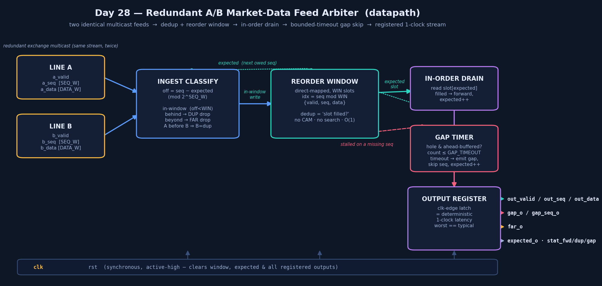
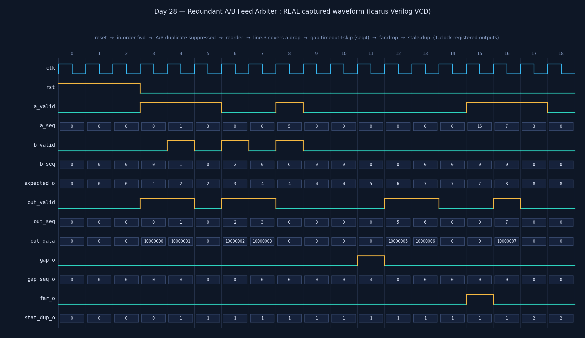

# Day 28 — Redundant A/B Market-Data Feed Arbiter (line arbitration)

The **very front door of the HFT tick-to-trade path** — the stage that sits in
front of Day 25's feed parser. Every major exchange publishes each market-data
multicast feed **twice**, on two independent network paths — line **A** and line
**B** — for redundancy: a UDP packet dropped on line A is (almost always) still
delivered on line B, and vice-versa. Before *any* decode, book, or risk logic
runs, a handler must collapse those two noisy, independently-lossy, slightly-
skewed copies into **one** clean, in-order, gap-free stream. That is this block —
the FPGA **line arbiter** / **feed arbitrator**.

It does three things, every one of them in a fixed, registered, occupancy-
independent number of clocks:

1. **Dedup** — forward each sequence number **exactly once**; the second copy
   (whichever line it comes from) is silently suppressed.
2. **Reorder** — merge the two lines back into **strictly ascending sequence
   order** with a small direct-mapped reorder window (an early packet on one
   line waits for its in-order predecessors).
3. **Gap-detect** — a sequence number missing on **both** lines is a real loss;
   after a **bounded, deterministic timeout** the block emits a `gap` event (the
   trigger a real handler uses to request a retransmit / snapshot) and **skips**
   the hole so the pipe can never wedge.

The output is a single, dedup'd, in-order stream that Day 25's parser consumes at
one message per clock.

---

## Why this is an ultra-low-latency lesson (the point of the day)

| Software A/B arbitration | This hardware arbiter |
|---|---|
| "Have I seen this seq?" = **hash-set probe** — hashing, cache misses, maybe a resize | "Have I seen this seq?" = **one direct-mapped slot's `valid` bit**, combinational |
| Reorder = **priority-queue / tree** insert — `O(log N)` pointer chases | Reorder = **`seq mod WIN`** index into a tiny register array, `O(1)` |
| Gap wait = a **software timer / callback** on the socket thread — scheduler jitter | Gap wait = a **fixed cycle counter**; timeout is a constant, not a guess |
| Two sockets, locks, memcpy, GC/alloc on the hottest packet on the wire | Two feed ports, **no allocation, no locks, no search** — a fixed cone/clock |
| Worst case ≫ typical (the tail that loses the race to the book) | **Worst-case latency == typical latency** — even *packet loss* resolves in bounded time |

> **The product is determinism, not just speed.** The insight that makes A/B
> arbitration tractable in hardware: because each line is *already in order*, you
> never need to sort — you only need a **window** big enough to absorb the skew
> between the two lines, indexed **directly** by sequence number. Dedup becomes a
> single `valid`-bit test, reordering becomes an array index, and "is there a
> gap?" becomes "is the `expected` slot empty while a later slot is full?" Every
> one of those is a fixed combinational cone, and every output is registered — so
> the arbiter adds a **constant** one-clock hop to the tick-to-trade budget no
> matter how the two lines drop, duplicate, or skew.

This is the ingest sibling of the deterministic-latency theme running through
Day 25 (parser), Day 26 (risk gate) and Day 27 (order book): specialize the data
structure to the one question the hot path actually asks, and answer it in
constant time.

---

## Features

- **Two redundant input lines** (`a_*`, `b_*`), each presenting up to one
  `{valid, seq, data}` message per clock. `data` is an opaque `DATA_W`-bit
  payload (a raw feed message the downstream parser will decode).
- **Duplicate suppression** — the redundancy win. A sequence number already held
  (delivered first by the other line, or replayed) is dropped and counted in
  `stat_dup_o`. Line **A** is processed before line **B** each cycle, so a
  simultaneous A/B pair resolves as "A written, B suppressed."
- **Direct-mapped reorder window** — `WIN = 2**WIN_LOG2` slots, slot for seq `s`
  is `s mod WIN`. Within the window each residue maps to a unique sequence, so
  there is **no aliasing, no CAM, no search** — dedup and reorder are both O(1).
- **In-order drain** — at most **one** message forwarded per clock, always the
  one at `expected`; `expected` advances only when that message is present.
- **Bounded-timeout gap handling** — a hole at `expected` while later messages
  are buffered is a genuine loss (positive evidence the seq exists). A fixed
  `GAP_TIMEOUT`-cycle counter waits for a late-arriving copy; on timeout the
  block pulses `gap_o` with `gap_seq_o`, **skips** the seq, and moves on. One
  `expected` advance per clock, whether by forward or by skip.
- **Beyond-window guard** — a message more than `WIN` ahead of `expected` (a line
  that jumped far — e.g. a burst loss) can't fit the window; it is dropped and
  flagged on `far_o` rather than corrupting a slot.
- **Modular sequence arithmetic** — classification uses `off = seq − expected`
  (mod `2**SEQ_W`): `off < WIN` ⇒ in-window; `off` in the top half ⇒ *behind*
  `expected` ⇒ stale duplicate; otherwise ⇒ beyond-window / far.
- **Registered outputs ⇒ deterministic 1-clock latency** — every result
  (`out_*`, `gap_*`, `far_o`) is latched: worst-case == typical.
- **Saturating perf counters** — `stat_fwd_o` (forwarded), `stat_dup_o`
  (duplicates suppressed — the A/B value delivered), `stat_gap_o` (gaps skipped).
- Latch-free, `default_nettype none`, synchronous active-high reset, fully
  parameterized (`SEQ_W`, `DATA_W`, `WIN_LOG2`, `GAP_TIMEOUT`, `STAT_W`).

---

## Parameters

| Parameter | Default | Meaning |
|-----------|---------|---------|
| `SEQ_W` | 16 | Sequence-number width (bits). |
| `DATA_W` | 32 | Opaque per-message payload width (bits). |
| `WIN_LOG2` | 3 | Reorder window depth = `2**WIN_LOG2` slots (must cover the worst-case A/B skew). |
| `GAP_TIMEOUT` | 4 | Cycles to wait for a missing seq (on either line) before declaring a gap and skipping it. |
| `STAT_W` | 32 | Width of the saturating performance counters. |

## Ports

| Port | Dir | Width | Description |
|------|-----|-------|-------------|
| `clk` | in | 1 | Clock. |
| `rst` | in | 1 | Synchronous, active-high reset — clears the window, `expected`, and all registered outputs. |
| `a_valid` | in | 1 | Line A presents a message this cycle. |
| `a_seq` | in | `SEQ_W` | Line A message sequence number. |
| `a_data` | in | `DATA_W` | Line A message payload. |
| `b_valid` | in | 1 | Line B presents a message this cycle. |
| `b_seq` | in | `SEQ_W` | Line B message sequence number. |
| `b_data` | in | `DATA_W` | Line B message payload. |
| `out_valid` | out | 1 | Registered: a dedup'd, in-order message is on `out_*` this cycle (≤ 1/clock). |
| `out_seq` | out | `SEQ_W` | Forwarded message's sequence number. |
| `out_data` | out | `DATA_W` | Forwarded message's payload. |
| `gap_o` | out | 1 | Registered 1-cycle pulse: `gap_seq_o` was lost on **both** lines and skipped. |
| `gap_seq_o` | out | `SEQ_W` | The sequence number that was skipped (recovery / retransmit trigger). |
| `far_o` | out | 1 | Registered 1-cycle pulse: a message beyond the reorder window was dropped. |
| `expected_o` | out | `SEQ_W` | The next in-order sequence number the arbiter still owes downstream. |
| `stat_fwd_o` | out | `STAT_W` | Saturating count of messages forwarded. |
| `stat_dup_o` | out | `STAT_W` | Saturating count of duplicates suppressed (the redundancy payoff). |
| `stat_gap_o` | out | `STAT_W` | Saturating count of gaps skipped. |

---

## Block diagram



```
        LINE A  {a_valid, a_seq, a_data}
        LINE B  {b_valid, b_seq, b_data}     (same stream, published twice)
                        │  │
                        ▼  ▼
              ┌────────────────────┐   off = seq − expected  (mod 2^SEQ_W)
              │  INGEST  CLASSIFY  │   off < WIN     → in-window (write slot)
              │  A before B        │   off "behind"  → stale DUP  (drop, count)
              │                    │   else          → beyond win → FAR (drop)
              └─────────┬──────────┘
             in-window  │  write {valid, seq, data}
                        ▼
              ┌────────────────────┐        ┌────────────────────┐
              │   REORDER WINDOW   │  slot  │   IN-ORDER  DRAIN  │
              │  direct-mapped     │ [exp]  │  slot[expected]    │
              │  idx = seq mod WIN │───────▶│  filled → forward, │
              │  dedup = 'filled?' │        │  expected++        │
              └─────────┬──────────┘        └─────────┬──────────┘
             hole & ahead-buffered?                   │
                        ▼                              │
              ┌────────────────────┐                  │
              │     GAP  TIMER     │  timeout → gap,   │
              │  count ≤ GAP_TIMEOUT│ skip, expected++ │
              └─────────┬──────────┘                  │
                        └───────────┬──────────────────┘
                                    ▼
                        ┌────────────────────┐
                        │  OUTPUT  REGISTER  │  1-clock deterministic latency
                        │  out_* / gap_* /   │  (worst-case == typical)
                        │  far_o             │
                        └────────────────────┘
             expected  ─ feeds the classifier & drain (next owed seq)
```

---

## How it works

Every cycle, in one combinational pass over the tiny window:

1. **Classify each line** against the current `expected`. `off = seq − expected`
   (16-bit, wraps). If `off < WIN` the message belongs in the reorder window at
   slot `seq mod WIN`: if that slot is already `valid` it's a **duplicate**
   (dropped, `stat_dup`++), otherwise it's written. If `off` lands in the *top*
   half of the modular circle the seq is **behind** `expected` — a stale copy we
   already emitted — dropped as a duplicate. Anything else is **beyond** the
   window (`far_o`, dropped). Line A is classified before line B, so an identical
   simultaneous pair naturally resolves to "A stored, B duplicate."

2. **Drain / gap** — look at `slot[expected]`. If it's `valid`, **forward** it
   (`out_valid`), free the slot, `expected++`, reset the gap timer. If it's empty
   but at least one *later* slot is buffered, we have positive evidence of a
   **real loss**: count the gap timer up; once it reaches `GAP_TIMEOUT`, pulse
   `gap_o`/`gap_seq_o`, **skip** the seq (`expected++`) and reset the timer. If
   nothing is buffered ahead, we're simply idle (no gap yet).

At most **one** `expected` advance happens per clock — by a forward or by a skip
— which is exactly what keeps the latency constant and the design provably
progress-guaranteed (the timer bounds any stall).

---

## Simulation timing



**This is a real captured waveform**, not a hand-drawn mock-up: the self-checking
testbench was compiled and run under **Icarus Verilog**, the run dumped
`ab_feed_arbiter.vcd`, and a small Python VCD parser + matplotlib rendered the
trace above (sampled just after each clock edge, where the registered outputs are
valid). Reading left → right it walks the directed corner cases (`expected`
starts at 0):

- **Reset** (cycles 0–2) → window and `expected` cleared, all outputs low.
- **In-order forward** (cycle 3) — line A delivers seq 0 → `out_seq = 0` the next
  clock, `expected → 1`.
- **A/B duplicate suppressed** (cycle 4) — *both* lines deliver seq 1 → forwarded
  **once**, `stat_dup_o` ticks to 1, `expected → 2`.
- **Reorder** (cycle 5) — line A delivers seq 3 out of order; hole at 2, so
  `out_valid` stays low and the message waits in the window.
- **Line B covers a drop** (cycle 6) — the missing seq 2 arrives on **line B**
  (line A had already lost it) → forwarded, `expected → 3`, then the buffered
  seq 3 drains (cycle 7). *This is the whole reason A/B exists.*
- **Gap timeout + skip** (cycles 8–11) — seqs 5 and 6 arrive but seq 4 is lost on
  **both** lines. The arbiter stalls on the hole, the gap timer counts, and at
  `GAP_TIMEOUT` it pulses **`gap_o` with `gap_seq_o = 4`** and skips — then drains
  the buffered 5 and 6 (cycles 12–13).
- **Beyond-window far drop** (cycle 14) — with `expected = 7`, a seq 15 (`off =
  8 = WIN`) is too far ahead to buffer → **`far_o`** pulses, message dropped.
- **In-order 7** (cycle 15) — the real seq 7 arrives → forwarded, `expected → 8`.
- **Stale duplicate** (cycle 16) — a replayed seq 3 (`< expected`) → suppressed,
  `stat_dup_o` ticks to 2, no output.

Every one of those transitions appears **exactly one clock after** its event —
the deterministic latency the whole design exists to guarantee.

### Run it yourself

```bash
make icarus      # iverilog + vvp  (default)
# or
make verilator   # verilator --binary --timing
make vcs         # Synopsys VCS
make questa      # Questa / Xcelium (qrun)
make waves       # open ab_feed_arbiter.vcd in GTKWave
```

Expected tail of the transcript:

```
Directed done: 17 checks, 0 errors, expected=8 fwd=7 dup=2 gap=1
Day28 A/B feed arbiter: 4020 checks, 0 errors  (fwd=2527 dup=2884 gap=260)
RESULT: *** PASS ***
```

---

## What the testbench checks

`tb_ab_feed_arbiter.sv` runs an **independent golden reference** — a plain-array,
straight-line procedural re-implementation of the arbiter *policy* (dedup +
reorder window + bounded-timeout gap skip), structured deliberately unlike the
DUT's registered combinational cone. Because the DUT registers its outputs, the
reference outputs are compared **one clock after** the driving inputs (a 1-deep
pipeline) against every DUT output: `out_valid/out_seq/out_data`,
`gap_o/gap_seq_o`, `far_o`, and `expected_o`. The three perf counters are
cross-checked against independently accumulated totals at the end.

Coverage (**4020 checks, 0 errors**):

- **Reset** clears the window, `expected`, and all registered outputs.
- **In-order forward** on a single line.
- **A/B duplicate suppression** — the same seq on both lines is forwarded once.
- **Out-of-order reorder** — an early seq waits in the window for its
  predecessors.
- **Redundancy cover** — a seq dropped on one line is supplied by the other and
  still forwarded in order.
- **Genuine gap** — a seq lost on **both** lines triggers the bounded timeout,
  the `gap_o` pulse with the correct `gap_seq_o`, and a clean skip.
- **Beyond-window far drop** — a seq more than `WIN` ahead is dropped on `far_o`
  without corrupting the window.
- **Stale duplicate** — a replayed seq below `expected` is suppressed.
- **Randomized soak** — 4000 cycles with each line's validity and sequence number
  biased around the live `expected` (in-window, beyond-window, and behind), so
  forwards, duplicates, gaps and far-drops all occur, with the golden model
  checked **every cycle** and the counters reconciled at the end.
- A **timeout watchdog** fails loudly rather than hanging.

> **Honesty note:** the waveform PNG is a genuine Icarus-captured VCD render, and
> the `RESULT: *** PASS ***` above is the actual simulator transcript from this
> repo — not a hand-modelled diagram. The datapath block diagram
> (`docs/ab_feed_arbiter_block.png`) is a hand-drawn schematic of the design, not
> a captured waveform.
