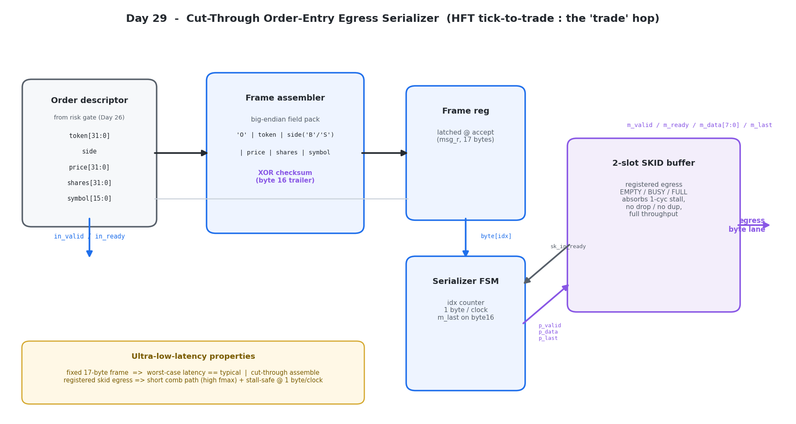
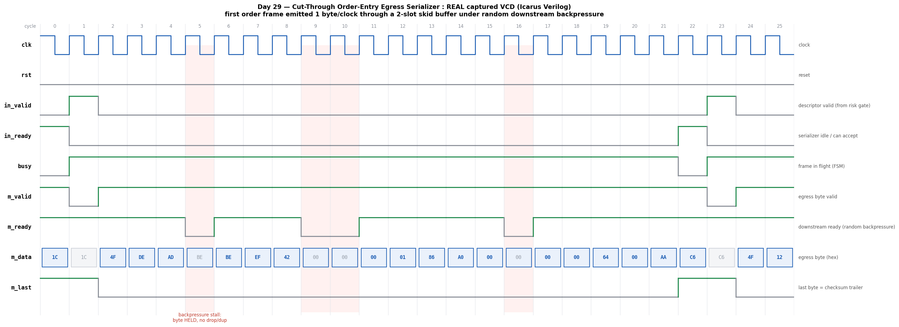

# Day 29 — Cut-Through Order-Entry Egress Serializer (wire encoder)

The **last hop of the HFT tick-to-trade path** — the stage that sits *behind*
Day 26's pre-trade risk gate and turns an accepted, parallel order descriptor
into the exchange's **binary order-entry wire message**, streamed out one byte
per clock onto the SerDes / MAC egress lane. It is the exact **inverse** of
Day 25's feed parser (which *deserialized* inbound bytes into fields); this block
*serializes* outbound fields into bytes. It is where "tick-to-**trade**" literally
becomes the trade: the moment your order leaves the FPGA.

Given a descriptor `{token, side, price, shares, symbol}` it emits a fixed
**17-byte** frame (a simplified **OUCH-style "Enter Order"**):

```
 byte  0     : message type   'O'                (MSG_TYPE)
 bytes 1..4  : order token     (32b, big-endian)
 byte  5     : side           'B' buy | 'S' sell
 bytes 6..9  : price           (32b, big-endian)
 bytes 10..13: shares          (32b, big-endian)
 bytes 14..15: symbol id       (16b, big-endian)
 byte  16    : checksum        = XOR of bytes 0..15   (asserted with m_last)
```

The egress bus is an **AXI-Stream-like** `{m_valid, m_ready, m_data[7:0], m_last}`
handshake with **full backpressure** — and that backpressure is handled by a
proper **2-slot skid buffer** so the block keeps 1 byte/clock throughput through a
downstream stall while every output stays **registered**.

---

## Why this is an ultra-low-latency lesson (the point of the day)

| Software order encode / send | This hardware serializer |
|---|---|
| Build message in a heap buffer, `memcpy` fields, then `write()`/`sendmsg()` — syscall, copy, DMA descriptor, NIC doorbell | Fields **latched in place**; byte `idx` selects a slice of one register — no copy, no buffer, no syscall |
| Encode cost depends on message contents / branches | **Fixed 17-byte frame** — every order takes the *same* number of clocks: **worst-case latency == typical latency** |
| Assembly then send = **store-and-forward** (whole message buffered before the first byte leaves) | **Cut-through**: checksum + frame built the same cycle the descriptor is accepted, first byte can leave on the very next clock |
| Backpressure (TX ring full) = block, or drop, or grow a queue → jitter | **Skid buffer**: absorbs a 1-cycle `m_ready` stall with **no drop, no duplicate**, and resumes at full rate |
| Long combinational encode path → low clock rate | Egress `valid/last/data` are **registered** → short comb path → **high fmax** on the FPGA |

> **The product is determinism, not just speed.** In HFT the number that wins is
> not the average — it's the *worst case*, because the tail is what loses the race
> to the exchange. A fixed-length, cut-through frame with a registered, stall-safe
> egress means the "trade" hop adds a **constant** contribution to the
> tick-to-trade budget regardless of order contents or transient downstream
> backpressure. This is the egress sibling of the deterministic-latency theme
> running through Day 25 (parser), Day 26 (risk gate), Day 27 (order book) and
> Day 28 (feed arbiter).

---

## Features

- **Cut-through frame assembly** — the full big-endian body and its 8-bit XOR
  checksum are built **combinationally** from the live inputs and captured into a
  single frame register on the accepting edge; emission can begin the next clock.
- **Fixed-length deterministic frame** — `TOTAL_BYTES = 17` for the defaults, so
  every order serializes in the same, occupancy-independent number of clocks.
- **Registered, backpressure-safe egress** via a textbook **2-slot skid buffer**
  (`EMPTY → BUSY → FULL` micro-FSM): sustains 1 byte/clock through a downstream
  `m_ready` de-assert, never drops or duplicates a byte, and keeps the output bus
  fully registered for timing closure.
- **AXI-Stream-like handshake** — `m_valid/m_ready` flow control, `m_last` marks
  the checksum byte (frame boundary) for the next stage / MAC.
- **Running XOR checksum trailer** — a cheap line-integrity check the exchange
  gateway can verify.
- **Parameterized field widths** (`TOKEN_W`, `PRICE_W`, `QTY_W`, `SYM_W`) and
  configurable `MSG_TYPE` / side codes; the byte layout and latency recompute at
  elaboration.
- **Latch-free, `default_nettype none`, reset-safe** RTL.

---

## Parameters

| Parameter   | Default   | Meaning |
|-------------|-----------|---------|
| `TOKEN_W`   | `32`      | Order token / tag width (bits, multiple of 8) |
| `PRICE_W`   | `32`      | Price field width (bits, multiple of 8) |
| `QTY_W`     | `32`      | Shares / quantity field width (bits, multiple of 8) |
| `SYM_W`     | `16`      | Symbol-id field width (bits, multiple of 8) |
| `MSG_TYPE`  | `8'h4F` (`'O'`) | Leading message-type byte |
| `SIDE_BUY`  | `8'h42` (`'B'`) | Byte emitted for `side_i == 0` |
| `SIDE_SELL` | `8'h53` (`'S'`) | Byte emitted for `side_i == 1` |

Derived: `BODY_BYTES = 1 + TOKEN_W/8 + 1 + PRICE_W/8 + QTY_W/8 + SYM_W/8` (16 for
defaults); `TOTAL_BYTES = BODY_BYTES + 1` (17, including the checksum trailer).

## Ports

| Port        | Dir | Width       | Description |
|-------------|-----|-------------|-------------|
| `clk`       | in  | 1           | Clock |
| `rst`       | in  | 1           | Synchronous active-high reset |
| `in_valid`  | in  | 1           | Descriptor valid |
| `in_ready`  | out | 1           | High when idle — accepts a descriptor |
| `token_i`   | in  | `TOKEN_W`   | Order token / tag |
| `side_i`    | in  | 1           | `0` = buy → `'B'`, `1` = sell → `'S'` |
| `price_i`   | in  | `PRICE_W`   | Price |
| `shares_i`  | in  | `QTY_W`     | Shares / quantity |
| `symbol_i`  | in  | `SYM_W`     | Symbol id |
| `m_valid`   | out | 1           | Egress byte valid (registered) |
| `m_ready`   | in  | 1           | Downstream ready (backpressure) |
| `m_data`    | out | 8           | Egress byte (registered) |
| `m_last`    | out | 1           | High on the final (checksum) byte of a frame |

A descriptor is **accepted** on any clock where `in_valid & in_ready` (i.e. the
block is idle). A byte is **transferred** on any clock where `m_valid & m_ready`.

---

## Block diagram

```
 order descriptor                                                    egress byte lane
 {token,side,price,                                                 (to SerDes / MAC)
  shares,symbol}                                                            ^
        │                                                                   │
        ▼                                                                   │
 ┌───────────────┐   ┌──────────────┐   ┌────────────┐   ┌────────────┐   ┌┴──────────────┐
 │ Frame         │   │ Frame reg    │   │ Serializer │   │ producer   │   │ 2-slot SKID   │
 │ assembler     │──▶│ msg_r        │──▶│ FSM        │──▶│ p_valid/   │──▶│ buffer        │──▶ m_valid
 │ big-endian    │   │ latched on   │   │ idx cnt    │   │ p_data/    │   │ EMPTY/BUSY/   │    m_data[7:0]
 │ pack + XOR    │   │ accept       │   │ 1 B/clk    │◀──│ p_last     │◀──│ FULL          │    m_last
 │ checksum      │   │ (17 bytes)   │   │ m_last@16  │   │            │   │ (registered,  │
 └───────────────┘   └──────────────┘   └────────────┘   sk_in_ready  │   │  stall-safe)  │◀── m_ready
        ▲                                                             └───┴───────────────┘
   in_valid/in_ready
```

A rendered schematic of the built circuit (generated from the design):



*Cut-through assembler → frame register → byte-serializer FSM → 2-slot skid
buffer → registered egress bus. `sk_in_ready` backpressures the FSM; the FSM
drives `{p_valid, p_data, p_last}` into the skid.*

---

## Simulation timing



**Honest caption:** this is a **real captured waveform** — the image is rendered
directly from the VCD produced by the Icarus Verilog run of the self-checking
testbench (`docs/make_waveform.py` parses `oe_egress_serializer.vcd` and samples
each signal on the rising clock edge). It is **not** a hand-drawn diagram.

The window shows the first directed order (an all-zero **buy**): the `accept`
cycle (`in_valid & in_ready` both high) is highlighted, after which `m_valid`
rises and the frame streams out `4F` (type `'O'`) → token bytes `00 00 00 00` →
`42` (`'B'`, buy) → price/shares/symbol bytes, one per clock. A highlighted
**stall** cycle (`m_valid` high while `m_ready` is low, driven by the testbench's
random backpressure) shows the skid buffer holding the byte with **no loss and no
duplication** — the same byte is still present the cycle after ready returns.

---

## How it works

1. **Assemble (combinational, cut-through).** `always_comb` packs the body bytes
   most-significant-field-byte-first into `body[]`, folds them into an 8-bit XOR
   `csum_c`, and concatenates `{body, checksum}` into one `MSG_BITS`-wide vector
   `asm_msg` with byte 0 in the MSBs. Because this is purely combinational over
   the live inputs, the entire frame (including checksum) is ready in the *same*
   cycle a descriptor is presented.
2. **Accept & latch.** `in_ready = !busy`. On `accept = in_valid & in_ready`, the
   FSM latches `msg_r <= asm_msg`, clears `idx`, and sets `busy`. This is the only
   store — one register write, no buffer copy.
3. **Serialize.** While `busy`, the current byte is `msg_r[(TOTAL_BYTES-1-idx)*8
   +: 8]`, presented as `p_data` with `p_valid = busy` and `p_last = (idx ==
   TOTAL_BYTES-1)`. When the skid can accept (`sk_in_ready`), the byte fires
   (`p_fire`), `idx` increments, and on the last byte `busy` clears — ready for
   the next order.
4. **Skid buffer (registered, stall-safe).** A 3-state (`EMPTY/BUSY/FULL`) 2-slot
   buffer registers the egress. When downstream stalls (`m_ready` low) while a new
   producer byte arrives, the incoming byte is parked in the skid slot (`FULL`)
   instead of being dropped; when `m_ready` returns, `main ← skid` and streaming
   resumes at 1 byte/clock. `sk_in_ready` is de-asserted only in `FULL`, which
   backpressures the FSM so it never overruns.

Everything on the hot path is a fixed combinational cone plus registered state,
so the **event → first-byte** and **frame-length** latencies are constant and
independent of the order's contents.

---

## Running it

```bash
make            # Icarus Verilog (default) — compiles + runs the self-checking TB
make verilator  # Verilator lint + fast cycle sim
make vcs        # Synopsys VCS
make questa     # Cadence Xcelium / Mentor Questa
make waves      # open oe_egress_serializer.vcd in GTKWave
make clean
```

Regenerate the captured waveform PNG after a run (needs `matplotlib`):

```bash
make            # produces oe_egress_serializer.vcd
python3 docs/make_waveform.py
python3 docs/make_block.py
```

---

## What the testbench checks

`tb_oe_egress_serializer.sv` is fully self-checking against an **independent
golden model**:

- **Golden re-assembly** — `gmodel()` re-builds the expected big-endian byte
  sequence and XOR checksum for every descriptor from scratch (not by calling the
  DUT), pushing `{byte, last}` pairs onto reference queues.
- **Per-beat scoreboard** — a sink samples the egress bus every clock under
  **random backpressure** (`m_ready` ~75% asserted) and, on each `m_valid &
  m_ready` beat, pops the reference queue and checks **`m_data`**, the **`m_last`
  position** (must assert exactly on byte 16 — the checksum), and flags any byte
  produced with an empty reference queue.
- **Directed corners** — all-zero buy, all-ones sell, a typical `100 @ 100000`
  buy, max-price / MSB-quantity sell, alternating `A5/5A` patterns, unit fields,
  split hi/lo patterns, and sign-boundary values.
- **Randomized burst** — 300 random orders (random token/price/shares/symbol/side)
  under random stalls that regularly drive the skid buffer into its `FULL` state.
- **Exact-count closure** — the run passes only if `errors == 0`, the number of
  checked bytes equals the number pushed, the reference queue drains to empty,
  and both `issued == 308` orders and `checks == 308 × 17 = 5236` bytes.
- **Timeout watchdog** — a global time limit prints `RESULT: *** FAIL ***
  (TIMEOUT)` if the run ever wedges.

On success it prints:

```
orders issued : 308
bytes expected: 5236
byte checks   : 5236
errors        : 0
residual queue: 0
RESULT: *** PASS ***
```

**Simulator status:** compiled and run with **Icarus Verilog** (`iverilog
-g2012`); **5236 byte checks, 0 errors, `RESULT: *** PASS ***`**. The waveform
image is captured from that same run's VCD.
