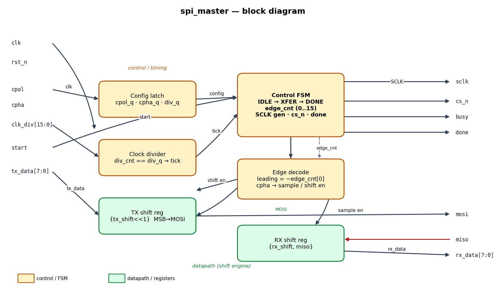
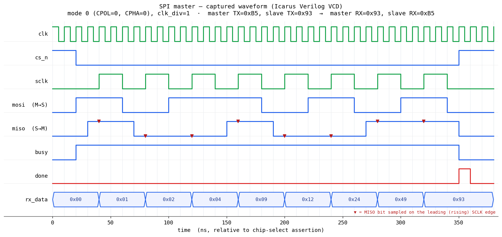

# Day 3 — Configurable SPI Master (all four modes)

A full-duplex **SPI master** controller in SystemVerilog with a fully
self-checking testbench. SPI (Serial Peripheral Interface) is the workhorse
serial bus for talking to flash, ADCs/DACs, sensors, displays and radios. A
"real" SPI master is more than a shift register: it has to generate the serial
clock at a programmable rate, respect the four **CPOL/CPHA** clocking modes,
drive chip-select framing, and shift data out on MOSI while *simultaneously*
capturing data on MISO — every bit, on the correct edge.

This design does all of that with a compact 3-state FSM, a clock divider, and
one shift register per direction. Both the polarity/phase and the SCLK
frequency are **run-time** inputs, so a single instance can talk to peripherals
with different mode requirements.

---

## Features

- **All four SPI modes** selectable at run time via `cpol` / `cpha`
  (mode 0/1/2/3) — latched at the start of each transfer.
- **Programmable SCLK rate**: `clk_div` sets the SCLK half-period to
  `clk_div + 1` system-clock cycles.
- **Full duplex**: transmits `tx_data` on MOSI and captures `rx_data` from MISO
  in the same transfer, MSB-first.
- **Parameterized** transfer width (`DATA_WIDTH`) and divider width
  (`DIV_WIDTH`).
- Clean handshake: level `busy`, single-cycle `done` strobe, active-low `cs_n`
  framing that brackets exactly one word.
- Reset-safe (async active-low reset, SCLK parked at the idle polarity) and
  lint-friendly (`` `default_nettype none ``, no latches, no combinational
  feedback on the bus).

---

## Parameters

| Parameter    | Default | Description                                             |
|--------------|---------|---------------------------------------------------------|
| `DATA_WIDTH` | 8       | Bits per transfer (MSB-first), `>= 2`                   |
| `DIV_WIDTH`  | 16      | Width of the `clk_div` input                            |

## Ports

| Port       | Dir | Width          | Description                                                    |
|------------|-----|----------------|----------------------------------------------------------------|
| `clk`      | in  | 1              | System clock                                                   |
| `rst_n`    | in  | 1              | Active-low asynchronous reset                                  |
| `cpol`     | in  | 1              | Clock polarity — idle level of SCLK (latched at `start`)       |
| `cpha`     | in  | 1              | Clock phase — sampling edge select (latched at `start`)        |
| `clk_div`  | in  | `DIV_WIDTH`    | SCLK half-period = `clk_div + 1` system clocks (latched)       |
| `start`    | in  | 1              | Pulse high (while idle) to launch a transfer                   |
| `tx_data`  | in  | `DATA_WIDTH`   | Word to shift out on MOSI (MSB first)                          |
| `rx_data`  | out | `DATA_WIDTH`   | Word shifted in from MISO (MSB first)                          |
| `busy`     | out | 1              | High for the whole duration of a transfer                      |
| `done`     | out | 1              | One-cycle strobe when a transfer completes                     |
| `sclk`     | out | 1              | Serial clock to the slave                                      |
| `mosi`     | out | 1              | Master-out / slave-in serial data                              |
| `miso`     | in  | 1              | Master-in / slave-out serial data                              |
| `cs_n`     | out | 1              | Active-low chip select (low for the whole word)                |

### SPI mode table

| Mode | CPOL | CPHA | SCLK idle | Data sampled on   | Data shifted on    |
|------|------|------|-----------|-------------------|--------------------|
| 0    | 0    | 0    | low       | leading (rising)  | trailing (falling) |
| 1    | 0    | 1    | low       | trailing (falling)| leading (rising)   |
| 2    | 1    | 0    | high      | leading (falling) | trailing (rising)  |
| 3    | 1    | 1    | high      | trailing (rising) | leading (falling)  |

---

## Block diagram

```
        clk_div ─▶┌───────────────┐        config ┌──────────────────────┐
   cpol/cpha ─▶  │ Config latch  │──────────────▶│                      │──▶ sclk
                 └───────────────┘                │     Control FSM      │──▶ cs_n
        clk ─▶┌──────────────────┐  tick          │  IDLE → XFER → DONE  │──▶ busy
              │  Clock divider   │───────────────▶│  edge_cnt (0..2N-1)  │──▶ done
              │ div_cnt==div_q   │                └───────────┬──────────┘
              └──────────────────┘                            │ edge_cnt
                                                              ▼
                                                  ┌──────────────────────┐
                                          shift en │     Edge decode      │ sample en
                            ┌──────────────────────│ leading=~edge_cnt[0] │──────────┐
                            ▼                       │ cpha→sample/shift    │          ▼
     tx_data ─▶┌────────────────────────┐          └──────────────────────┘  ┌───────────────┐
               │      TX shift reg       │──── MOSI ───────────────────────▶  │               │──▶ mosi
               │  {tx_shift<<1}, MSB→out │                                    │ (bus)         │
               └─────────────────────────┘                          miso ──▶ │  RX shift reg  │──▶ rx_data
                                                                              │ {rx_shift,miso}│
                                                                              └───────────────┘
```

---

## Circuit / block diagram



*Schematic of the built circuit: a control/timing group (config latch, clock
divider, the `IDLE→XFER→DONE` FSM, and the CPOL/CPHA edge-decode) driving a
two-register shift-engine datapath (TX→MOSI, MISO→RX). Rendered with
matplotlib.*

---

## Simulation timing



*A **real captured waveform**: this image is rendered directly from
`spi_master.vcd`, the VCD produced by running the testbench under **Icarus
Verilog** (`make icarus`). A Python VCD parser (`gen_waveform.py`, in the commit
history) extracts the first transfer and plots it with matplotlib — it is **not**
a hand-drawn mock-up.*

The window shows SPI **mode 0** (CPOL=0, CPHA=0) with `clk_div=1`, the master
sending `0xB5` while the slave sends `0x93`:

- `cs_n` drops, then eight SCLK pulses clock the byte through.
- `mosi` carries `1011_0101` = **0xB5** MSB-first.
- The ▼ markers show MISO being sampled on each **leading (rising)** SCLK edge;
  the sampled bits `1001_0011` = **0x93** assemble in `rx_data`
  (`0x01→0x02→0x04→0x09→0x12→0x24→0x49→0x93`).
- `done` strobes for one cycle as `cs_n` returns high — a full-duplex swap:
  master RX = `0x93`, slave RX = `0xB5`.

---

## How it works

- **Edge numbering.** Every SCLK edge in a word is numbered `0 .. 2*DATA_WIDTH-1`.
  Even edges are *leading* (SCLK leaves its idle level), odd edges are *trailing*.
  `is_leading = ~edge_cnt[0]` — no separate edge detector needed.
- **Mode decode.** `cpha` alone decides, per edge, whether the master samples
  MISO or shifts the next MOSI bit:
  `cpha=0` samples on leading / shifts on trailing; `cpha=1` shifts on leading
  (except the very first, whose bit is already presented) / samples on trailing.
  `cpol` only sets the SCLK idle level, so "leading" is a rising edge when
  `cpol=0` and a falling edge when `cpol=1`.
- **Clock generation.** A `div_cnt` counter produces one `tick` every
  `clk_div+1` cycles; each tick toggles `sclk` and advances `edge_cnt`. This is
  what makes SCLK frequency programmable independent of the mode logic.
- **Datapath.** `mosi` is simply the MSB of `tx_shift`; shifting left presents
  the next bit. Captured MISO bits are shifted into `rx_shift` from the LSB, so
  the first-received (slave MSB) ends up in the MSB — MSB-first in both
  directions.
- **Framing.** `cs_n` is asserted on `start` and released in the one-cycle
  `S_DONE` state, which also pulses `done`. SCLK is returned to its idle level
  on the last edge, so the bus is left clean between words.

---

## Files

| File                       | Description                                            |
|----------------------------|--------------------------------------------------------|
| `spi_master.sv`            | RTL design under test                                  |
| `tb_spi_master.sv`         | Self-checking testbench + behavioural SPI slave model  |
| `Makefile`                 | Run targets for common simulators                      |
| `docs/spi_master_block.png`| Circuit / block diagram (matplotlib)                   |
| `docs/…_waveform.png`      | Real captured waveform (from the Icarus VCD)           |

---

## Run the simulation

```bash
# Icarus Verilog (open source) — used to capture the waveform above
make icarus

# Verilator (open source)
make verilator

# Synopsys VCS
make vcs

# Siemens Questa / ModelSim
make questa
```

Expected output ends with:

```
Checks performed : 324
Errors           : 0
RESULT: *** PASS ***
```

A `spi_master.vcd` waveform is also produced for viewing in GTKWave.

> Verified: run under Icarus Verilog — **324 checks, 0 errors,
> `RESULT: *** PASS ***`.**

---

## What the testbench checks

A behavioural SPI **slave** is wired back-to-back with the DUT (MOSI → slave,
slave → MISO), so every transfer is a genuine full-duplex exchange on the bus.
Because SPI swaps words verbatim, the golden model is trivial and fully
independent of the DUT internals:

> the master must receive exactly what the slave shifted out, **and** the slave
> must receive exactly what the master shifted out.

Both expected values are known constants for every transfer, so the scoreboard
never derives anything from the DUT. Each transfer verifies:

1. **Master RX** equals the slave's transmit word (MISO path, all four modes).
2. **Slave RX** equals the master's `tx_data` (MOSI path, all four modes).
3. Exactly **`2*DATA_WIDTH` SCLK edges** per word (clock generation / bit count).
4. `cs_n` framing — `busy` and `cs_n` bracket the word together.
5. `done` is a **single-cycle** strobe.

Stimulus covers all four SPI modes, corner-case patterns (`0x00`, `0xFF`,
`0x80`, `0x01`, `0xA5`, …), several clock dividers, and **300 randomized**
transfers (random mode, data, and divider), with a global timeout backstop and
a VCD dump.

> Note: the behavioural *slave model* samples SCLK synchronously in the
> system-clock domain, so the testbench uses `clk_div >= 1` (SCLK half-period
> ≥ 2 clocks). The `spi_master` RTL itself has no such restriction.
