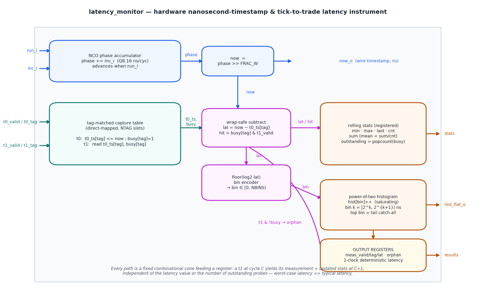
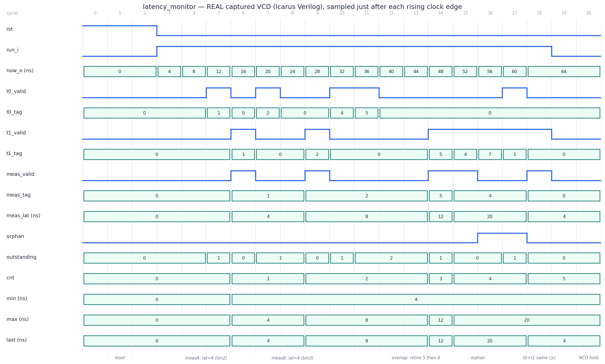

# Day 29 — Hardware Nanosecond-Timestamp & Tick-to-Trade Latency Monitor

The **instrumentation stage** of the HFT tick-to-trade path — the block that
does not move an order, but **measures** how fast every order moved, in
hardware, on the wire, with no CPU in the loop. In HFT the number that decides
whether you win a trade is **tick-to-trade latency**: the time from a market-data
bit arriving at ingress (Day 28's feed arbiter → Day 25's parser) to the child
order leaving at egress (after Day 26's risk gate). You cannot optimize what you
cannot measure, and you cannot measure single-digit-nanosecond latencies from
software — a host `clock_gettime()` costs more and jitters more than the thing
being measured. So the FPGA timestamps the path itself.

This design is three cooperating pieces, each fully deterministic:

1. **NCO ("DDS") fractional-nanosecond clock** — a phase accumulator advances by
   a *fractional* nanoseconds-per-cycle word (`inc_i`, Q8.16) every active clock.
   Its integer part is the live wire timestamp `now_o`. A fractional increment
   lets an integer counter track a clock whose period is **not** an integer
   number of ns (the real case at 156.25/322.265625 MHz SerDes-derived clocks),
   and `inc_i` doubles as the **frequency-correction word** a PTP / IEEE-1588
   servo nudges to discipline the counter to grandmaster time.

2. **Tag-matched timestamp capture** — a **start** event `t0` (a tick at ingress)
   and a **stop** event `t1` (the order at egress) each carry a small `TAG`. `t0`
   stamps `now` into a **direct-mapped** slot and marks it busy; `t1` reads the
   slot, forms the **wrap-safe** difference `now − t0_ts[tag]` = the round-trip
   latency, and frees the slot. Direct-mapped ⇒ **no CAM, no search, O(1)**,
   occupancy-independent. A `t1` with no matching `t0` is reported as an
   **orphan** (a dropped/duplicated probe) rather than corrupting a stat.

3. **Latency statistics + power-of-two histogram** — every completed measurement
   updates `min` / `max` / `last` / `cnt` / running-`sum` (for the mean) and
   bumps one **saturating** histogram bin indexed by `floor(log2(latency))`. A
   log2 (order-of-magnitude) histogram is exactly how HFT teams read **tail**
   latency — the p99 / p99.9 that actually loses races — because the mean hides
   it.

---

## Why this is an ultra-low-latency lesson (the point of the day)

| Software latency measurement | This hardware monitor |
|---|---|
| Timestamp = a syscall / RDTSC read — **costs and jitters more than the path** it measures | Timestamp = a **free-running counter slice**, zero cost, read combinationally |
| Match a start to a stop = a **hash map** keyed on order-id — hashing, cache misses | Match = **one direct-mapped slot's `busy` bit** — O(1), no search, no allocation |
| Sub-ns resolution = impossible from an integer µs/ns OS clock | **NCO phase accumulator** — fractional ns/cycle gives sub-ns resolution *and* is the exact PTP servo knob |
| Stats = post-hoc log parsing; the tail is averaged away | **Live power-of-two histogram** in fabric — the p99 tail is a hardware counter |
| Measurement perturbs the very latency you are measuring (the observer effect) | The probe is **out-of-band** registers — measuring costs the datapath **nothing** |

> **You optimize what you can measure, and in HFT you must measure in the fabric.**
> The whole series has hammered one idea — *specialize the structure to the one
> question the hot path asks, and answer it in constant time.* Here the question
> is "how long did this order take?", and the answer is a direct-mapped stamp, a
> wrap-safe subtract, and a log2 bin — every one a fixed combinational cone into
> a register. A `t1` at cycle **C** produces its measurement and updated stats at
> cycle **C+1**, no matter the latency value or how many probes are outstanding:
> **worst-case latency == typical latency**, even for the instrument itself.

This is the measurement sibling of the deterministic-latency theme running
through Day 25 (parser), Day 26 (risk gate), Day 27 (order book) and Day 28
(feed arbiter).

---

## Features

- **NCO fractional-nanosecond timestamp** — `phase_acc += inc_i` each cycle
  `run_i` is high; `now_o = phase_acc >> FRAC_W`. `inc_i` is Q(`INC_W−FRAC_W`)`.`
  `FRAC_W` nanoseconds-per-cycle (e.g. `0x04_0000` = 4.0 ns/cycle), so a
  non-integer clock period and a PTP frequency trim are both expressible.
- **`run_i` gate** — hold the timestamp (e.g. across a clock-domain gap or a
  paused link) without disturbing outstanding measurements.
- **Tag-matched, direct-mapped capture** — `NTAG = 2**TAG_W` outstanding
  measurement slots. `t0` arms `t0_ts[tag]`; `t1` retires it. No CAM, no search,
  overlapping probes retire **in any order**.
- **Wrap-safe latency** — `lat = now − t0_ts[tag]` in modular `TS_W` arithmetic,
  so a measurement that straddles the counter roll-over is still correct.
- **Orphan detection** — a `t1` whose slot is not armed pulses `orphan_o` and
  increments `orphan_cnt_o`; it never pollutes the latency stats.
- **Same-slot precedence** — a `t0` and `t1` on the **same tag in the same
  cycle** resolve as "measure the old generation, then re-arm for the next" —
  exactly the pipelined-probe case.
- **Rolling stats** — `min_o`, `max_o`, `last_o`, `cnt_o`, and a widened
  `sum_o` (mean = `sum/cnt`), all saturating, all registered.
- **Power-of-two latency histogram** — `NBINS` saturating bins; bin `k` counts
  latencies in `[2^k, 2^{k+1})` ns, the top bin a **tail catch-all** for
  everything `≥ 2^{NBINS-1}`. Exposed as a flattened `hist_flat_o` bus.
- **`outstanding_o`** — live popcount of armed slots (in-flight probes).
- **Registered outputs ⇒ deterministic 1-clock latency**; latch-free,
  `default_nettype none`, synchronous active-high reset, fully parameterized.

---

## Parameters

| Parameter | Default | Meaning |
|-----------|---------|---------|
| `TS_W`   | 32 | Integer timestamp / latency width (ns). |
| `FRAC_W` | 16 | NCO fractional (sub-ns) phase bits. |
| `INC_W`  | 24 | Width of the ns-per-cycle increment word (`Q(INC_W−FRAC_W).FRAC_W`). |
| `TAG_W`  | 3  | Probe-tag width → `NTAG = 2**TAG_W` outstanding measurement slots. |
| `NBINS`  | 8  | Number of power-of-two latency histogram bins (top = tail catch-all). |
| `CNT_W`  | 32 | Measurement / orphan counter width (saturating). |
| `SUM_W`  | 48 | Running latency-sum width for the mean (saturating). |
| `HIST_W` | 32 | Per-bin histogram counter width (saturating). |

## Ports

| Port | Dir | Width | Description |
|------|-----|-------|-------------|
| `clk` | in | 1 | Clock. |
| `rst` | in | 1 | Synchronous, active-high reset — clears the phase, capture table, stats and histogram. |
| `run_i` | in | 1 | Advance the NCO timestamp this cycle. |
| `inc_i` | in | `INC_W` | Nanoseconds-per-cycle, `Q(INC_W−FRAC_W).FRAC_W` (frequency-correction word). |
| `now_o` | out | `TS_W` | Current integer-nanosecond wire timestamp. |
| `t0_valid_i` | in | 1 | A **start** event this cycle. |
| `t0_tag_i` | in | `TAG_W` | Start-event tag (which slot to arm). |
| `t1_valid_i` | in | 1 | A **stop** event this cycle. |
| `t1_tag_i` | in | `TAG_W` | Stop-event tag (which slot to retire). |
| `meas_valid_o` | out | 1 | Registered 1-cycle pulse: a matched measurement completed. |
| `meas_tag_o` | out | `TAG_W` | Tag of the completed measurement. |
| `meas_lat_o` | out | `TS_W` | Measured latency (ns). |
| `orphan_o` | out | 1 | Registered 1-cycle pulse: a `t1` had no armed `t0`. |
| `cnt_o` | out | `CNT_W` | Saturating count of completed measurements. |
| `min_o` / `max_o` / `last_o` | out | `TS_W` | Minimum / maximum / most-recent latency. |
| `sum_o` | out | `SUM_W` | Saturating sum of latencies (mean = `sum_o/cnt_o`). |
| `orphan_cnt_o` | out | `CNT_W` | Saturating count of orphan `t1`s. |
| `outstanding_o` | out | `TAG_W+1` | Live count of armed (in-flight) slots. |
| `hist_flat_o` | out | `NBINS*HIST_W` | Flattened power-of-two histogram bins. |

---

## Block diagram



```
   run_i, inc_i ─▶┌───────────────────────┐ phase ┌──────────────┐
                  │ NCO phase accumulator  │──────▶│ now =         │──▶ now_o
                  │ phase += inc_i (Q8.16) │       │ phase>>FRAC_W │   (ns)
                  └───────────────────────┘        └──────┬───────┘
                                                          │ now
   t0_valid/tag ─▶┌───────────────────────┐  t0_ts, busy  ▼
   t1_valid/tag ─▶│ tag-matched capture    │──────▶┌────────────────────┐  lat/hit
                  │ table (direct-mapped)  │       │ wrap-safe subtract  │────────▶ stats
                  │ t0: stamp+arm  t1: read│       │ lat = now−t0_ts[tag]│  min·max·last
                  └───────────────────────┘        │ hit = busy & t1_val │  cnt·sum·outstanding
                                                    └────────┬───────────┘
                                                        lat  │        │ t1 & !busy
                                                             ▼        └──────────▶ orphan
                                                    ┌────────────────┐
                                                    │ floor(log2 lat) │ bin ─▶ power-of-two
                                                    │ bin encoder     │        histogram (sat)
                                                    └────────────────┘        hist_flat_o
        every cone feeds a register ⇒ t1@C → measurement + stats @C+1  (worst == typical)
```

---

## How it works

Every cycle, in one combinational pass:

1. **Timestamp.** When `run_i` is high the phase accumulator adds `inc_i`. The
   integer nanoseconds `now = phase >> FRAC_W` are the wire timestamp. Because
   `inc_i` is fractional, sub-ns phase accrues in the low `FRAC_W` bits and rolls
   into `now` at exactly the right average rate — the same mechanism a DDS uses
   to synthesize a frequency that isn't a clean divisor of the reference.

2. **Capture / measure.** A `t0` writes `t0_ts[t0_tag] = now` and sets
   `busy[t0_tag]`. A `t1` checks `busy[t1_tag]`: on a **hit** it emits
   `lat = now − t0_ts[t1_tag]` (modular, so it survives counter wrap), clears the
   slot, and drives `meas_valid_o/meas_tag_o/meas_lat_o`. On a **miss** it pulses
   `orphan_o`. `t0` takes precedence for the slot's `busy` bit, so a same-cycle
   same-tag `t0+t1` measures the outstanding generation and immediately re-arms.

3. **Accumulate.** On a completed measurement, `min/max/last/cnt/sum` update
   (first measurement seeds `min=max`), and the histogram bin
   `min(floor(log2 lat), NBINS−1)` increments (saturating). `outstanding_o` is
   the popcount of `busy`.

All state transitions are registered, so a `t1` presented at cycle **C** yields
its measurement and every updated statistic at cycle **C+1** — a constant hop
regardless of the latency magnitude or the number of in-flight probes.

---

## Simulation timing



**This is a real captured waveform**, not a hand-drawn mock-up: the self-checking
testbench was compiled and run under **Icarus Verilog**, the run dumped
`latency_monitor.vcd`, and a small Python VCD parser + matplotlib
(`gen_waveform.py`) rendered the trace above (sampled just after each rising
clock edge, where the registered outputs are valid). Reading left → right it
walks the directed corner cases (NCO at 4.0 ns/cycle):

- **Reset** (cycles 0–2) — phase, capture table and all stats cleared; `now_o = 0`.
- **NCO warm-up** (cycles 3–4) — `run_i` high, `now_o` climbs `4, 8, 12, …` ns.
- **Measurement A** (cycles 5–6) — `t0` on tag 1, then `t1` on tag 1 →
  `meas_valid`, `meas_lat = 4` ns (histogram **bin 2**), `cnt → 1`, `min = max = 4`.
- **Measurement B** (cycles 7–9) — `t0` tag 2, one idle cycle, `t1` tag 2 →
  `meas_lat = 8` ns (**bin 3**), `max → 8`.
- **Overlapping probes** (cycles 10–15) — arm tag 4 then tag 5 (`outstanding → 2`),
  and retire them **out of order**: tag 5 first (`meas_lat = 12`), then tag 4
  (`meas_lat = 20`, a new `max`). Direct-mapped slots retire in any order.
- **Orphan** (cycle 16) — a `t1` on the never-armed tag 7 → `orphan_o` pulses,
  the latency stats untouched.
- **Simultaneous `t0`+`t1`** (cycles 17–18) — arm tag 0 while a `t1` on an idle
  tag orphans, then retire tag 0.
- **NCO hold** (cycles 19–20) — `run_i` low → `now_o` **freezes** at 64 while the
  outstanding state is preserved.

Every measurement and pulse appears **exactly one clock after** its `t1` — the
deterministic latency the design exists to guarantee.

### Run it yourself

```bash
make icarus      # iverilog + vvp  (default)
# or
make verilator   # verilator --binary --timing
make vcs         # Synopsys VCS
make questa      # Questa / Xcelium (qrun)
make waves       # open latency_monitor.vcd in GTKWave
```

Regenerate the images (optional): `python3 gen_block.py && python3 gen_waveform.py`.

Expected tail of the transcript:

```
Directed done: 388 checks, 0 errors  (cnt=5 orphans=2 min=4 max=20 now=64)
Day29 latency monitor: 75166 checks, 0 errors  (cnt=1394 orphans=1228 min=0 max=192 sum=31216)
RESULT: *** PASS ***
```

---

## What the testbench checks

`tb_latency_monitor.sv` runs an **independent golden reference** — plain
SystemVerilog variables plus a straight-line procedural mirror of the NCO phase
accumulator, the tag-matched capture table, and the stats + power-of-two
histogram, deliberately structured unlike the DUT's registered cone. Because the
DUT registers all of its outputs, the reference is compared **one clock after**
the driving inputs (a 1-deep pipeline) against *every* DUT output each cycle:
`now_o`, `meas_valid/tag/lat`, `orphan_o`, `cnt/min/max/last/sum`,
`orphan_cnt_o`, `outstanding_o`, and **all `NBINS` histogram bins**. The
measurement and orphan counters are independently reconciled at the end.

Coverage (**75,166 checks, 0 errors**):

- **Reset** clears the phase, capture table, stats and every histogram bin.
- **NCO advance / hold** — `now_o` tracks the fractional increment while `run_i`
  is high and freezes exactly when it is low.
- **Single measurement** with a known cycle gap → the exact latency and bin.
- **Overlapping probes** on distinct tags retired **out of order**.
- **Orphan `t1`** with no armed `t0` — pulse + counter, stats untouched.
- **Same-cycle `t0`+`t1`** on the same and different tags (arm-vs-retire
  precedence).
- **Every histogram bin** exercised, from `lat = 0` through the tail catch-all.
- **min / max / last / sum** tracking across ascending, descending and mixed
  latencies.
- **Randomized soak** — 4000 cycles with each of `run_i`, `t0`, `t1` and their
  tags randomized, and the increment periodically switched to `32.0` ns/cycle so
  latency magnitudes spread across all bins; the golden model is checked **every
  cycle** and the counters reconciled at the end.
- A **timeout watchdog** fails loudly rather than hanging.

> **Honesty note:** the waveform PNG is a genuine Icarus-captured VCD render, and
> the `RESULT: *** PASS ***` above is the actual simulator transcript from this
> repo — not a hand-modelled diagram. The datapath block diagram
> (`docs/latency_monitor_block.png`) is a hand-drawn schematic of the design, not
> a captured waveform.
