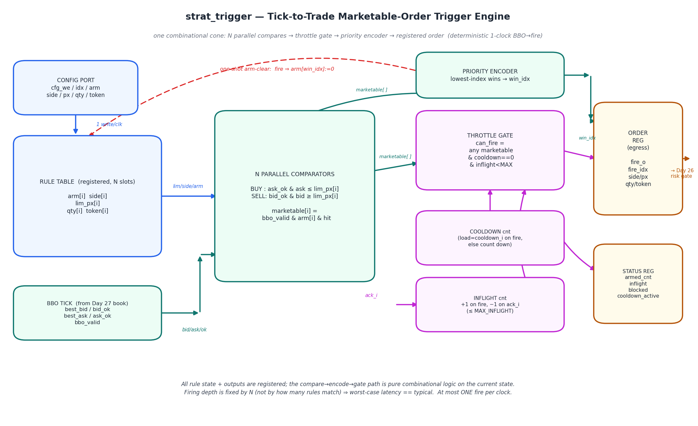
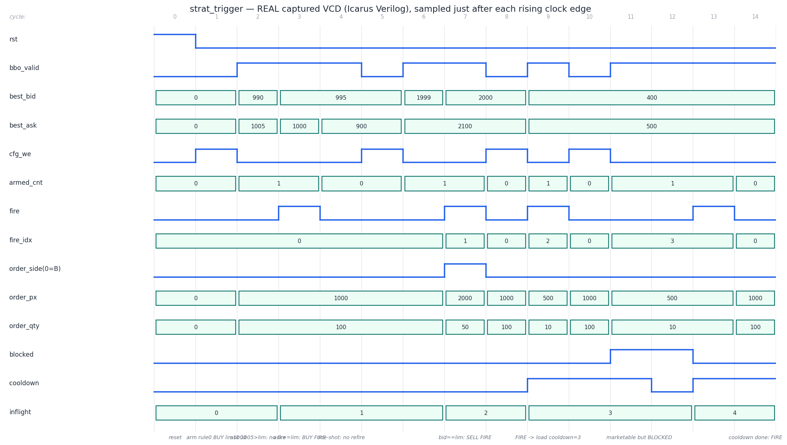

# Day 31 — Tick-to-Trade Marketable-Order Trigger Engine (`strat_trigger`)

**The trade-decision node of the HFT tick-to-trade path.** It sits between
[Day 27](../Day27)'s L2 limit-order-book / BBO engine (which produces the
best-bid / best-offer every tick) and [Day 26](../Day26)'s pre-trade risk gate
(which vets the child order before it egresses on [Day 29](../Day29)). This is
the block where a *quote* becomes a *trade*: it holds a small table of resting
**strategy rules**, evaluates all of them against the live BBO every cycle, and
the very clock a rule becomes **marketable** it emits exactly one child order —
no CPU, no software round-trip, no jitter.

> **What I set out to learn:** how a hardware trading strategy actually *fires* —
> and why the hard parts are not the compare but the **throttles** (one-shot,
> cooldown, max-inflight) that keep a fabric that reacts in one clock from
> machine-gunning duplicate orders into the market.

---

## Why this is an ultra-low-latency (ULL) design

The whole decision — *N* parallel marketable compares → priority encoder →
throttle gate → order-field mux — is **one combinational cone** evaluated on the
current registered state and captured into registered outputs.

| ULL property | How it is achieved | Why it matters in HFT |
|---|---|---|
| **Deterministic, occupancy-independent latency** (worst == typical) | BBO tick → order fire is **exactly 1 clock** whether 1 rule or all *N* are armed; the priority-encoder depth is fixed by `N`, not by how many rules match | In a race, it is the **variance** of tick-to-trade that loses. A fixed 1-clock hop removes it. |
| **No software in the loop** | Book, strategy compare, and fire all live in fabric | No interrupt / cache / DMA jitter between "price crossed" and "order out" |
| **One-shot arm-clear** | Firing clears `arm[win_idx]`; a rule fires **exactly once** per arm | Kills the classic HW bug: a marketable price persists for many cycles → a *flood* of duplicate orders |
| **Cooldown throttle** | Post-fire quiet window of `cooldown_i` cycles, gated deterministically | Hardware rate-limit; bounds message rate to the exchange / avoids self-trading storms |
| **Max-inflight throttle** | At most `MAX_INFLIGHT` orders outstanding (awaiting `ack_i`); a single counter compare | Bounds capital-at-risk and exchange message credits with no software |
| **One fire / clock** | Priority encoder picks a single winner; registered egress | Clean, back-pressure-free hand-off to the risk gate |

---

## Circuit diagram



*Hand-drawn schematic of the built circuit (matplotlib, not a simulator
capture). The registered rule table feeds `N` parallel comparators alongside the
live BBO; the resulting `marketable[]` vector drives both a priority encoder
(lowest index wins) and a throttle gate (`cooldown==0 & inflight<MAX`). A fire
registers the child order and clears the winning rule's arm bit (dashed
feedback). All rule state and outputs are registered; only the
compare→encode→gate path is combinational.*

---

## How it works

A rule *i* is `{ arm, side, lim_px, qty, token }`. Each cycle a rule is
**marketable** when the live BBO crosses its limit on the correct side:

```
BUY  rule (side=0):  marketable = arm & bbo_valid & ask_ok & (best_ask <= lim_px)
SELL rule (side=1):  marketable = arm & bbo_valid & bid_ok & (best_bid >= lim_px)
```

Each cycle:

1. **Compare** — all `N` rules test their limit against the current BBO in
   parallel → `marketable[N-1:0]`.
2. **Encode** — a priority encoder picks the **lowest-index** marketable rule as
   `win_idx` (deterministic tie-break; index = strategy priority).
3. **Gate** — `can_fire = |marketable & (cooldown_cnt==0) & (inflight<MAX_INFLIGHT)`.
   If any rule is marketable but a throttle blocks it, `blocked_o` pulses
   instead of `fire_o`.
4. **Fire** — on `can_fire`, the registered egress emits
   `{fire_o, fire_idx_o, order_side_o, order_px_o, order_qty_o, order_token_o}`
   one clock later. Simultaneously the winning rule's `arm` bit is cleared
   (**one-shot**), the cooldown counter is loaded with `cooldown_i`, and the
   inflight counter increments.
5. **Retire** — a downstream `ack_i` (fill or reject from the risk gate / venue)
   decrements the inflight counter, freeing a credit.

**Config vs. fire coherency:** a `cfg_we_i` write in the same cycle a rule fires
takes precedence over the one-shot arm-clear (the newer instruction wins), so
software can re-arm a slot on the exact cycle it fires without losing the write.

**Counter safety:** the inflight counter ignores a stray `ack_i` when nothing is
outstanding (no underflow) and can never exceed `MAX_INFLIGHT` (the gate blocks
firing first). The cooldown reloads on every fire, else counts down to zero.

---

## Parameters

| Parameter | Default | Meaning |
|---|---|---|
| `N` | 8 | Number of resting strategy rules |
| `PX_W` | 32 | Price width (bits) |
| `QW` | 16 | Order-quantity width |
| `TOKW` | 32 | Client order-token width |
| `COOLDOWN_W` | 8 | Width of the runtime cooldown counter |
| `MAX_INFLIGHT` | 4 | Max simultaneously-outstanding orders |
| `IDXW`,`CNTW`,`IFW` | derived | rule-index / armed-count / inflight widths (do **not** override) |

## Ports

| Port | Dir | Width | Description |
|---|---|---|---|
| `clk`, `rst` | in | 1 | Clock; synchronous active-high reset |
| `bbo_valid_i` | in | 1 | A fresh BBO tick is present this cycle |
| `best_bid_i` / `bid_ok_i` | in | `PX_W` / 1 | Best bid price + valid flag |
| `best_ask_i` / `ask_ok_i` | in | `PX_W` / 1 | Best ask price + valid flag |
| `cfg_we_i` | in | 1 | Write-enable for one rule slot |
| `cfg_idx_i` | in | `IDXW` | Rule slot to write |
| `cfg_arm_i` | in | 1 | 1 = arm/enable, 0 = disarm the slot |
| `cfg_side_i` | in | 1 | 0 = BUY, 1 = SELL |
| `cfg_px_i` | in | `PX_W` | Limit price |
| `cfg_qty_i` | in | `QW` | Order size |
| `cfg_token_i` | in | `TOKW` | Client token |
| `ack_i` | in | 1 | One outstanding order retired (fill/reject) |
| `cooldown_i` | in | `COOLDOWN_W` | Cycles to mute after each fire |
| `fire_o` | out | 1 | 1-cycle child-order emit strobe |
| `fire_idx_o` | out | `IDXW` | Which rule fired |
| `order_side_o` | out | 1 | Order side (0=BUY, 1=SELL) |
| `order_px_o` | out | `PX_W` | Limit price sent (rule `lim_px`) |
| `order_qty_o` | out | `QW` | Order size |
| `order_token_o` | out | `TOKW` | Client token |
| `blocked_o` | out | 1 | Marketable this cycle but throttled |
| `armed_cnt_o` | out | `CNTW` | Number of currently-armed rules |
| `inflight_o` | out | `IFW` | Number of outstanding orders |
| `cooldown_active_o` | out | 1 | Cooldown counter is non-zero |

---

## ASCII block diagram

```
        cfg_we/idx/arm/side/px/qty/token
                     │  (1 write / clk)
                     ▼
        ┌─────────────────────────┐        ┌────────────────────────────┐
        │  RULE TABLE (registered)│ lim,   │   N PARALLEL COMPARATORS    │
        │  arm[] side[] lim_px[]  ├───────►│ BUY : ask_ok & ask ≤ lim    │
        │  qty[] token[]          │ side,  │ SELL: bid_ok & bid ≥ lim    │
        └───────────▲─────────────┘ arm    │ marketable[i]=bbo_valid&arm │
                    │                       └───────┬───────────┬─────────┘
   best_bid/ask ────┘ (BBO tick, Day 27)           │ marketable[]
   bid_ok/ask_ok/bbo_valid ───────────────────────►│           │
                                                    ▼           ▼
        arm[win_idx]:=0 (one-shot)     ┌───────────────┐  ┌──────────────┐
        ◄──────────────────────────────┤ PRIORITY ENC  │  │ THROTTLE GATE│
                                        │ lowest idx →  │  │ cooldown==0 &│
                                        │   win_idx     │  │ inflight<MAX │
                                        └──────┬────────┘  └──────┬───────┘
                       cooldown cnt ───────────┼──────────────────┤
                       inflight cnt (+fire/−ack)──────────────────┘
                                               ▼
                                 ┌───────────────────────────┐   → Day 26
                                 │ ORDER REG (registered)     │   risk gate
                                 │ fire_o, fire_idx, side, px │──────►
                                 │ qty, token  +  status      │
                                 └───────────────────────────┘
```

---

## Simulation timing



*This is a **real captured waveform**, not a hand-drawn mock-up. It is produced
by parsing `strat_trigger.vcd` — written by the Icarus Verilog run of
`tb_strat_trigger` (`make icarus` → `gen_waveform.py`) — and sampling each
signal just after every rising clock edge, where the registered outputs are
valid. Every level and value shown is read straight from the VCD.*

Reading the directed sequence (cycle indices as plotted):

- **cycle 0** — reset; all rules disarmed.
- **cycle 1** — config writes/arms rule 0 (BUY, `lim_px=1000`, `qty=100`);
  `armed_cnt` → 1.
- **cycle 2** — BBO tick `ask=1005 > 1000`: not marketable, no fire.
- **cycle 3** — `ask==1000` (== limit): **BUY fires** — `fire_idx=0`,
  `order_side=0`, `order_px=1000`, `order_qty=100`; `inflight` → 1. The one-shot
  clears rule 0's arm bit.
- **cycle 4** — even with a *better* `ask=900`, **no refire** (rule disarmed) —
  the one-shot in action.
- **cycle 7** — a SELL rule (`lim_px=2000`) sees `bid==2000`: **SELL fires**
  (`order_side=1`, `order_px=2000`, `order_qty=50`); `inflight` → 2.
- **cycle 9** — a BUY rule fires and **loads the cooldown** (`cooldown_i=3`);
  `inflight` → 3, `cooldown_active` asserts.
- **cycles 11–13** — a freshly-armed rule is *marketable every cycle* but
  `blocked_o` asserts instead of `fire_o` while `cooldown_active` is high.
- **cycle 14** — cooldown has expired: the rule finally **fires**; `inflight`
  → 4.

> **Testbench run:** Icarus Verilog — **4033 checks, 0 errors → `RESULT: *** PASS ***`**.

---

## What the testbench checks

`tb_strat_trigger` runs an **independent golden model** — a plain shadow of the
rule table plus scalar cooldown / inflight counters — that reproduces the DUT's
next-state rules exactly. Because the DUT registers its outputs, the model
computes the expected decision from the pre-clock state and compares it against
the DUT outputs one cycle later. Every output is checked every cycle:
`fire`, `fire_idx`, `order_side/px/qty/token`, `blocked`, `armed_cnt`,
`inflight`, `cooldown_active`.

**Directed corners**

1. **BUY trigger** — fires exactly when `ask <= lim` (boundary `ask==lim`).
2. **One-shot** — a persisting / improving marketable price does **not** refire a
   fired rule.
3. **SELL trigger** — fires when `bid >= lim` (boundary `bid==lim`).
4. **Cooldown** — a fire loads the counter; subsequent marketable ticks assert
   `blocked_o` until it expires, then fire.
5. **Inflight cap** — fill to `MAX_INFLIGHT`, confirm further marketable rules
   are `blocked_o`, then `ack_i` frees a credit and firing resumes.
6. **Priority** — with several rules marketable at once, the **lowest index**
   wins.
7. **Gating flags / disarm** — `ask_ok`/`bid_ok` low ⇒ not marketable; a config
   disarm removes a rule.

**Randomized soak** — 4000 cycles of random config writes, BBO ticks, acks and
runtime cooldown changes, every output checked against the golden model each
cycle (**4033 total checks**).

---

## Run it

```bash
# Icarus Verilog (self-checking; prints RESULT: *** PASS ***)
make icarus

# regenerate the REAL captured waveform from the VCD
python3 gen_waveform.py

# regenerate the block diagram
python3 gen_block.py
```

Other simulators: `make verilator`, `make vcs`, `make questa`.

---

## Files

```
Day31/
├── strat_trigger.sv        # RTL: the trigger engine
├── tb_strat_trigger.sv     # self-checking TB (independent golden model)
├── Makefile                # icarus / verilator / vcs / questa targets
├── gen_waveform.py         # VCD parser → docs/strat_trigger_waveform.png
├── gen_block.py            # matplotlib block diagram → docs/strat_trigger_block.png
└── docs/
    ├── strat_trigger_block.png
    └── strat_trigger_waveform.png
```
