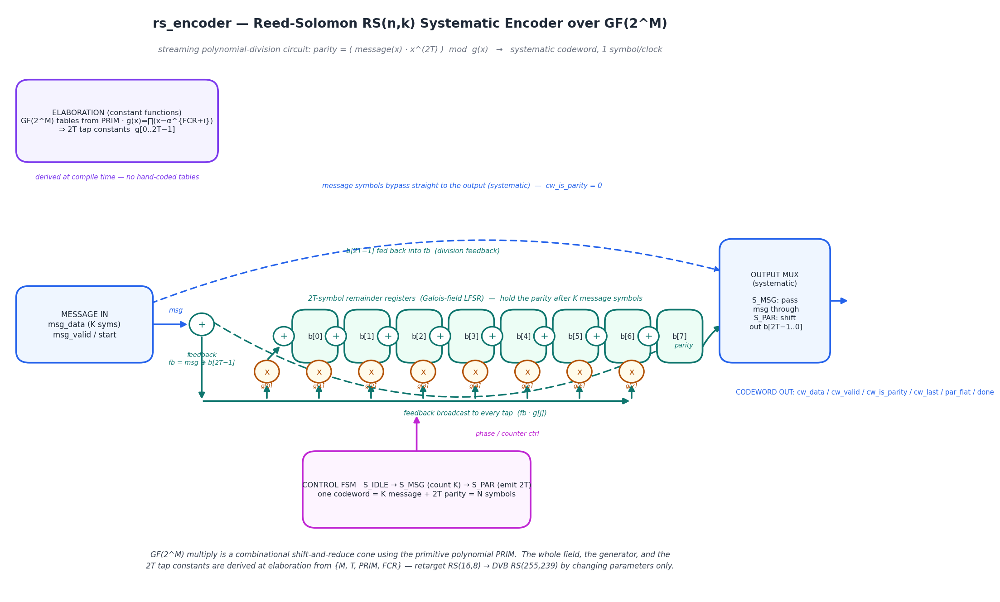
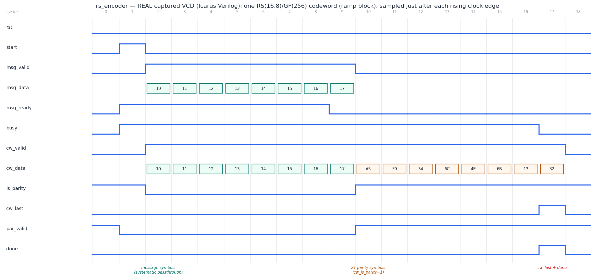

# Day 32 — Reed–Solomon RS(n, k) Systematic Encoder over GF(2^M) (`rs_encoder`)

A streaming, **systematic Reed–Solomon encoder**. For every block of `K` message
symbols it appends `2T` parity symbols so that the `N = K + 2T` symbol codeword
is an exact multiple of the code's generator polynomial

```
g(x) = ∏_{i=0}^{2T-1} ( x − α^(FCR+i) )        (degree 2T, monic)
```

which is precisely the algebraic condition that lets a decoder **correct up to
`T` symbol errors** (or fill `2T` erasures). Reed–Solomon is the workhorse
symbol-level ECC of the real world: CDs/DVDs/Blu-ray, QR codes, DVB / ATSC
broadcast, DSL, RAID-6, deep-space (CCSDS), and modern flash controllers all sit
on an RS core.

> **What I set out to learn:** how a finite-field ECC encoder is actually built
> in hardware — and the neat part is that the *entire* field (its arithmetic)
> **and** the generator polynomial's tap constants are **derived at elaboration
> time** by constant SystemVerilog functions from just `{M, T, PRIM, FCR}`.
> There are **no hand-coded lookup tables anywhere** — change the parameters and
> the datapath re-derives GF(2^M), `g(x)`, and every tap.

This is a deliberately different animal from [Day 10](../Day10)'s Hamming
**SECDED** codec: that corrects a *single bit* with linear parity over GF(2);
Reed–Solomon corrects whole *symbols* using cyclic-code arithmetic over the
extension field GF(2^M), so a burst that trashes an entire byte still costs only
**one** of the code's `T` correction credits.

Default parameters give a shortened **RS(16, 8) over GF(256)** (primitive
polynomial `0x11D`) that corrects `T = 4` symbol errors; changing parameters
retargets the *same source* to DVB's **RS(255, 239)** (`K = 239`, `T = 8`) or
any other RS code.

---

## Why the interesting parts are the field, not the FSM

| Design property | How it is achieved | Why it matters |
|---|---|---|
| **No lookup tables — the field is *derived*** | `gf_mul` is a combinational shift-and-reduce ("Russian-peasant") cone folding in the primitive polynomial `PRIM`; it works for *any* `M`/`PRIM` | One generic RTL retargets GF(16)→GF(256)→GF(2^12) with a parameter, not a rewritten ROM |
| **Generator `g(x)` built at compile time** | A constant function multiplies the monomials `(x − α^(FCR+i))` in GF(2^M) at elaboration → `2T+1` coefficient constants | The `2T` LFSR tap multipliers are wired to *derived* constants; retargeting the code changes them automatically |
| **Systematic, 1 symbol/clock** | The `2T`-symbol Galois LFSR *is* the polynomial-division circuit; message symbols pass straight through, the remainder registers become the parity | Payload is transmitted verbatim (decoder reads it directly when clean); throughput is one symbol per clock |
| **Deterministic framing** | `S_IDLE → S_MSG (count K) → S_PAR (emit 2T)`; registered outputs | A codeword always takes exactly `N` symbol-beats — no data-dependent stalls |
| **Reset-safe / latch-free** | `default_nettype none`, fully synchronous, every output registered | Clean lint, portable across the four simulators in the Makefile |

---

## Circuit diagram



*Hand-drawn schematic of the built circuit (matplotlib, **not** a simulator
capture). At elaboration the primitive polynomial fixes GF(2^M) and the product
`∏(x−α^(FCR+i))` yields the `2T` tap constants `g[0..2T−1]`. At run time the
feedback term `fb = msg ⊕ b[2T−1]` is broadcast to `2T` Galois-field multipliers
(`fb·g[j]`), each XORed into the next remainder register — the textbook
LFSR polynomial-division circuit. During `S_MSG` the message symbols bypass
straight to the output (systematic, `cw_is_parity=0`); during `S_PAR` the
remainder registers `b[2T−1..0]` are shifted out as the parity symbols.*

---

## How it works

**GF(2^M) multiply (combinational).** For `a·b`, scan the bits of `b`; whenever
`b[i]=1` add (XOR) a running copy of `a` that is shifted left one place per step,
folding in `PRIM` whenever it would overflow past `x^(M−1)`:

```
acc = a
for i in 0..M-1:
    if b[i]: prod ^= acc
    acc = (acc[M-1]) ? (acc<<1) ^ PRIM : (acc<<1)
```

**Generator polynomial (elaboration-time).** Starting from `g(x)=1`, multiply in
each root:

```
for i in 0..2T-1:
    root = α^(FCR+i)                 // α = 2 = x
    g(x) = g(x) · (x − root)         // in GF(2^M);  − == ⊕
```

For the default RS(16,8)/GF(256) the derived coefficients (low→high degree) are

```
g[0..8] = 18 c8 ad ef 36 51 0b ff 01     (hex, g[8]=1 monic)
```

**Encoder (the LFSR).** For each incoming message symbol `d`:

```
fb      = d ⊕ b[2T-1]
b[j]   <= b[j-1] ⊕ (fb · g[j])   for j = 2T-1 .. 1
b[0]   <= fb · g[0]
```

After all `K` message symbols are absorbed, `b[2T−1..0]` hold the remainder =
the parity, which is then streamed out highest-degree-first. The concatenation
`{message, parity}` is exactly `message(x)·x^(2T) + remainder`, i.e. a multiple
of `g(x)`.

### ASCII block diagram

```
                       fb = msg ⊕ b[2T-1]     (broadcast to every tap)
                ┌───────────────────────────────────────────────┐
                │        │g[0]      │g[1]            │g[2T-1]     │
   msg ─►(⊕)────┤     (×)│       (×)│             (×)│           │
         ▲      │        ▼          ▼                ▼           │
         │      │  ┌───┐(⊕)  ┌───┐(⊕)  ...   (⊕)┌───────┐        │
         │      └─►│b[0]│──► │b[1]│──►  ...  ──► │b[2T-1]│────────┘
         │         └───┘     └───┘              └───────┘  (top reg → fb)
         │                                                    │
   message symbols pass straight through (systematic) ───┐    │ parity
                                                         ▼    ▼
                                             ┌────────────────────┐
                                             │  OUTPUT MUX (sys)   │─► cw_data
                                             │ S_MSG: msg          │   cw_valid
                                             │ S_PAR: b[2T-1..0]   │   cw_is_parity
                                             └────────────────────┘   cw_last / done
```

---

## Parameters

| Parameter | Default | Meaning |
|-----------|---------|---------|
| `M`    | `8`     | Symbol width — the field is GF(2^M) (default GF(256), one byte/symbol) |
| `T`    | `4`     | Error-correction power → `P = 2*T` parity symbols |
| `K`    | `8`     | Message symbols per codeword block (`N = K + 2T`) |
| `PRIM` | `0x11D` | Primitive polynomial of GF(2^M) (bit `M` set; `0x11D` = x⁸+x⁴+x³+x²+1) |
| `FCR`  | `0`     | First consecutive root exponent of `g(x)` |
| `ALG`  | `2`     | Primitive element α (`x`, i.e. `2`) |

*Default = shortened **RS(16, 8)** over GF(256), corrects `T = 4` symbol errors.
Set `K=239, T=8` for **DVB RS(255, 239)**; `M=4, PRIM=0x13, T=2, K=11` for
**RS(15, 11)** over GF(16).*

## Ports

| Port | Dir | Width | Description |
|------|-----|-------|-------------|
| `clk`            | in  | 1     | Clock |
| `rst`            | in  | 1     | Synchronous, active-high reset |
| `start_i`        | in  | 1     | Pulse: begin a fresh codeword block (clears the LFSR) |
| `msg_valid_i`    | in  | 1     | A message symbol is offered this cycle |
| `msg_data_i`     | in  | `M`   | Message symbol (payload), highest-order symbol first |
| `msg_ready_o`    | out | 1     | Encoder is in the message-accept phase (`S_MSG`) |
| `cw_valid_o`     | out | 1     | Codeword symbol valid (registered stream) |
| `cw_data_o`      | out | `M`   | Codeword symbol: `K` message symbols, then `2T` parity |
| `cw_is_parity_o` | out | 1     | `0` = payload symbol, `1` = parity symbol |
| `cw_last_o`      | out | 1     | Asserted on the final (`N`-th) symbol of the codeword |
| `par_flat_o`     | out | `2T*M`| Parallel view of the parity block (symbol *i* at `[i*M +: M]`) |
| `par_valid_o`    | out | 1     | `par_flat_o` valid (from first parity beat through `done`) |
| `busy_o`         | out | 1     | A block is in flight |
| `done_o`         | out | 1     | 1-clock pulse when the codeword completes |

---

## Simulation timing



*__REAL captured waveform__ — parsed straight from `rs_encoder.vcd`, produced by
the Icarus Verilog run of `tb_rs_encoder` (`make icarus`), **not** a hand-drawn
mock-up. Every level and bus value is read from the VCD, sampled just after each
rising clock edge.* The window shows one full **RS(16, 8)** codeword of the
`ramp` directed block:

- **`start`** pulses; `busy` asserts and the LFSR is cleared.
- **`msg_valid`** high for `K = 8` cycles feeds the message `10 11 12 … 17`;
  those symbols appear on `cw_data` **unchanged** with `is_parity = 0` — the
  systematic passthrough (green cells).
- The encoder then streams the **`2T = 8` parity symbols**
  `A5 F9 34 6C 4E 6B 13 32` with `is_parity = 1` (orange cells) and
  `par_valid` asserted.
- **`cw_last`** + **`done`** pulse on the final parity symbol; `busy` drops.

> **Testbench run:** Icarus Verilog — **20,308 checks, 0 errors →
> `RESULT: *** PASS ***`**.

---

## What the testbench checks

`tb_rs_encoder` runs a **fully independent golden model** — it never reuses the
DUT's LFSR. Each codeword is checked on four properties:

1. **Schoolbook remainder** — the parity is recomputed by textbook GF(2^M)
   polynomial long division of `message(x)·x^(2T)` by an independently generated
   `g(x)`. The DUT computes the same remainder with an LFSR; disagreement means
   one of them is wrong.
2. **Systematic property** — the first `K` emitted symbols must equal the
   message symbol-for-symbol with `cw_is_parity = 0`; the last `2T` must carry
   `cw_is_parity = 1` and match `par_flat_o`.
3. **Syndrome-zero property (the real teeth)** — the defining algebraic fact of
   a Reed–Solomon codeword: `c(α^(FCR+s)) = 0` for **every** one of the `2T`
   parity roots, evaluated by Horner's method. This shares no code path with
   either the DUT or the schoolbook divider.
4. **Error-injection sanity** — flipping one codeword symbol must make at least
   one syndrome **non-zero**, proving the syndrome check is not vacuous.

**Directed corners:** all-zero message (parity must be all-zero), all-ones,
single unit symbol at the head, single symbol at the tail, a ramp, and a fixed
human-checkable message whose parity is printed
(`2b 50 03 c1 68 76 08 bf`, cross-checked against an independent Python
GF(256) model).

**Randomized soak:** 400 random blocks, each verified on all four properties —
**20,308 total checks**. A cycle-timeout watchdog guards against a hang, and the
run dumps `rs_encoder.vcd`.

---

## Run it

```bash
# Icarus Verilog (self-checking; prints RESULT: *** PASS ***)
make icarus

# regenerate the REAL captured waveform from the VCD + the block diagram
make gen        # or: python3 gen_waveform.py ; python3 gen_block.py
```

Other simulators: `make verilator`, `make vcs`, `make questa`.
To see the derived generator polynomial printed at elaboration, compile the RTL
with `-DRS_DUMP_GEN`.

---

## Files

```
Day32/
├── rs_encoder.sv        # RTL: parameterized RS(n,k) systematic encoder over GF(2^M)
├── tb_rs_encoder.sv     # self-checking TB (independent schoolbook + syndrome golden model)
├── Makefile             # icarus / verilator / vcs / questa / gen targets
├── gen_waveform.py      # VCD parser → docs/rs_encoder_waveform.png (real capture)
├── gen_block.py         # matplotlib circuit diagram → docs/rs_encoder_block.png
└── docs/
    ├── rs_encoder_block.png
    └── rs_encoder_waveform.png
```
