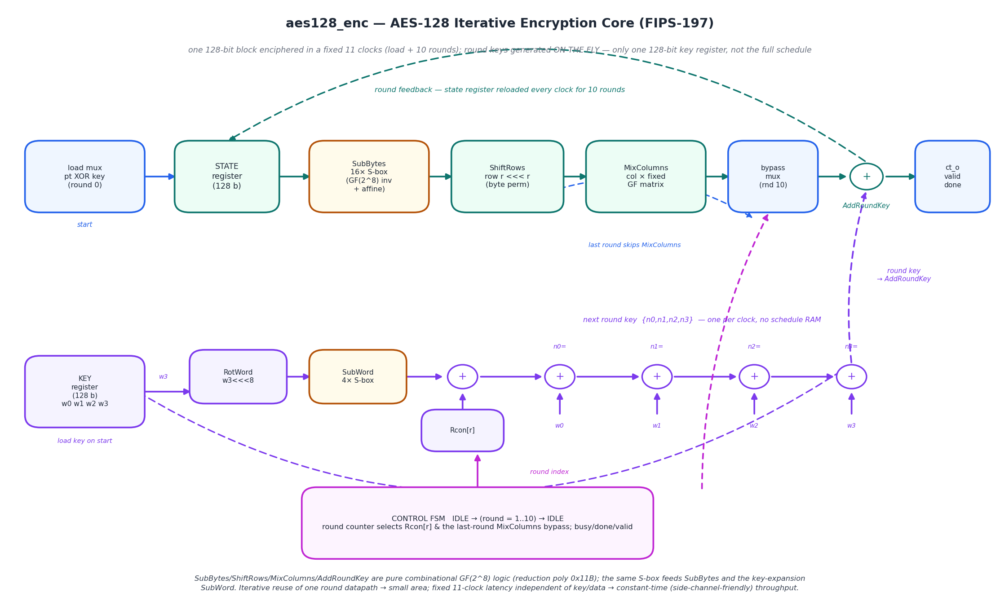
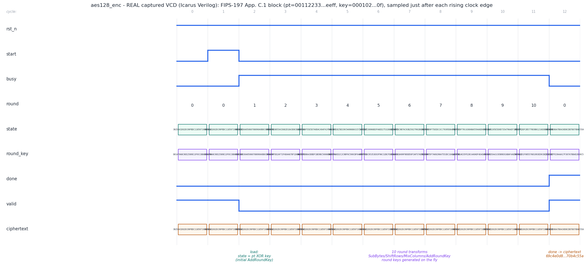

# Day 33 — AES-128 Block-Cipher Encryption Core (`aes128_enc`)

A compact, synthesizable **AES-128 encryptor** — the symmetric block cipher that
sits under MACsec (802.1AE), IPsec/TLS record encryption, self-encrypting
drives, and virtually every "line-rate crypto" datapath on an FPGA/ASIC. One
128-bit block is enciphered in a **fixed, data-independent 11 clocks** (an
initial key-add + 10 rounds), with the round keys generated **on the fly** so the
core stores exactly **one** 128-bit key register — not the 176-byte expanded
schedule.

> **What I set out to learn:** how the four AES round primitives
> (SubBytes / ShiftRows / MixColumns / AddRoundKey) map to real GF(2⁸) hardware,
> and how the key schedule can be *folded into the round loop* (one round key
> produced per clock by `RotWord`/`SubWord`/`Rcon`) instead of precomputed into a
> RAM. The result is small (one round datapath, reused 10×) and **constant-time**
> — the same 11 clocks for every key/plaintext, which is exactly the timing
> side-channel hygiene a hardware cipher wants.

This complements the series' other finite-field blocks — [Day 10](../Day10)'s
Hamming **SECDED** (linear parity over GF(2)) and [Day 32](../Day32)'s
Reed–Solomon encoder (GF(2^M) *cyclic-code* arithmetic). AES is a different use
of the same algebra: a **substitution–permutation network** over GF(2⁸) with the
reduction polynomial `x⁸ + x⁴ + x³ + x + 1` (`0x11B`), where confusion comes from
the S-box (a field inversion + affine map) and diffusion from ShiftRows +
MixColumns.

---

## Algorithm (FIPS-197)

```
state = plaintext XOR RoundKey[0]                     // initial AddRoundKey
for r = 1 .. 9:                                       // 9 full rounds
    state = AddRoundKey( MixColumns( ShiftRows( SubBytes(state) ) ), RoundKey[r] )
state = AddRoundKey( ShiftRows( SubBytes(state) ), RoundKey[10] )   // final round (no MixColumns)
ciphertext = state
```

- **SubBytes** — each of the 16 state bytes is replaced by the AES S-box, i.e.
  its multiplicative inverse in GF(2⁸) followed by a fixed affine transform
  (**confusion**, the only nonlinear step).
- **ShiftRows** — row *r* of the 4×4 state is cyclically left-rotated by *r*
  bytes (**diffusion** across columns).
- **MixColumns** — each column is multiplied by a fixed MDS matrix over GF(2⁸)
  (`{02 03 01 01}` circulant); skipped on the last round.
- **AddRoundKey** — XOR the 128-bit round key.
- **Key expansion** — `W[i] = W[i-4] ⊕ (i%4==0 ? SubWord(RotWord(W[i-1]))⊕Rcon[i/4] : W[i-1])`.
  Done **one round key per clock** in hardware, sharing the S-box with SubBytes.

Byte ordering follows FIPS-197: **byte 0 of every 128-bit port is bits
`[127:120]`** and maps to state column 0, row 0; byte *i* → `state[row=i%4][col=i/4]`.

---

## Features

| Feature | Detail |
|---|---|
| Cipher | AES-128 encryption (FIPS-197), 10 rounds |
| Throughput / latency | 1 block / 11 clocks, **outcome-independent** (worst-case == typical) |
| Key schedule | **on-the-fly**, 1 round key/clock — one 128-bit key register, no schedule RAM |
| Datapath | single round transform reused 10× (small area) |
| Field arithmetic | GF(2⁸) mod `0x11B`; `xtime` shift-and-reduce, no lookup for MixColumns |
| S-box | 256-entry ROM (packed constant) — **proven** against a from-scratch GF-inverse+affine model in the TB |
| Interface | `start` pulse → `busy` → `done`/`valid` with held `ct_o` |
| Style | `default_nettype none`, latch-free, synchronous active-low reset, no vendor primitives |
| Verification | independent golden model **anchored to two FIPS-197 KATs** + 500 random blocks |

---

## Ports

| Signal | Dir | Width | Description |
|---|---|---|---|
| `clk` | in | 1 | clock |
| `rst_n` | in | 1 | active-low reset |
| `start_i` | in | 1 | 1-cycle pulse: latch `key_i` + `pt_i`, begin encryption |
| `key_i` | in | 128 | cipher key (byte 0 = `[127:120]`) |
| `pt_i` | in | 128 | plaintext block (byte 0 = `[127:120]`) |
| `busy_o` | out | 1 | high while a block is in flight |
| `done_o` | out | 1 | 1-cycle pulse when `ct_o` is valid |
| `valid_o` | out | 1 | sticky: `ct_o` holds a valid result |
| `ct_o` | out | 128 | ciphertext block (byte 0 = `[127:120]`) |

### Parameter

| Parameter | Default | Description |
|---|---|---|
| `NR` | `10` | number of rounds (AES-128 = 10; do not change) |

---

## Circuit diagram



*Hand-drawn schematic (matplotlib, not a simulator capture).* **Top —**
cipher-state datapath: the load mux (`pt ⊕ key`) into the 128-bit **STATE
register**, looped through **SubBytes → ShiftRows → MixColumns → AddRoundKey**,
with a last-round mux that bypasses MixColumns and the round feedback that
reloads the state register each clock. **Bottom —** the on-the-fly key-expansion
datapath: `RotWord → SubWord → ⊕Rcon` and the word-chain XORs that emit one round
key per clock (no schedule RAM). **Control FSM** drives the round counter, the
`Rcon[r]` select, and the last-round bypass.

---

## ASCII block diagram

```
                       round feedback (state reloaded each clock, ×10)
        ┌─────────────────────────────────────────────────────────────┐
        │                                                             ▼
 start ─┤  ┌────────┐   ┌────────┐  ┌────────┐  ┌────────┐  ┌────────┐ ┌───────┐  ┌────┐
 key ──►│  │ load   │──►│ STATE  │─►│SubBytes│─►│ShiftRow│─►│MixColmn│►│bypass │─►│ +  │─► ct_o
 pt  ──►│  │ mux    │   │ reg128 │  │16×Sbox │  │ row<<<r│  │ GF mtx │ │mux(10)│  │ARK │   valid
        │  │pt⊕key  │   └────────┘  └────────┘  └────────┘  └────────┘ └───────┘  └────┘   done
        │  └────────┘                                  └── skip on last round ──┘   ▲
        │                                                                          │ round key
        │  ┌────────┐  ┌───────┐  ┌───────┐  ┌────┐   n0    n1    n2    n3          │
 key ──►│  │ KEY    │─►│RotWord│─►│SubWord│─►│⊕Rcon├──►(+)──►(+)──►(+)──►(+)─────────┘
        │  │ reg128 │  │ w3<<8 │  │4×Sbox │  └────┘    ▲w0   ▲w1   ▲w2   ▲w3
        │  └────────┘  └───────┘  └───────┘         one round key / clock — no schedule RAM
        │       ▲ round counter (Rcon select, last-round bypass) ── CONTROL FSM
        └───────┴──────────────────────────────────────────────
```

---

## Simulation timing



*__REAL captured waveform__ — parsed straight from `aes128_enc.vcd`, produced by
the Icarus Verilog run of `tb_aes128_enc` (`make icarus`), **not** a hand-drawn
mock-up. Every level and bus value is read from the VCD, sampled just after each
rising clock edge.* The window shows the **FIPS-197 Appendix C.1** block
(`pt = 00112233…eeff`, `key = 000102…0f`):

- **`start`** pulses; `busy` asserts and the **load** cycle sets
  `state = pt ⊕ key` (initial AddRoundKey, `round = 0`).
- The **`round`** counter walks `1 → 10`; each clock the **`state`** register
  advances through one SubBytes/ShiftRows/MixColumns/AddRoundKey transform and
  the **`round_key`** register shows the next key computed **on the fly**.
- On `round = 10`, **`done`** pulses, **`valid`** latches, and **`ct_o`** holds
  the ciphertext `69c4e0d8 6a7b0430 d8cdb780 70b4c55a` — the exact FIPS-197
  known-answer value. (Before `done`, `ct_o` still holds the *previous* block's
  result, the Appendix-B ciphertext — the register is only updated on the
  accepting edge.)

> **Testbench run:** Icarus Verilog — **510 checks, 0 errors →
> `RESULT: *** PASS ***`**.

---

## What the testbench checks

`tb_aes128_enc.sv` is self-checking against an **independent** golden model, and
the key point is *how* it is independent:

1. **The S-box is derived, not copied.** The golden model builds all 256 S-box
   entries from first principles — the **multiplicative inverse in GF(2⁸)**
   (found by exhaustive search under `0x11B`) followed by the **affine transform**
   `s = inv ⊕ (inv⋘1) ⊕ (inv⋘2) ⊕ (inv⋘3) ⊕ (inv⋘4) ⊕ 0x63`. If a single byte
   of the DUT's S-box ROM were wrong, the golden model would disagree.
2. **The model is anchored to the standard.** Before it judges the DUT, the model
   must reproduce the **two published FIPS-197 known-answer vectors**
   (Appendix B `2b7e…/3243…` → `3925841d…`, and Appendix C.1
   `0001…/0011…` → `69c4e0d8…`). A `$fatal` fires if the reference itself is
   wrong — so the golden model is proven against NIST, then used to certify the
   DUT.
3. **Directed corners** — all-zero, all-ones, `key == pt`, unit-bit key,
   unit-bit plaintext, and a split bit-pattern block.
4. **Randomized** — 500 random `(key, plaintext)` pairs; every block's `ct_o`
   is compared to the golden ciphertext.
5. **Protocol / liveness** — a per-block watchdog `$fatal`-timeout (spec latency
   is 11 clocks; the guard trips at 40) plus a global simulation timeout, so a
   hang can never masquerade as a pass.

Total: **510 checks, 0 errors**. The run also dumps `aes128_enc.vcd` for the
waveform above.

---

## Run it

```bash
# Icarus Verilog (open source)
make            # or: make icarus

# other simulators
make verilator
make vcs
make questa

# regenerate the figures from the freshly written VCD
make gen        # -> docs/aes128_enc_waveform.png (real VCD) + docs/aes128_enc_block.png
```

Expected tail of the Icarus run:

```
AES-128 encryption core : 510 checks, 0 errors
RESULT: *** PASS ***
```

---

## Notes & scope

- **Encryption only.** This is the forward cipher (ECB of a single block). A
  decryptor (InvSubBytes/InvShiftRows/InvMixColumns + reverse key schedule) and a
  mode of operation (CTR/GCM/CBC) are the natural follow-ons; ECB of one block is
  the right unit to verify the round datapath against FIPS-197.
- **Constant-time by construction** — latency does not depend on key or data, so
  there is no timing side channel from the datapath itself. (Power/EM side
  channels are out of scope for an RTL functional core.)
- Fully synthesizable, latch-free, `default_nettype none`; the S-box is written
  as a packed constant (indexed slice) rather than an unpacked-array parameter so
  the source elaborates on Icarus and Verilator as well as the big-3 simulators.
