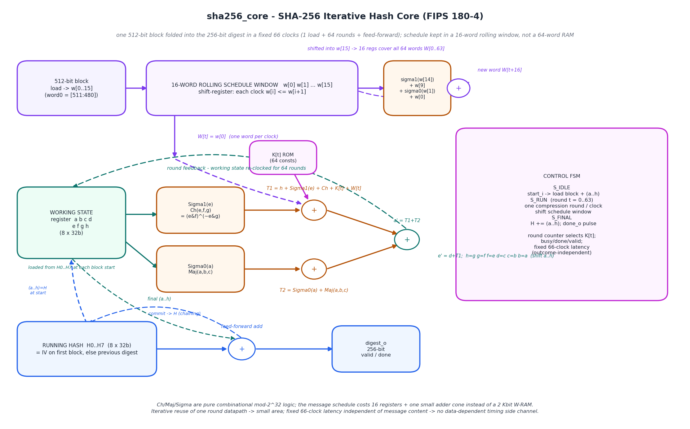
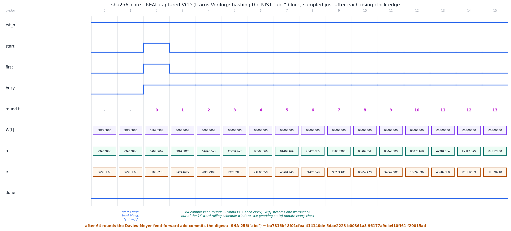

# Day 34 — SHA-256 Cryptographic Hash Core (iterative, FIPS 180-4)

A compact, synthesizable **SHA-256** engine in SystemVerilog. It absorbs one
already-padded **512-bit message block per launch** and folds it into a **256-bit
running digest** in a fixed, data-independent **66 clocks** (1 load + 64 rounds +
1 feed-forward), chaining an arbitrary number of blocks (Merkle–Damgård
construction) to hash a message of any length.

SHA-256 is the hash workhorse of the real world: it authenticates **TLS
records**, signs **Git commits/objects**, seals **software-update / secure-boot
images**, drives **HMAC** and **PBKDF2**, addresses content in **IPFS**, and is
the proof-of-work primitive in **Bitcoin**. This core is the hardware embodiment
of the FIPS 180-4 compression function — the exact same primitive family as
[Day 33](../Day33)'s AES block cipher, but a *one-way hash* (Merkle–Damgård
compression) rather than an invertible cipher, and a *bit-level* mixing network
rather than a GF(2⁸) substitution–permutation network.

> **Circuit diagram of the built core** (hand-drawn schematic, matplotlib):



---

## Highlights

- **Fixed, outcome-independent 66-clock latency per block** — every block takes
  the *same* number of clocks regardless of its content, so there is **no
  data-dependent timing side channel** (the property a MACsec / IPsec / TLS /
  HMAC datapath needs). Worst-case latency == typical latency.
- **The hardware standout: a 16-word rolling message schedule.** The 64 expanded
  schedule words `W[0..63]` are **never stored as 64 registers**. The core keeps
  a **16-word circular window** `w[0..15]` that shift-registers by one word per
  round. Round `t` consumes `w[0]` (`== W[t]`); in the *same* clock the
  recurrence

  ```
  W[t+16] = sigma1(W[t+14]) + W[t+9] + sigma0(W[t+1]) + W[t]
          = sigma1(w[14])   + w[9]   + sigma0(w[1])   + w[0]
  ```

  is evaluated combinationally and shifted into `w[15]`. So the whole schedule
  costs **16 registers + one small adder cone**, not a 2 Kbit `W`-RAM.
- **Dual-use hash registers (Davies–Meyer feed-forward).** The eight 32-bit
  registers `H0..H7` hold the running (chaining) digest **and** serve as the
  feed-forward input: a fresh working state `a..h` is loaded from them at each
  block, and the final add commits back into them — no separate feed-forward
  shadow copy is needed.
- **Multi-block chaining in hardware.** Assert `first_i` with the first block to
  seed the state to the SHA-256 **IV**; subsequent blocks chain automatically, so
  a message of any length is hashed one 512-bit block at a time.
- **Elaboration-baked constants.** The 64 round constants `K[t]` (cube-root
  fractional bits) live in a constant `case` — a portable ROM, no `$readmem`.
- **Clean & lint-friendly:** `` `default_nettype none ``, latch-free, no vendor
  primitives, single always block, parameterized round count.

---

## Parameters

| Parameter | Default | Meaning |
|-----------|---------|---------|
| `NROUND`  | `64`    | Number of compression rounds. SHA-256 is fixed at 64 — do **not** change; exposed only for readability. |

## Ports

| Port        | Dir | Width | Description |
|-------------|-----|-------|-------------|
| `clk`       | in  | 1     | Clock. |
| `rst_n`     | in  | 1     | Active-low reset (synchronous use); resets the FSM and seeds `H0..H7` to the IV. |
| `start_i`   | in  | 1     | 1-cycle pulse: latch `block_i` and begin absorbing it. |
| `first_i`   | in  | 1     | Sampled with `start_i`. `1` ⇒ this is the **first** block of a new message (reset chaining state to the IV); `0` ⇒ continue chaining from the current running digest. |
| `block_i`   | in  | 512   | One 512-bit, **already-padded** message block. Big-endian: word 0 (`M₀`) is `block_i[511:480]`. |
| `busy_o`    | out | 1     | High while a block is in flight (`state != IDLE`). |
| `done_o`    | out | 1     | 1-cycle pulse when the block has been absorbed and `digest_o` is updated. |
| `valid_o`   | out | 1     | Sticky: set once at least one block has been absorbed. |
| `digest_o`  | out | 256   | Running / final digest `{H0,H1,…,H7}` (`H0` = MSBs). Valid on/after `done_o`. |

*Padding is the caller's job* — the core absorbs pre-padded 512-bit blocks. The
testbench contains the padding logic (append `0x80`, zero-fill, 64-bit
big-endian bit-length).

---

## Block diagram (ASCII)

```
        512-bit padded block  (word0 = [511:480])
                    │  load
                    ▼
   ┌─────────────────────────────────────────────┐   sigma1(w[14])+w[9]
   │  16-WORD ROLLING SCHEDULE WINDOW             │ ─▶ +sigma0(w[1])+w[0] ─┐
   │  w[0] w[1] ... w[15]   (w[i] <= w[i+1])      │ ◀── shift into w[15] ──┘
   └─────────────────────────────────────────────┘
                    │ W[t] = w[0]  (one word / clock)
                    ▼
     K[t] ROM ─▶  T1 = h + Σ1(e) + Ch(e,f,g) + K[t] + W[t]
                  T2 =     Σ0(a) + Maj(a,b,c)
                    │
     ┌──────────────┴───────────────┐
     ▼                              ▼
  a' = T1 + T2      e' = d + T1 ;  h=g g=f f=e d=c c=b b=a   (a..h shift)
     └───────── round feedback (×64) ──────────┘
                    │ final a..h
                    ▼
     H0..H7  ──▶  (+)  H := H + (a..h)   ──▶  digest_o (256b)
     (IV on first block, else prev digest;  feed-forward = running hash)
```

`Ch`, `Maj`, and the Σ/σ functions are pure combinational mod-2³² logic:

```
Ch(e,f,g)  = (e & f) ^ (~e & g)          Maj(a,b,c) = (a&b)^(a&c)^(b&c)
Σ0(a) = ror(a,2) ^ ror(a,13) ^ ror(a,22) Σ1(e) = ror(e,6)  ^ ror(e,11) ^ ror(e,25)
σ0(x) = ror(x,7) ^ ror(x,18) ^ (x>>3)    σ1(x) = ror(x,17) ^ ror(x,19) ^ (x>>10)
```

---

## Simulation timing

The image below is a **real captured waveform** — parsed straight from
`sha256_core.vcd`, which is produced by the Icarus Verilog run of
`tb_sha256_core` (`make icarus`). It is **not** a hand-drawn mock-up: every level
and bus value is read from the VCD and sampled just after each rising clock edge,
where the registered datapath is valid.



It shows the NIST **`"abc"`** known-answer block being hashed: the `start`+`first`
pulse loads the block and seeds the working state to the IV (`a = 6a09e667`,
`e = 510e527f`); then the round counter `t` climbs while the message-schedule word
`W[t]` streams one word per clock out of the 16-word window (round 0's word is
`0x61626380` = `"abc"` ‖ `0x80`, followed by the block's zero words) and the
working registers `a`, `e` update every clock. After 64 such rounds the
Davies–Meyer feed-forward add commits the digest

```
SHA-256("abc") = ba7816bf 8f01cfea 414140de 5dae2223
                 b00361a3 96177a9c b410ff61 f20015ad
```

which matches the FIPS 180-4 published value.

---

## How it works

1. **Load (`S_IDLE`, `start_i`).** The 512-bit block is latched into the schedule
   window `w[0..15]` (word 0 → `w[0]`). The working state `a..h` is seeded from
   `H0..H7` — which are set to the **IV** when `first_i` is asserted, otherwise
   hold the previous block's chaining value. `busy_o` rises.
2. **64 compression rounds (`S_RUN`).** Each clock:
   - Compute `T1 = h + Σ1(e) + Ch(e,f,g) + K[t] + w[0]` and `T2 = Σ0(a) +
     Maj(a,b,c)` combinationally.
   - Shift the working register: `h=g; g=f; f=e; e=d+T1; d=c; c=b; b=a;
     a=T1+T2`.
   - Shift the schedule window by one word and push the freshly computed
     `sigma1(w[14]) + w[9] + sigma0(w[1]) + w[0]` into `w[15]`.
   - Increment the round counter until `t == 63`.
3. **Feed-forward (`S_FINAL`).** `H0..H7 += a..h` (mod 2³²) commits the block into
   the running digest; `done_o` pulses and `valid_o` sets. Control returns to
   `S_IDLE`, ready for the next block (chained) or a new message (`first_i`).

Total latency from `start_i` to `done_o` is a fixed **66 clocks** for every
block, independent of the data.

---

## Run it

Default is **Icarus Verilog** (open-source):

```bash
make            # iverilog + vvp : compile & run the self-checking TB
make gen        # regenerate docs/ figures from the captured VCD / model
make waves      # open sha256_core.vcd in GTKWave
make clean
```

Other simulators:

```bash
make verilator  # Verilator (lint + fast cycle sim)
make vcs        # Synopsys VCS
make questa     # Cadence Xcelium / Mentor Questa (qrun)
```

Expected tail of the run:

```
Golden model anchored to 3 NIST known-answer tests: OK
...
SHA-256 hash core : 309 checks, 0 errors
RESULT: *** PASS ***
```

---

## What the testbench checks

`tb_sha256_core` is **self-checking** against an **independent golden SHA-256
model** written into the TB. The model is *structurally different* from the DUT:
it materialises the **full 64-word** message schedule `W[0..63]` in an array
(whereas the DUT keeps only the rolling 16-word window), so a bug in the DUT's
window recurrence cannot be masked by a matching bug in the reference.

- **Golden model anchored to published NIST KATs** (via `$fatal`, *before* it is
  ever trusted to judge the DUT):
  - `""` → `e3b0c442…7852b855`
  - `"abc"` → `ba7816bf…f20015ad`
  - the 56-byte `"abcdbcde…nomnopnopq"` → `248d6a61…19db06c1` (2 blocks)
- **Padding + block streaming.** For every stimulus message the TB pads it into
  512-bit blocks, streams them through the DUT (`first_i` on block 0, chaining
  the rest), and compares the final `digest_o` against the golden digest.
- **Directed corners:** empty message; single byte; **55 bytes** (largest
  single-block message); **56 / 64 bytes** (smallest and exact multi-block
  boundaries); the **112-byte** 896-bit KAT; **200-byte all-zero** and
  **130-byte all-ones** messages (carry / chaining stress).
- **Randomized:** 300 messages of random length (0–300 B) and random content.
- **Timeouts:** a per-block guard (`$fatal` if `done_o` doesn't arrive within
  200 clocks — well above the deterministic 66) and a global watchdog.
- A **VCD is dumped** so the waveform above is a genuine captured trace.

Total: **309 checks, 0 errors** on the committed run.

> Toolchain note: this run was performed with **Icarus Verilog** — the PASS above
> is a real simulator result, and the waveform PNG is rendered from the VCD that
> run produced.
