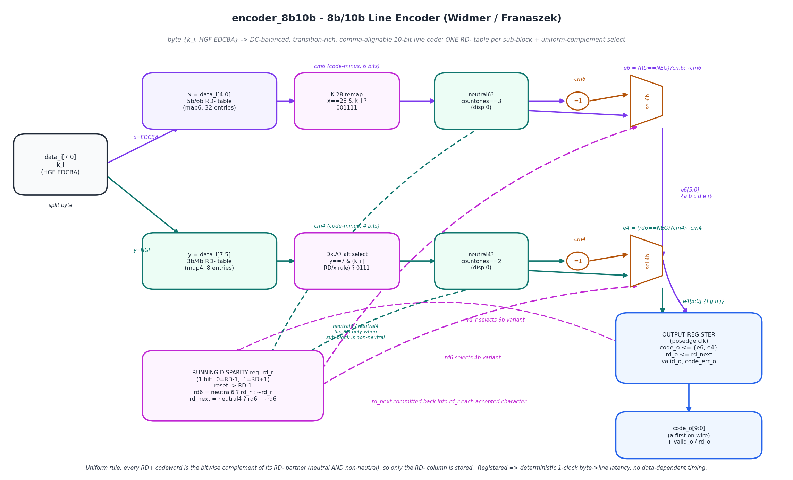
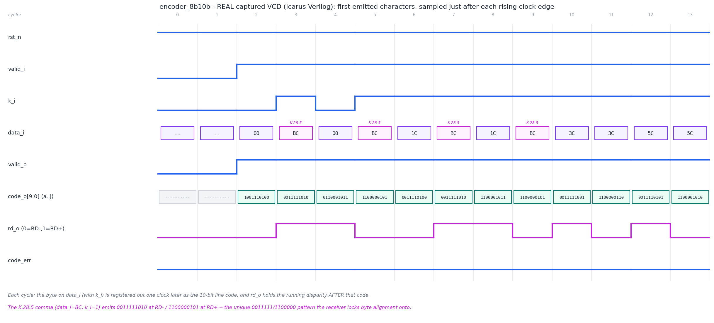

# Day 35 — 8b/10b Line Encoder (Widmer / Franaszek)

A synthesizable **8b/10b encoder** — the physical-coding-sublayer (PCS) block that
sits between byte-domain logic and the SerDes of **PCIe Gen1/2, SATA, 1000BASE-X
Gigabit Ethernet, USB 3.0 (Gen1), DisplayPort and Fibre Channel**. It maps each
8-bit character (plus a 1-bit control flag `K`) to a 10-bit line code that is

- **DC-balanced** — the encoder tracks a 1-bit *running disparity* and always
  picks the code variant that pulls the 1s-vs-0s balance back toward zero, so the
  serial stream carries no long-term DC bias (AC-coupling / PLL friendly);
- **transition-rich** — guaranteed **≤ 5 consecutive identical bits**, giving the
  receiver's clock-and-data-recovery (CDR) loop enough edges to stay locked;
- **comma-alignable** — the control codes (K.28.1 / K.28.5 / K.28.7) embed the
  unique 7-bit *comma* `0011111` / `1100000` that appears in no other bit
  position, so the deserializer can find byte boundaries in a raw bit stream.

The point of interest is how little logic it takes. 8b/10b splits the byte into a
**5b/6b** and a **3b/4b** sub-block, each with two line representations chosen by
the current running disparity — naively two full code tables. But **every RD+
codeword is the exact bitwise complement of its RD− partner** (for the
disparity-neutral codes *and* the disparity-±2 codes). So this core stores only
the RD− column and selects with one XOR cone:

```
emit    = (running_disparity == NEG) ? code_minus : ~code_minus
rd_next = neutral ? running_disparity : ~running_disparity   // flip only on non-neutral
```

One 6-bit table, one 4-bit table, two XOR cones, two 1-bit flips — no dual ROM,
no adders in the disparity path.

---

## Features

- Full **256-value data (D) code space** plus all **12 valid control (K) codes**
  (K.28.0–K.28.7 and K.23.7, K.27.7, K.29.7, K.30.7).
- **K.28 comma remap** — K.28 substitutes the special 5b/6b code `001111` for
  D.28's `001110`, so the comma pattern only ever appears in control codes.
- **Dx.A7 alternate 3b/4b encoding** — the one rule that prevents a run of five in
  one sub-block abutting a same-polarity run in its neighbour (which would make
  six identical bits): the primary D.x.7 (`1110`/`0001`) is replaced by the
  alternate (`0111`/`1000`) when `RD=−1 & x∈{17,18,20}` or `RD=+1 & x∈{11,13,14}`;
  all control `.7` codes always use the alternate form.
- **Running disparity** kept in a single flip-flop, reset to the spec-mandated
  RD = −1, exported on `rd_o` for observability.
- **Illegal control detection** — a `K` request for anything other than the valid
  control codes raises `code_err_o` and does not emit a code word.
- **Registered outputs** ⇒ deterministic **1-clock** byte→line latency,
  independent of the data (no data-dependent timing).
- Latch-free, `` `default_nettype none ``, no vendor primitives.

---

## Ports

| Port         | Dir | Width | Description |
|--------------|-----|-------|-------------|
| `clk`        | in  | 1     | Clock. |
| `rst_n`      | in  | 1     | Active-low **synchronous** reset (RD → −1). |
| `valid_i`    | in  | 1     | Present a character this cycle. |
| `data_i`     | in  | 8     | Character `HGF EDCBA` (`data_i[4:0]`=x=`EDCBA`, `data_i[7:5]`=y=`HGF`). |
| `k_i`        | in  | 1     | 1 = control (K) character, 0 = data (D). |
| `code_o`     | out | 10    | Line code; **`code_o[9]`='a' is first on the wire** (MSB-first), `code_o[0]`='j'. |
| `valid_o`    | out | 1     | `code_o` holds a fresh encoded character (mirrors `valid_i`, 1-cycle delay). |
| `rd_o`       | out | 1     | Running disparity **after** this character (`0`=RD−1, `1`=RD+1). |
| `code_err_o` | out | 1     | Set when `valid_i & k_i` requested an illegal control code. |

*(8b/10b is a fixed-width standard, so the datapath widths are constants rather
than parameters; the two lookup tables are the natural configuration surface.)*

## Bit / code conventions

| Symbol | Meaning |
|--------|---------|
| `x`    | 5-bit sub-block `EDCBA` = `data_i[4:0]` → 6-bit `abcdei` |
| `y`    | 3-bit sub-block `HGF` = `data_i[7:5]` → 4-bit `fghj` |
| RD−/RD+ | running disparity −1 / +1 |
| neutral | sub-block with equal 1s and 0s (6b: 3 ones, 4b: 2 ones) → RD unchanged |
| non-neutral | ±2 disparity sub-block → RD flips |

---

## Block diagram (ASCII)

```
 data_i[7:0], k_i
   |        |
   | x=[4:0]                              running-disparity reg  rd_r (1 bit)
   v                                        (0=RD-1, 1=RD+1; reset -> RD-1)
 +----------+  +-----------+  +----------+     |            |
 | 5b/6b    |->| K.28      |->| neutral6?|     | rd_r        | rd6
 | RD- table|  | remap     |  | ones==3  |     v (select)   v (select)
 +----------+  +-----------+  +----------+  +-----+       +-----+
      cm6 ------------------------------->  | sel |->e6   | sel |->e4
                                    ~cm6 -> | 6b  |       | 4b  |
                                           +-----+       +-----+
 data_i[7:5]                                  ^ ~cm4        ^
   | y=[7:5]                                  |             |
   v                                     +----------+  +----------+
 +----------+  +-----------+  +----------+| Dx.A7    |  | neutral4?|
 | 3b/4b    |->| Dx.A7 alt |->| neutral4?|| alt(0111)|  | ones==2  |
 | RD- table|  | select    |  | ones==2  |+----------+  +----------+
 +----------+  +-----------+  +----------+
      cm4
                          rd6 = neutral6 ? rd_r : ~rd_r
                          rd_next = neutral4 ? rd6 : ~rd6
                                   |
   e6{a..i}, e4{f..j} ---> [ OUTPUT REGISTER @posedge ] ---> code_o[9:0], rd_o, valid_o
                                   ^______ rd_next committed back into rd_r ______|
```

## Circuit diagram



*Hand-drawn schematic of the built circuit (matplotlib, not a simulator capture):
the byte split into the two sub-block lookups, the K.28 comma remap and Dx.A7
alternate selector, the uniform-complement select driven by the running-disparity
register, the neutral-detect that flips RD only on non-neutral sub-blocks, and the
registered `{a..i, f..j}` line-code output.*

---

## Simulation timing



*A **real captured waveform**, parsed straight from `encoder_8b10b.vcd` produced by
the Icarus Verilog run of `tb_encoder_8b10b` (not hand-drawn). It shows the first
characters the DUT emits — the D.00 known-answer pair and the K.28.5 comma among
them — sampled just after each rising clock edge. `data_i`/`k_i` present a
character; one clock later `code_o` holds the 10-bit line code and `rd_o` holds the
running disparity **after** that code. Note the K.28.5 comma (`data_i=BC, k_i=1`)
emitting `0011111010` at RD− and `1100000101` at RD+ — the unique
`0011111`/`1100000` pattern the receiver locks byte alignment onto — and `rd_o`
toggling as non-neutral sub-blocks are transmitted.*

---

## How it works

1. **Split.** The byte is split into `x = data_i[4:0]` (→ 6-bit `abcdei`) and
   `y = data_i[7:5]` (→ 4-bit `fghj`).
2. **RD− lookup.** `map6(x)` and `map4(y)` return the **RD− (code-minus)** form of
   each sub-block. `K.28` remaps the 6-bit code to `001111`; the `.7` codes select
   the primary `1110` or the Dx.A7 alternate `0111`.
3. **Neutral detect.** A sub-block is *disparity-neutral* iff it has an equal
   number of 1s and 0s (6b: `$countones==3`, 4b: `$countones==2`). Neutral codes
   leave RD unchanged; non-neutral codes flip it.
4. **Uniform-complement select.** The emitted sub-block is the RD− code when the
   entering running disparity is negative, and its **bitwise complement**
   otherwise: `e6 = (rd_r==NEG)?cm6:~cm6`, then `e4 = (rd6==NEG)?cm4:~cm4`, where
   `rd6` is the disparity between the two sub-blocks. This single rule reproduces
   both the neutral RD-alternates and the ±2 balance-flipping variants.
5. **Commit.** On the accepting clock edge the 10-bit code `{e6,e4}` and the new
   running disparity `rd_next` are registered; `rd_r` carries the disparity into
   the next character.

The whole datapath is combinational feeding one register stage, so **every**
character encodes in exactly one clock regardless of its value.

---

## Run it

```bash
make icarus       # Icarus Verilog (default)
# or
make verilator    # Verilator --binary --timing
make vcs          # Synopsys VCS
make questa       # Cadence Xcelium / Mentor Questa

make gen          # regenerate docs/*.png from the VCD + model (needs matplotlib)
make waves        # open encoder_8b10b.vcd in GTKWave
make clean
```

Verified locally with **Icarus Verilog**:

```
[KAT] 26 published known-answer anchors passed.
[SWEEP] 512 data characters scoreboarded (RD-chained).
[CTRL] valid control codes scoreboarded.
[ERR ] illegal control requests flagged.
[RAND] 6000 randomized RD-chained characters scoreboarded.
checks = 46285   errors = 0   max-run = 5
RESULT: *** PASS ***
```

---

## What the testbench checks

`tb_encoder_8b10b` uses **three independent oracles**, in increasing strength:

- **(A) Structural / table-free laws — on every emitted symbol.** Using only
  `$countones` of the 10 line bits (no encode table, so it cannot "share a bug"
  with the DUT): each 6b sub-block has 2–4 ones and each 4b sub-block 1–3 ones;
  the running disparity **recomputed by popcount** equals the DUT's `rd_o` and
  always stays on −1 or +1; and a **live max-run monitor** across the serial
  concatenation of all codes asserts **≤ 5** consecutive identical bits for the
  data stream.
- **(B) Published known-answer anchors.** The 12 standard control codes plus D.00
  are asserted with `$fatal` against exact 10-bit strings from the spec — pinning
  the absolute bit values (K.28 comma remap, the `.7` alternate, both RD states,
  every 3b/4b `y`) **before** the golden model is trusted.
- **(C) Golden-model scoreboard.** A reference model (the uniform-complement
  algorithm) checks `code_o` / `rd_o` / `code_err_o` for a **full 256×2 data
  sweep**, **all valid control codes**, illegal-K error flagging, and a **6000-
  character randomized RD-chained stream** — the real stress on the disparity
  state machine.

Directed + randomized stimulus, a `$fatal`/timeout watchdog, and a VCD dump.
Total: **46,285 checks, 0 errors** on the Icarus run.
