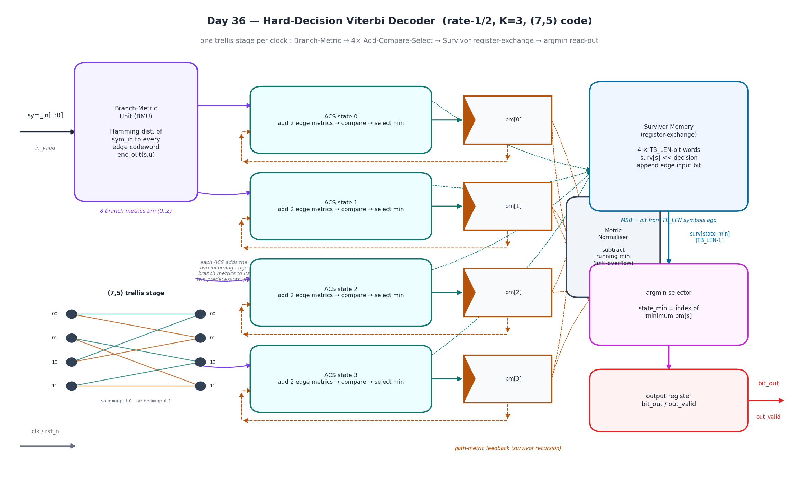
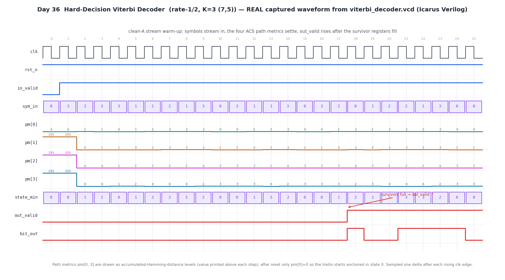

# Day 36 — Hard-Decision Viterbi Decoder (rate-1/2, K=3, (7,5) code)

A fully pipelined **Viterbi decoder** — the maximum-likelihood decoder for a
convolutional code. It processes one received 2-bit channel symbol per clock and,
after a fixed decode latency, emits one decoded message bit per clock. Because it
finds the trellis path of minimum accumulated Hamming distance, it *corrects*
channel bit errors rather than merely detecting them.

The default configuration decodes the textbook **rate-1/2, constraint-length K=3,
(7,5)₈ convolutional code** (generator polynomials `G0 = 111₂ = 7₈`,
`G1 = 101₂ = 5₈`), which has free distance `d_free = 5`.

---

## Circuit diagram



*Hand-drawn schematic of the built datapath (matplotlib — not a simulator capture):
the Branch-Metric Unit computes the Hamming distance of `sym_in` to every trellis
edge codeword; four Add-Compare-Select (ACS) units — one per K=3 state — add those
edge metrics to their two predecessors' path metrics, compare, and keep the survivor;
the per-cycle normaliser subtracts the running minimum path metric to prevent
overflow; the survivor memory (register-exchange) shifts each winner's history and
appends the edge input bit; and the argmin selector reads the decoded bit out of the
minimum-metric state's oldest survivor slot. The inset shows one `(7,5)` trellis
stage (solid = input 0, amber = input 1).*

---

## Features

- **Maximum-likelihood decoding** over the full trellis — not a heuristic; the
  survivor with the smallest accumulated Hamming distance always wins.
- **One trellis stage per clock** — throughput of one decoded bit per input symbol
  (streaming, back-pressure-free).
- **Add-Compare-Select (ACS)** butterfly for all `2^(K-1) = 4` states, with the two
  incoming edges added, compared, and selected in one combinational stage.
- **Register-exchange survivor memory** — a `TB_LEN`-deep history word per state;
  the decoded bit falls out of the MSB after exactly `TB_LEN` symbols (fixed latency,
  no separate traceback pass).
- **Per-cycle metric normalisation** subtracts the running minimum so the path
  metrics stay bounded and `PM_W` never overflows on arbitrarily long streams.
- **Self-synchronising** — reset biases every survivor into state 0 and the output
  is taken from whichever state currently holds the minimum metric, so no explicit
  trellis termination is required in hardware.
- **Parameterised** generator polynomials, survivor depth and metric width.
- Clean, reset-safe, lint-friendly **SystemVerilog-2012**; `default_nettype none`.

---

## Parameters

| Parameter | Default | Description |
|-----------|---------|-------------|
| `G0`      | `3'o7` (`111₂`) | Generator polynomial 0 (bit2 = current input tap, bit1 = `sr0` tap, bit0 = `sr1` tap). |
| `G1`      | `3'o5` (`101₂`) | Generator polynomial 1, same bit convention. |
| `TB_LEN`  | `16`    | Survivor / traceback depth in symbols; equals the decode latency. Use ≳ 5·K for good performance. |
| `PM_W`    | `8`     | Path-metric register width in bits. |

## Ports

| Port | Dir | Width | Description |
|------|-----|-------|-------------|
| `clk`       | in  | 1 | Clock. |
| `rst_n`     | in  | 1 | Active-low **synchronous** reset. |
| `in_valid`  | in  | 1 | Asserted when `sym_in` carries a valid received symbol this cycle. |
| `sym_in`    | in  | 2 | Received channel symbol `{c0, c1}` (hard bits). |
| `out_valid` | out | 1 | Asserted when `bit_out` carries a valid decoded message bit. |
| `bit_out`   | out | 1 | Decoded message bit (delayed by `TB_LEN` symbols). |
| `state_min` | out | 2 | Current minimum-metric trellis state (observability / debug). |

---

## ASCII block diagram

```
                    +-------------------+
  sym_in[1:0] ----> |  Branch-Metric    |  8 edge metrics (Hamming dist 0..2)
   in_valid ------> |  Unit  (BMU)      |----+----+----+----+
                    +-------------------+    |    |    |    |
                                             v    v    v    v
                        +----------+   +----------+   +----------+   +----------+
                        | ACS s0   |   | ACS s1   |   | ACS s2   |   | ACS s3   |
                        | add/cmp/ |   | add/cmp/ |   | add/cmp/ |   | add/cmp/ |
                        |  select  |   |  select  |   |  select  |   |  select  |
                        +----+-----+   +----+-----+   +----+-----+   +----+-----+
                             |  pm[0]       |  pm[1]       |  pm[2]       |  pm[3]
                             +------+-------+------+-------+------+-------+---+
                                    |  (normalise: subtract running min)         |
                                    v                                            |
                        +-----------------------+     +-----------------------+  |
                        | Survivor memory       |     | argmin selector       |<-+
                        | (register-exchange)   |     |  state_min = min pm   |
                        | 4 x TB_LEN-bit words  |     +-----------+-----------+
                        +-----------+-----------+                 |
                                    |  surv[state_min][TB_LEN-1]  |
                                    +--------------+--------------+
                                                   v
                                        +----------------------+
                                        | output register      |--> bit_out
                                        | bit_out / out_valid  |--> out_valid
                                        +----------------------+
```

---

## How it works

**Trellis.** For K=3 the encoder state `s = {sr1, sr0}` holds the two most recent
message bits. On input `u` it shifts to `next = {sr0, u}`, so every state has exactly
two outgoing edges (`u = 0/1`) and two incoming edges. Each edge emits the 2-bit
codeword `{G0·[u,sr0,sr1], G1·[u,sr0,sr1]}` (XOR of the tapped bits), computed at
elaboration time from `G0`/`G1`.

**Branch metrics.** The BMU compares the received `sym_in` against every edge's
expected codeword and produces the Hamming distance (0, 1 or 2) — the local cost of
taking that edge this cycle.

**Add-Compare-Select.** For each next-state, the decoder adds the two incoming edge
metrics to their source path metrics, compares the two candidates, and keeps the
smaller as the new path metric `pm[s]`. The loser is discarded — that is the Viterbi
pruning that keeps the survivor count constant at one path per state.

**Survivor memory (register-exchange).** Instead of storing decision bits and walking
them backwards, each state carries a `TB_LEN`-bit history word. On every ACS the
winner's word is shifted left and the edge's input bit is appended at the LSB, so a
message bit that entered `TB_LEN` symbols ago now sits in the MSB. Reading
`surv[state_min][TB_LEN-1]` therefore yields the finalised decision with a fixed
latency of `TB_LEN` symbols and no separate traceback machine.

**Normalisation & anchoring.** After each stage the minimum of the four path metrics
is subtracted from all of them, keeping the values bounded regardless of stream
length. Reset sets `pm[0]=0` and the others to the maximum, anchoring the trellis in
the encoder's known start state; the output uses the running minimum-metric state so
the decoder re-synchronises on its own.

---

## Simulation timing



**Real captured waveform** parsed straight from `viterbi_decoder.vcd`, which is
produced by the Icarus Verilog run of `tb_viterbi_decoder` (`make icarus`). It shows
the *clean-A* stream warming up: after `rst_n` releases, only `pm[0]` starts at `0`
while `pm[1..3]` start at `255` (the reset bias that anchors the trellis in state 0);
as symbols stream in the four Add-Compare-Select path metrics settle into the low
single digits, `state_min` tracks the current best state, and `out_valid` rises after
the `TB_LEN = 16`-deep survivor registers fill, at which point `bit_out` begins
delivering decoded message bits. Every level and bus value is read from the VCD,
sampled one delta after each rising clock edge. *(The path-metric traces are drawn as
Hamming-distance levels with the numeric value printed above each step — this is a
real capture, not a hand-drawn mock-up.)*

---

## What the testbench checks

`tb_viterbi_decoder.sv` is **self-checking** against a golden reference model — a
rate-1/2 (7,5) convolutional **encoder** written directly in the testbench:

1. A random message is generated and run through the golden encoder to produce the
   transmitted symbol stream.
2. An optional, controlled channel-error pattern flips isolated single symbol bits
   (well separated, hence guaranteed correctable for a `d_free = 5` code).
3. The (possibly corrupted) symbols are streamed into the DUT, followed by a proper
   **zero-tail termination + drain** so the final message bits ripple out of the
   survivor registers.
4. The decoded stream is aligned to the transmitted message and **every** bit is
   compared; the detected latency is printed.

| Test | Channel | Expected result |
|------|---------|-----------------|
| `clean-A` | error-free, 400-bit random stream | 0 decoded-bit errors |
| `errors`  | one isolated bit flip per 25 symbols, 400 bits | **0** decoded-bit errors (all corrected) |
| `clean-B` | error-free, 300-bit random stream (fresh seed) | 0 decoded-bit errors |

The bench includes directed + randomised stimulus, a global timeout watchdog, and
dumps `viterbi_decoder.vcd`. It prints `RESULT: *** PASS ***` only if every decoded
stream matches the transmitted message exactly.

Example run (Icarus Verilog):

```
Day36 Viterbi decoder  (rate-1/2, K=3, (7,5) code, TB_LEN=16)
-----------------------------------------------------------------
  [clean-A ] nbits=400  err_period=0   detected_latency=0  bit_errors=0
  [errors  ] nbits=400  err_period=25  detected_latency=0  bit_errors=0
  [clean-B ] nbits=300  err_period=0   detected_latency=0  bit_errors=0
-----------------------------------------------------------------
RESULT: *** PASS *** (all decoded streams matched the transmitted message)
```

> Note: Icarus Verilog emits a few benign `sorry: constant selects in always_*`
> notices for the array-indexed ACS loop; they do not affect the (correct) results
> and other simulators (Verilator/VCS/Questa) accept the RTL as written.

---

## Run it

```bash
make icarus       # Icarus Verilog (default) — compiles and runs the self-checking TB
make verilator    # Verilator lint + fast cycle sim
make vcs          # Synopsys VCS
make questa       # Cadence Xcelium / Mentor Questa
make gen          # regenerate docs/*.png from the VCD / model
make waves        # open the VCD in GTKWave
make clean
```

## Files

| File | Description |
|------|-------------|
| `viterbi_decoder.sv`     | Synthesizable Viterbi decoder RTL. |
| `tb_viterbi_decoder.sv`  | Self-checking testbench with golden (7,5) encoder reference. |
| `Makefile`               | Run targets for Icarus / Verilator / VCS / Questa. |
| `gen_waveform.py`        | Parses `viterbi_decoder.vcd` → `docs/viterbi_decoder_waveform.png`. |
| `gen_block.py`           | Renders the circuit/block diagram → `docs/viterbi_decoder_block.png`. |
| `docs/`                  | Generated circuit diagram and captured waveform. |
