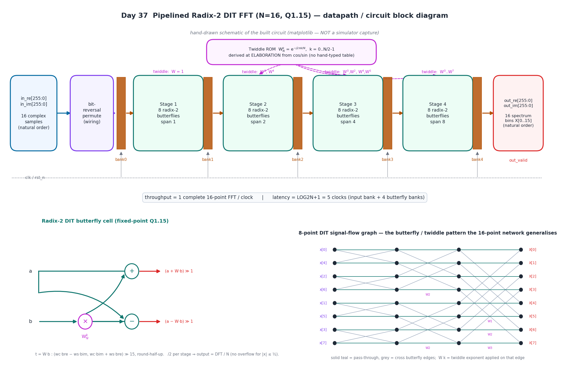
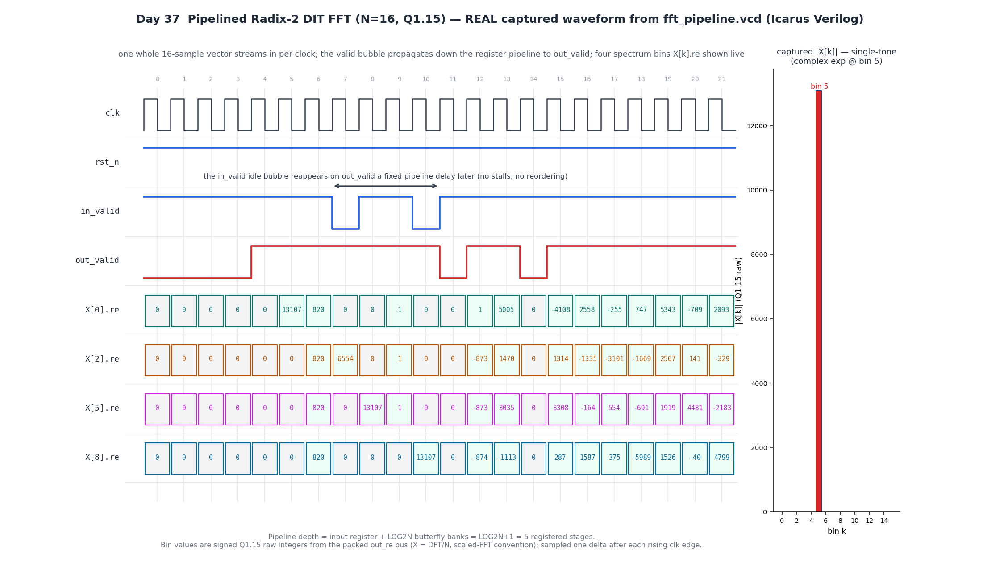

# Day 37 — Pipelined Radix-2 DIT FFT (N=16, fixed-point Q1.15)

A fully-pipelined, fully-parallel **Fast Fourier Transform** — the workhorse of
digital signal processing. It sits under OFDM (Wi-Fi 802.11a/g/n/ac, LTE/5G,
DVB, DSL), pulse-Doppler and synthetic-aperture radar, spectrometry, fast
convolution/correlation, and channelizers. This core accepts one **complete
16-sample complex vector every clock** and, after a fixed 5-cycle pipeline
latency, emits the **full 16-bin complex spectrum** — one transform per clock,
back-to-back, with no stalls.

The transform is a decimation-in-time (DIT) radix-2 butterfly network with
`LOG2N = 4` stages. Input is consumed in **natural order** and internally
bit-reversed (pure wiring), so the spectrum leaves in **natural bin order**
`X[0..15]`. All arithmetic is fixed-point **Q1.15** (signed 1.15); each butterfly
divides its sum/difference by two, so the whole network scales the result by
`1/N` — the output is the mathematically-exact DFT divided by `N`. This is the
**scaled-FFT** convention used by commercial streaming FFT IP (Xilinx/Intel):
provided the input magnitude stays `≤ ½` full-scale, the datapath **never
overflows**.

---

## Circuit diagram



*Hand-drawn schematic of the built circuit (matplotlib — not a simulator
capture). The packed complex input enters a bit-reversal permutation, then four
radix-2 DIT butterfly stages — each a bank of `N/2 = 8` butterflies followed by a
pipeline register bank — fed by the elaboration-derived twiddle ROM, and the
packed natural-order spectrum leaves the last register bank. Inset left: the
radix-2 DIT butterfly cell arithmetic (complex twiddle multiply, add/sub, `/2`
scaling with round-half-up). Inset right: an 8-point DIT signal-flow graph
showing the butterfly connectivity and per-stage twiddle schedule that the full
16-point network generalises.*

---

## Features

- **Fully-parallel, fully-pipelined** — one complete N-point FFT accepted and
  produced per clock (max throughput; a new spectrum every cycle).
- **Radix-2 decimation-in-time** butterfly network, fully unrolled: `LOG2N = 4`
  combinational butterfly stages, each followed by a pipeline register bank.
- **Natural in → natural out** — the input is consumed in order and internally
  **bit-reversed**, so no external reordering is needed on either side.
- **Twiddle ROM derived at elaboration** — `W_N^k = e^(−j2πk/N)` is built from
  `cos`/`sin` by a constant SystemVerilog function; **no hand-typed tables**.
- **Fixed-point Q1.15** data and twiddles with **round-half-up** re-quantisation;
  per-stage `/2` scaling ⇒ output = **DFT / N** (scaled FFT), overflow-free for
  `|x| ≤ ½`.
- **Synthesizable structural unrolling** — the butterfly network is built with
  `generate` loops whose bounds are all elaboration-time constants (span, group
  size and twiddle stride are powers of two), so there are **no variable-bound
  procedural loops**.
- **Deterministic latency** = `LOG2N + 1 = 5` clocks, **outcome-independent** (no
  data-dependent timing).
- **Streaming valid** — `in_valid` flows through the pipeline to `out_valid`; idle
  bubbles pass through unchanged (no stalls, no reordering).
- Parameterised size / word width; reset-safe; latch-free; `default_nettype none`;
  clean lint-friendly SystemVerilog-2012.

---

## Parameters

| Parameter | Default | Description |
|-----------|---------|-------------|
| `N`       | `16`    | Transform size (power of two). |
| `DW`      | `16`    | Sample word width — signed Q1.(DW-1) fixed-point. |
| `LOG2N`   | `4`     | `= log2(N)`; must be kept consistent with `N`. |

Derived internally: `TWSCALE = 2^(DW-1) − 1` (twiddle full-scale, 32767 for
DW=16) and `FRAC = DW − 1` (fractional bits, 15).

## Ports

| Port        | Dir | Width      | Description |
|-------------|-----|------------|-------------|
| `clk`       | in  | 1          | Clock. |
| `rst_n`     | in  | 1          | Active-low **synchronous** reset. |
| `in_valid`  | in  | 1          | 1 ⇒ a fresh N-sample vector is presented this clock. |
| `in_re`     | in  | `N*DW`     | Packed real parts; sample `n` = `in_re[n*DW +: DW]` (natural order). |
| `in_im`     | in  | `N*DW`     | Packed imaginary parts. |
| `out_valid` | out | 1          | Aligned with `out_re`/`out_im`. |
| `out_re`    | out | `N*DW`     | Packed real spectrum; bin `k` = `out_re[k*DW +: DW]` (natural order). |
| `out_im`    | out | `N*DW`     | Packed imaginary spectrum. |

Fixed-point convention: a raw sample value `v` represents `v / 2^(DW-1)`
(Q1.15 ⇒ `v / 32768`). The spectrum is the **scaled** DFT, `X[k] = DFT(x)[k] / N`.

---

## ASCII block diagram

```
                       Twiddle ROM  W_N^k = e^(-j2*pi*k/N),  k=0..N/2-1
                       (derived at elaboration from cos/sin)
                                 |        |        |
                                 v        v        v
 in_re/in_im     bit-      +--------+  +--------+  +--------+  +--------+   out_re/
 (natural   -->  reversal->|Stage 1 |->|Stage 2 |->|Stage 3 |->|Stage 4 |-> out_im
  order)         permute   | 8 BF   |  | 8 BF   |  | 8 BF   |  | 8 BF   |   (natural
   (16 cmplx)    (wiring)  | span 1 |  | span 2 |  | span 4 |  | span 8 |    bin order)
                    |      +--------+  +--------+  +--------+  +--------+
                  [bank0]   [bank1]     [bank2]     [bank3]     [bank4]
                    reg       reg         reg         reg         reg
                    \__________\___________\___________\___________/
                         one pipeline register bank after every stage
   latency = LOG2N+1 = 5 clocks     throughput = 1 complete 16-pt FFT / clock

 Radix-2 DIT butterfly cell:            a --------------------+--> (a + W*b) >> 1
                                                               \ /
   t = W_N^k * b (complex, Q1.15,        b --> [ x W_N^k ] --> (X)-> (a - W*b) >> 1
   round-half-up); /2 per stage
   keeps the datapath in [-1, 1).
```

---

## Simulation timing



*This is a **real captured waveform**, parsed straight from `fft_pipeline.vcd`
produced by the Icarus Verilog run of `tb_fft_pipeline` — not a hand-drawn
mock-up. Directed test vectors stream in (one whole 16-sample vector per clock);
the `in_valid` idle bubble reappears on `out_valid` a fixed pipeline delay later
(no stalls, no reordering). Four spectrum bins `X[k].re` are shown live as signed
Q1.15 raw integers read straight from the packed `out_re` bus. The values are
physically exact: the **DC** vector (all `+0.4`) gives `X[0] = 13107` (= 0.4 in
Q1.15) and zero elsewhere; the **impulse** gives every bin `= 820` (= 0.4/16); the
**cosine tone at bin 2** gives `X[2] = 6554` (= 0.2) split with bin 14; the
**complex exponential at bin 5** gives `X[5] = 13107` in a single bin (see the
inset magnitude spectrum, captured from the DUT, with all energy in bin 5); and
the **alternating ±0.4** (Nyquist) vector gives `X[8] = 13107`. Pipeline depth =
input register + LOG2N butterfly banks = `LOG2N+1 = 5` registered stages.*

Regenerate the figures after a run with `make gen`.

---

## How it works

**1. Bit-reversal (stage 0).** A decimation-in-time FFT expects its inputs in
bit-reversed order. The core takes samples in natural order and rewires them:
sample `n` of the register bank is fed from input position `bitrev(n)`. This is
pure wiring (no logic) and lets the output emerge in natural bin order.

**2. Radix-2 DIT butterfly stages (1..4).** Stage `m` performs `N/2 = 8`
butterflies with span `HALF = 2^(m-1)`, group size `2^m`, and twiddle stride
`N/2^m`. For each butterfly pair `(top, bot = top + HALF)` with twiddle index
`twi = j * N/2^m`:

```
t          = W_N^twi * b              (complex multiply, b = sample[bot])
sample'[top] = (a + t) / 2            (a = sample[top])
sample'[bot] = (a - t) / 2
```

Stage 1 uses only `W = 1`; each later stage adds more twiddle angles
(`{W^0, W^4}`, `{W^0, W^2, W^4, W^6}`, `{W^0 … W^7}`). Because the network is fully
unrolled and the twiddles are fixed by butterfly position (not selected by a
runtime counter), the whole dataflow is feed-forward with a very small bug
surface.

**3. Fixed-point arithmetic.** Data and twiddles are signed Q1.15. The complex
multiply forms `wc·br − ws·bi` and `wc·bi + ws·br` in a widened accumulator, then
re-quantises to Q1.15 by `(acc + 2^14) >> 15` (**round-half-up**). Each butterfly
then divides its sum/difference by two (`(x + 1) >> 1`, round-half-up). Four
stages of `/2` scale the output by `1/16 = 1/N`, so `out = DFT(x) / N` and every
internal node stays inside `[-1, 1)` as long as `|x| ≤ ½`.

**4. Pipeline & valid.** Every stage is followed by a register bank, giving a
`LOG2N + 1 = 5`-cycle latency and one full FFT of throughput per clock.
`in_valid` is shifted through a matching valid pipeline to produce `out_valid`, so
each output labels itself and idle bubbles pass through unchanged.

**5. Twiddle ROM.** `W_N^k = cos(−2πk/N) + j·sin(−2πk/N)` for `k = 0 … N/2−1` is
computed by a constant SystemVerilog function at elaboration — the tool folds the
`cos`/`sin` to compile-time constants (verified under Icarus). Synthesis flows
that cannot fold real system functions can `$readmemh` an equivalent generated
hex table; the ROM is a pure constant either way.

---

## What the testbench checks

`tb_fft_pipeline.sv` is **self-checking against an independent golden model** — a
**direct DFT** (naive double-precision `O(N^2)` double sum), structurally unlike
the DUT's butterfly network, scaled by `1/N` and re-quantised to Q1.15. A
fixed-point FFT is always graded against a floating reference within an error
bound (it is never bit-exact), so **PASS = every bin of every vector lands within
`TOL = 4` LSB of the rounded ideal**.

- **Directed vectors:** all-zero, DC, unit impulse, real cosine tone (bin 2),
  complex exponential (single-bin, bin 5), two-tone (bins 1 & 6), alternating
  ±0.4 (Nyquist bin 8), and a ramp.
- **Randomised streaming:** 600 random complex vectors, `|re|, |im| ≤ 0.4`
  (guarantees `|x| ≤ ½`, no internal overflow), presented back-to-back with
  occasional idle bubbles to exercise `valid` gating and pipeline ordering.
- **Scoreboard:** a FIFO of presented vectors; on each `out_valid` the oldest
  input is transformed by the golden DFT and every real & imaginary bin is
  compared. The bench tracks total checks, mismatches, and the **max observed
  error**, then prints `RESULT: *** PASS ***`.
- A VCD is dumped for the waveform figure; a global timeout guards against hangs.

**Measured result (Icarus Verilog):**

```
checks = 19456   mismatches = 0   max |err| = 2 LSB   (TOL=4)
RESULT: *** PASS ***
```

The observed worst-case quantisation error is only **2 LSB** out of a ±32768
full-scale — well inside the 4-LSB bound — across all 19,456 bin comparisons.

---

## Run

```bash
make            # Icarus Verilog: compile + run the self-checking TB
make gen        # regenerate docs/*.png from the captured VCD + model
make waves      # open fft_pipeline.vcd in GTKWave
make verilator  # lint + fast cycle sim (if Verilator is installed)
make vcs        # Synopsys VCS
make questa     # Cadence Xcelium / Mentor Questa
make clean
```

Requires Icarus Verilog for simulation; Python 3 with `matplotlib` + `numpy`
for the figures.
