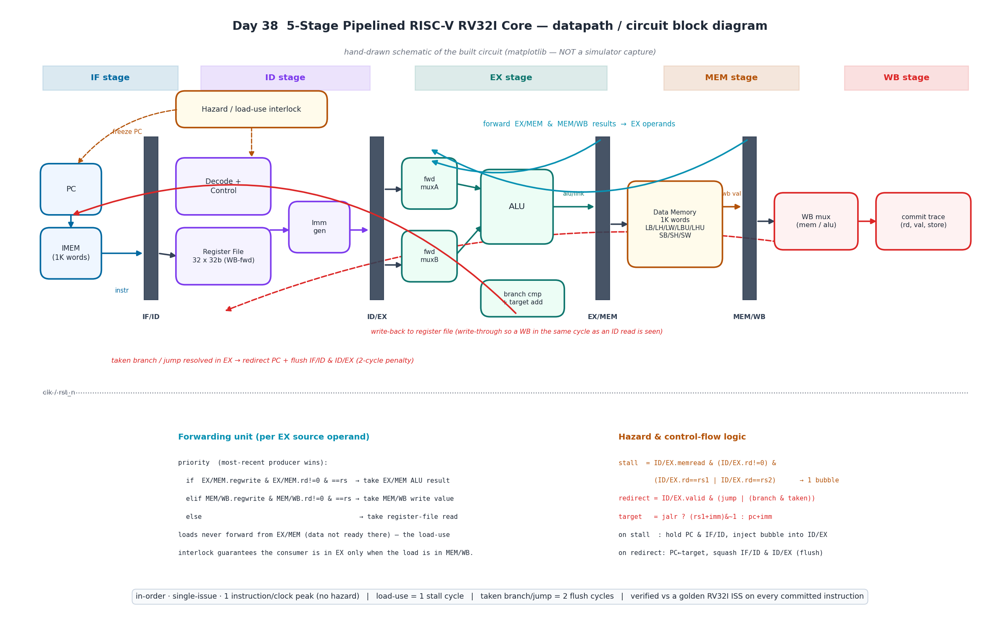
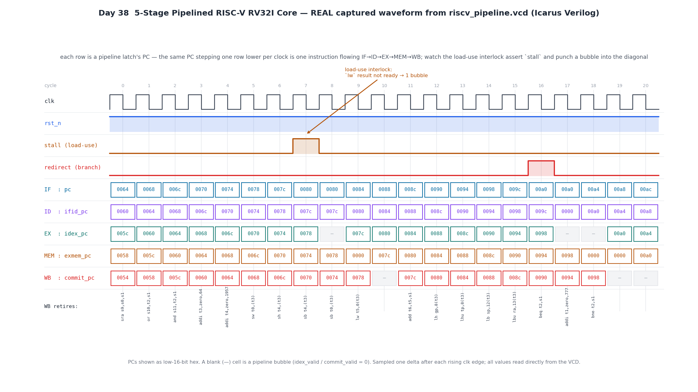

# Day 38 — 5-Stage Pipelined RISC-V RV32I Integer Core

A synthesizable, in-order, single-issue **RISC-V RV32I** processor built as the
textbook **IF → ID → EX → MEM → WB** classic 5-stage pipeline — with a full
**data-forwarding network**, a **load-use hazard interlock**, and **branch/jump
resolution in the EX stage** with a pipeline flush. It is the canonical "put it
all together" RTL building block: a real CPU that fetches, decodes, executes,
accesses memory, and retires one instruction per clock at peak, and it is
**verified against an independent golden RV32I instruction-set simulator on
every committed instruction**.

Where the earlier days built individual blocks (ALUs, multipliers, FIFOs,
crypto cores, DSP datapaths), this day wires the whole control+datapath machine
that *sequences* such blocks — hazards, forwarding, and speculative fetch and
all.

---

## Overview

The core implements the full **RV32I base integer instruction set** (user
level; no CSR/FENCE/ECALL):

| Group | Instructions |
|-------|--------------|
| Upper-immediate | `LUI` `AUIPC` |
| Jumps | `JAL` `JALR` |
| Branches | `BEQ` `BNE` `BLT` `BGE` `BLTU` `BGEU` |
| Loads | `LB` `LH` `LW` `LBU` `LHU` |
| Stores | `SB` `SH` `SW` |
| Register-immediate | `ADDI` `SLTI` `SLTIU` `XORI` `ORI` `ANDI` `SLLI` `SRLI` `SRAI` |
| Register-register | `ADD` `SUB` `SLL` `SLT` `SLTU` `XOR` `SRL` `SRA` `OR` `AND` |

Instruction and data memories are on-chip single-cycle arrays so the core is a
self-contained, simulate-able unit. A **commit-trace port** exposes the
architectural retirement of each instruction at WB so the testbench (or any
external checker) can validate the machine cycle-accurately.

---

## Features

- **Classic 5-stage pipeline** — IF, ID, EX, MEM, WB with four pipeline
  register banks (IF/ID, ID/EX, EX/MEM, MEM/WB), 1 instruction/clock at peak.
- **Full forwarding network** — EX operands are bypassed from the **EX/MEM** and
  **MEM/WB** stages (most-recent producer wins), so back-to-back dependent ALU
  instructions never stall.
- **Load-use hazard interlock** — a load feeding the very next instruction
  injects exactly **one** bubble (freeze PC + IF/ID, bubble ID/EX); the consumer
  then forwards the loaded value from MEM/WB.
- **Branch/jump resolution in EX** — taken branches and `JAL`/`JALR` redirect the
  PC and **flush the two younger instructions** (2-cycle control penalty). `JALR`
  target is `(rs1+imm) & ~1`.
- **Write-through register file** — a WB write in the same cycle as an ID read is
  observed, eliminating the WB→ID hazard.
- **Every load/store width** — sign/zero-extended `LB/LH/LBU/LHU`, full `LW`, and
  byte-enabled `SB/SH/SW` (read-modify-write of the addressed word).
- **Reset-safe, latch-free, `default_nettype none`**, parameterized memory
  depths, no vendor primitives.

---

## Parameters

| Parameter | Default | Meaning |
|-----------|---------|---------|
| `IMEM_WORDS` | `1024` | instruction memory depth (32-bit words) |
| `DMEM_WORDS` | `1024` | data memory depth (32-bit words) |

## Ports

| Port | Dir | Width | Description |
|------|-----|-------|-------------|
| `clk` | in | 1 | clock |
| `rst_n` | in | 1 | active-low synchronous-style reset |
| `commit_valid` | out | 1 | a real (non-bubble) instruction retired this cycle |
| `commit_pc` | out | 32 | its program counter |
| `commit_instr` | out | 32 | its raw encoding |
| `commit_reg_we` | out | 1 | it writes a GP register (`rd != x0`) |
| `commit_rd` | out | 5 | destination register |
| `commit_wdata` | out | 32 | value written back |
| `commit_mem_we` | out | 1 | it performed a store |
| `commit_mem_addr` | out | 32 | store byte address |
| `commit_mem_wdata` | out | 32 | store data (`rs2`, pre-mask) |
| `commit_funct3` | out | 3 | funct3 (load/store width) |

The program is loaded by the testbench directly into the core's `imem` array
(and mirrored into the golden model). `dmem` starts cleared.

---

## Block diagram (ASCII)

```
      IF                 ID                  EX               MEM        WB
  +--------+   IF/ID  +----------+  ID/EX +---------+ EX/MEM +------+ MEM/WB +------+
  |  PC    |----||----| Decode + |---||---| fwd mux |---||---| Data |---||---| WB   |
  | IMEM   |    ||    | Control  |   ||   |   A / B |   ||   | Mem  |   ||   | mux  |
  +---+----+    ||    | RegFile  |   ||   |   ALU   |   ||   |LB..SW|   ||   +--+---+
      |         ||    | Imm gen  |   ||   | br cmp+ |   ||   +------+   ||      |
      |         ||    +----------+   ||   | target  |   ||              ||      v
      |                              ||   +----+----+                        register-file
      |   <----- redirect (taken branch / jump, flush IF/ID & ID/EX) -----+   write-back
      |                                    ^   ^                              (write-through)
      |                          forward   |   |   from EX/MEM & MEM/WB
   [ Hazard / load-use interlock: stall = ID/EX.memread & rd hits IF/ID sources ]
```

A detailed datapath / circuit schematic (forwarding paths, hazard logic, flush,
and the forwarding-priority & control equations) is below.



*Hand-drawn schematic of the built circuit (matplotlib — **not** a simulator
capture): the five stages, four pipeline register banks, the EX/MEM & MEM/WB
forwarding paths into the EX operand muxes, the load-use interlock, and the
EX-stage branch resolution that redirects the PC and flushes the two younger
instructions.*

---

## Simulation timing



***Real captured waveform*** — parsed directly from `riscv_pipeline.vcd`, which
is written by the Icarus Verilog run of `tb_riscv_pipeline` (this is **not** a
hand-drawn mock-up). Each row is a pipeline latch's PC, so the **same PC
stepping one row lower every clock** is a single instruction advancing
IF → ID → EX → MEM → WB — the pipeline "diagonal". The window is auto-centred on
the first **load-use interlock**: watch `stall` assert, freeze the front of the
pipe, and punch a one-cycle **bubble** into the diagonal (the blank `—` cells,
where `idex_valid`/`commit_valid` = 0). A few cycles later a taken branch raises
`redirect`, and its two-cycle flush shows up as fresh bubbles. The bottom row
disassembles the instruction retiring at WB each cycle — matching the program
exactly (`… sw, sh, sb, lw, add, lh, lhu, lb, lbu, beq, bne …`).

---

## How it works

**Fetch (IF).** The PC indexes `imem`; the next PC is `pc+4`, the EX-stage
`redirect` target, or held (on a stall). The fetched instruction and PC latch
into IF/ID.

**Decode (ID).** A combinational decoder cracks the opcode into control signals
(reg-write, mem-read/write, ALU op, operand selects, branch/jump/link flags) and
generates the type-correct immediate (I/S/B/U/J). The **write-through** register
file reads `rs1`/`rs2`, bypassing a same-cycle WB. All of this latches into
ID/EX.

**Execute (EX).** The **forwarding unit** compares the ID/EX source registers
against the EX/MEM and MEM/WB destinations and selects, per operand, the
freshest value (EX/MEM result → MEM/WB value → register file). The ALU computes
`ADD/SUB/SLL/SLT/SLTU/XOR/SRL/SRA/OR/AND`; `LUI`/`AUIPC` fold into the ALU
(`0+imm` / `pc+imm`) and jumps carry `pc+4` as the link value. In parallel a
comparator resolves the branch condition and an adder forms the target
(`pc+imm`, or `(rs1+imm)&~1` for `JALR`). A taken branch or any jump asserts
`redirect`, which repoints the PC and **flushes IF/ID and ID/EX**.

**Memory (MEM).** Loads read `dmem` combinationally and sign/zero-extend by
width; stores do a byte-enabled read-modify-write. The write-back value is the
load data or the ALU/link result.

**Write-back (WB).** The value writes the register file (skipping `x0`) and the
architectural result is published on the **commit trace** for checking.

**Hazards.** *Data* hazards are resolved by forwarding, except the **load-use**
case (a load feeding the next instruction), which the hazard unit catches in ID
and covers with a single stall so the consumer forwards from MEM/WB. *Control*
hazards are resolved by the EX-stage flush (2-cycle penalty). A load to `x0` and
writes to `x0` are correctly treated as no-ops.

---

## Run it

```bash
# Icarus Verilog (default)
make            # or: make icarus

# other simulators
make verilator
make vcs
make questa

# regenerate the figures from the captured VCD + model
make gen
```

Expected tail of the Icarus run:

```
Day 38  5-stage pipelined RV32I core
  instructions retired : 1575
  checks performed     : 7127
  mismatches           : 0
RESULT: *** PASS ***
```

---

## What the testbench checks

`tb_riscv_pipeline.sv` contains a **fully independent golden RV32I
instruction-set simulator** (a sequential interpreter) that runs in lockstep
with the DUT's commit trace. For **every** instruction the DUT retires it
verifies, against the ISS:

- **the committed PC equals the ISS program counter** — a direct proof that the
  DUT's control flow (every branch taken/not-taken, every `JAL`/`JALR` target)
  matches the ISA;
- the committed **raw encoding** equals what the ISS fetched;
- the **register write-back** (`rd`, value, write-enable — including `x0`
  suppression) matches;
- any **store** (address, width, data) matches, and is applied to the golden
  memory.

The program mixes **directed coverage** — all upper-immediate / ALU / shift ops,
every load & store width, a **load-use hazard** (`lw` → dependent `add`),
not-taken and taken branches, a **backward loop** (sum 1..10), and a
**`JAL`/`JALR` call+return** that forces link-value and return-address forwarding
— with a **300-instruction randomized ALU stream** that hammers the forwarding
network and the interlock. After the run it also compares the **entire DUT
register file and data-memory window** against the golden model.

Result: **1,575 instructions retired, 7,127 checks, 0 mismatches.**

> **Note on the waveform image:** it is a genuine capture parsed from the
> `riscv_pipeline.vcd` produced by the Icarus Verilog simulation — not a
> hand-drawn timing diagram. The separate *block diagram* is explicitly a
> hand-drawn schematic of the circuit (so labelled), not a simulator screenshot.
