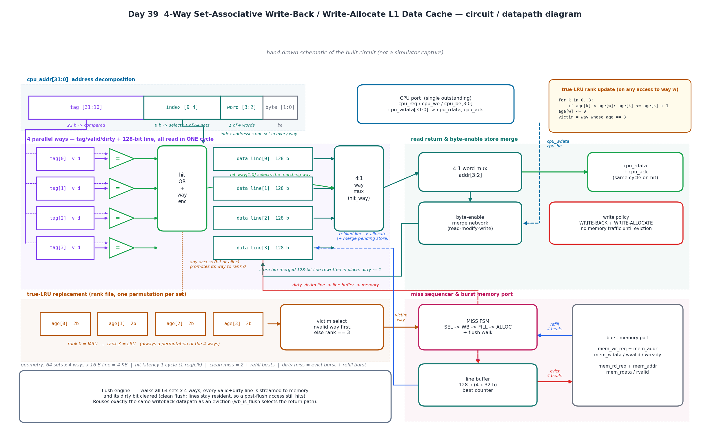
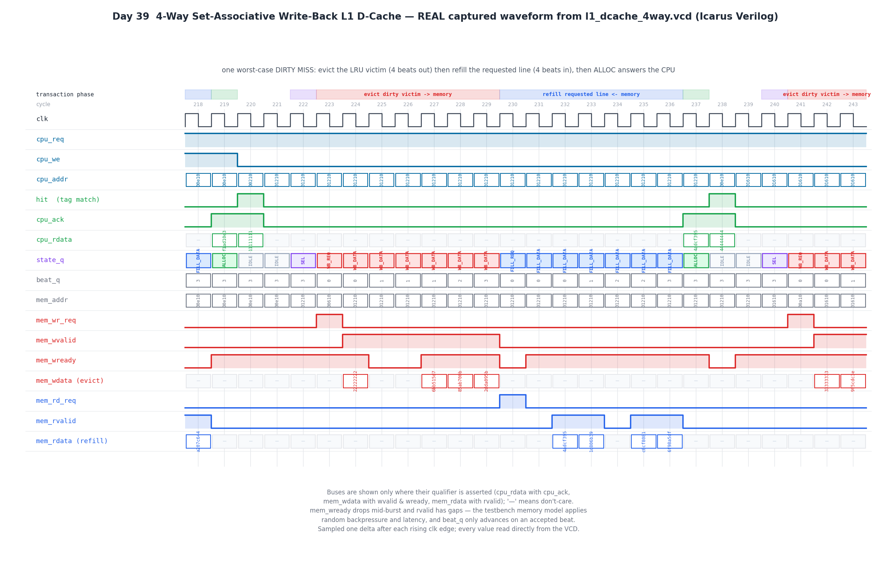

# Day 39 — 4-Way Set-Associative Write-Back L1 Data Cache

A synthesizable **4-way set-associative L1 data cache** with **true-LRU**
replacement, a **write-back / write-allocate** store policy with byte-enable
granularity, **line-burst** eviction and refill over a backpressured memory
port, and a **flush engine** that walks the whole tag array and makes main
memory architecturally coherent again.

Day 38 built the RISC-V core that *issues* loads and stores; this day builds the
block that actually *feeds* it. It is where a design stops being a datapath and
starts being a memory system: four ways compared in parallel in a single cycle,
a replacement policy that has to remember access order, dirty state that must
never be lost, and a hard-sequenced miss FSM that has to interleave an eviction
burst and a refill burst on one shared memory port without ever dropping a beat.

The whole thing is verified against an **independent golden flat memory** on
every single access, plus a whole-memory comparison after each flush — so the
cache is not just "self-consistent", it is proven to be **architecturally
invisible**.

---

## Overview

| | |
|---|---|
| Geometry | 64 sets × 4 ways × 16 B lines = **4 KB** |
| Tag / index / offset | 22 b tag, 6 b index, 2 b word, 2 b byte |
| Hit latency | **1 cycle** — combinational tag compare + way mux + word mux |
| Hit throughput | **1 request/clock**, back-to-back, no wait states |
| Replacement | **true LRU** (2-bit age rank per way, a permutation per set) |
| Write policy | **write-back + write-allocate**, byte-enable granular |
| Clean miss | `SEL` → refill burst → `ALLOC` |
| Dirty miss | `SEL` → **eviction burst** → refill burst → `ALLOC` |
| Maintenance | clean flush: writes back every dirty line, lines stay resident |

The CPU port is a simple single-outstanding request/ack interface: the requester
holds `cpu_req` until it sees `cpu_ack`. On a hit, `cpu_ack` comes back in the
**same cycle** the address is presented, so a hit stream runs at one access per
clock. On a miss the ack is simply withheld while the FSM does the eviction and
the refill, then arrives with the data in the `ALLOC` cycle.

The memory port is line-granular: a 1-cycle `mem_rd_req` / `mem_wr_req` pulse
carries the line-aligned address, then `WORDS_PER_LINE` beats flow (word 0
first). Reads are paced by `mem_rvalid`, writes by `mem_wready` — the beat
counter only advances on an **accepted** beat, so arbitrary latency and
arbitrary backpressure are both handled.

---

## Features

- **Single-cycle 4-way lookup** — all four tags are compared in parallel against
  the presented address; the hit-OR drives a 4:1 way mux and then a 4:1 word mux
  selected by `addr[3:2]`, so `cpu_rdata` and `cpu_ack` are valid in the request
  cycle itself.
- **True LRU, not pseudo-LRU** — every way carries a 2-bit age rank, and the
  ranks in a set are always a permutation of `0..WAYS-1` (0 = MRU, 3 = LRU). Any
  access (hit *or* allocate) promotes its way to rank 0 and increments only the
  ways that were more recent. The victim is the way at rank `WAYS-1`.
- **Invalid-way-first victim selection** — a cold set fills all four ways before
  any eviction happens; only a fully valid set consults the LRU rank.
- **Write-back + write-allocate** — a store hit does a read-modify-write of the
  resident 128-bit line and sets `dirty`; **no memory traffic at all** until that
  line is evicted or flushed. A store *miss* refills the line first, then merges
  the pending store into the freshly filled line during `ALLOC`.
- **Byte-enable granularity** — `cpu_be[3:0]` merges 1/2/3/4 bytes anywhere in
  the addressed word, so `SB`/`SH`/`SW` all work without a read-modify-write from
  the CPU side.
- **Dirty-victim eviction burst** — the victim line is captured into a line
  buffer and streamed out word 0 first; the refill for the missing line only
  starts after the last eviction beat is accepted.
- **Backpressure- and latency-tolerant bursts** — `beat_q` advances only on
  `mem_wvalid && mem_wready` (writes) or `mem_rvalid` (reads), so the memory may
  stall or gap beats arbitrarily.
- **Clean flush engine** — `flush_req` walks all 64 sets × 4 ways and writes back
  every valid+dirty line through **the same writeback datapath** as an eviction
  (`wb_is_flush` just picks the return path), clearing the dirty bits. Lines stay
  valid, so a post-flush access still hits.
- **Performance event pulses** — `ev_hit`, `ev_miss`, `ev_wb` for external
  counters.
- **Reset-safe, latch-free, `default_nettype none`**, fully parameterized
  geometry, no vendor primitives.

---

## Parameters

| Parameter | Default | Meaning |
|-----------|---------|---------|
| `ADDR_W` | `32` | byte-address width |
| `DATA_W` | `32` | CPU word width (byte enables are `DATA_W/8`) |
| `WAYS` | `4` | associativity (power of 2) |
| `SETS` | `64` | number of sets (power of 2) |
| `WORDS_PER_LINE` | `4` | line size in words (power of 2) → 16 B lines |

Derived internally: `TAG_W = ADDR_W - log2(SETS) - log2(WORDS_PER_LINE) - log2(DATA_W/8)`,
`LINE_W = DATA_W * WORDS_PER_LINE`.

## Ports

| Port | Dir | Width | Description |
|------|-----|-------|-------------|
| `clk` | in | 1 | clock |
| `rst_n` | in | 1 | active-low reset (clears valid/dirty, seeds LRU ranks) |
| `cpu_req` | in | 1 | request valid — **hold until `cpu_ack`** |
| `cpu_we` | in | 1 | 1 = store, 0 = load |
| `cpu_addr` | in | 32 | byte address |
| `cpu_wdata` | in | 32 | store data |
| `cpu_be` | in | 4 | store byte enables |
| `cpu_rdata` | out | 32 | load data — valid in the cycle `cpu_ack` = 1 |
| `cpu_ack` | out | 1 | request retired this cycle |
| `flush_req` | in | 1 | pulse: write back all dirty lines |
| `flush_busy` | out | 1 | flush pending or in progress |
| `flush_done` | out | 1 | 1-cycle pulse when the walk completes |
| `mem_rd_req` | out | 1 | 1-cycle pulse: start a line read burst |
| `mem_wr_req` | out | 1 | 1-cycle pulse: start a line write burst |
| `mem_addr` | out | 32 | line-aligned burst address |
| `mem_wdata` | out | 32 | eviction beat (word 0 first) |
| `mem_wvalid` | out | 1 | eviction beat valid |
| `mem_wready` | in | 1 | memory accepts the beat |
| `mem_rdata` | in | 32 | refill beat (word 0 first) |
| `mem_rvalid` | in | 1 | refill beat valid |
| `ev_hit` | out | 1 | pulse: access hit |
| `ev_miss` | out | 1 | pulse: access missed |
| `ev_wb` | out | 1 | pulse: a dirty line was written to memory |

---

## Block diagram (ASCII)

```
 cpu_addr : | tag [31:10] | index [9:4] | word [3:2] | byte [1:0] |
                  |              |             |
                  |              v             |
                  |     one set in every way   |
                  v                            |
   +---------+ +---+                           |
   | tag[0] v|-| = |--+                        |
   | tag[1] v|-| = |--+   hit                  |     +--------+
   | tag[2] v|-| = |--+-> OR  --> hit_way -->  |     |4:1 word|--> cpu_rdata
   | tag[3] v|-| = |--+   enc         |        +---> |  mux   |    + cpu_ack
   +---------+ +---+                  v              +--------+    (same cycle)
   +---------------------+       +----------+             ^
   | data line[0..3] 128b|-----> |4:1 way   |-------------+
   +---------------------+       |   mux    |             |
        ^          ^             +----------+        +----------+
        |          |                                | byte-en  |<- cpu_wdata
        |          +--- store hit: merged line ---- | merge RMW|   cpu_be
        |               rewritten, dirty := 1       +----------+
        |
        |  +------------------+      +--------------+     +---------------+
        +--| age[0..3] ranks  |----->| victim select|---->|   MISS FSM    |
           | 0=MRU .. 3=LRU   |      | invalid 1st, |     | SEL->WB->FILL |
           +------------------+      | else rank==3 |     |    ->ALLOC    |
                                     +--------------+     +-------+-------+
                                                                  |
                              line buffer 128b <------------------+
                              |  ^                     evict 4 beats -> mem
                              |  +-------------------- refill 4 beats <- mem
                              +--> allocate into the victim way
```

A detailed circuit / datapath schematic (all four ways, the comparators and
muxes, the byte-enable merge network, the LRU rank file and victim selector, the
line buffer and the burst port, plus the LRU rank-update equations) is below.



*Hand-drawn schematic of the built circuit (matplotlib — **not** a simulator
capture): the address split, the four parallel tag/valid/dirty ways feeding the
hit-OR and the way mux, the word mux and the byte-enable read-modify-write path,
the true-LRU rank file with invalid-way-first victim selection, and the miss FSM
driving the shared line buffer for eviction and refill bursts.*

---

## Simulation timing



***Real captured waveform*** — parsed directly out of `l1_dcache_4way.vcd`,
which is written by the Icarus Verilog run of `tb_l1_dcache_4way` (this is
**not** a hand-drawn mock-up). Every level, bus value and state name in the
figure was read from the VCD.

The window is auto-centred on the first **dirty miss** — the worst-case
transaction — and it happens to land exactly on the testbench's true-LRU check,
so the policy is visible in the trace:

| cycle | what happens |
|-------|--------------|
| 220 | **hit** on `0x00210`, `cpu_rdata = 0x11111111`, acked in the same cycle — this promotes that way to MRU |
| 221 | request `0x01210` (same set, 5th distinct tag) → **miss** |
| 222 | `SEL` picks the victim |
| 223 | `WB_REQ` with `mem_addr = 0x00610` — **the true-LRU line, not the line just touched at cycle 220** (a FIFO/round-robin policy would have evicted `0x00210`) |
| 224–229 | 4 eviction beats; `mem_wready` drops mid-burst and `beat_q` correctly stalls (0,0,1,1,1,2,3) |
| 230 | `FILL_REQ` for `0x01210` |
| 231–236 | 4 refill beats with `mem_rvalid` gaps |
| 237 | `ALLOC` — line installed, `cpu_ack` + `cpu_rdata = 0x4adcf395` |
| 238 | next request **hits in that very next cycle** (`0x44444444`) — no dead cycle after a miss |
| 240–241 | the following miss evicts `0x00a10`, again the LRU line |

Buses are drawn only where their qualifier is asserted (`cpu_rdata` with
`cpu_ack`, `mem_wdata` with `wvalid && wready`, `mem_rdata` with `rvalid`); `—`
means don't-care. Values are sampled one delta after each rising clock edge.

---

## How it works

**Lookup (1 cycle).** `cpu_addr` is split into tag / index / word / byte. The
index reads one set out of all four ways simultaneously; four comparators check
`valid && tag == cpu_tag`. The hit-OR produces `hit` and encodes `hit_way`,
which selects the 128-bit line, and `addr[3:2]` selects the word out of it. All
of that is combinational, so from `S_IDLE` a hitting request is answered with
`cpu_ack` in the same cycle — including back-to-back, one per clock.

**Store hit.** The addressed word inside the resident line is merged with
`cpu_be` (a read-modify-write of the 128-bit line), the line is rewritten in
place, and `dirty` is set. Nothing goes to memory.

**True-LRU bookkeeping.** Each way holds a 2-bit rank; the four ranks in a set
are always a permutation of `0..3`. On any access to way `w`:

```
for k in 0..WAYS-1:
    if age[k] < age[w]:  age[k] <= age[k] + 1
age[w] <= 0
```

Only ways that were *more recently* used than `w` age; `w` becomes MRU. The
invariant (always a permutation) means there is exactly one way at rank
`WAYS-1`, and that way is the victim. Ranks are seeded to `0,1,2,3` at reset so
the invariant holds from cycle 0.

**Miss sequence.** The request is latched and the FSM runs:

| state | action |
|-------|--------|
| `S_SEL` | pick the victim — **lowest invalid way first**, else the way at rank `WAYS-1`; capture its tag → `wb_addr` and its data → the line buffer |
| `S_WB_REQ` | (only if the victim is valid **and** dirty) pulse `mem_wr_req` with the victim's line address |
| `S_WB_DATA` | stream the line buffer out, one word per accepted beat |
| `S_FILL_REQ` | pulse `mem_rd_req` with the *missing* line's address |
| `S_FILL_DATA` | write each `mem_rvalid` beat into the fill register |
| `S_ALLOC` | install tag + valid; if the pending request was a store, merge it into the filled line and set dirty, else store the line clean; promote the way to MRU; assert `cpu_ack` and return the word |

A clean or invalid victim skips the two writeback states entirely, so a cold
miss costs `SEL` + refill + `ALLOC` and only a *dirty* miss pays for the
eviction.

**Flush.** `flush_req` is latched into `flush_pend`. `S_IDLE` gives the flush
priority over new CPU requests (so it can never be starved by a hot loop), then
`S_FL_SCAN`/`S_FL_NEXT` walk every `(set, way)`. A valid+dirty line is pushed
through the exact same `S_WB_REQ`/`S_WB_DATA` states — `wb_is_flush` only
selects where they return to — and its dirty bit is cleared as the last beat is
accepted. Lines stay **valid**, so this is a clean flush: memory becomes
coherent without throwing away the working set.

---

## Run it

```bash
cd Day39
make            # Icarus Verilog (default)
make verilator  # Verilator
make vcs        # Synopsys VCS
make questa     # Questa / Xcelium
make gen        # regenerate both figures from the VCD
make waves      # open the VCD in GTKWave
```

Actual output of `make` (Icarus Verilog):

```
========================================================
Day 39  4-way set-associative write-back L1 data cache
  64 sets x 4 ways x 16 B lines = 4096 B cache
========================================================
  T1 cold read sweep                 8 compulsory misses, 32 words verified
  T2 warm re-read                    32/32 hits, zero memory bursts
  T3 back-to-back hit stream         16 words in 16 cycles (1 req/clk)
  T4 byte-enable store merging       partial writes read back OK
  T5 write-allocate store miss       line refilled + store merged
  T6 true-LRU victim #1              evicted 00000610 (LRU), not 00000210 (FIFO)
  T6 true-LRU victim #2              evicted 00000a10 (LRU)
  T7 clean flush                     all 4096 memory words match golden state
  T8 randomised soak                 600 mixed ops, 416 misses / 89 writebacks so far
  T8 post-soak flush                 all 4096 memory words match golden state
--------------------------------------------------------
Day 39  4-way set-associative write-back L1 D-cache
  hits / misses        : 289 / 416
  refill bursts        : 416
  writeback bursts     : 257
  checks performed     : 8612
  mismatches           : 0
RESULT: *** PASS ***
--------------------------------------------------------
```

---

## What the testbench checks

The testbench builds two independent references:

- a **behavioural burst main memory** with *randomised* read latency (0–3
  cycles), *randomised* gaps between refill beats, and *randomised* `mem_wready`
  backpressure on eviction beats — the only place data physically lives;
- a **golden flat memory** `gold[]`, updated on every store with the same byte
  enables and never touched by the cache. `mem[]` starts as an exact copy of it.

Every load is compared against `gold[]`, so the cache must be architecturally
indistinguishable from a flat memory no matter how lines migrate, merge, get
evicted or get written back. After each flush, **all 4096 memory words** are
compared against `gold[]` — that is what actually proves dirty-bit tracking and
the writeback path, since any lost or stale dirty line shows up as a mismatch.

| Test | What it proves |
|------|----------------|
| **T1** cold read sweep, 8 lines × 4 words | exactly 8 compulsory misses (one per line, not one per word) and all 32 words correct |
| **T2** re-read the same 8 lines | 32/32 hits, 0 misses, and **zero** memory bursts — a hit stream must be silent on the memory port |
| **T3** streaming hits | `cpu_req` held high with a new address every cycle: `cpu_ack` in **every** cycle, 16 words in 16 cycles |
| **T4** byte-enable stores | 2-byte, 1-byte, full-word and unaligned-byte-address stores merge correctly and read back |
| **T5** store miss | registers as a miss, refills the line, and the merged store is visible on read-back while the rest of the line came from memory |
| **T6** true LRU | 4 dirty lines fill a set, the **oldest** is then re-touched, and the next allocation must evict the *second*-oldest — the observed writeback address distinguishes true LRU from FIFO/round-robin. Repeated a second time. |
| **T7** clean flush | whole-memory compare vs `gold[]`, plus a follow-up access that must still **hit** (a clean flush may not invalidate) |
| **T8** randomised soak | 600 random loads/stores with random byte enables over a window **2× the cache size** — permanent conflict misses, evictions and writebacks — every load self-checked, then a final flush + whole-memory compare |

Plus a global timeout watchdog, and a VCD dump for the waveform figure.

**8612 checks, 0 mismatches, `RESULT: *** PASS ***`** under Icarus Verilog.
