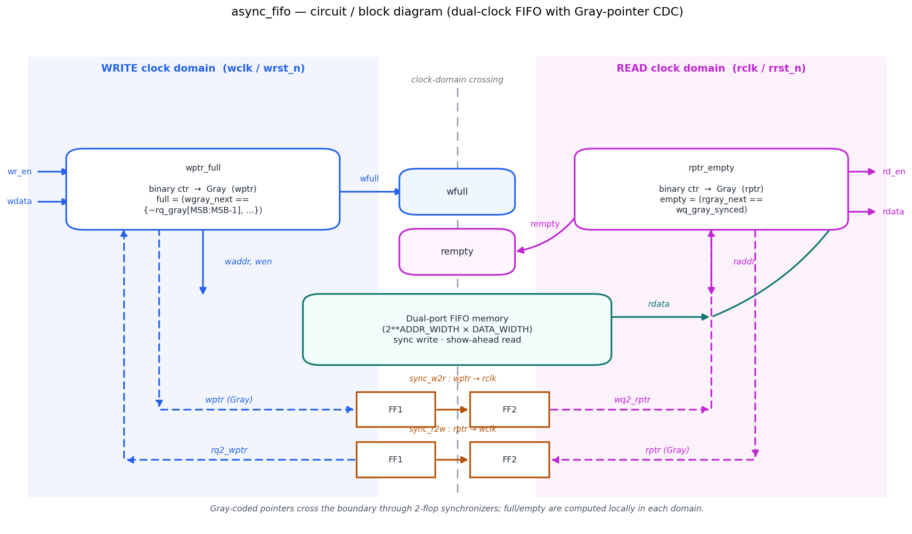
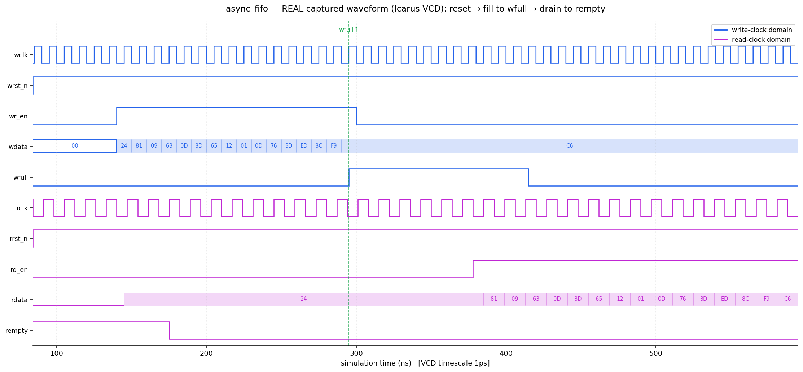

# Day 4 — Asynchronous (dual-clock) FIFO with Gray-pointer CDC

A **dual-clock FIFO**: the write port and the read port are driven by two
*independent, asynchronous* clocks. This is the canonical clock-domain-crossing
(CDC) building block — you reach for it any time data has to move between two
unrelated clock domains (e.g. a sensor/PHY clock and the core clock, or two
peripherals running off different PLLs).

The storage is the easy part. The hard part is generating the `full` and
`empty` flags *correctly* when the two pointers live in different clock domains
and can be sampled mid-transition. This design uses the classic solution
(Clifford Cummings, SNUG 2002):

- pointers are kept **both** in binary (for addressing and arithmetic) **and**
  in **Gray code** (for crossing the boundary). A Gray code changes exactly one
  bit per increment, so a value latched mid-flight is always either the old or
  the new pointer — never a corrupt in-between code.
- each pointer is carried into the opposite domain through a **two-flop
  synchronizer** to resolve metastability.
- `full` and `empty` are computed **locally** in each domain from the local
  pointer and the synchronized copy of the remote pointer.

Unlike Day 1's single-clock `sync_fifo`, everything here has to survive an
arbitrary phase/frequency relationship between `wclk` and `rclk`.

---

## Features

- **Truly asynchronous** write and read clocks, with **independent** active-low
  resets per domain (`wrst_n`, `rrst_n`).
- **Gray-coded pointer CDC** with two-flop synchronizers — single-bit-change
  guarantee makes flag generation glitch-free.
- **Conservative, safe flags**: `wfull` can only ever be pessimistic (never
  under-reports fullness) and `rempty` can only ever be pessimistic (never
  under-reports emptiness), so the FIFO never overflows or underflows across
  the crossing.
- **Show-ahead (first-word-fall-through) read**: `rdata` presents the head word
  whenever `rempty` is low; assert `rd_en` to pop it.
- **Parameterized** data width and depth (`DATA_WIDTH`, `ADDR_WIDTH` →
  depth = 2^ADDR_WIDTH).
- Reset-safe (empty out of reset), and lint-friendly
  (`` `default_nettype none ``, no latches, no unused nets, one flip-flop bank
  per pointer).

---

## Parameters

| Parameter    | Default | Description                                             |
|--------------|---------|---------------------------------------------------------|
| `DATA_WIDTH` | 8       | Width of each FIFO word                                 |
| `ADDR_WIDTH` | 4       | Address width; FIFO **depth = 2^ADDR_WIDTH** (16)       |

## Ports

| Port     | Dir | Domain | Width        | Description                                        |
|----------|-----|--------|--------------|----------------------------------------------------|
| `wclk`   | in  | write  | 1            | Write clock                                        |
| `wrst_n` | in  | write  | 1            | Active-low async reset (write domain)              |
| `wr_en`  | in  | write  | 1            | Write request — data pushed when `wr_en & !wfull`  |
| `wdata`  | in  | write  | `DATA_WIDTH` | Write data                                         |
| `wfull`  | out | write  | 1            | FIFO full (in the write clock domain)              |
| `rclk`   | in  | read   | 1            | Read clock                                         |
| `rrst_n` | in  | read   | 1            | Active-low async reset (read domain)               |
| `rd_en`  | in  | read   | 1            | Read request — data popped when `rd_en & !rempty`  |
| `rdata`  | out | read   | `DATA_WIDTH` | Read data (valid whenever `!rempty`, show-ahead)   |
| `rempty` | out | read   | 1            | FIFO empty (in the read clock domain)              |

---

## Block diagram (ASCII)

```
        WRITE clock domain (wclk)                 READ clock domain (rclk)
   ┌───────────────────────────┐   :CDC:   ┌───────────────────────────┐
wr_en ─▶│                       │   :   :   │                       │◀─ rd_en
wdata ─▶│  wptr_full            │   :   :   │           rptr_empty  │──▶ rdata
        │  bin ctr → Gray(wptr) │   :   :   │  Gray(rptr) ← bin ctr │
        │  wfull ───────────────│──▶ wfull  │  rempty ──────────────│──▶ rempty
        └──────┬──────▲─────────┘   :   :   └──────┬──────▲─────────┘
    waddr,wen  │      │ rq2_wptr    :   :   raddr  │      │ wq2_rptr
               ▼      └────────┐    :   :          ▼      └────────┐
        ┌───────────────┐  ┌──┴──┐ :   : ┌──┴──┐          ┌──────────────┐
        │  FIFO memory  │  │ FF1 │─│FF2│ │ FF1 │─│FF2│    │ (sync_w2r)   │
        │ 2^AW × DWIDTH │  └─────┘ (sync_r2w)  └─────┘     └──────────────┘
        └───────┬───────┘                    ▲
                └───────── rdata ────────────┘
```

---

## Circuit / block diagram



*Schematic of the built circuit. Two clock-domain bands (write in blue, read in
magenta) straddle a dual-port memory. Each domain owns a binary+Gray pointer
block (`wptr_full`, `rptr_empty`) that generates its local flag; the two Gray
pointers cross the boundary through the `sync_w2r` and `sync_r2w` two-flop
synchronizers (dashed). Hand-drawn with matplotlib (`gen_block.py`) — this is a
structural diagram, not a simulator screenshot.*

---

## Simulation timing



*A **real captured waveform** — rendered directly from `async_fifo.vcd`, the VCD
produced by running the testbench under **Icarus Verilog** (`make icarus`). A
Python VCD parser (`gen_waveform.py`) extracts the directed fill/drain phase and
plots it with matplotlib; it is **not** a hand-drawn mock-up. (The block diagram
above *is* hand-drawn — only this timing image is captured from a real sim.)*

The window (write domain in blue, read domain in magenta) shows the directed
**fill-to-full → drain-to-empty** phase with the two independent clocks running
concurrently:

- After reset, `wr_en` goes high and 16 words (`24, 81, 09, 63, …, F9`) are
  pushed on `wclk`; `wdata` steps through each value.
- `wfull` asserts (green marker) exactly when the FIFO holds all 16 words, and
  `wr_en` drops — no overflow.
- Later, in the read domain, `rd_en` goes high and `rdata` streams the **same
  words back out in order** (`24, 81, 09, …`), confirming FIFO ordering across
  the clock boundary.
- `rempty` re-asserts (amber marker) once the last word is popped — no underflow.

---

## How it works

- **Pointers are one bit wider than the address.** With `ADDR_WIDTH = N`, each
  pointer is `N+1` bits. The extra MSB distinguishes "full" from "empty" when
  the low `N` address bits are equal: same pointers → empty; pointers equal
  except for a wrap in the top bit(s) → full.
- **Binary for addressing, Gray for crossing.** `bin_next = bin + inc` drives
  the memory address; `gray_next = (bin_next >> 1) ^ bin_next` is what actually
  crosses the domain. Because consecutive Gray codes differ in one bit, the
  receiving synchronizer can only ever latch the old or new value.
- **Two-flop synchronizers.** `sync_w2r` carries `wptr` (Gray) into the read
  domain as `rq2_wptr`; `sync_r2w` carries `rptr` (Gray) into the write domain
  as `wq2_rptr`. Two flops give the metastable first stage a full cycle to
  settle.
- **Empty** (read domain): `rempty = (rgray_next == rq2_wptr)` — the read
  pointer has caught up to the (synchronized) write pointer.
- **Full** (write domain): `wfull = (wgray_next == {~rq2_wptr[MSB:MSB-1],
  rq2_wptr[MSB-2:0]})` — the write pointer has wrapped exactly one extra time
  relative to the read pointer. The top-two-bit inversion is the Gray-code way
  of testing "one lap ahead".
- **Latency is safe by construction.** Because each domain sees a *delayed*
  copy of the other pointer, `wfull` may assert a hair early and `rempty` may
  assert a hair early — both conservative. Neither can ever be optimistic, so
  overflow/underflow are impossible.

---

## Files

| File                          | Description                                             |
|-------------------------------|---------------------------------------------------------|
| `async_fifo.sv`               | RTL: top + `sync_ff`, `fifo_mem`, `wptr_full`, `rptr_empty` |
| `tb_async_fifo.sv`            | Self-checking testbench (dual clock, golden-queue model)|
| `Makefile`                    | Run targets for common simulators                       |
| `gen_waveform.py`             | VCD → PNG renderer (produces the captured waveform)     |
| `gen_block.py`                | Draws the circuit / block diagram                       |
| `docs/async_fifo_block.png`   | Circuit / block diagram (matplotlib)                    |
| `docs/async_fifo_waveform.png`| Real captured waveform (from the Icarus VCD)            |

---

## Run the simulation

```bash
# Icarus Verilog (open source) — used to capture the waveform above
make icarus

# Verilator (open source)
make verilator

# Synopsys VCS
make vcs

# Siemens Questa / ModelSim
make questa
```

Expected output ends with:

```
Checks performed : 1259
Errors           : 0
RESULT: *** PASS ***
```

An `async_fifo.vcd` waveform is also produced for viewing in GTKWave. To
regenerate the PNG from that VCD:

```bash
python3 gen_waveform.py async_fifo.vcd docs/async_fifo_waveform.png
```

> Verified: run under **Icarus Verilog** — **1259 checks, 0 errors,
> `RESULT: *** PASS ***`.**

---

## What the testbench checks

Two independent clock generators (re-skewed per phase) drive the write and read
ports. A **golden reference model** — an unbounded SystemVerilog queue — records
every accepted write in order; every accepted read is checked against the front
of that queue, so the scoreboard is completely independent of the DUT internals.

Invariants enforced continuously:

1. **Data integrity / ordering** — every read returns the *oldest* not-yet-read
   written word (`rdata` must equal `model.pop_front()`).
2. **No overflow** — the model never exceeds `DEPTH` entries; if it did, `wfull`
   failed to block a write.
3. **No underflow** — a read never fires while the model is empty; `rempty` must
   have gated it.
4. **Reset** — `rempty` high and `wfull` low immediately after reset.
5. **Exact boundaries** — a directed *fill-to-full* accepts exactly `DEPTH`
   words and asserts `wfull`; a directed *drain-to-empty* returns exactly those
   words and asserts `rempty`.

Stimulus:

- **Directed**: reset checks, fill-to-full, drain-to-empty (exact flag edges).
- **Randomized**: independent random `wr_en`/`rd_en` streams run under
  **writer-faster** clocks (stresses `wfull`) and then **reader-faster** clocks
  (stresses `rempty`), each followed by a full drain so every word is checked.
- A global **timeout** backstop and a **VCD dump** are included.

> CDC note: after traffic stops, the directed tasks deliberately wait a few
> destination-clock cycles for the last pointer update to finish crossing the
> two-flop synchronizer before sampling `wfull`/`rempty` — otherwise a
> just-written word may not yet be visible on the read side. This models exactly
> how real firmware must treat these flags, and is a property of asynchronous
> FIFOs, not a DUT defect.
