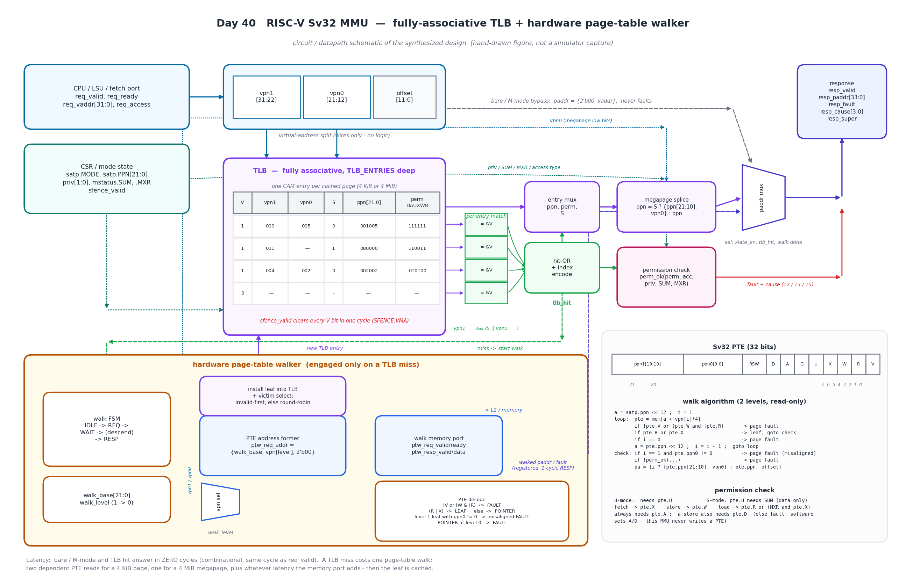
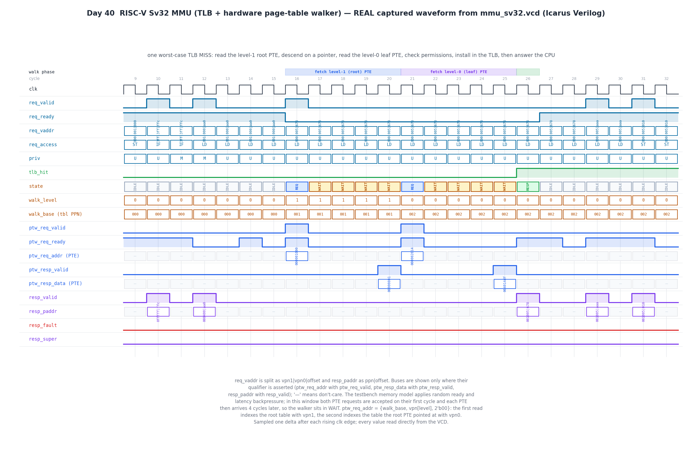

# Day 40 — RISC-V Sv32 MMU: TLB + Hardware Page-Table Walker

A synthesizable **RISC-V Sv32 memory-management unit**: a fully-associative
**TLB** that translates in **zero cycles** on a hit, backed by a **hardware
page-table walker** that reads the real two-level page table out of memory on a
miss, and a **permission-check block** that enforces the full privileged-spec
access rules (U/S separation, `SUM`, `MXR`, `A`/`D`, execute/read/write).

[Day 38](../Day38) built the RISC-V core that issues loads, stores and fetches;
[Day 39](../Day39) built the cache that feeds it. This day builds the block that
sits *in front of* both and decides what an address even **means**. It is where
a design stops being a memory system and starts being an **operating-system
substrate**: every access now has to be looked up in a CAM, and on a miss the
hardware itself has to go walk a tree in memory — a multi-cycle, data-dependent,
backpressured traversal whose outcome may be a legal physical address or a page
fault that the OS has to handle.

The interesting part is not the address arithmetic; it is that **paging is a
protection mechanism**, so almost every line of it is a corner case. A valid PTE
can still be illegal. A leaf at the wrong level can be illegal. A page the
supervisor owns is illegal for user code, and a page *user* code owns is illegal
for the supervisor too — unless `SUM` is set, and never for instruction fetch. An
execute-only page is unreadable unless `MXR` is set. All of it is verified
against an **independent software walker** on every single translation.

---

## Overview

| | |
|---|---|
| Architecture | RISC-V **Sv32** (32-bit VA → 34-bit PA), privileged spec |
| Translation modes | `satp.MODE=0` bare, M-mode bypass, Sv32 paging |
| Page sizes | **4 KiB** (level-0 leaf) and **4 MiB** megapage (level-1 leaf) |
| TLB | fully associative, `TLB_ENTRIES` deep, caches both page sizes |
| Hit latency | **0 cycles** — combinational CAM + permission check, answered in the same cycle as `req_valid` |
| Miss cost | one page-table walk: **2 dependent PTE reads** (4 KiB) or **1** (megapage), plus memory latency |
| Replacement | invalid-entry-first, then **round-robin** |
| Invalidation | `sfence_valid` clears every valid bit in **one cycle** (SFENCE.VMA) |
| Faults | instruction (12), load (13), store/AMO (15) page faults |
| `A`/`D` policy | never written by hardware — a clear `A` (or clear `D` on a store) faults so software sets it |
| Walk port | decoupled `valid`/`ready` request + `valid` response, fully backpressure-tolerant |
| Verification | golden software walker, 647 translations, 25 configs (5 TLB depths × 5 seeds) all pass |

---

## Features

- **Zero-cycle hit path.** A TLB hit needs no state change: the CAM compare, the
  entry mux, the megapage PPN splice and the whole permission check are
  combinational, so `resp_valid` and `resp_paddr` come back in the *same* cycle
  the CPU raises `req_valid`. Back-to-back hits sustain one translation per
  clock with no wait states.
- **Real two-level hardware walk.** On a miss the walker forms
  `ptw_req_addr = {walk_base, vpn[level], 2'b00}`, reads the PTE, classifies it,
  and either descends (pointer) or terminates (leaf / fault). It never assumes a
  fixed latency: it waits for `ptw_req_ready` on the request and for
  `ptw_resp_valid` on the data.
- **Megapage (4 MiB superpage) support.** A level-1 leaf is cached as a single
  TLB entry that matches on `vpn1` alone and covers 4 MiB; the physical address
  is formed by splicing `vpn0` into the low PPN bits. A level-1 leaf whose
  `ppn0 != 0` is a **misaligned superpage** and faults, exactly as the spec
  requires.
- **Full permission model.** `perm_ok()` implements U/S separation, `mstatus.SUM`
  (supervisor access to user pages — data only, *never* fetch), `mstatus.MXR`
  (loads from execute-only pages), per-access-type `X`/`W`/`R` checks, and the
  `A`/`D` requirements. The function is **pure** — every input is an explicit
  argument — so it is correct both in synthesis and in a continuous assign.
- **Correct fault taxonomy.** `resp_cause` returns 12/13/15 by access type, and
  every terminating condition routes to it: invalid PTE, the reserved `W && !R`
  encoding, a pointer PTE at the last level, a misaligned superpage, and any
  permission or `A`/`D` violation.
- **Bare and M-mode bypass.** When `satp.MODE = 0` or the core is in M-mode the
  MMU identity-maps in zero cycles and can never fault.
- **SFENCE.VMA.** A one-cycle pulse invalidates the entire TLB, and an install
  racing with the fence is suppressed so a stale entry cannot survive it.
- **Parameterized and swept.** `TLB_ENTRIES` is free (verified at 2, 4, 8, 16
  and 32); the index width is derived with `$clog2`.

---

## Parameters

| Parameter | Default | Description |
|---|---|---|
| `TLB_ENTRIES` | `8` | Number of fully-associative TLB entries. Any value ≥ 2; need not be a power of two. Index width is derived as `$clog2(TLB_ENTRIES)`. |

Derived locally:

| Local | Value | Description |
|---|---|---|
| `IDXW` | `$clog2(TLB_ENTRIES)` | TLB entry-index width |
| `PRIV_U/S/M` | `0 / 1 / 3` | privilege-mode encodings |
| `ACC_LOAD/STORE/FETCH` | `0 / 1 / 2` | `req_access` encodings |
| `CAUSE_*_PF` | `12 / 13 / 15` | fetch / load / store page-fault causes |

---

## Ports

### Clock and reset

| Port | Dir | Width | Description |
|---|---|---|---|
| `clk` | in | 1 | rising-edge clock |
| `rst_n` | in | 1 | asynchronous active-low reset |

### CSR / mode configuration

| Port | Dir | Width | Description |
|---|---|---|---|
| `satp_mode` | in | 1 | `1` = Sv32 paging enabled, `0` = bare (identity) |
| `satp_ppn` | in | 22 | physical page number of the root page table |
| `priv` | in | 2 | current privilege mode (`PRIV_U`/`PRIV_S`/`PRIV_M`) |
| `mstatus_sum` | in | 1 | permit S-mode **data** access to `U=1` pages |
| `mstatus_mxr` | in | 1 | make eXecutable Readable (loads allowed from `X`-only pages) |
| `sfence_valid` | in | 1 | one-cycle pulse: invalidate the whole TLB (SFENCE.VMA) |

### CPU translation request

| Port | Dir | Width | Description |
|---|---|---|---|
| `req_valid` | in | 1 | a translation request is being presented |
| `req_vaddr` | in | 32 | virtual address `{vpn1[9:0], vpn0[9:0], offset[11:0]}` |
| `req_access` | in | 2 | `ACC_LOAD` / `ACC_STORE` / `ACC_FETCH` |
| `req_ready` | out | 1 | MMU can accept a request (low while a walk is in flight) |

### CPU translation response

| Port | Dir | Width | Description |
|---|---|---|---|
| `resp_valid` | out | 1 | response is valid this cycle |
| `resp_paddr` | out | 34 | translated physical address (valid when `!resp_fault`) |
| `resp_fault` | out | 1 | the access raises a page fault |
| `resp_cause` | out | 4 | `12` fetch / `13` load / `15` store page fault; `0` when no fault |
| `resp_super` | out | 1 | the leaf was a 4 MiB megapage |

### Page-table-walk memory port

| Port | Dir | Width | Description |
|---|---|---|---|
| `ptw_req_valid` | out | 1 | walker is requesting a PTE read |
| `ptw_req_addr` | out | 34 | PTE physical address, always 4-byte aligned |
| `ptw_req_ready` | in | 1 | memory accepted the request |
| `ptw_resp_valid` | in | 1 | `ptw_resp_data` holds the requested PTE |
| `ptw_resp_data` | in | 32 | the PTE |

### Performance counters (one-cycle pulses)

| Port | Dir | Width | Description |
|---|---|---|---|
| `perf_tlb_hit` | out | 1 | a translated request hit in the TLB |
| `perf_tlb_miss` | out | 1 | a translated request missed and started a walk |
| `perf_fault` | out | 1 | a response was a page fault |

---

## Sv32 formats

```
 virtual address (32 b)          physical address (34 b)
 +--------+--------+--------+    +----------------+--------+
 |  vpn1  |  vpn0  | offset |    |    ppn[21:0]   | offset |
 | 31..22 | 21..12 | 11..0  |    |     33..12     | 11..0  |
 +--------+--------+--------+    +----------------+--------+

 page-table entry (32 b)
 +------------+-----------+-----+---+---+---+---+---+---+---+---+
 | ppn1 19:10 | ppn0 9:0  | RSW | D | A | G | U | X | W | R | V |
 |   31..20   |   19..10  | 9:8 | 7 | 6 | 5 | 4 | 3 | 2 | 1 | 0 |
 +------------+-----------+-----+---+---+---+---+---+---+---+---+
```

---

## Block diagram (ASCII)

```
 req_vaddr : | vpn1 [31:22] | vpn0 [21:12] | offset [11:0] |
                    |              |               |
                    v              v               |
        +-----------------------------------+      |
        |  TLB - fully associative CAM      |      |
        |  V | vpn1 | vpn0 | S | ppn | perm |      |
        |  V | vpn1 | vpn0 | S | ppn | perm |      |
        |    ...  (TLB_ENTRIES deep) ...    |      |
        +-----------------------------------+      |
              |  each entry -> comparator          |
              v                                    |
        +-----------+      +--------------+         |
        | = && V x N|----->| hit-OR +     |         |
        +-----------+      | index encode |         |
              |            +------+-------+         |
              |  entry mux        | tlb_hit         |
              v                   |                 |
        +-------------+           |                 |
        | ppn, perm, S|           |                 |
        +------+------+           |                 |
               |                  |                 |
               v                  v                 v
     +------------------+   +---------------+   +--------+
     | megapage splice  |   | permission    |   |        |
     | S ? {ppn[21:10], |   | check         |   |        |
     |      vpn0} : ppn |   | perm_ok(perm, |   |        |
     +---------+--------+   |  acc, priv,   |   |        |
               |            |  SUM, MXR)    |   |        |
               |            +-------+-------+   |        |
               |                    | fault     |        |
               v                    v           v        |
          +---------------------------------------+      |
          |  paddr mux  <- bare/M-mode: {2'b00,va}|------+
          +------------------+--------------------+
                             v
                 resp_valid / resp_paddr / resp_fault
                 resp_cause / resp_super

  ---- on a miss: hardware page-table walker ------------------------------

   miss ->  +-----------+     walk_base[21:0], walk_level (1 -> 0)
            | walk FSM  |            |
            | IDLE      |            v
            |  -> REQ   |     +--------------------------------+
            |  -> WAIT  |---->| ptw_req_addr =                 |
            |  -> RESP  |     | {walk_base, vpn[level], 2'b00} |----> memory
            +-----+-----+     +--------------------------------+
                  ^                          |  ptw_resp_data
                  |                          v
                  |            +---------------------------------+
                  |            | PTE decode                      |
                  |            |  !V or (W & !R)      -> FAULT   |
                  |            |  (R | X)             -> LEAF    |
                  |            |  else                -> POINTER |
                  |            |  L1 leaf, ppn0 != 0  -> FAULT   |
                  |            |  POINTER at level 0  -> FAULT   |
                  |            +----------------+----------------+
                  |   pointer: base := ppn,     | leaf & perm_ok
                  +---- level := 0, re-REQ      v
                                   +----------------------------+
                                   | install into TLB           |
                                   | victim: invalid-first,     |
                                   |         else round-robin   |
                                   +----------------------------+
```

A detailed circuit / datapath schematic (the CAM entries and their comparators,
the hit-OR and entry mux, the megapage splice, the permission block and its CSR
fan-in, the bypass mux, and the whole walker with the PTE address former, PTE
decoder and victim selector, plus the PTE bit layout, walk algorithm and
permission equations) is below.



*Hand-drawn schematic of the built circuit (matplotlib — **not** a simulator
capture): the virtual-address split, the fully-associative TLB CAM with
per-entry `vpn` comparators feeding the hit-OR and the entry mux, the megapage
PPN splice, the permission check driven by `priv`/`SUM`/`MXR`, the bare/M-mode
bypass on the response path, and the page-table walker with its
`walk_base`/`walk_level` registers, PTE address former, PTE decoder and
invalid-first / round-robin victim selector.*

---

## Simulation timing



***Real captured waveform*** — parsed directly out of `mmu_sv32.vcd`, which is
written by the Icarus Verilog run of `tb_mmu_sv32` (this is **not** a hand-drawn
mock-up). Every level, bus value and state name in the figure was read from the
VCD.

The window is auto-centred on the first **full TLB miss** — the worst-case
translation, where the walker has to read *both* levels — and it happens to sit
right after the bare-mode and M-mode checks, so all three latency classes are
visible in one trace:

| cycle | what happens |
|-------|--------------|
| 10 | **bare mode** (`satp.MODE=0`): `0xFFFFFFFC` → `0x0FFFFFFFC` identity-mapped, `resp_valid` in the **same cycle**, no walk |
| 12 | **M-mode bypass** (paging on, `priv=M`): `0x00400AA0` → `0x000400AA0`, again **zero cycles** |
| 15 | U-mode request `0x00005678` arrives (`vpn1=0x000`, `vpn0=0x005`, `offset=0x678`) — `tlb_hit = 0`, so the walker latches it |
| 16 | `REQ`, `walk_level = 1`, `walk_base = 1` (root PPN from `satp`) → `ptw_req_addr = 0x00001000` = `{PPN 1, vpn1=0, 2'b00}`; accepted this cycle, and `req_ready` drops |
| 17–20 | `WAIT` — the PTE arrives at cycle 20: `0x00000801` → `V=1`, `R=X=0`, so it is a **POINTER** to PPN `0x002` |
| 21 | descended: `walk_level = 0`, `walk_base = 2` → `ptw_req_addr = 0x00002014` = `{PPN 2, vpn0=5, 2'b00}` |
| 22–25 | `WAIT` — the PTE arrives at cycle 25: `0x004014DF` → `ppn = 0x1005`, flags `V R W X U A D` set, so it is a **LEAF** and `perm_ok` passes |
| 26 | `RESP`: `resp_valid`, `resp_paddr = 0x001005678` (`ppn 0x1005` ‖ `offset 0x678`), `resp_fault = 0`, `resp_super = 0` (4 KiB). The leaf is installed, so `tlb_hit` is already high |
| 27 | back to `IDLE`, `req_ready` high again — **no dead cycle** after a walk |
| 29 | `0x00005AAA`, same page → **zero-cycle TLB hit**, `0x001005AAA` |
| 31 | `0x00005010` as a **store** → zero-cycle hit again; the cached `perm` has `W` and `D`, so it passes |

So the same page costs **11 cycles** cold (2 dependent PTE reads plus the
memory model's latency) and **0 cycles** warm.

Buses are drawn only where their qualifier is asserted (`ptw_req_addr` with
`ptw_req_valid`, `ptw_resp_data` with `ptw_resp_valid`, `resp_paddr` with
`resp_valid`); `—` means don't-care. The testbench memory model applies random
`ready`/latency backpressure, so the number of `WAIT` cycles per level varies
from run to run — in this window both requests were accepted on their first
cycle and each PTE then took 4 cycles. Values are sampled one delta after each
rising clock edge.

---

## How it works

**Lookup (0 cycles).** `req_vaddr` is split into `vpn1`/`vpn0`/`offset` — wires
only. Every TLB entry compares in parallel: an entry matches if it is valid,
`vpn1` matches, and either it is a megapage (`S=1`, so `vpn0` is a don't-care)
or `vpn0` matches too. The hit-OR produces `tlb_hit` and encodes the index,
which muxes out that entry's `ppn`, `perm` and `S`. If `S` is set the physical
PPN is `{ppn[21:10], vpn0}` — the megapage splice — otherwise it is `ppn`
directly. In parallel, `perm_ok()` checks the cached permission bits against the
*current* `req_access`, `priv`, `SUM` and `MXR`. All of this is combinational, so
the response is driven in the same cycle as the request.

**Why the permission check is a pure function.** `perm_ok()` takes `priv`, `SUM`
and `MXR` as explicit arguments rather than reading them from module scope. That
matters: the hit path calls it from a continuous assign, and an assign's
sensitivity comes from the operands in its right-hand side. A function that
read those signals internally would not re-evaluate when they changed — the
translation would keep answering with a stale privilege decision. Passing them
in makes the dependency visible and the design correct in both simulation and
synthesis.

**Bypass.** Translation is active only when `satp_mode && priv != PRIV_M`.
Otherwise the MMU identity-maps (`{2'b00, req_vaddr}`), reports no fault, and
never touches the TLB or the walk port.

**The walk.** A translated request that misses starts the walker, which latches
`vpn1`, `vpn0`, `offset` and `req_access`, sets `walk_base` from `satp_ppn` and
`walk_level` to 1, and drops `req_ready`. Then, per level:

1. `S_REQ` drives `ptw_req_valid` with
   `ptw_req_addr = {walk_base, walk_level ? vpn1 : vpn0, 2'b00}` and holds until
   `ptw_req_ready`.
2. `S_WAIT` holds until `ptw_resp_valid`, then classifies the PTE:
   - `!V` or `W && !R` (a reserved encoding) → **page fault**;
   - `R || X` → **leaf** — if this is level 1 and `ppn0 != 0` it is a misaligned
     superpage and faults; otherwise `perm_ok()` decides, and on success the
     entry is installed and the physical address is registered;
   - neither → **pointer** — if already at level 0 there is nowhere left to
     descend, so it faults; otherwise `walk_base := pte.ppn`, `walk_level := 0`,
     and it goes back to `S_REQ`.
3. `S_RESP` presents the registered result for one cycle and returns to `S_IDLE`.

So a 4 KiB translation costs two dependent PTE reads and a megapage costs one,
plus whatever the memory port adds. Nothing in the walker assumes a fixed
latency.

**Install and replacement.** A leaf that passes its permission check is written
into the TLB along with its `perm` bits and its `S` flag. The victim is the
lowest-numbered invalid entry if there is one, otherwise the round-robin pointer,
which advances on every install. Because the *whole* leaf PTE's permissions are
cached (not just the ones the installing access needed), a later access of a
different type re-checks correctly against the same entry — a page installed by a
load will still fault a store if its `D` bit is clear.

**A/D bits.** This MMU never writes a PTE. An access to a page with `A=0`, or a
store to a page with `D=0`, raises a page fault so the trap handler can set the
bit and retry. This is the spec-permitted software-managed option, and it keeps
the walk port read-only — no read-modify-write, no atomicity problem.

**SFENCE.VMA.** `sfence_valid` clears every valid bit in one cycle. An install
that would have completed in that same cycle is suppressed, so a leaf fetched
against the old page table cannot slip into the TLB behind the fence.

---

## Run it

```bash
make            # Icarus Verilog: compile + run the self-checking testbench
```

```bash
make icarus ENTRIES=16 SEED=1234    # pick a TLB depth and a random seed
```

```bash
make sweep      # regression: 5 TLB depths x 5 seeds, 25 runs
```

```bash
make gen        # re-render both figures from the freshly captured VCD
```

```bash
make waves      # open mmu_sv32.vcd in GTKWave
```

Other simulators: `make verilator`, `make vcs`, `make questa`.

Expected tail of a passing run:

```
--------------------------------------------------------
 mmu_sv32 : 647 translations checked (seed=1)
   zero-cycle answers (bare / TLB hit) : 166
   walked (TLB miss)                   : 481
   page faults observed                : 399
   mismatches vs golden model          : 0
--------------------------------------------------------
RESULT: *** PASS ***
```

The design was simulated with **Icarus Verilog 13.0** and passes at
`TLB_ENTRIES` = 2, 4, 8, 16 and 32 across seeds 1, 7, 42, 1234 and 99991 — 25
configurations, 0 mismatches.

---

## What the testbench checks

The testbench builds a **real Sv32 page-table tree** in a physical-memory model
(a root table plus two second-level tables) and answers the walk port with
**random `ready` backpressure and random response latency**. Every translation
is then compared against a **golden reference model** — an independent software
walk of that same page table, written in plain procedural SystemVerilog with no
knowledge of the DUT's TLB, FSM or timing. Each response is checked for
`resp_fault`, `resp_cause`, `resp_paddr` and `resp_super`.

The page table is laid out so that every terminating condition in the spec is
reachable:

| `vpn1` | what it maps | exercises |
|---|---|---|
| `0x000` | pointer → table of 256 user `RWX` 4 KiB pages | the normal two-level walk, TLB hit/miss/replacement |
| `0x001` | 4 MiB megapage, supervisor `RW` (`U=0`) | level-1 leaf, PPN splice, U-mode rejection |
| `0x002` | megapage with `ppn0 != 0` | **misaligned superpage** fault |
| `0x003` | `V = 0` | **invalid PTE** fault |
| `0x004` | pointer → table of corner-case leaves | see below |
| `0x005` | `W = 1, R = 0` | the **reserved encoding** fault |
| `0x006` | valid megapage with `A = 0` | **`A`-bit** fault on every access type |

and inside the level-0 corner-case table:

| `vpn0` | leaf | exercises |
|---|---|---|
| `0` | a *pointer* PTE at the last level | **pointer-at-level-0** fault |
| `1` | `R`, `A` set, `D` clear | loads pass, **stores fault on `D`** |
| `2` | `X` only, `A` set | fetch passes, loads fault **unless `MXR`** |
| `3` | `RW`, `U = 0` | U-mode always faults (supervisor page) |
| `4` | `RW`, `U`, `A`, `D` | S-mode faults **unless `SUM`**; fetch faults even with `SUM` |

### Directed checks

1. **Bare mode** — three accesses identity-map and answer in zero cycles.
2. **M-mode bypass** — paging enabled but `priv = M` still identity-maps.
3. **4 KiB pages** — a cold miss is asserted to *walk*; the next three accesses
   to the same page (load, store, fetch) are asserted to be **zero-cycle hits**.
4. **Megapages** — base, top and middle of a 4 MiB region; the middle access is
   asserted to be a hit, proving one entry really covers all 4 MiB.
5. **Fault taxonomy** — misaligned superpage, invalid PTE, reserved `W && !R`,
   `A = 0`, pointer-at-level-0; each is checked for the *right cause* (12/13/15
   by access type).
6. **Per-access permissions** — read-only page rejects a store; execute-only page
   accepts a fetch, rejects a load, then accepts the load once `MXR` is set.
7. **U/S separation and `SUM`** — U-mode on a supervisor page faults; S-mode on a
   user page faults without `SUM`, passes with it, and **still faults for an
   instruction fetch** even with `SUM` set.
8. **SFENCE.VMA** — a page is translated (filling the TLB), its PTE is then
   remapped to a different PPN, and after the fence the next access is asserted
   to **re-walk** and to return the *new* PPN. The mapping is then restored and
   fenced again.
9. **Capacity and replacement** — from a cold TLB, `TLB_ENTRIES` distinct pages
   are touched and each is asserted to walk; re-touching all of them is asserted
   to be free; then one more distinct page is walked and the TLB arrays are
   inspected directly to prove **exactly one** resident page was displaced — no
   thrashing, and no exceeding capacity. (Residency is read out of the TLB rather
   than probed, because probing would itself miss and evict.)

### Randomised checks

600 further requests with randomised `{vaddr, access, priv, SUM, MXR}`, drawn
from a mix of a small hot page set (to force TLB hits), the wider 256-page
region, the megapage region, the corner-case leaves, the faulting `vpn1` values
and fully random 32-bit addresses. Roughly 1 in 40 requests is followed by an
`SFENCE.VMA` so cold and warm behaviour keep interleaving. Every one is compared
against the golden walker.

A global timeout guards against a hang, and the run dumps `mmu_sv32.vcd`.

### A bug this actually caught

The randomised stimulus — specifically randomising `priv`, `SUM` and `MXR`
*between* requests while the TLB stayed warm — found a real defect in the first
version of the RTL: `perm_ok()` read `priv`, `mstatus_sum` and `mstatus_mxr` out
of module scope instead of taking them as arguments. The hit-path `assign` that
calls it was therefore only sensitive to the arguments that *were* passed, so
when the privilege mode changed without the address changing, the MMU kept
answering with the previous cycle's permission decision — permitting some
accesses it should have faulted and faulting others it should have permitted.
Making the function pure fixed it. A directed test with a fixed privilege mode
would never have seen it.
