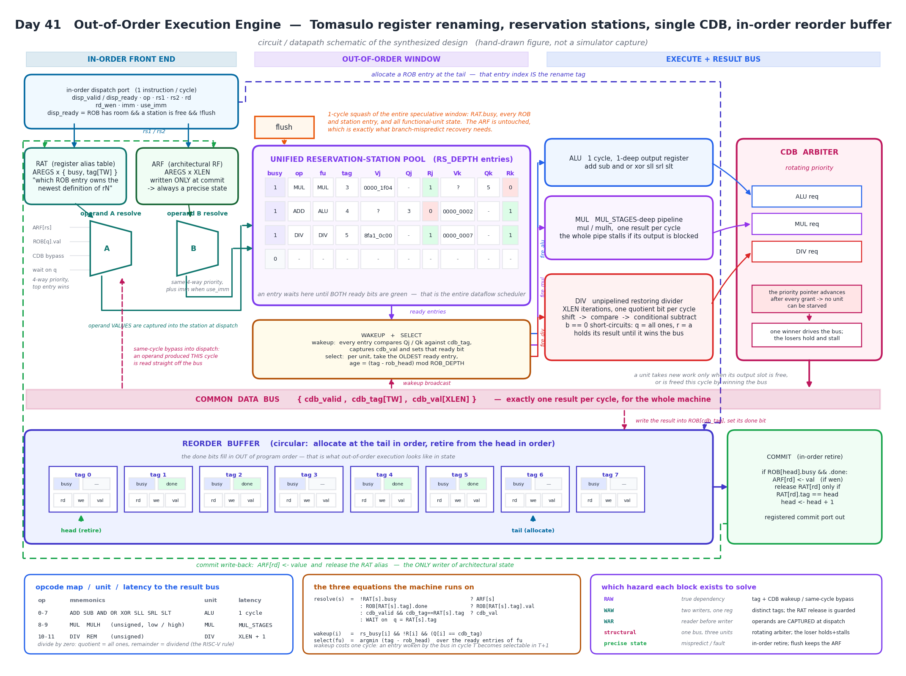
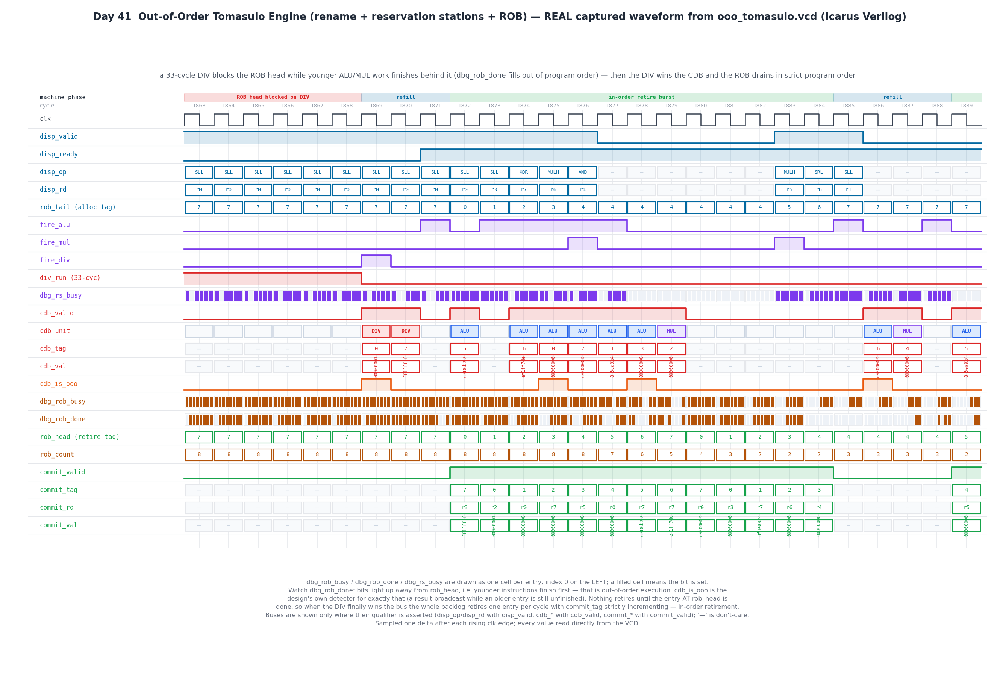

# Day 41 — Out-of-Order Execution Engine: Tomasulo Renaming + Reservation Stations + Reorder Buffer

A synthesizable **out-of-order execution core**. Instructions go in one per
cycle in program order, get their destination **renamed** onto a reorder-buffer
tag, wait in a **reservation-station** pool until their operands actually
arrive, execute on whichever of three different-latency functional units frees
up first — so they finish in **dataflow order, not program order** — broadcast
their results on a single arbitrated **Common Data Bus**, and then retire from
the **reorder buffer in strict program order** so the architectural register
file only ever holds a precise state.

[Day 38](../Day38) built an in-order 5-stage RISC-V core, where a single stalled
instruction stops everything behind it. [Day 39](../Day39) and
[Day 40](../Day40) built the cache and the MMU that feed it. This day removes
the in-order constraint itself. The moment a machine is allowed to execute
younger work while older work is still in flight, four things that were free in
an in-order pipeline stop being free: **which** definition of `r3` a reader
should see, **when** a waiting instruction learns its operand exists, **who**
gets the one result bus this cycle, and **how** the architectural state stays
recoverable. Renaming, wakeup, arbitration and the ROB are the four answers, and
the whole design is those four mechanisms and nothing else.

---

## Overview

| | |
|---|---|
| Execution model | Tomasulo: rename → dataflow issue → single CDB → in-order retire |
| Dispatch | in-order, **1 instruction/cycle**, `valid`/`ready` backpressured |
| Rename | RAT: `AREGS × {busy, tag}`, destination renamed onto its ROB index |
| Scheduler | **unified** reservation-station pool, `RS_DEPTH` entries, any op in any entry |
| Select policy | **oldest ready first** per unit, `age = (tag − rob_head) mod ROB_DEPTH` |
| Functional units | ALU (1 cycle) · MUL (`MUL_STAGES`-deep pipeline) · DIV (restoring, `XLEN`+1 cycles) |
| Result bus | **one** CDB, **rotating-priority** arbiter, losers hold and back-pressure |
| Wakeup | full tag broadcast to every station; **+ same-cycle bypass into dispatch** |
| Retire | in-order from the ROB head, 1/cycle, registered commit port |
| Recovery | `flush` squashes rename + ROB + stations + FU state in **1 cycle**, ARF intact |
| Divide by zero | RISC-V rule (`q` = all ones, `r` = dividend), answered without iterating |
| Verification | in-order golden interpreter, 792 instructions, 36 geometries × 7 seeds all pass |

---

## Features

- **True register renaming, not scoreboarding.** Every destination is renamed
  onto its ROB index, so WAW and WAR hazards simply cannot exist: two writes to
  `r3` get two different tags, and a reader that dispatched earlier already
  **captured the value** into its station and does not care that `r3` was
  overwritten afterwards. The `t_waw_war` scenario hammers exactly this — 24
  rounds of *write `r3` / read `r3` / read the older `r3`* — and it is the test
  that fails first if the RAT release is wrong.
- **Guarded RAT release.** When an instruction retires it may only clear
  `rat_busy[rd]` if `rat_tag[rd]` is still *its own* tag. A younger writer of
  the same register owns the alias by then, and releasing it would send the next
  reader to the stale ARF copy. This one condition is the single most bug-prone
  line in the design; deleting it is caught by the testbench in 19 instructions.
- **Same-cycle CDB bypass at dispatch.** An instruction dispatched in the exact
  cycle its producer broadcasts must read the value off the bus, because the
  wakeup broadcast has already gone past by the time the station exists. Without
  this the machine does not merely lose performance, it **deadlocks** — the new
  station waits forever on a tag that will never be broadcast again.
- **Three genuinely different latencies.** A 1-cycle ALU, a `MUL_STAGES`-deep
  multiplier pipeline that can retire one result per cycle, and an unpipelined
  restoring divider that grinds one quotient bit per cycle for `XLEN` cycles.
  That spread is what makes completion order diverge from program order in the
  first place — with uniform latency an "out-of-order" machine is just a slow
  in-order one.
- **Rotating-priority CDB arbitration.** One result bus, three producers. The
  grant pointer advances after every grant, so no unit can be starved by a
  faster neighbour, and a unit that loses **holds its result and stalls its own
  input** rather than dropping it. `perf_cdb_conflict` counts the cycles where
  more than one unit wanted the bus (36 in the default run).
- **Precise architectural state.** The ARF is written by exactly one place —
  commit — and commit only ever fires on the ROB head. Results can land in the
  ROB in any order at all; the register file never sees them out of order.
- **Single-cycle squash.** `flush` clears the rename table, every ROB and
  station entry and all functional-unit state at once, leaves the ARF untouched,
  and the engine accepts new work the next cycle. That is branch-mispredict
  recovery, and it is verified as such: architectural state byte-identical
  across the flush, zero commits from the squashed instructions, and a full
  24-instruction workload run afterwards.
- **Built-in observability.** `perf_ooo_complete` is the design's own detector
  for a result broadcast while an older ROB entry is still unfinished — the
  hardware's own evidence that it is reordering. Alongside it:
  `perf_dispatched`, `perf_committed`, `perf_cdb_conflict`, `perf_stall_rob`,
  `perf_stall_rs`, `perf_flush`, plus packed `dbg_rob_busy` / `dbg_rob_done` /
  `dbg_rs_busy` occupancy bitmaps.
- **Fully parameterized and reset-safe.** `XLEN`, `AREGS`, `ROB_DEPTH`,
  `RS_DEPTH`, `MUL_STAGES` are all free; the regression sweeps 36 combinations
  including the degenerate ones (a 2-entry station pool, a 1-deep multiplier, a
  4-entry ROB).

---

## Circuit diagram



*Datapath schematic of the built circuit: the in-order front end (dispatch,
RAT, ARF, the 4-way priority operand-resolution mux), the out-of-order window
(the unified station pool and the wakeup/select logic), the three functional
units and the rotating-priority arbiter feeding the single Common Data Bus, and
the reorder buffer that turns all of it back into in-order architectural state.
Hand-drawn figure — not a simulator screenshot.*

---

## Parameters

| Parameter | Default | Meaning |
|---|---|---|
| `XLEN` | 32 | data-path width; also the number of divider iterations |
| `AREGS` | 8 | architectural registers (`AW = $clog2(AREGS)`) |
| `ROB_DEPTH` | 8 | reorder-buffer entries — **power of 2**, sets the tag width `TW` and the in-flight window |
| `RS_DEPTH` | 6 | unified reservation-station entries (the scheduling window) |
| `MUL_STAGES` | 3 | multiplier pipeline depth, ≥ 1 |

Derived: `TW = $clog2(ROB_DEPTH)`, `RW = $clog2(RS_DEPTH)`,
`SHW = $clog2(XLEN)`, `CW = $clog2(ROB_DEPTH+1)`.

`ROB_DEPTH` must be a power of two: the age comparison
`(tag − rob_head) mod ROB_DEPTH` relies on natural wraparound of a `TW`-bit
subtract.

## Ports

### Clock, reset, recovery

| Port | Dir | Width | Description |
|---|---|---|---|
| `clk` | in | 1 | rising-edge clock |
| `rst_n` | in | 1 | asynchronous active-low reset; clears the ARF too |
| `flush` | in | 1 | squash the whole in-flight window this cycle; the ARF survives |

### Dispatch (in-order, 1 instruction/cycle)

| Port | Dir | Width | Description |
|---|---|---|---|
| `disp_valid` | in | 1 | an instruction is offered |
| `disp_ready` | out | 1 | ROB has room **and** a station is free **and** not flushing |
| `disp_op` | in | 4 | opcode, see the table below |
| `disp_rs1`, `disp_rs2` | in | `AW` | source architectural registers |
| `disp_rd` | in | `AW` | destination architectural register |
| `disp_rd_wen` | in | 1 | 0 = the result is discarded (the entry still occupies the ROB and retires) |
| `disp_imm` | in | `XLEN` | immediate |
| `disp_use_imm` | in | 1 | operand B is `disp_imm` instead of `ARF[rs2]` |

`disp_ready` is a function of registered state only — it never depends on
`disp_valid`, so there is no combinational loop across the handshake.

### Commit (in-order, registered)

| Port | Dir | Width | Description |
|---|---|---|---|
| `commit_valid` | out | 1 | an instruction retired on the previous edge |
| `commit_rd` | out | `AW` | its destination register |
| `commit_rd_wen` | out | 1 | whether the ARF was actually written |
| `commit_val` | out | `XLEN` | the retired result |
| `commit_tag` | out | `TW` | the ROB entry that retired; increments by 1 mod `ROB_DEPTH`, always |

### Observability

| Port | Dir | Width | Description |
|---|---|---|---|
| `perf_dispatched` | out | 32 | instructions accepted |
| `perf_committed` | out | 32 | instructions retired |
| `perf_cdb_conflict` | out | 32 | cycles where more than one unit wanted the result bus |
| `perf_ooo_complete` | out | 32 | results broadcast while an **older** ROB entry was still unfinished |
| `perf_stall_rob` | out | 32 | dispatch-blocked cycles, ROB full |
| `perf_stall_rs` | out | 32 | dispatch-blocked cycles, station pool full |
| `perf_flush` | out | 32 | flushes taken |
| `dbg_rob_busy`, `dbg_rob_done` | out | `ROB_DEPTH` | packed ROB occupancy / completion bitmaps |
| `dbg_rs_busy` | out | `RS_DEPTH` | packed station occupancy bitmap |

### Instruction set

| `op` | Mnemonic | Unit | Result | Latency to the bus |
|---|---|---|---|---|
| 0–7 | `ADD SUB AND OR XOR SLL SRL SLT` | ALU | `SLT` is signed; shifts use `b[SHW-1:0]` | 1 cycle |
| 8 | `MUL` | MUL | low half of the unsigned product | `MUL_STAGES` |
| 9 | `MULH` | MUL | high half of the unsigned product | `MUL_STAGES` |
| 10 | `DIV` | DIV | unsigned quotient; `b==0` → all ones | `XLEN`+1, or 1 if `b==0` |
| 11 | `REM` | DIV | unsigned remainder; `b==0` → `a` | `XLEN`+1, or 1 if `b==0` |

---

## Block diagram

```
                                        flush ──┐ (1-cycle squash of everything below the ARF)
                                                v
   ┌─────────────────────────────┐      ┌──────────────────────────────────────────┐
   │  IN-ORDER DISPATCH  1/cyc   │      │       UNIFIED RESERVATION STATIONS       │
   │  op rs1 rs2 rd wen imm      │      │  busy op fu tag | Vj Qj Rj | Vk Qk Rk    │
   └──────┬───────────────┬──────┘      │  ...  RS_DEPTH entries, any op anywhere  │
          │ rs1/rs2       │ rd          └───────────────┬──────────────────────────┘
          v               v                  ^          │ both ready?
   ┌────────────┐  ┌────────────┐            │          v
   │    RAT     │  │    ARF     │            │   ┌───────────────────────────────┐
   │ busy , tag │  │  AREGS x   │            │   │  SELECT: oldest ready per FU  │
   │  per areg  │  │   XLEN     │            │   │  age = (tag - rob_head) mod N │
   └─────┬──────┘  └──────┬─────┘            │   └───┬───────────┬───────────┬───┘
         │                │                  │       │           │           │
         v                v                  │       v           v           v
   ┌────────────────────────────┐            │   ┌───────┐  ┌─────────┐ ┌──────────┐
   │  4-way priority resolve    │            │   │  ALU  │  │   MUL   │ │   DIV    │
   │  ARF | ROB.val | CDB | wait│────────────┘   │ 1 cyc │  │ pipe x3 │ │ XLEN itr │
   └────────────────────────────┘  allocate      └───┬───┘  └────┬────┘ └────┬─────┘
              ^                    station           │           │           │
              │ same-cycle bypass                    v           v           v
              │                                 ┌──────────────────────────────────┐
              │                                 │ ROTATING-PRIORITY  CDB  ARBITER  │
              │                                 └────────────────┬─────────────────┘
              │                                                  v
   ═══════════╪══════════════════════════════════════════════════╪═══════════════════
    COMMON DATA BUS   { cdb_valid , cdb_tag , cdb_val }          │  one result / cycle
   ═══════════╪═══════════════════════╪══════════════════════════╪═══════════════════
              │                       │ wakeup broadcast         │ write ROB[tag].val
              └───────────────────────┴──────────────────────────┤ set ROB[tag].done
                                                                 v
   ┌─────────────────────────────────────────────────────────────────────┐
   │  REORDER BUFFER   tag0 .. tagN-1   { busy, done, rd, wen, val }     │
   │  head ──► retire in order                    tail ──► allocate      │
   └─────────────────────────────────┬───────────────────────────────────┘
                                     v
   ┌─────────────────────────────────────────────────────────────────────┐
   │  COMMIT: ARF[rd] <- val ;  release RAT[rd] iff RAT[rd].tag == head  │
   │          head++ ;  registered commit port out                       │
   └─────────────────────────────────────────────────────────────────────┘
```

---

## Simulation timing



**This is a real captured waveform**, not a hand-drawn diagram: `make icarus`
runs the self-checking testbench under Icarus Verilog and dumps
`ooo_tomasulo.vcd`, and `gen_waveform.py` parses that VCD and plots the values
directly. Every level and every bus value in the figure was produced by the RTL.

The window is auto-selected around the moment the machine's whole point becomes
visible. A 33-cycle divide is sitting at the head of the reorder buffer:

- **Cycles 1863–1868** — `div_run` is high, `rob_count` is pegged at 8, and
  `disp_ready` is low, so dispatch keeps re-presenting the same instruction.
  Look at `dbg_rob_done`: bits are set *away* from `rob_head`. The younger ALU
  and MUL instructions behind the divide finished long ago and are parked as
  completed-but-not-retired entries. `commit_valid` is flat the whole time —
  **nothing may retire past an unfinished head**.
- **Cycle 1869** — the divider wins the bus (`cdb unit = DIV`, `cdb_tag = 0`).
  `fire_div` fires in the same cycle, issuing the next divide; that one has a
  zero divisor, so it takes the short-circuit path and broadcasts `ffffffff` on
  cycle 1870 without iterating at all.
- **Cycles 1872–1884** — the backlog drains at **one retire per cycle**, and
  `commit_tag` walks 7, 0, 1, 2, 3, 4, 5, 6, 7, 0, 1, 2, 3 — strictly
  incrementing mod 8, with no gaps, while `rob_count` falls from 8 to 2 and
  dispatch refills the buffer from the other end.
- **`cdb_is_ooo`** pulses whenever a result is broadcast while an older entry is
  still unfinished. It is the design's own detector, and it is the difference
  between an out-of-order machine and an in-order one that happens to pass the
  same value checks.

---

## How it works

### 1 — Dispatch: rename, then read

Dispatch does three things at once. It allocates `ROB[rob_tail]`, and **that
index is the rename tag**. It resolves both operands through a 4-way priority
mux:

```
resolve(s) = !RAT[s].busy                        ? ARF[s]                 // never renamed
           : ROB[RAT[s].tag].done                ? ROB[RAT[s].tag].val    // done, not yet retired
           : cdb_valid && cdb_tag == RAT[s].tag  ? cdb_val                // on the bus RIGHT NOW
           :                                       WAIT on q = RAT[s].tag
```

Then, if the instruction writes a register, it points `RAT[rd]` at the new tag.
The order matters: this happens *after* commit in the same clocked block, so
an instruction renaming `r3` in the very cycle an older writer of `r3` retires
wins, and the alias correctly ends up pointing at the younger tag.

That third case — the same-cycle bus bypass — is not an optimization. The
wakeup broadcast reaches stations that already exist; a station created this
cycle would never see it. Removing the bypass turns the design into one that
**hangs**, and the testbench catches it as a drain timeout rather than a
mismatch.

### 2 — The station pool: waiting is the whole scheduler

A station holds `{op, fu, tag, Vj, Qj, Rj, Vk, Qk, Rk}`. Ready operands are
stored as *values*; unready ones as the *tag* of whoever will produce them. That
capture-at-dispatch is what eliminates WAR hazards outright — once the value is
in the station, nothing that happens to the architectural register afterwards
can reach it.

Every cycle, each station compares `Qj` and `Qk` against `cdb_tag` and latches
`cdb_val` on a match. Wakeup costs one cycle here: an entry woken in cycle *T*
becomes selectable in *T+1*. That is a deliberate choice — collapsing wakeup and
select into the same cycle is the classic critical path in a real machine, and
the pipelined version is both simpler and closer to what actually gets built.

The pool is **unified**: any opcode can sit in any entry, and `fu` is just a
field. It is a smaller, better-utilized structure than per-unit stations, at the
cost of a wider select.

### 3 — Select: oldest ready wins

For each functional unit, the scheduler picks the oldest ready station, where
age is `(tag − rob_head) mod ROB_DEPTH`. ROB tags are handed out in program
order from a circular buffer, so distance from the head *is* program order — no
separate age counter is needed anywhere.

Oldest-first is a **performance** policy, not a correctness one. A machine that
picked the lowest station index instead would still be correct, and indeed still
passes the whole testbench; it would just be slower, because it would leave the
instruction blocking the ROB head sitting in the pool.

### 4 — Functional units and the one bus

- **ALU** — combinational, with a 1-deep output register. It accepts new work
  when that register is free, or is being freed this cycle by a bus grant.
- **MUL** — a `MUL_STAGES`-deep `{valid, tag, value}` shift pipeline. If the
  output stage is blocked, the *entire* pipeline stalls, and it stops accepting
  new work. No result is ever dropped.
- **DIV** — a real restoring divider: `r = {r, q[MSB]}`, compare against the
  divisor, conditionally subtract, shift the quotient bit in. `XLEN` iterations,
  then the result is held until the bus is won. A zero divisor skips the
  iteration entirely and produces the RISC-V answer in one cycle.

All three feed **one** CDB. The arbiter's grant pointer advances after every
grant, so priority rotates and no unit can be starved. The loser of a grant does
not lose its result — it holds it and back-pressures its own input, which is why
`can_alu` / `can_mul` / `can_div` all include "…or freed this cycle by winning".

### 5 — Retire: putting time back together

Commit fires only when `ROB[head]` is both busy and done. It writes
`ARF[rd]` (if `rd_wen`), releases the RAT alias **only if it still owns it**,
advances the head, and drives the registered commit port. It is the only writer
of architectural state in the entire design, which is precisely why the state is
always precise.

### 6 — Why tag reuse is safe

`ROB_DEPTH` tags are recycled continuously, so it is fair to ask whether a
station could be waiting on tag 3 and get woken by a *different* instruction
that later got tag 3. It cannot. A tag is only reused after its entry retires,
retiring requires `done`, and `done` was set by a CDB broadcast that woke every
waiting station at that instant. Any station created after that broadcast takes
the `ROB[q].done` path at dispatch and is born ready. So at the moment a tag is
recycled, its waiter set is provably empty.

### 7 — Flush

`flush` clears `rat_busy` for every register, every ROB and station entry, the
ALU output register, the multiplier pipeline valids and the divider state, and
resets the ROB pointers — in one cycle, as a final override at the bottom of the
clocked block. The ARF and the performance counters survive. Since commit is
suppressed during the flush cycle, an instruction that has not already retired
never will.

---

## Run instructions

```bash
make            # Icarus Verilog: build + run the self-checking testbench
make SEED=42    # a different randomisation seed
make ROB=16 RS=10 MUL=5     # a different machine geometry
make sweep      # 36 geometries (ROB x RS x MUL_STAGES)
make seeds      # 7 seeds at the default geometry
make gen        # regenerate both figures from the fresh VCD
make waves      # open ooo_tomasulo.vcd in GTKWave
make clean
```

`make verilator`, `make vcs` and `make questa` targets are provided for those
simulators. The results below were produced with **Icarus Verilog 13.0** — the
only simulator installed on the machine this was developed on, so the VCS and
Questa flows are supplied but unexercised.

### Actual output

```
=========================================================
 Day 41 : out-of-order Tomasulo engine
   XLEN=32 AREGS=8 ROB_DEPTH=8 RS_DEPTH=6 MUL_STAGES=3 seed=1
=========================================================
  [T1] register-init prologue
  [T2] RAW dependency chain (fully serialized)
  [T3] WAW / WAR storm on a single architectural register
  [T4] long-latency shadow (DIV blocks the ROB head)
  [T5] divide / remainder by zero
  [T6] back-to-back independent multiplies + CDB contention
  [T7] instructions whose result is discarded (rd_wen=0)
  [T8] full-rate dispatch into a full ROB (backpressure)
  [T9] randomized soak : 400 instructions
  [T10] flush : squash the speculative window
  [T10] post-flush restart
---------------------------------------------------------
 dispatched      : 792 (DUT counter 794)
 committed       : 792 (DUT counter 792)
 commits checked : 792
 completions     : 768, out-of-order inversions : 146 (TB), 266 (DUT)
 CDB conflicts   : 36
 dispatch stalls : 1244 ROB-full, 226 RS-full
 flushes         : 1
 final architectural register file matches the model
---------------------------------------------------------
RESULT: *** PASS ***
```

The DUT dispatch counter reads 794 against the testbench's 792: the two extra
are the deliberately-squashed instructions from the flush test, which the
testbench never told its model about. The two out-of-order figures count
different things and are not expected to match — the testbench counts
*inversions in the completion sequence*, the design counts *broadcasts made
while an older entry was unfinished*.

---

## What the testbench checks

The golden model is a plain **in-order interpreter** over an architectural
register file. The DUT may execute in any order it likes; what it may not do is
retire in any order but program order, with any values but the ones a simple
in-order machine would have produced. Every instruction offered at the dispatch
port is executed immediately by the model and its `{rd, rd_wen, value}` pushed
onto an expectation queue; every commit the DUT reports is popped off the front
and compared.

On top of that stream compare:

| Check | What it catches |
|---|---|
| `commit_val` vs the in-order model | any renaming, wakeup, bypass or ROB error |
| `commit_rd`, `commit_rd_wen` | wrong destination or a lost `rd_wen` |
| `commit_tag` increments by 1 mod `ROB_DEPTH`, always | retirement out of order, or a skipped/duplicated entry |
| commit count == dispatch count | a lost or duplicated instruction |
| expectation queue empty at the end | an instruction that never retired |
| final ARF vs the model | a commit that reported the right value but wrote the wrong place |
| **out-of-order inversions > 0** (computed independently of the DUT counter) | a machine that quietly degraded to in-order — it would pass every value check above |
| `perf_ooo_complete > 0` | the design's own reordering detector never fired |
| flush: ARF unchanged, 0 commits, `rat_busy`/`rob_busy`/`rs_busy` all clear, `rob_count == 0`, `disp_ready` high | a squash that leaked speculative state or bricked the engine |

Four assertions are compiled into the RTL itself (`ifndef SYNTHESIS`): the ROB
occupancy never exceeds `ROB_DEPTH`, the CDB never writes a free ROB entry, it
never double-completes one, and never more than one unit is granted.

### Stimulus

| Test | What it targets |
|---|---|
| T1 prologue | seeds the 8 architectural registers from a zeroed reset |
| T2 RAW chain | every instruction reads what the previous one wrote — fully serialized, exercises wakeup and the same-cycle bypass on every operand |
| T3 WAW/WAR storm | 72 instructions rewriting and re-reading one register — the renaming test |
| T4 long-latency shadow | 6 divides each followed by 12 independent ALU ops — completed work piling up behind a blocked head |
| T5 divide by zero | `x/0`, `x%0`, `0/0`, then real divides to prove the unit recovers |
| T6 multiply burst | 30 back-to-back multiplies with a divide running underneath — maximum CDB contention |
| T7 discarded results | `rd_wen = 0` entries that occupy the ROB and retire without writing |
| T8 full-rate dispatch | 120 instructions with no gaps at all — sustained ROB-full backpressure and the dispatch-plus-commit-in-one-cycle path |
| T9 random soak | 400 random instructions, random opcodes/registers/immediates and random dispatch gaps |
| T10 flush | squash mid-flight, verify the architectural state and the pointers, then run a full workload afterwards |

### Regression status

Every configuration below passes.

| Sweep | Configurations |
|---|---|
| `make sweep` | `ROB_DEPTH ∈ {4, 8, 16}` × `RS_DEPTH ∈ {2, 4, 6, 10}` × `MUL_STAGES ∈ {1, 3, 5}` = **36 geometries** |
| `make seeds` | seeds 1, 7, 42, 1234, 99991, 2026, 31337 at the default geometry |

The testbench was also mutation-tested — three bugs injected into a scratch copy
of the RTL to confirm the checks actually bite:

| Injected bug | Result |
|---|---|
| drop the "still the newest definition" guard on the RAT release | caught at instruction 19, wrong `commit_val` |
| remove the same-cycle CDB bypass at dispatch | caught as a drain timeout — the machine deadlocks |
| select the lowest-index ready station instead of the oldest | **passes**, correctly: oldest-first is a performance policy, not a correctness one |

---

## Files

| File | |
|---|---|
| `ooo_tomasulo.sv` | the design (653 lines) |
| `tb_ooo_tomasulo.sv` | self-checking testbench with the in-order golden interpreter (612 lines) |
| `Makefile` | icarus / verilator / vcs / questa targets, plus `sweep`, `seeds`, `gen` |
| `gen_waveform.py` | VCD parser + matplotlib renderer for the captured waveform |
| `gen_block.py` | matplotlib renderer for the circuit schematic |
| `docs/ooo_tomasulo_waveform.png` | captured waveform (from the real Icarus run) |
| `docs/ooo_tomasulo_block.png` | circuit / datapath schematic (hand-drawn) |
