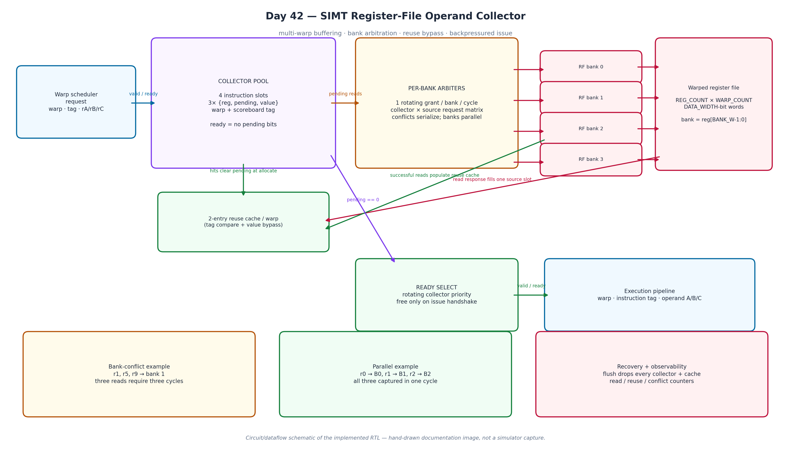
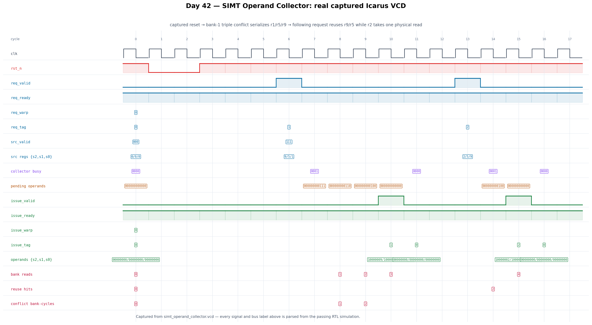

# Day 42 — SIMT Register-File Operand Collector

A synthesizable GPU streaming-multiprocessor operand-delivery stage. It accepts
decoded warp instructions with as many as three source registers, buffers
multiple warps in a collector pool, arbitrates conflicts in a banked register
file, bypasses recently read operands through a warp-private reuse cache, and
issues a complete operand bundle to the execution pipeline under backpressure.

This is intentionally different from [Day 16](../Day16), which resolves
lane-address conflicts in shared memory. Here the competing requests are
**instruction source operands** contending for physical register-file banks—the
high-bandwidth operand-gather problem between an SM warp scheduler and its
CUDA/Tensor execution pipelines.

## Features

- `COLLECTORS` independent instruction slots hide multi-cycle bank conflicts by
  gathering operands for several warps concurrently.
- Each of the `BANKS` physical banks grants one read per clock, while different
  banks operate in parallel. Per-bank rotating priority prevents a hot
  collector from permanently starving its neighbours.
- A two-entry cache per warp bypasses recently read operands. The cache is
  tagged by the architectural register number, so values never leak between
  warps.
- Three independently optional sources support unary, binary, and fused
  three-input instructions without fake register reads; disabled outputs are
  deterministically zero.
- Completed collectors remain stable across execution-pipeline backpressure
  and are freed only by a `valid && ready` issue handshake.
- `flush_i` atomically invalidates all in-flight collectors and reuse entries,
  suitable for warp kill/replay or control-flow recovery.
- Performance counters expose physical bank reads, reuse hits, and the total
  number of bank-cycles with more than one contender.
- The register write port includes same-cycle write-to-read forwarding, avoiding
  a stale operand on a coincident scoreboard release/writeback.

## Circuit diagram



*Circuit/dataflow diagram of the implemented collector pool, reuse bypass,
per-bank arbiters, banked register file, and issue selector. This is a hand-drawn
documentation image, not a simulator screenshot.*

## Parameters

| Parameter | Default | Meaning |
|---|---:|---|
| `DATA_WIDTH` | 32 | Width of one scalar register value |
| `REG_COUNT` | 32 | Registers per warp; must be a power of two |
| `WARP_COUNT` | 4 | Independently addressed resident warps |
| `BANKS` | 4 | Physical read banks; power of two, one read/bank/clock |
| `COLLECTORS` | 4 | Concurrent operand-gather slots |
| `TAG_WIDTH` | 12 | Opaque instruction/scoreboard tag width |
| `SOURCES` | 3 | Maximum source operands per instruction |

The bank mapping is `bank = register_number & (BANKS-1)`. Thus registers
`r1`, `r5`, and `r9` all contend for bank 1 in the default geometry, whereas
`r0`, `r1`, and `r2` can be captured together.

## Ports

| Port | Dir | Width | Description |
|---|---|---:|---|
| `clk`, `rst_n` | in | 1 | Clock and asynchronous active-low reset |
| `flush_i` | in | 1 | Drop all in-flight collectors and reuse entries |
| `wr_en_i` | in | 1 | Register-file writeback enable |
| `wr_warp_i`, `wr_reg_i` | in | derived | Writeback warp and register address |
| `wr_data_i` | in | `DATA_WIDTH` | Writeback value |
| `req_valid_i`, `req_ready_o` | in/out | 1 | Decoded-instruction allocation handshake |
| `req_warp_i` | in | `clog2(WARP_COUNT)` | Source warp |
| `req_tag_i` | in | `TAG_WIDTH` | Opaque tag carried to issue |
| `req_src_valid_i` | in | `SOURCES` | Which source slots are used |
| `req_src_reg_i` | in | `SOURCES*clog2(REG_COUNT)` | Packed source-register numbers |
| `issue_valid_o`, `issue_ready_i` | out/in | 1 | Execution issue handshake |
| `issue_warp_o`, `issue_tag_o` | out | derived | Warp and instruction identity |
| `issue_operand_o` | out | `SOURCES*DATA_WIDTH` | Gathered operand bundle |
| `issue_src_valid_o` | out | `SOURCES` | Original source-use mask |
| `dbg_busy_o`, `dbg_pending_o` | out | derived | Collector occupancy and pending-read map |
| `perf_bank_reads_o` | out | 32 | Physical RF reads performed |
| `perf_reuse_hits_o` | out | 32 | Source operands served from reuse cache |
| `perf_conflict_cycles_o` | out | 32 | Sum of banks with multiple contenders per cycle |

## Block diagram

```text
 decoded warp instruction
  {warp, tag, src regs}
           │ valid/ready
           ▼
 ┌──────────────────────────── collector pool ───────────────────────────┐
 │ slot 0..N: {warp, tag, src_valid, src_reg[], pending[], operand[]}    │
 │            ▲ reuse hit clears pending at allocation                   │
 └────────────┼───────────────────────────────────┬──────────────────────┘
              │ pending reads                     │ pending == 0
       ┌──────┴───────┐                           ▼
       │ per-bank RR  │                    ┌──────────────┐
       │ arbitration  │                    │ ready select │──valid/ready──▶ EX
       └──────┬───────┘                    └──────────────┘
              │ one grant / bank / cycle
     ┌────────┴─────────────────────┐
     │ bank 0 │ bank 1 │ ... │ B-1 │  register file [warp][reg]
     └────────┬─────────────────────┘
              ├── read response ──▶ collector operand slot
              └── cache fill ─────▶ 2-entry reuse cache for that warp
```

## How it works

Allocation chooses the first free collector. Each valid source probes the two
reuse tags for its warp; a hit supplies the value immediately, while a miss sets
that source's pending bit. Every clock, each bank examines the complete
collector/source request matrix starting at its rotating pointer and grants its
first contender. The returned word clears exactly one pending bit and updates
the warp's reuse cache. An instruction becomes issueable only after all pending
bits are clear. A separate rotating selector chooses one complete collector,
and its state is retained unchanged until the downstream pipeline accepts it.

## Simulation timing



*Real waveform captured from the passing Icarus Verilog VCD. The first request
asks for `r1/r5/r9`, which all map to bank 1 and therefore clear one pending bit
per cycle. The following request reuses two of those values and physically reads
only `r2`; later requests show parallel bank activity and collector overlap.*

## Running

```sh
make              # Icarus Verilog compile + self-checking simulation
make verilator    # Verilator timing simulation
make vcs          # Synopsys VCS
make questa       # Siemens Questa
make figures      # regenerate both PNGs from the captured VCD
make waves        # inspect the VCD in GTKWave
make clean
```

## What the testbench checks

The testbench maintains an independent shadow register file and a tag-indexed
golden scoreboard. It checks every issued warp, tag, source-valid mask, and
operand value regardless of completion order. Directed tests force a three-way
same-bank collision, cache reuse, unused-source zeroing, parallel-bank reads,
output backpressure, and flush of two live collectors. A further 1,200
randomized multi-warp instructions vary register banks, valid masks, conflicts,
and downstream stalls. A stale-cache-after-writeback test verifies cache
coherency. A global timeout catches deadlock; success requires the
exact line `RESULT: *** PASS ***`.

The default Icarus run completes **1,208 requests** (1,206 issued and two
deliberately flushed), performs **16,155 checks**, and reports zero mismatches.
