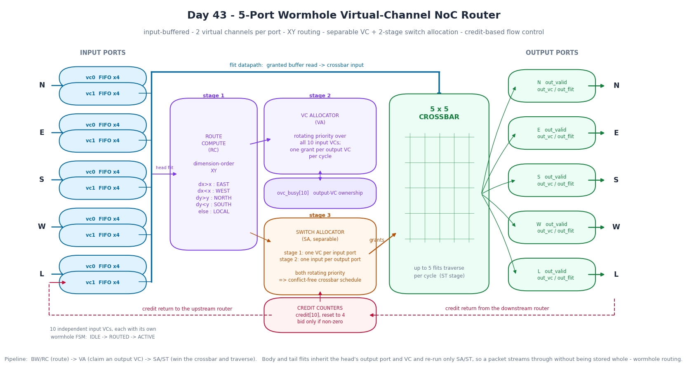
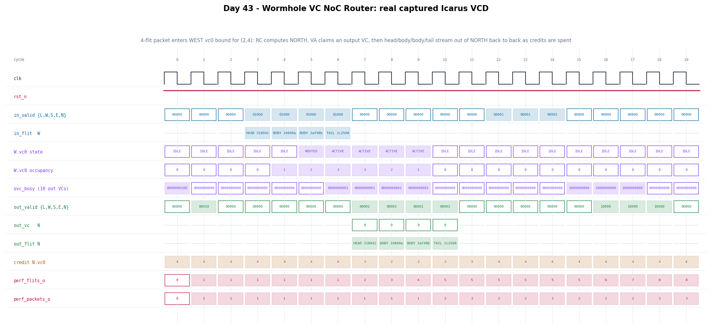

# Day 43 — Wormhole Virtual-Channel NoC Router (5-port mesh node)

A synthesizable input-buffered router for a 2-D mesh network-on-chip: the switch
that sits at every tile of a many-core SoC or GPU and moves packets between
neighbours. It implements the full classic three-stage virtual-channel router —
route computation, VC allocation, and separable two-stage switch allocation over
a 5×5 crossbar — with credit-based flow control on every output virtual channel.

This is the first *interconnect* project in the series. Earlier days built
things that sit at the endpoints of a fabric ([Day 7](../Day7) AXI4-Lite,
[Day 14](../Day14) systolic GEMM, [Day 38](../Day38) a RISC-V core); this one is
the fabric itself, and the interesting problems are different: allocation under
contention, deadlock freedom, and keeping one blocked packet from stalling an
unrelated one sharing the same wire.

## Features

- **5 physical ports** — North, East, South, West, and the Local (tile) port.
- **`VCS` virtual channels per input port**, each with a private flit FIFO and a
  private wormhole state machine. Two packets arriving on the same wire but
  bound for different outputs make independent progress.
- **Dimension-order (XY) route computation.** Every packet finishes all of its X
  hops before taking any Y hop, which makes the channel dependency graph acyclic
  and the network provably deadlock free even though wormhole packets hold
  buffers in several routers at once.
- **Separable VC allocator** with rotating priority over all input VCs, granting
  at most one input VC per output VC per cycle.
- **Separable two-stage switch allocator**: stage 1 picks one VC per input port
  (one flit may leave a physical input per cycle), stage 2 picks one input port
  per output port. Together the stages produce a conflict-free crossbar
  schedule; up to 5 flits traverse per cycle.
- **Credit-based flow control** per output VC. A flit is launched only when the
  downstream buffer is known to have a free slot, so the link never overflows
  and needs no round-trip stall signal.
- **Rotating priority everywhere**, advanced every cycle, so no requester can be
  starved regardless of traffic pattern.
- **Wormhole, not store-and-forward.** Body and tail flits inherit the head's
  output port and VC and re-run only the switch-allocation stage, so a packet
  streams through without ever being buffered whole — latency is proportional to
  hop count, not packet length.
- Performance counters for flits, packets, and VA/SA stall cycles, plus per-VC
  state, occupancy, credit, and output-VC-ownership debug buses.

## Circuit diagram



*Circuit/dataflow diagram of the implemented router: per-port virtual-channel
buffers, XY route computation, the VC allocator and its `ovc_busy` ownership
vector, the two-stage switch allocator, the credit counters, and the 5×5
crossbar, with both credit-return loops. This is a hand-drawn documentation
image, not a simulator screenshot.*

## Parameters

| Parameter | Default | Meaning |
|---|---:|---|
| `PORTS` | 5 | Physical ports; 5 for a 2-D mesh node (N, E, S, W, Local) |
| `VCS` | 2 | Virtual channels per input port |
| `FLIT_WIDTH` | 32 | Flit width; must exceed `2 + 2*COORD_WIDTH` |
| `BUF_DEPTH` | 4 | Flit slots per input VC, and the reset credit count |
| `COORD_WIDTH` | 4 | Mesh coordinate width |
| `VCW`, `CNTW` | derived | `$clog2` of `VCS` and `BUF_DEPTH+1`; do not override |

## Ports

All per-port buses are flattened (`[PORTS*W-1:0]`, port `p` occupying
`[p*W +: W]`) so the port list stays plain-Verilog compatible.

| Port | Dir | Width | Description |
|---|---|---:|---|
| `clk`, `rst_n` | in | 1 | Clock and asynchronous active-low reset |
| `my_x_i`, `my_y_i` | in | `COORD_WIDTH` | This router's mesh coordinates |
| `in_valid_i` | in | `PORTS` | One flit offered on this physical input |
| `in_vc_i` | in | `PORTS*VCW` | Which input VC the flit belongs to |
| `in_flit_i` | in | `PORTS*FLIT_WIDTH` | The flit itself |
| `in_ready_o` | out | `PORTS*VCS` | Per-(port,VC) buffer-not-full status |
| `in_credit_valid_o` | out | `PORTS` | An input slot freed; credit returned upstream |
| `in_credit_vc_o` | out | `PORTS*VCW` | Which input VC the credit belongs to |
| `out_valid_o` | out | `PORTS` | A flit is leaving on this physical output |
| `out_vc_o` | out | `PORTS*VCW` | Output VC the flit was allocated |
| `out_flit_o` | out | `PORTS*FLIT_WIDTH` | The departing flit |
| `out_credit_valid_i` | in | `PORTS` | Downstream freed a slot |
| `out_credit_vc_i` | in | `PORTS*VCW` | Which output VC the credit refills |
| `dbg_state_o` | out | `PORTS*VCS*2` | Per input VC: IDLE / ROUTED / ACTIVE |
| `dbg_ovc_busy_o` | out | `PORTS*VCS` | Output-VC ownership vector |
| `dbg_occupancy_o` | out | `PORTS*VCS*CNTW` | Input-VC occupancy |
| `dbg_credit_o` | out | `PORTS*VCS*CNTW` | Remaining downstream credits |
| `perf_flits_o`, `perf_packets_o` | out | 32 | Flits and packets that traversed |
| `perf_va_stall_o`, `perf_sa_stall_o` | out | 32 | Cycles with an ungranted VA / SA request |

Note that `in_ready_o` is a status signal, not a handshake: an upstream router
should use the credit interface (`in_credit_valid_o` / `in_credit_vc_o`), because
the ready seen at a clock edge does not account for the flit being pushed on that
same edge.

## Flit format

```
 bit  31          tail
 bit  30          head            (11 = single-flit packet)
 bits 29 : 8      opaque payload, never inspected by the router
 bits  7 : 4      dest_y  \  head flits only
 bits  3 : 0      dest_x  /
```

## Block diagram

```
             ┌──────────────────────────────────────────────────────────┐
   N ──────► │  vc0 FIFO×4                                              │
             │  vc1 FIFO×4  ─┐                                          │
   E ──────► │  vc0 / vc1    │                                          │
   S ──────► │  vc0 / vc1    │  flit datapath                           │
   W ──────► │  vc0 / vc1    │                                          │
   L ──────► │  vc0 / vc1    │                                          │
             └───────┬───────┴──────────────────────────────┐           │
                     │ head flit                            │           │
                     ▼                                      ▼           │
             ┌───────────────┐   out port   ┌────────────────────────┐  │
             │ ROUTE COMPUTE │─────────────►│  VC ALLOCATOR   (VA)   │  │
             │  (RC)  XY     │              │  rotating priority     │  │
             │ dx>x : EAST   │              │  ovc_busy[PORTS*VCS]   │  │
             │ dx<x : WEST   │              └───────────┬────────────┘  │
             │ dy>y : NORTH  │                          │ out VC        │
             │ dy<y : SOUTH  │                          ▼               │
             │ else  : LOCAL │              ┌────────────────────────┐  │
             └───────┬───────┘              │ SWITCH ALLOCATOR (SA)  │  │
                     │  out port per VC     │ 1: one VC per in port  │  │
                     └─────────────────────►│ 2: one in per out port │  │
                                            └───────────┬────────────┘  │
             ┌────────────────────────┐                 │ grants        │
             │ CREDIT COUNTERS        │────────────────►│               │
             │ credit[PORTS*VCS] = 4  │                 ▼               │
             │ bid only if non-zero   │       ┌──────────────────┐      │
             └───────▲────────────────┘       │   5 × 5 CROSSBAR │◄─────┘
                     │ credit return          └────────┬─────────┘
                     │ from downstream                 │
                     │                                 ▼   N  E  S  W  L
                     └─────────────────────────────────┴──────────────►
```

## How it works

**Buffer write.** Each cycle every physical input may offer one flit tagged with
its VC. If that VC's FIFO has room the flit is written and the occupancy count
increments; one cycle later a credit is returned upstream.

**RC (stage 1).** When an input VC is `IDLE` and its FIFO is non-empty, the flit
at the read pointer must be a head. Its `dest_x`/`dest_y` are compared against
`my_x_i`/`my_y_i` and the output port is latched; the VC moves to `ROUTED`.

**VA (stage 2).** Every `ROUTED` VC bids for a free virtual channel on its
computed output port. The allocator sweeps requesters starting from a pointer
that advances every cycle, and a `va_taken` mask stops two winners receiving the
same output VC in one cycle. On a grant the output VC is marked busy in
`ovc_busy` and the input VC moves to `ACTIVE`.

**SA/ST (stage 3).** An `ACTIVE` VC bids for the crossbar if it holds a flit and
its output VC has a credit. Stage 1 of the allocator picks one VC per input
port, stage 2 picks one input port per output port — the two together can never
schedule two flits onto one crossbar input or output. Winners pop a flit,
decrement a credit, drive the output registers, and return a credit upstream.

**Teardown.** When the flit that traverses is a tail, the input VC returns to
`IDLE` and its output VC is released back into `ovc_busy` for reallocation. Body
and tail flits never re-run RC or VA, which is what makes this wormhole routing:
the packet occupies a reserved path across the fabric until its tail passes.

**Why virtual channels.** With a single buffer per input port, a packet whose
output is congested blocks every packet behind it on that wire even if their
outputs are idle — head-of-line blocking. Splitting the input into independent
VCs, each with its own FSM and its own share of the crossbar bids, lets the
second packet route around the first. Test T6 in the testbench measures exactly
this.

## Simulation timing



*This is a **real captured waveform**: `make icarus` runs the testbench under
Icarus Verilog, which dumps `noc_vc_router.vcd`, and `gen_figures.py` parses that
VCD and plots the signals directly. It is not a hand-modelled diagram.*

The window shows directed test T2. A 4-flit packet addressed to mesh node (2,4)
enters the WEST port on vc0 at cycle 3 (`in_valid = 01000`), one flit per cycle,
and the input-VC occupancy climbs 1→2→3. At cycle 5 the head reaches the front of
the FIFO and RC drives the VC to `ROUTED`; the destination shares this router's X
coordinate but lies to the north, so XY routing selects NORTH. At cycle 6 VA
grants an output VC — visible as bit 0 of `ovc_busy` going high — and the VC
becomes `ACTIVE`. From cycle 7 the switch allocator wins the crossbar on four
consecutive cycles and HEAD, BODY, BODY, TAIL stream out of the NORTH port back
to back while `credit N.vc0` is spent and refilled. The tail at cycle 10 releases
the output VC (`ovc_busy` returns to 0) and bumps `perf_packets_o`.

## Running it

```bash
make icarus      # Icarus Verilog (verified: RESULT: *** PASS ***)
make verilator   # Verilator
make vcs         # Synopsys VCS
make questa      # Siemens Questa
make seeds       # regression across six random seeds
make figures     # regenerate docs/*.png from the captured VCD
make waves       # open the VCD in GTKWave
```

Verified with Icarus Verilog 13.0 (`iverilog -g2012`). The design was not run
through Verilator, VCS, or Questa — those targets are provided but untested here.

```
Day 43 - Wormhole VC NoC Router, node at mesh coordinate (2,2)
  PORTS=5 VCS=2 FLIT_WIDTH=32 BUF_DEPTH=4 seed=1
  ...
  packets delivered : 247
  flits traversed   : 789
  perf_flits_o      : 789
  perf_packets_o    : 247
  VA stall cycles   : 728
  SA stall cycles   : 78
  simulated cycles  : 1132
  errors            : 0

RESULT: *** PASS ***
```

## What the testbench checks

The reference model is *structural* rather than a second copy of the RTL: the
router may schedule flits in any order it likes, but seven invariants must hold,
and every one is checked on every flit.

| # | Invariant | How it is checked |
|---|---|---|
| 1 | Routing | The packet must leave on exactly the port XY routing selects for its destination |
| 2 | Wormhole | Once a head appears on an output VC, every later flit there must belong to the same packet, in order, until its tail — no interleaving |
| 3 | Data integrity | Each flit's payload is a pure function of (packet id, flit index), so the checker regenerates the expected flit and compares bit-exactly |
| 4 | Ordering | Packets injected on the same (input port, input VC) must be delivered in injection order |
| 5 | Flow control | The testbench models the downstream buffer with its own credit count and fails if the router ever launches a flit with zero credits, or overflows the buffer |
| 6 | Credit balance | Credits returned upstream must equal the number of flits the router consumed |
| 7 | Completion | Every injected packet must be delivered; no input FIFO, order list, or output VC may be left mid-packet |

The injector models the upstream router with a real credit-based link rather
than sampling `in_ready_o`, and the receiver models a credit-limited downstream
buffer with randomized credit-return delay.

Stimulus is eight scenarios:

| Test | Scenario |
|---|---|
| T1 | Single-flit packet (head and tail in one flit), Local → EAST |
| T2 | 4-flit wormhole packet that finishes X and turns to Y, WEST → NORTH |
| T3 | Ejection to the Local port (destination is this node) |
| T4 | All five inputs injecting simultaneously to five distinct outputs |
| T5 | Four inputs contending for a single output port |
| T6 | **Head-of-line avoidance** — EAST credits are frozen so a packet on W.vc0 stalls mid-wormhole, then a NORTH-bound packet is injected behind it on W.vc1 and *must* be delivered while the first is still stuck. This is the property virtual channels exist to provide, and the test fails if the second packet does not get through |
| T7 | **Fairness** — one input floods a port with 12 packets while another sends a single packet to the same port; the rotating-priority allocators must not starve it |
| T8 | Randomized soak: 220 packets with random destinations, lengths, VCs, injection gaps, and credit-return delays |

Plus a global timeout, and a final sweep confirming every queue is empty, both
performance counters agree with the observed flit and packet totals, and no
output VC is still allocated.

The testbench was checked against deliberately broken versions of the design to
confirm it is not passing vacuously — swapping NORTH/SOUTH in the routing
function, dropping the credit check from the switch-allocator request, and
letting the VC allocator hand out an already-owned output VC are each caught.

Six seeds pass:

```
seed 1      : RESULT: *** PASS ***
seed 7      : RESULT: *** PASS ***
seed 42     : RESULT: *** PASS ***
seed 2026   : RESULT: *** PASS ***
seed 31337  : RESULT: *** PASS ***
seed 99991  : RESULT: *** PASS ***
```
