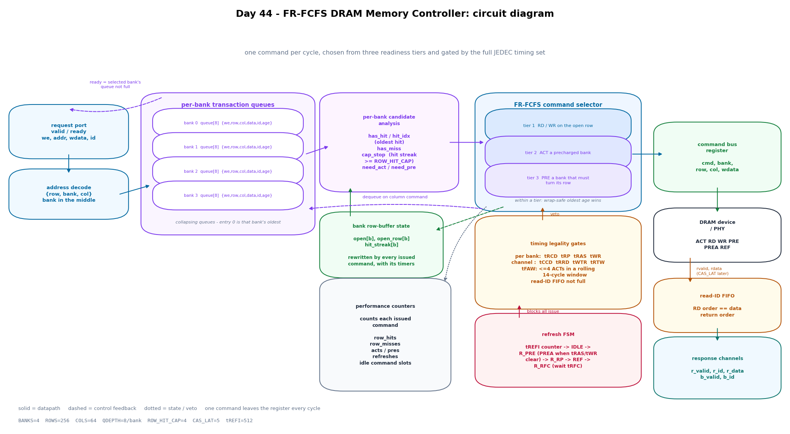
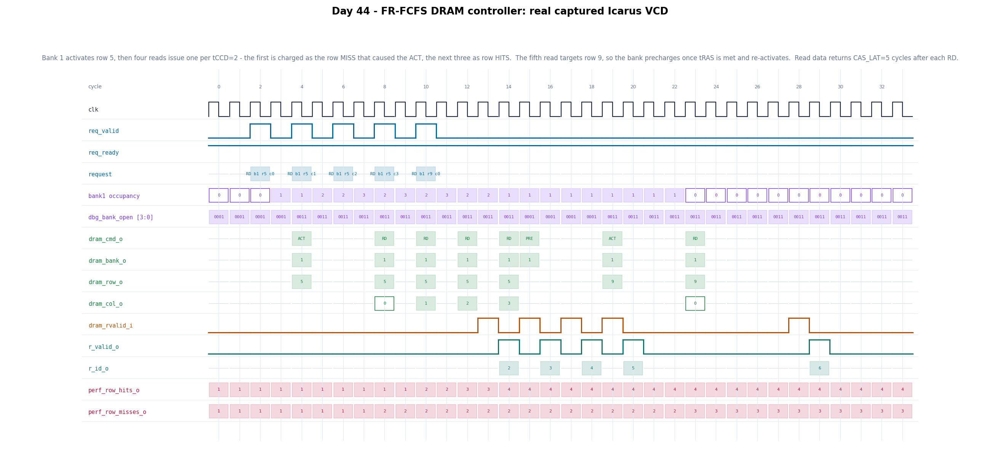

# Day 44 — FR-FCFS DRAM Memory Controller (JEDEC-style bank scheduler)

A synthesizable DDR-style memory controller: the block that sits between a
system's memory traffic and the DRAM devices themselves. It accepts read and
write transactions on a simple valid/ready port, splits them into per-bank
transaction queues, and every cycle chooses **one** DRAM command to issue —
`ACT` / `RD` / `WR` / `PRE` / `PREA` / `REF` — subject to the full set of JEDEC
timing constraints.

The scheduling policy is **FR-FCFS** (First-Ready, First-Come-First-Served), the
policy real controllers actually use. Its whole point is that DRAM is not a flat
memory: reading a row into a bank's row buffer costs `tRCD`, and closing it costs
`tRAS` + `tRP`, but a column access to an *already open* row costs almost
nothing. FR-FCFS therefore reorders requests to prefer row hits — which is why a
memory controller is a scheduler, not a FIFO.

Earlier days built the endpoints and the fabric of a memory system: [Day 7](../Day7)
an AXI4-Lite slave, [Day 39](../Day39) a write-back L1 cache, [Day 40](../Day40) a
page-table walker, [Day 43](../Day43) the interconnect. This one is what sits at
the *far* end of that path, and the interesting problems are different again:
timing legality across many interacting constraints, reordering for locality
without breaking correctness, and bounding the starvation that reordering
creates.

## Features

- **Per-bank transaction queues** (`QDEPTH` entries each) holding
  `{we, row, col, data, id, age}`. They are *collapsing* queues, so entry 0 is
  always that bank's oldest live request and per-bank age order is implicit in
  the index — only cross-bank comparisons need the age field.
- **Three-tier FR-FCFS selection**, evaluated every cycle:
  1. a column command (`RD`/`WR`) that **hits** the currently open row,
  2. an `ACT` for a precharged bank that has work,
  3. a `PRE` of a bank whose open row no longer serves its oldest request.
- **Wrap-safe oldest-first tie-break within a tier.** Ages are compared modulo
  `2**AGE_W` using the sign of `a - b`, so the comparison stays correct across
  counter wrap and a younger request can never permanently pass an older one at
  the same readiness level.
- **Starvation bound via a row-hit cap.** Classic FR-FCFS can starve a request
  indefinitely: a stream of hits to the open row always beats a waiting miss.
  `ROW_HIT_CAP` limits a bank to that many consecutive hits *while an older
  request to a different row is waiting*, after which the bank is forced to turn
  its row. The testbench measures this bound directly.
- **Full JEDEC timing set enforced by the issue logic**, not just documented:
  - per bank — `tRCD`, `tRP`, `tRAS`, `tWR`
  - per channel — `tCCD`, `tRRD`, `tWTR`, `tRTW`, `tRFC`
  - **`tFAW`** — at most four `ACT`s in any rolling `T_FAW`-cycle window, tracked
    with a shift-register history rather than a timer.
- **Blocking all-bank refresh FSM.** On the `tREFI` deadline the scheduler stops
  issuing, waits until every bank is `tRAS`/`tWR`-clear, issues `PREA`, waits out
  `tRP`, issues `REF`, then waits out `tRFC`.
- **Bank-interleaved address map** — `{row, bank, col}` with the bank field in
  the *middle*, so consecutive lines spread across banks and expose bank-level
  parallelism instead of serializing on one bank.
- **Out-of-order completion with in-order same-address semantics.** Requests
  carry an `ID` and are answered on separate read- and write-response channels.
  Two requests to the same address always complete in arrival order (same
  address ⇒ same bank *and* same row ⇒ same tier ⇒ ordered by age); requests to
  different addresses may complete out of order.
- **Read-ID recovery FIFO.** The device returns read data strictly in `RD` issue
  order, so a plain FIFO recovers each response's `ID`. Issue is throttled when
  that FIFO is full, so a read is never launched with nowhere to land.
- **Performance counters** for row hits, row misses, `ACT`s, `PRE`s, refreshes,
  and idle command slots, plus per-bank open/row/occupancy and refresh-active
  debug buses.

## Circuit diagram



*Circuit/dataflow diagram of the implemented controller: the request port and
address decode, the four per-bank transaction queues, per-bank candidate
analysis, the three-tier FR-FCFS selector with its timing-legality vetoes and
refresh FSM, the registered command bus, and the read-ID FIFO that feeds the
response channels. This is a hand-drawn documentation image, not a simulator
screenshot.*

## Parameters

| Parameter | Default | Meaning |
|---|---|---|
| `BANKS` | 4 | DRAM banks (power of two) |
| `ROW_BITS` | 8 | rows per bank = `2**ROW_BITS` |
| `COL_BITS` | 6 | columns per row = `2**COL_BITS` |
| `DATA_W` | 32 | data beat width |
| `ID_W` | 6 | transaction ID width |
| `QDEPTH` | 8 | transaction queue entries **per bank** |
| `ROW_HIT_CAP` | 4 | max consecutive row hits while an older miss waits |
| `T_RCD` | 4 | `ACT` → column command, same bank |
| `T_RP` | 4 | `PRE` → `ACT`, same bank |
| `T_RAS` | 10 | `ACT` → `PRE`, same bank |
| `T_WR` | 4 | `WR` → `PRE`, same bank (write recovery) |
| `T_CCD` | 2 | column command → column command |
| `T_RRD` | 3 | `ACT` → `ACT`, different banks |
| `T_FAW` | 14 | rolling window holding at most four `ACT`s |
| `T_WTR` | 4 | `WR` → `RD` bus turnaround |
| `T_RTW` | 3 | `RD` → `WR` bus turnaround |
| `T_RFC` | 16 | `REF` → any command |
| `T_REFI` | 512 | average refresh interval |
| `CAS_LAT` | 5 | device read latency (contract with the PHY) |

Derived, not to be overridden: `BB = $clog2(BANKS)`,
`ADDR_W = ROW_BITS + BB + COL_BITS`, `QCW = $clog2(QDEPTH+1)`.

All timing parameters are in **controller clocks**, and every one of them is
enforced by the RTL and independently re-checked by the testbench's device model.

## Ports

| Port | Dir | Width | Meaning |
|---|---|---|---|
| `clk` | in | 1 | clock |
| `rst_n` | in | 1 | asynchronous active-low reset |
| `req_valid_i` | in | 1 | request valid |
| `req_ready_o` | out | 1 | the addressed bank's queue has room |
| `req_we_i` | in | 1 | 1 = write, 0 = read |
| `req_addr_i` | in | `ADDR_W` | `{row, bank, col}` |
| `req_wdata_i` | in | `DATA_W` | write data |
| `req_id_i` | in | `ID_W` | transaction ID, returned with the response |
| `dram_cmd_o` | out | 3 | registered command (see encoding below) |
| `dram_bank_o` | out | `BB` | command bank |
| `dram_row_o` | out | `ROW_BITS` | row (`ACT`; don't-care otherwise) |
| `dram_col_o` | out | `COL_BITS` | column (`RD`/`WR`) |
| `dram_wdata_o` | out | `DATA_W` | write data (`WR`) |
| `dram_rvalid_i` | in | 1 | device read-data valid, `CAS_LAT` after `RD` |
| `dram_rdata_i` | in | `DATA_W` | device read data |
| `r_valid_o` | out | 1 | read response valid |
| `r_id_o` | out | `ID_W` | read response ID |
| `r_data_o` | out | `DATA_W` | read data |
| `b_valid_o` | out | 1 | write response valid |
| `b_id_o` | out | `ID_W` | write response ID |
| `perf_row_hits_o` | out | 32 | column commands to an already-open row |
| `perf_row_misses_o` | out | 32 | column commands that needed an `ACT` |
| `perf_acts_o` | out | 32 | `ACT` commands issued |
| `perf_pres_o` | out | 32 | `PRE` + `PREA` commands issued |
| `perf_refreshes_o` | out | 32 | `REF` commands issued |
| `perf_idle_o` | out | 32 | cycles with no command to issue |
| `dbg_bank_open_o` | out | `BANKS` | per-bank row-buffer open |
| `dbg_open_row_o` | out | `BANKS*ROW_BITS` | per-bank open row |
| `dbg_occupancy_o` | out | `BANKS*QCW` | per-bank queue occupancy |
| `dbg_ref_active_o` | out | 1 | a refresh sequence is in progress |

## Command encoding

| Value | Command | Effect |
|---|---|---|
| 0 | `NOP` | idle command slot |
| 1 | `ACT` | open `row` in `bank` |
| 2 | `RD` | column read from the open row |
| 3 | `WR` | column write to the open row |
| 4 | `PRE` | close one bank's row |
| 5 | `PREA` | close every bank (refresh preamble) |
| 6 | `REF` | all-bank refresh |

## Block diagram

```
   req_valid/ready                                   ┌──────────────────────┐
   we, addr, wdata, id                               │  timing legality     │
          │                                          │  per bank: tRCD tRP  │
          ▼                                          │   tRAS tWR           │
 ┌──────────────────┐                                │  channel: tCCD tRRD  │
 │ address decode   │   ready = selected bank's      │   tWTR tRTW tRFC     │
 │ {row, bank, col} │◀───── queue not full ────┐     │  tFAW: <=4 ACT / 14c │
 └────────┬─────────┘                          │     └───────────┬──────────┘
          │                                    │                 │ veto
          ▼                                    │                 ▼
 ┌───────────────────────────────┐             │     ┌──────────────────────┐
 │  per-bank transaction queues  │─────────────┘     │  FR-FCFS selector    │
 │  bank0 [QDEPTH] {we,row,col,  │                   │                      │
 │  bank1  data,id,age}          │──── candidates ──▶│ 1: RD/WR on open row │
 │  bank2   collapsing: entry 0  │                   │ 2: ACT a precharged  │
 │  bank3   is that bank's oldest│                   │      bank            │
 └───────────────────────────────┘                   │ 3: PRE a bank that   │
          ▲                                          │      must turn       │
          │ dequeue on column command                │ tie-break: wrap-safe │
          └──────────────────────────────────────────│      oldest age      │
                                                     └───────────┬──────────┘
 ┌───────────────────────────────┐                               │
 │ bank row-buffer state         │◀──── issue updates ───────────┤
 │ open[b], open_row[b],         │                               │
 │ hit_streak[b]  ───────────────┼─── has_hit / cap_stop ────────┘
 └───────────────────────────────┘                               │
 ┌───────────────────────────────┐                               ▼
 │ refresh FSM                   │              ┌────────────────────────────┐
 │ tREFI → R_PRE →(PREA)→ R_RP   │── blocks ───▶│ command bus register       │
 │  →(REF)→ R_RFC →(tRFC)→ IDLE  │    issue     │ cmd, bank, row, col, wdata │
 └───────────────────────────────┘              └──────────────┬─────────────┘
                                                               ▼
                                                 ┌────────────────────────────┐
                                                 │ DRAM device / PHY          │
                                                 └──────────────┬─────────────┘
                                    rvalid, rdata (CAS_LAT later)│
                                                               ▼
 ┌───────────────────────────────┐              ┌────────────────────────────┐
 │ read-ID FIFO                  │─────────────▶│ response channels          │
 │ RD issue order == data order  │              │ r_valid/r_id/r_data        │
 └───────────────────────────────┘              │ b_valid/b_id               │
                                                └────────────────────────────┘
```

## How it works

**Ingress.** `req_addr_i` splits into `{row, bank, col}`. `req_ready_o` is the
addressed bank's "queue not full", so backpressure is per-bank: a hot bank can
fill up while the others keep accepting. On acceptance the request is appended to
that bank's queue with the current value of a global `age_ctr`, which is the only
cross-bank ordering information the scheduler needs.

**Candidate analysis.** For every bank, combinational logic scans the queue and
produces: is there a request targeting the currently open row (`has_hit`) and
which is the oldest such entry (`hit_idx`); is there a request targeting some
other row (`has_miss`); has this bank exhausted its hit budget
(`cap_stop = has_miss && hit_streak >= ROW_HIT_CAP`); and from those,
`need_act` and `need_pre`. The scan runs *downward* so that the lowest matching
index — the oldest, because the queue collapses — is what remains latched.

**Selection.** One command per cycle. Tier 1 collects every bank whose oldest hit
is legal right now (`tRCD` met on that bank, `tCCD` met on the channel, plus
`tRTW`/`tWTR` for the direction and a free read-ID FIFO slot for reads) and picks
the globally oldest. If tier 1 is empty, tier 2 does the same for `ACT`
candidates (`tRP`, `tRRD`, `tFAW`), and failing that tier 3 picks a `PRE`
(`tRAS`, `tWR`). Because a tier is only consulted when the tiers above it are
empty, the fast path — streaming column commands out of open rows — is never
delayed by bookkeeping.

**Why the row-hit cap matters.** Without it, tier 1 outranks tiers 2 and 3
forever, so a bank receiving a steady stream of hits to row *X* never precharges
and a queued request for row *Y* waits indefinitely. `cap_stop` removes that
bank's hits from tier 1 once `hit_streak` reaches `ROW_HIT_CAP`, which promotes
its `PRE` into tier 3 and forces the row to turn. The cap is per bank and resets
on each `ACT`, so it costs nothing on friendly traffic.

**Timing bookkeeping.** Every constraint is a down-counter loaded on the command
that creates it, and the counters free-run downward each cycle. Because the
command-effect assignments come *after* the decrements in the same `always_ff`,
issuing a command cleanly overrides that cycle's decrement. `tFAW` is the one
exception: a rolling window can't be expressed as a single timer, so `act_hist`
shift-registers the last `T_FAW-1` cycles of `ACT` activity and the issue logic
requires fewer than four set bits.

**Refresh.** `refi_cnt` counts down from `T_REFI`. At zero the FSM leaves
`R_IDLE` and stops all normal issue. In `R_PRE` it waits until no bank has
`tRAS`/`tWR` outstanding, then issues `PREA`; `R_RP` waits out `tRP` on every
bank and issues `REF`; `R_RFC` waits out `tRFC` before normal scheduling resumes.

**Responses.** Writes are acknowledged on `b_*` the cycle after their `WR`
issues. Reads are harder: the device returns data `CAS_LAT` cycles later with no
identifying information, so `rid_mem` records the ID of every `RD` in issue order
and pops one per `dram_rvalid_i`. Issue is blocked when that FIFO is full, which
is what makes the correspondence safe rather than merely likely.

## Simulation timing



*This is a **real captured waveform**: `make icarus` runs the testbench under
Icarus Verilog, which dumps `dram_fr_fcfs_ctrl.vcd`, and `gen_figures.py` parses
that VCD and plots the signals directly. It is not a hand-modelled diagram.*

The window shows directed phase 2, the row-locality test. Five reads to bank 1
are accepted back to back — four to row 5, then one to row 9 — and
`bank1 occupancy` climbs as they queue.

- **cycle 4** — bank 1 is precharged and has work, so tier 2 fires: `ACT` bank 1
  row 5. `dbg_bank_open` goes `0001` → `0011`.
- **cycle 8** — the first `RD` issues, exactly `tRCD` = 4 cycles after the `ACT`,
  and is charged as the **row miss** that caused the activation
  (`perf_row_misses_o` 1 → 2).
- **cycles 10, 12, 14** — the remaining three reads to row 5 stream out one per
  `tCCD` = 2 as **row hits**, taking `perf_row_hits_o` 1 → 4. This is the whole
  point of the policy: three accesses at 2 cycles apiece instead of three full
  activate/precharge round trips.
- **cycle 13 onward** — `dram_rvalid_i` returns data `CAS_LAT` = 5 cycles after
  each `RD`, and `r_valid_o`/`r_id_o` hand it back one cycle later as IDs
  2, 3, 4, 5 — in `RD` issue order, recovered from the read-ID FIFO.
- **cycle 15** — the queued read for row 9 is a miss with no hits left to serve,
  so tier 3 issues `PRE` bank 1. It could not have gone earlier: `tRAS` = 10 from
  the `ACT` at cycle 4 makes cycle 14 the first legal cycle, and the `RD` at 14
  took that slot.
- **cycle 20** — `ACT` bank 1 row 9, `tRP` = 4 after the `PRE`.
- **cycle 24** — `RD` row 9 column 0, again `tRCD` = 4 later, returning ID 6.

Note `dram_row_o` is blank on the `PRE` cycle: the row field is a don't-care for
precharge, so the plot gates it rather than showing a stale value.

## Running it

```bash
make icarus      # Icarus Verilog (verified: RESULT: *** PASS ***)
make verilator   # Verilator
make vcs         # Synopsys VCS
make questa      # Siemens Questa
make seeds       # regression across six random seeds
make figures     # regenerate docs/*.png from the captured VCD
make waves       # open the VCD in GTKWave
```

Verified with Icarus Verilog 13.0 (`iverilog -g2012`). The design was not run
through Verilator, VCS, or Questa — those targets are provided but untested here.
Icarus prints a few `sorry: constant selects in always_* processes ...` notes
while elaborating; they are conservative sensitivity warnings, not errors, and
the run completes normally.

```
=========================================================
 Day 44 - FR-FCFS DRAM memory controller
  BANKS=4 ROWS=256 COLS=64 QDEPTH=8 CAP=4 seed=1
  tRCD=4 tRP=4 tRAS=10 tWR=4 tCCD=2 tRRD=3 tFAW=14
  tWTR=4 tRTW=3 tRFC=16 tREFI=512 CL=5
=========================================================
[55065000] backdoor memory compare over 65536 words: clean
---------------------------------------------------------
 requests 1316  (reads 707, writes 609)
 row hits 320  row misses 996  hit rate 24%
 ACT 1005  PRE 980  REF 10  idle cmd slots 2189
 worst request latency 161 cycles, device violations 0
---------------------------------------------------------
RESULT: *** PASS ***
```

`make seeds` passes on all six seeds (1, 7, 42, 2026, 31337, 99991).

The 24 % hit rate is a property of the *stimulus*, not a weakness of the
scheduler: the soak phase deliberately mixes a small hot row set with uniformly
random rows across all 256, so misses dominate by construction. Phase 2 in the
waveform above is where locality is measured exactly, and there the policy
converts four accesses into one activation.

## What the testbench checks

The testbench never predicts the controller's *schedule* — reordering is the
feature under test. Instead three independent checkers constrain it from
different directions, and any violation is an error.

| # | Checker | What it proves |
|---|---|---|
| 1 | **DRAM device model** | Snoops the command bus, keeps the real bank/row state and the memory array, and flags **every** violated timing constraint (`tRCD`, `tRP`, `tRAS`, `tWR`, `tCCD`, `tRRD`, `tFAW`, `tWTR`, `tRTW`, `tRFC`) and every illegal command (CAS to a precharged bank, CAS to the wrong open row, `ACT` on an open bank, `REF` with a bank still active). It also returns read data `CAS_LAT` cycles after each `RD`, so the controller's latency contract is exercised rather than assumed. |
| 2 | **Golden memory** | Updated in strict request-*arrival* order. Every read's expected value is snapshotted at the cycle its request is accepted, so any same-address reordering by the scheduler surfaces as a data mismatch. |
| 3 | **Response scoreboard** | Keyed by transaction ID: every response must match an outstanding request of the right direction, so no response can be duplicated, invented, dropped, or mis-tagged. Also tracks worst-case latency. |

Stimulus is nine phases, directed first and then randomized:

| Phase | What it exercises | Assertion |
|---|---|---|
| 1 | single write then read-back | exactly one read and one write response |
| 2 | four row hits then a forced row turn | exactly 2 `ACT`, 1 `PRE`, 3 row hits |
| 3 | one request per bank, all different rows | exactly `BANKS` `ACT`s, and the batch must finish well inside `BANKS × (tRP+tRCD+CL)` — proving the activations were **overlapped**, not serialized |
| 4 | read/write turnaround, write visibility | `tWTR`/`tRTW` legality; reads see prior writes |
| 5 | fill all `BANKS × QDEPTH` queue slots | backpressure via `req_ready_o`; queues empty when drained |
| 6 | idle across a full `tREFI` interval | a refresh actually issued, and traffic is served correctly afterwards |
| 7 | park one old request, then hammer a different row of the same bank with 24 hits | the victim completes within a bounded 600 cycles — the **starvation bound** the row-hit cap exists to provide |
| 8 | 1200 randomized requests, skewed row distribution, random idle gaps | all three checkers, under mixed hit/miss traffic |
| 9 | backdoor compare of all 65 536 words | device memory ≡ golden memory |

Plus, on top of the per-phase assertions: command bus idle out of reset, no
response asserted out of reset, no bank open out of reset, request count equals
response count, nothing left outstanding at the end, and a 400 000-cycle
watchdog that fails the run rather than hanging it.
