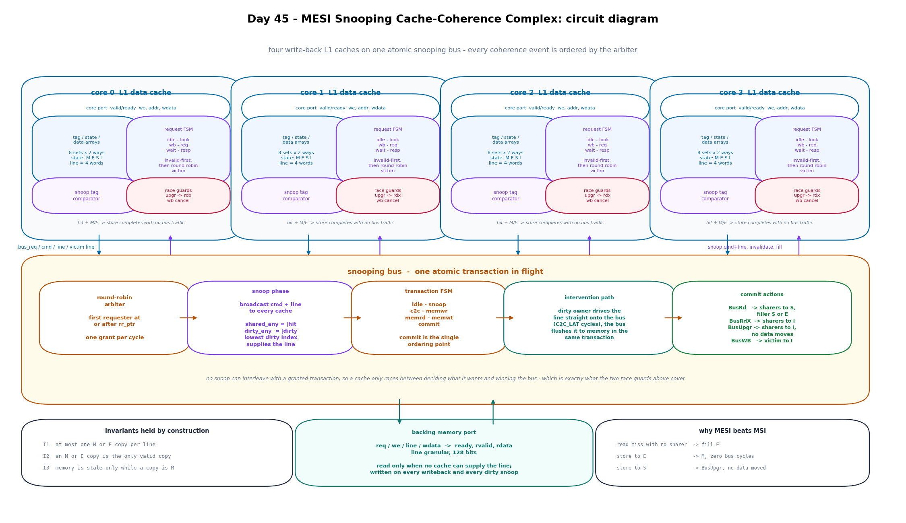
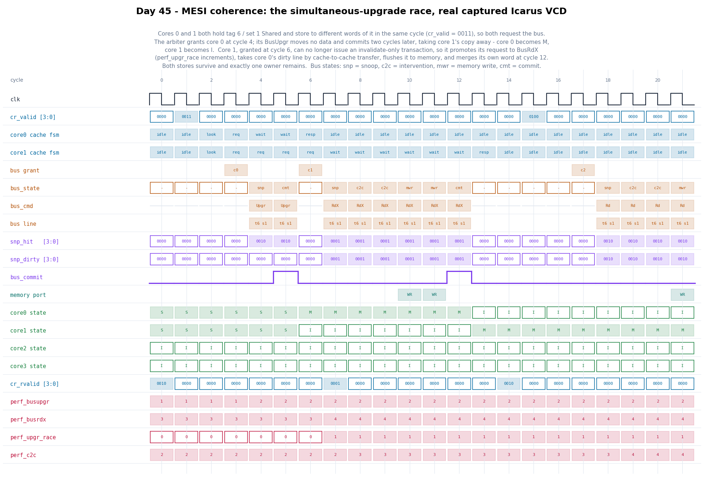

# Day 45 — MESI Snooping Cache-Coherence Complex (4-core, cache-to-cache)

A complete shared-memory coherence subsystem: four write-back, write-allocate L1
data caches, each tracking a **MESI** state per line, tied together by an atomic
snooping bus with round-robin arbitration and a single backing-memory port.

Earlier days built the pieces of a memory system in isolation — [Day 39](../Day39)
a write-back L1 cache, [Day 40](../Day40) a page-table walker, [Day 43](../Day43)
the interconnect, [Day 44](../Day44) the DRAM controller. Every one of those
assumed a single requester. This one removes that assumption, and the problem
changes character completely: correctness is no longer about one FSM's timing but
about a *global invariant* holding across four caches that each see only part of
what is happening.

The interesting content is not the four-state diagram — that fits on a napkin.
It is the two races that appear because a cache spends many cycles between
deciding what permission it wants and actually winning the bus, and what it has
to do when the world changed underneath it in that window.

## Features

- **Full MESI, with the optimisations that justify it over MSI.**
  - **E (Exclusive-clean).** A read miss that no other cache answers fills in
    **E**, so a later store upgrades **E → M silently**: no bus transaction at
    all. The testbench asserts this by snapshotting *every* bus counter across
    such a store and requiring all of them to be unchanged.
  - **BusUpgr.** A store hitting a **shared** line needs permission, not data,
    so it issues an invalidate-only transaction — no memory read, no line
    transfer.
  - **Cache-to-cache intervention.** If a snooped line is dirty in another
    cache, that cache drives it straight onto the bus (`C2C_LAT` cycles) and the
    bus flushes it to memory in the same transaction, instead of paying the full
    memory read latency.
- **Two protocol races handled explicitly, and directly tested:**
  - **Upgrade race.** Two caches hold a line in **S** and store to it in the
    same cycle. Both request `BusUpgr`; the arbiter picks one, and its
    transaction invalidates the loser's copy. The loser must *not* go on to
    issue `BusUpgr` — it has no line left, so an invalidate-only transaction
    would leave it claiming **M** over stale data. It detects the lost copy and
    promotes its own request to `BusRdX`. The promotion is **combinational** on
    the request outputs, because a registered promotion could be granted in the
    same cycle it is decided, and the arbiter would latch the stale command.
  - **Writeback race.** A cache waiting for the bus to write back a dirty victim
    gets snooped on that very line, supplies it by intervention, and the bus
    flushes it. The pending writeback is now redundant and is cancelled rather
    than issued.
  - **Snoop-versus-hit collision.** A silent **E → M** upgrade can land in the
    same cycle as an incoming invalidate for that line. The bus commit is the
    ordering point, so the hit loses: the lookup is retried next cycle against
    the updated state, and the store re-resolves as a `BusRdX`.
- **Atomic snooping bus** — round-robin arbiter, broadcast snoop phase with
  `shared`/`dirty` aggregation, intervention path, memory port, and a single
  `commit` state that is the only place coherence state changes. Exactly one
  transaction is in flight, which is what makes the protocol verifiable.
- **Invalid-ways-first, then round-robin replacement.** Dirty victims are
  written back; clean **S**/**E** victims are dropped silently — legal precisely
  because invariant I3 below says memory is already current for them.
- **Full observability.** Every cache's per-way state and tag is flattened onto
  debug buses, so the testbench can decode the entire coherence state of the
  machine every cycle. Fourteen performance counters cover bus traffic,
  intervention, invalidation, downgrades, memory traffic, silent upgrades,
  promoted upgrades, and cancelled writebacks.

The three invariants the design maintains, and the testbench checks:

| # | Invariant |
|---|---|
| I1 | at most one cache holds a given line in **M** or **E** |
| I2 | if any cache holds a line in **M** or **E**, it is the **only** valid copy |
| I3 | backing memory is stale for a line **only** while some cache holds it in **M** |

## Circuit diagram



*Circuit/dataflow diagram of the implemented design: the four L1 caches with
their tag/state/data arrays, request FSMs, snoop comparators and race guards;
the snooping bus with its arbiter, snoop-aggregation phase, transaction FSM,
intervention path and commit actions; and the line-granular memory port. This is
a hand-drawn documentation image, not a simulator screenshot.*

## Parameters

| Parameter | Default | Meaning |
|---|---|---|
| `NUM_CORES` | 4 | coherent caches on the bus |
| `SETS` | 8 | sets per cache (power of two) |
| `WAYS` | 2 | associativity |
| `LINE_WORDS` | 4 | words per coherence line (power of two) |
| `DATA_W` | 32 | word width |
| `TAG_W` | 4 | address tag bits |
| `C2C_LAT` | 2 | cache-to-cache intervention transfer cycles |

Derived, not to be overridden: `SIDX = $clog2(SETS)`,
`WOFF = $clog2(LINE_WORDS)`, `CSEL = $clog2(NUM_CORES)`,
`ADDR_W = TAG_W + SIDX + WOFF`, `LADDR_W = TAG_W + SIDX`,
`LINE_W = LINE_WORDS * DATA_W`.

With the defaults each cache holds 16 lines of 4 words, and the address space is
128 lines / 512 words — small enough that the testbench can compare the whole
memory against its golden model word for word.

## Ports

Per-core ports are flattened into packed vectors (`core_addr_i[c*ADDR_W +: ADDR_W]`
is core `c`'s address) so the top level stays synthesizable without SystemVerilog
interfaces.

| Port | Dir | Width | Meaning |
|---|---|---|---|
| `clk` | in | 1 | clock |
| `rst_n` | in | 1 | asynchronous active-low reset |
| `core_req_valid_i` | in | `NUM_CORES` | per-core request valid |
| `core_req_ready_o` | out | `NUM_CORES` | that core's cache is idle |
| `core_we_i` | in | `NUM_CORES` | 1 = store, 0 = load |
| `core_addr_i` | in | `NUM_CORES*ADDR_W` | word address `{tag, set, word}` |
| `core_wdata_i` | in | `NUM_CORES*DATA_W` | store data |
| `core_resp_valid_o` | out | `NUM_CORES` | operation complete (1-cycle pulse) |
| `core_rdata_o` | out | `NUM_CORES*DATA_W` | load data |
| `mem_req_o` | out | 1 | memory request |
| `mem_we_o` | out | 1 | 1 = line write, 0 = line read |
| `mem_line_o` | out | `LADDR_W` | line address |
| `mem_wdata_o` | out | `LINE_W` | line write data |
| `mem_ready_i` | in | 1 | memory accepted the request |
| `mem_rvalid_i` | in | 1 | read data valid |
| `mem_rdata_i` | in | `LINE_W` | read data |
| `dbg_state_o` | out | `NUM_CORES*SETS*WAYS*2` | MESI state of every way |
| `dbg_tag_o` | out | `NUM_CORES*SETS*WAYS*TAG_W` | tag of every way |
| `dbg_fsm_o` | out | `NUM_CORES*4` | each cache's request FSM state |
| `bus_active_o` | out | 1 | a transaction is in flight |
| `bus_cmd_o` | out | 2 | current bus command |
| `bus_line_o` | out | `LADDR_W` | current bus line |
| `bus_owner_o` | out | `CSEL` | which core owns the transaction |
| `bus_state_o` | out | 3 | bus FSM state |
| `bus_commit_o` | out | 1 | the ordering point of the transaction |
| `bus_gnt_o` | out | `NUM_CORES` | grant vector (at most one hot) |
| `snp_hit_o` | out | `NUM_CORES` | which caches hold a valid copy |
| `snp_dirty_o` | out | `NUM_CORES` | which cache will supply it |
| `perf_*_o` | out | 32 each | 14 performance counters |

Core ports accept **one outstanding request per core**; `core_req_ready_o[c]`
falls until that operation retires.

## Line states and bus commands

| State | Encoding | Meaning |
|---|---|---|
| `I` | 0 | invalid |
| `S` | 1 | shared, clean, other copies may exist |
| `E` | 2 | exclusive, clean, the only cached copy |
| `M` | 3 | modified, the only cached copy, memory is stale |

| Command | Encoding | Data moved | Issued when |
|---|---|---|---|
| `BusRd` | 0 | line → requester | load miss |
| `BusRdX` | 1 | line → requester | store miss, or a promoted `BusUpgr` |
| `BusUpgr` | 2 | none | store hitting a line held in `S` |
| `BusWB` | 3 | victim → memory | a dirty victim is evicted |

## Block diagram

```
    core 0            core 1            core 2            core 3
      | valid/ready     |                 |                 |
      | we/addr/wdata   |                 |                 |
 +----v-----------+ +---v------------+ +--v-------------+ +--v-------------+
 |  L1 cache 0    | |  L1 cache 1    | |  L1 cache 2    | |  L1 cache 3    |
 |                | |                | |                | |                |
 | tag/state/data | |      ...       | |      ...       | |      ...       |
 |  8 sets x 2 w  | |                | |                | |                |
 | MESI per way   | |                | |                | |                |
 |                | |                | |                | |                |
 | request FSM    | |                | |                | |                |
 | idle-look-wb   | |                | |                | |                |
 | -req-wait-resp | |                | |                | |                |
 |                | |                | |                | |                |
 | snoop compare  | |                | |                | |                |
 | race guards:   | |                | |                | |                |
 |  upgr -> rdx   | |                | |                | |                |
 |  wb cancel     | |                | |                | |                |
 +--|----------^--+ +--|----------^--+ +--|----------^--+ +--|----------^--+
    | req      | snoop  | req     |       | req     |       | req     |
    | cmd/line | inval  |         |       |         |       |         |
    | victim   | fill   |         |       |         |       |         |
 +--v----------|-------v---------|-------v---------|-------v---------|----+
 |                      SNOOPING BUS  (atomic, one transaction)           |
 |                                                                        |
 |  round-robin  ->  snoop phase   ->  transaction  ->  intervention      |
 |  arbiter          broadcast to        FSM             dirty owner       |
 |  first requester  every cache         idle-snoop      drives the line   |
 |  at/after rr_ptr  shared_any=|hit     c2c-memwr        onto the bus,    |
 |  one grant/cycle  dirty_any =|dirty   memrd-memwt      bus flushes it   |
 |                   lowest dirty        commit           to memory        |
 |                   index supplies                                       |
 |                                                                        |
 |  commit actions:  BusRd   -> sharers S, filler E if nobody else had it  |
 |                   BusRdX  -> sharers I                                 |
 |                   BusUpgr -> sharers I, no data moves                  |
 |                   BusWB   -> victim I                                  |
 +---------------------------|--------------------^-----------------------+
                             | req/we/line/wdata  | ready/rvalid/rdata
                        +----v--------------------|----+
                        |   backing memory (line wide) |
                        +------------------------------+
```

## How it works

**A core operation** is latched into the cache and resolved by a six-state FSM:
`idle → look → (wb) → (req → wait) → resp`.

`look` does the tag/state lookup and decides the whole transaction in one cycle:

| Lookup result | Action | Bus traffic |
|---|---|---|
| load hit, `S`/`E`/`M` | return the word | none |
| store hit, `M` | write the word | none |
| store hit, `E` | write the word, `E → M` | **none** |
| store hit, `S` | need permission | `BusUpgr` |
| miss, victim clean or invalid | allocate | `BusRd` / `BusRdX` |
| miss, victim `M` | write back first | `BusWB`, then `BusRd` / `BusRdX` |

**A bus transaction** runs `idle → snoop → (c2c) → (memwr | memrd → memwt) →
commit`:

1. **Arbitration** (`idle`). The arbiter picks the first requester at or after a
   rotating pointer and asserts a single grant. The winner's command, line and —
   for a writeback — victim data are latched.
2. **Snoop** (`snoop`). The command and line are broadcast to every cache. Each
   cache combinationally compares against its registered tags and drives
   `snp_hit` (I hold a valid copy) and `snp_dirty` (…and it is modified). The bus
   reduces these to `shared_any` and `dirty_any`, and picks the lowest-indexed
   dirty cache as the supplier.
3. **Data movement.** With a dirty supplier the line is taken off that cache
   (`c2c`, `C2C_LAT` cycles) and written to memory in the same transaction, so
   memory ends up clean. With no dirty supplier a `BusRd`/`BusRdX` reads memory;
   `BusUpgr` moves no data at all and skips straight to commit.
4. **Commit** (`commit`). The single ordering point. Sharers are downgraded to
   `S` (on `BusRd`) or invalidated (on `BusRdX`/`BusUpgr`), and the requester is
   filled: `S` if anyone else had a copy, **`E` if nobody did**.

**Why the `E` decision matters.** `fill_shared` is just `shared_any` from the
snoop phase, and it is the entire difference between MESI and MSI. Fill in `E`
and the common private-data pattern — load a location, then store to it — costs
one bus transaction instead of two. Two caches racing to read the same line do
not break it: the first fills in `E`, and the second's `BusRd` snoops that copy,
so `shared_any` is set for the second *and* the first is downgraded `E → S` by
the same commit.

**Why the races exist at all.** The bus is atomic, so no snoop can interleave
with a *granted* transaction. The only exposed window is between a cache
deciding what it wants and winning the bus — which can be many cycles under
contention. That window is exactly where the upgrade promotion and the writeback
cancellation live, and it is why the promotion has to be combinational rather
than registered.

## Simulation timing



**A real captured waveform**, rendered directly from the VCD that `make icarus`
produces — not a hand-drawn diagram. The window is stimulus phase 7, the
simultaneous-upgrade race.

Cores 0 and 1 both hold tag 6 / set 1 in `S` and store to different words of it
in the same cycle (`cr_valid = 0011` at cycle 1), so both request the bus. The
arbiter grants core 0 at cycle 4; its `BusUpgr` moves no data — note the memory
port stays idle — and commits two cycles later, leaving core 0 in `M` and core 1
in `I`. Core 1 is granted at cycle 6, but its shared copy is gone, so the
command on the bus is already the promoted `BusRdX` (`perf_upgr_race`
increments): it takes core 0's now-dirty line by cache-to-cache transfer
(`snp_dirty = 0001`), the bus flushes that line to memory (`mwr`), and core 1
merges its own word at cycle 12. Core 0 drops to `I`.

Both stores survive, exactly one owner remains, and the `perf_busupgr` /
`perf_busrdx` / `perf_upgr_race` counters step exactly once each — which is what
the testbench asserts for this phase.

## Running it

```bash
cd Day45
make icarus     # compile + run the self-checking testbench (Icarus)
make seeds      # re-run across six random seeds
make figures    # regenerate both images from the captured VCD
make waves      # open the VCD in GTKWave
make lint       # Verilator lint (if installed)
```

Other simulators: `make verilator`, `make vcs`, `make questa`.

Verified here with **Icarus Verilog 13.0** (`iverilog -g2012`). The Verilator,
VCS and Questa targets are provided but untested in this environment. Icarus
prints a few `sorry: constant selects in always_* processes ...` notes while
elaborating; they are conservative sensitivity warnings, not errors, and the run
completes normally.

```
=========================================================
 Day 45 - MESI snooping cache-coherence complex
  cores=4  cache=8x2 lines of 4 words  tags=16 (13 for traffic)
  memory=128 lines (512 words)  C2C_LAT=2  mem read lat=4+
  seed=1
=========================================================
[96070000] backdoor memory compare over 512 words: clean
---------------------------------------------------------
 core operations   1022  (reads 531, writes 491)
 cache hits 169  misses 855  silent E->M upgrades 8
 BusRd 418  BusRdX 357  BusUpgr 80  writeback 125
 cache-to-cache transfers 320  invalidations 389  M/E->S downgrades 390
 memory reads 455  memory writes 445
 promoted upgrades 1  cancelled writebacks 7
 coherence sweeps: 167247 line-level memory checks
---------------------------------------------------------
RESULT: *** PASS ***
```

`make seeds` passes on all six seeds (1, 7, 42, 2026, 31337, 99991).

The low hit rate is the point of the stimulus, not a weakness of the caches: the
soak aims 70 % of four cores' traffic at eight shared lines, so most misses are
*coherence* misses — a line invalidated by somebody else's store — rather than
capacity misses. That is also why 320 of the 775 line fetches are answered by
another cache instead of by memory, and why 125 writebacks were needed for 491
stores.

## What the testbench checks

Three independent checkers constrain the design from different directions. None
of them predicts the *schedule* — arbitration order and intervention are the
features under test.

| # | Checker | What it proves |
|---|---|---|
| 1 | **Golden word memory** | Every operation is checked against a flat reference memory. A per-line software lock keeps at most one operation in flight per coherence line, so every load has exactly one legal value — any lost store, stale hit, or mis-merged line surfaces immediately. Stores commit to the golden model when they retire, not when they are accepted. |
| 2 | **Coherence invariant checker** | Decodes all four caches' states and tags out of the debug buses and proves **I1**, **I2** and **I3** (see above) at every bus commit and periodically in between — the periodic sweep is what covers the silent `E → M` upgrade, which changes state with no bus event to hang a check on. Over a run this is ~167 000 line-level memory-versus-golden comparisons. |
| 3 | **Protocol-event checker** | Directed phases assert the exact bus traffic a correct MESI implementation must generate, counter by counter. |

Plus, continuously: at most one grant asserted per cycle, no cache asserting
snoop-dirty without snoop-hit, every cache invalid out of reset, the bus and
memory port quiet during reset, nothing left in flight at the end, and a
2 000 000-cycle watchdog that fails the run rather than hanging it.

Stimulus is ten phases, directed first and then randomized:

| Phase | What it exercises | Assertion |
|---|---|---|
| 1 | cold load miss, no other sharer | exactly 1 `BusRd`, 1 memory read, 0 intervention, and the line fills **`E`** — not `S` |
| 2 | store to that `E` line | **every** bus counter unchanged, `silent_upgr` +1, line now `M` |
| 3 | three cores read the dirty line | 3 `BusRd`, 1 cache-to-cache transfer, 1 memory write (the flush), 2 memory reads, all four caches end `S` |
| 4 | store to a shared line | 1 `BusUpgr`, 0 `BusRdX`, **0 memory reads and 0 memory writes**, 3 invalidations, one owner |
| 5 | store to a line dirty in another cache | 1 `BusRdX`, 1 intervention, 0 memory reads, 1 flush; the earlier core's word survives the transfer |
| 6 | fill a set with dirty lines, then miss into it | exactly 1 writeback and 1 memory write; the evicted line still reads back correctly |
| 7 | **two cores store to one shared line in the same cycle** | 1 `BusUpgr` + 1 promoted `BusRdX`, `upgr_race` +1, exactly one owner and one invalid copy, and **both** stores visible afterwards |
| 8 | false-sharing ping-pong, four cores on four words of one line | heavy intervention traffic (≥ 10 transfers), every word correct when read from a different core |
| 9 | 880 randomized operations, four concurrent cores, 70 % aimed at a hot shared working set, random idle gaps | all three checkers under real contention |
| 10 | conflict-eviction drain, then a backdoor compare | no traffic line left cached anywhere, all 512 words of memory equal the golden model, and the design's own memory counters equal the model's independently counted traffic |

Phase 10's drain reads `WAYS+1` reserved tags per set rather than `WAYS`: with
invalid-ways-first replacement the round-robin pointer does not necessarily
alternate, so `WAYS` conflicting fills can land twice in the same way and leave a
real line resident.

The checkers were validated by mutation — three protocol bugs injected into the
RTL are each caught, by a different checker:

| Injected bug | Caught by |
|---|---|
| fill `S` instead of `E` (drop the MESI optimisation) | phase 1 state check, then phase 2's zero-bus-traffic assertion |
| forget to invalidate other copies on `BusUpgr` | **I2** invariant checker, within 74 cycles |
| skip the memory flush on a dirty intervention | golden memory (a stale load), then phase 3's memory-write count |
