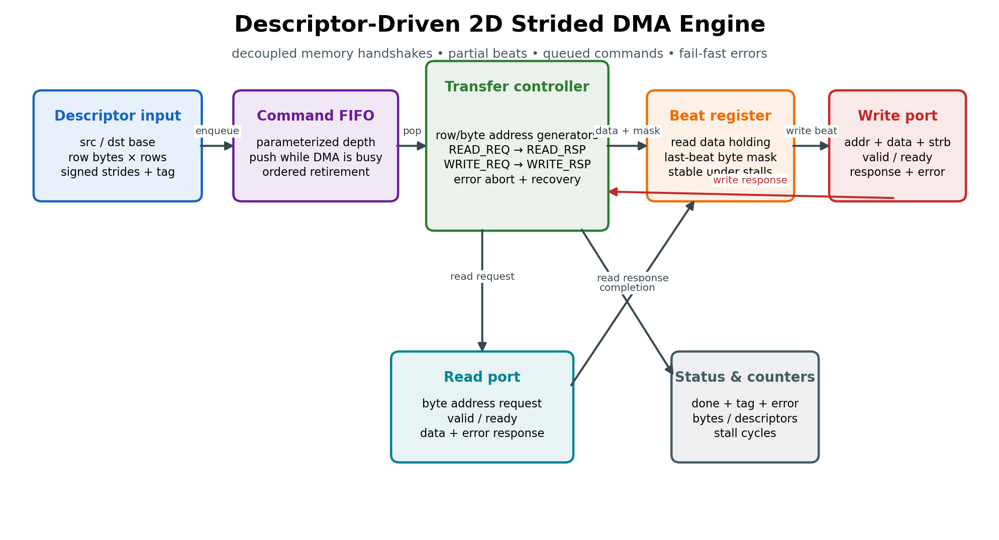
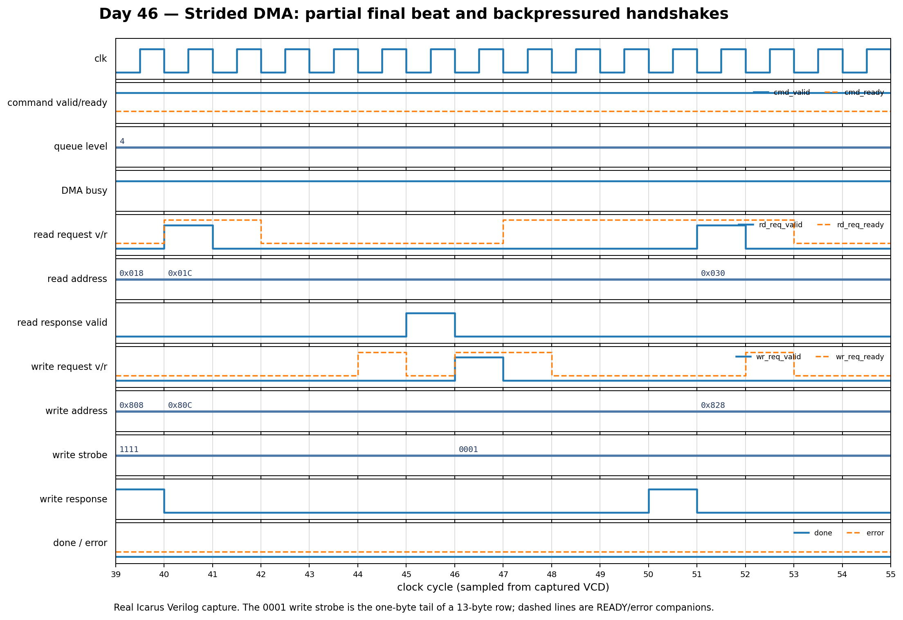

# Day 46 — Descriptor-Driven 2D Strided DMA Engine

A synthesizable direct-memory-access engine that moves rectangular byte regions
between two decoupled memory ports. Each descriptor specifies source and
destination bases, bytes per row, number of rows, and independent signed row
strides. This is the hardware pattern behind image planes, tensor tiles, pitched
frame buffers, packet scatter/gather, and accelerator scratchpad transfers.

Unlike a classroom single-shot copier, this design accepts new work into a
parameterized command FIFO while an earlier descriptor is still running,
preserves every VALID payload across arbitrary READY stalls, emits byte strobes
for a partial final beat, retires descriptors in order with their tags, and
contains read/write response faults to the active descriptor so queued work can
continue.

## Features

- **Queued tagged descriptors.** A `CMD_DEPTH`-entry FIFO decouples command
  submission from memory latency. `cmd_ready_o` provides natural backpressure;
  `done_tag_o` identifies each in-order completion.
- **True 2D address generation.** Every row restarts at
  `base + row_index * stride`. Source and destination strides are independent
  signed two's-complement values, so the engine supports padded, cropped, and
  vertically reversed layouts.
- **Byte-exact tails.** A row need not be a multiple of the datapath width. The
  final beat carries a computed low-byte write strobe, leaving adjacent bytes
  untouched.
- **Four independent decoupled handshakes.** Read request, read response, write
  request, and write response each tolerate unbounded backpressure. Address,
  data, and strobe are held in registers whenever the receiver stalls.
- **Fail-fast fault containment.** A read or write response error completes the
  current descriptor with `error_o=1`, discards its remaining rows, and starts
  the next queued command. Zero rows or zero row bytes are rejected the same
  way without issuing memory traffic.
- **Operational counters.** Completed byte count, descriptor count (successful
  and failed), and memory-stall cycles expose useful integration telemetry.
- **Reset-safe and lint-friendly.** Active-low asynchronous reset clears the
  FIFO, FSM, status pulses, holding registers, and counters; the RTL uses no
  inferred latches or unsynthesizable datapath constructs.

## Circuit diagram



*Documentation circuit/dataflow diagram of the implemented RTL. It is a drawn
architectural diagram, not a simulator screenshot.*

## Parameters

| Parameter | Default | Meaning |
|---|---:|---|
| `ADDR_W` | 16 | Byte-address width |
| `DATA_W` | 32 | Read/write beat width; must be divisible by 8 |
| `LEN_W` | 16 | Width of the per-row byte count |
| `ROW_W` | 8 | Width of the row count and row index |
| `TAG_W` | 8 | Descriptor completion-tag width |
| `CMD_DEPTH` | 4 | Number of queued descriptors; minimum 2 |

`BYTE_LANES = DATA_W/8`. Transfers use low byte lanes first on the final beat;
the memory adapter may map the abstract ports to AXI, Avalon, Wishbone, SRAM, or
another request/response fabric.

## Ports

### Descriptor and status

| Port | Dir | Width | Meaning |
|---|---|---:|---|
| `cmd_valid_i` / `cmd_ready_o` | in/out | 1 | Descriptor enqueue handshake |
| `cmd_src_addr_i` | in | `ADDR_W` | First row's source byte address |
| `cmd_dst_addr_i` | in | `ADDR_W` | First row's destination byte address |
| `cmd_row_bytes_i` | in | `LEN_W` | Bytes copied per row; zero is rejected |
| `cmd_rows_i` | in | `ROW_W` | Number of rows; zero is rejected |
| `cmd_src_stride_i` | in | `ADDR_W` signed | Source row-start increment |
| `cmd_dst_stride_i` | in | `ADDR_W` signed | Destination row-start increment |
| `cmd_tag_i` | in | `TAG_W` | Tag returned at completion |
| `busy_o` | out | 1 | Active transfer or queued descriptor exists |
| `queue_level_o` | out | `clog2(CMD_DEPTH+1)` | FIFO occupancy |
| `done_o` / `error_o` | out | 1 each | One-cycle completion and failure pulses |
| `done_tag_o` | out | `TAG_W` | Tag of the descriptor that retired |
| `perf_bytes_o` | out | 32 | Successfully written bytes |
| `perf_desc_o` | out | 32 | Retired descriptors, including errors |
| `perf_stall_cycles_o` | out | 32 | Cycles blocked on a memory handshake |

### Abstract memory interfaces

| Port | Dir | Width | Meaning |
|---|---|---:|---|
| `rd_req_valid_o` / `rd_req_ready_i` | out/in | 1 | Read-address handshake |
| `rd_req_addr_o` | out | `ADDR_W` | Byte address of the next source beat |
| `rd_rsp_valid_i` / `rd_rsp_ready_o` | in/out | 1 | Read-data handshake |
| `rd_rsp_data_i` | in | `DATA_W` | Read beat captured before write issue |
| `rd_rsp_error_i` | in | 1 | Abort the active descriptor on this response |
| `wr_req_valid_o` / `wr_req_ready_i` | out/in | 1 | Write-beat handshake |
| `wr_req_addr_o` | out | `ADDR_W` | Destination byte address |
| `wr_req_data_o` | out | `DATA_W` | Held read data |
| `wr_req_strb_o` | out | `DATA_W/8` | One enable per destination byte lane |
| `wr_rsp_valid_i` / `wr_rsp_ready_o` | in/out | 1 | Write-completion handshake |
| `wr_rsp_error_i` | in | 1 | Abort the active descriptor on this response |

## ASCII block diagram

```text
 descriptor channel
 src/dst, row bytes, rows, strides, tag
             |
             v
      +---------------+      +----------------------------------+
      | command FIFO  |----->| descriptor + row/beat controller |
      | CMD_DEPTH     |      | row bases, bytes-left, tag       |
      +---------------+      +---------+------------------------+
                                        |
                    +-------------------+-------------------+
                    |                                       |
             +------v------+                         +------v------+
             | read port   |                         | write port  |
             | req / rsp   |----> data holding ---->| data / strb |
             | backpressure|      + tail mask        | req / rsp   |
             +-------------+                         +-------------+
                    |                                       |
                    +-------------------+-------------------+
                                        |
                              done / error / tag
                              bytes / desc / stalls
```

## How it works

The FIFO can push a new descriptor in the same cycle the controller pops the
oldest one. The controller snapshots that entry, checks for illegal zero
dimensions, and then repeats one five-state beat transaction:

1. `RD_REQ` holds the source byte address until accepted.
2. `RD_RSP` waits for data or an error response.
3. A successful read is captured in `read_data_q`; the controller computes
   `write_strb_q` from `min(bytes_left, BYTE_LANES)`.
4. `WR_REQ` holds destination address, data, and strobe until accepted.
5. `WR_RSP` waits for completion. Only a successful write increments
   `perf_bytes_o` and advances the address generator.

For a full beat, both addresses advance by `BYTE_LANES`. At the row tail, the
next addresses are computed from the saved row bases plus the signed strides —
not from the padded beat address — so arbitrary pitch is exact. After the final
row, `done_o` pulses with the descriptor tag. A response error takes the same
retirement path with `error_o` asserted and leaves later FIFO entries intact.

The transfer order is intentionally one read followed by one write. That keeps
the protocol adapter small, gives precise error boundaries, and guarantees the
holding register is never overwritten under write backpressure. A higher
throughput implementation can replace that register with a data FIFO and allow
multiple outstanding reads without changing the descriptor contract.

## Simulation timing



*A real waveform captured from the Icarus Verilog VCD and rendered to PNG. The
window shows the end of the first 13-byte row under randomized request/response
stalls: three full `1111` writes are followed by a `0001` tail strobe at address
`0x80C`, so exactly one final byte changes. The next source/destination row
starts at the programmed strides (`0x030` and `0x828`).*

## Running it

```bash
make icarus      # Icarus Verilog (default)
make verilator   # Verilator timed binary
make vcs         # Synopsys VCS
make questa      # Siemens Questa
make lint        # Verilator lint
make seeds       # six randomized Icarus runs
```

Every simulation writes `strided_dma.vcd`. Use `make waves` when GTKWave is
installed.

## What the self-checking testbench verifies

The testbench uses a byte-addressed behavioral memory with independently
randomized read-request, read-response, write-request, and write-response
latency. Its golden memory is structurally separate from the DUT and applies
each descriptor as a scalar nested row/byte loop.

Coverage includes:

- a three-row, 13-byte unaligned transfer and its one-byte final strobe;
- back-to-back descriptor submission until the command FIFO backpressures;
- independent source/destination pitches and partial/full final beats;
- zero-length rejection with no memory modification;
- an injected read-response failure followed by a successful recovery command;
- 80 randomized 2D descriptors with randomized memory stalls;
- exact in-order completion tag and error-bit checking;
- full 4096-byte DUT-memory versus golden-memory comparison;
- byte, descriptor, and stall-counter checks; and
- a 200,000-cycle watchdog timeout.

The default seed completes **86 descriptors**, checks the entire memory image,
and prints `RESULT: *** PASS ***` only when every comparison succeeds.
