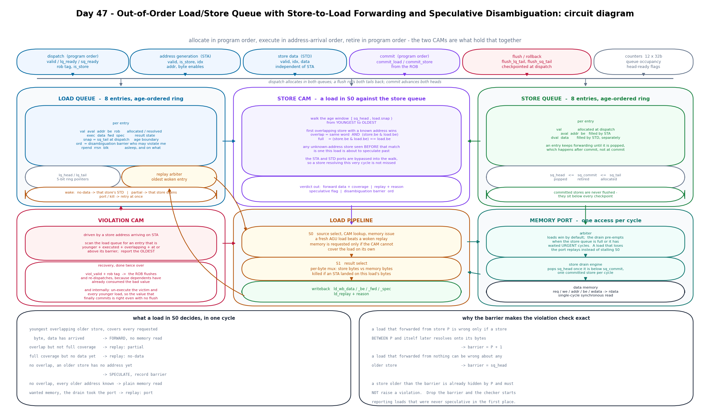
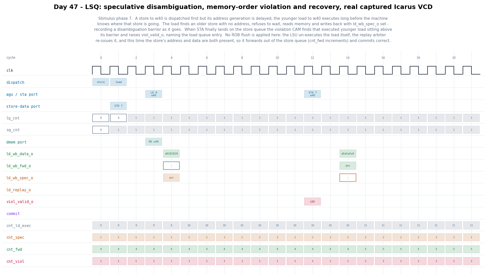

# Day 47 — Out-of-Order Load/Store Queue with Store-to-Load Forwarding and Speculative Memory Disambiguation

The memory pipeline of an out-of-order core. Loads and stores are allocated into
two age-ordered circular queues **in program order** at dispatch, execute in
whatever order their addresses and data happen to arrive, and retire **in program
order**. All of the difficulty lives in the middle step.

[Day 41](../Day41) built the Tomasulo engine that reorders arithmetic, and
[Day 39](../Day39) built the cache underneath. Neither had to answer the question
this design exists for: a load may need a value that is still sitting in the store
queue rather than in memory — and it may need it *before the machine knows which
addresses the older stores are even going to touch*.

Registers make dependences easy, because a register name is known at decode.
Memory dependences are not known until address generation, which happens after
issue. So the load/store unit is the one place in the machine that has to make a
dependence decision on incomplete information, notice later that it guessed wrong,
and undo it.

## Features

- **Store-to-load forwarding out of the store queue.** A load CAMs the store queue
  over exactly the age window of stores older than itself and takes the data of the
  **youngest overlapping** one. Age is a circular-pointer comparison, never an index
  comparison — two entries at indices 6 and 1 can be in either order depending on
  where the head is.
- **Forwarding failure → replay, with a targeted wake-up.** Real forwarding networks
  only forward when *one* store covers every byte the load wants and that store's
  data has already arrived. Everything else sleeps:
  | reason | when | woken by |
  |---|---|---|
  | `partial` | overlap, but the store does not cover every requested byte | that store draining to memory |
  | `no-data` | full coverage, but STD has not delivered yet | that store's STD arriving |
  | `port` | the load needed memory and the store drain pre-empted it | immediately |
  | `kill` | a store address landed on the load while it was in S1 | immediately |
  Each sleeping load records **which store** blocked it, so it re-issues on that
  store specifically instead of spinning on every idle cycle.
- **Speculative disambiguation.** A load that reaches execute while an older store
  still has no address does **not** wait for it. It goes to memory, reports
  `ld_wb_spec_o`, and records a **disambiguation barrier**: the store-queue pointer
  above which a later-resolving store would invalidate it.
- **Exact violation detection.** When a store's address finally arrives it CAMs the
  load queue for younger executed loads that overlap **and sit at or above their
  barrier**, and reports the oldest as a memory-order violation.
- **Recovery done twice over.** `viol_valid_o` + the ROB tag lets an external ROB
  flush and redirect — which a real machine must do, since dependents of the bad
  load have already consumed it. Independently, the LSU un-executes the victim and
  every younger load itself, so that if no flush arrives the value that finally
  commits is still correct. The testbench exercises both paths.
- **Store drain with anti-starvation.** Committed stores drain from the head, one
  per cycle, and keep forwarding until they are actually popped. Loads win the single
  memory port by default; the drain pre-empts when the queue is full or it has waited
  `URGENT` cycles, which is the only thing keeping a steady stream of loads from
  starving it forever.
- **Checkpoint/rollback.** Dispatch publishes the pre-allocation tail pointers so the
  ROB can checkpoint them per instruction; a flush restores both tails and invalidates
  everything above them. Committed stores are never flushed — they sit below every
  checkpoint by construction.

### The barrier is what makes the violation check exact

This is the part worth dwelling on, because the naive version is both wrong and
expensive:

- A load that forwarded from store **P** is only wrong if a store **between P and
  itself** later resolves onto its bytes. A store *older* than P is already hidden by
  P and must **not** raise a violation. → barrier = `P + 1`
- A load that forwarded from nothing can be wrong about **any** older store.
  → barrier = `sq_head`

A pleasant consequence: a load that had no unknown-address store above its source can
never be violated at all, and the barrier arithmetic proves that without a separate
speculation bit. `ld_wb_spec_o` is therefore pure observability — and the testbench
asserts that every reported violation names a load that had it set, which is a real
cross-check rather than a tautology.

### Three same-cycle races

Address resolution, data delivery and load execution are independent events on
independent ports, so they collide:

| race | what breaks | fix |
|---|---|---|
| STA resolves in the same cycle a load is in **S0** | the CAM reads the still-unknown entry and speculates past a store whose address is on the input pins — and the violation CAM misses it too, because the load is not yet marked executed | the STA port is bypassed into the CAM walk |
| STA resolves while the load is in **S1** | too late to bypass: the forwarding decision was made last cycle against an entry that has since changed | the writeback is killed and the load replays (`kill`) |
| STD arrives in the same cycle a load is in **S0** | a pointless `no-data` replay | the STD port is bypassed too |

A fourth one is a flush landing on a load in S1. S0 had already cleared that load's
replay-pending bit on the way in, so unless the flush explicitly re-arms it the entry
sits valid and addressed forever — never executed, never scheduled. The replay
arbiter only looks at replay-pending entries, and its address generation has already
happened, so nothing else will ever pick it up. This was a real deadlock found by the
randomized flush soak, not a hypothetical; see the flush branch in
[`lsq_disambiguation.sv`](lsq_disambiguation.sv).

## Circuit diagram



*Circuit/dataflow diagram of the implemented design: the two age-ordered queues and
their entry state, the store CAM with its age window and same-cycle bypasses, the
violation CAM and its two recovery paths, the two-stage load pipeline with the
per-byte forwarding mux, the replay arbiter and its wake rules, and the memory port
arbiter with the store drain engine. This is a hand-drawn documentation image, not a
simulator screenshot.*

## Parameters

| Parameter | Default | Meaning |
|---|---|---|
| `LQ_DEPTH` | 8 | load queue entries (power of two) |
| `SQ_DEPTH` | 8 | store queue entries (power of two) |
| `ADDR_W` | 12 | byte-address width |
| `DATA_W` | 32 | data word width (multiple of 8) |
| `ROB_W` | 6 | reorder-buffer tag width |
| `URGENT` | 3 | drain-starvation threshold, in cycles |

Derived, not to be overridden: `NB = DATA_W/8`, `LQ_AW = $clog2(LQ_DEPTH)`,
`SQ_AW = $clog2(SQ_DEPTH)`, `LPTR_W = LQ_AW + 2`, `SPTR_W = SQ_AW + 2`,
`WOFF = $clog2(NB)`, `WADDR_W = ADDR_W - WOFF`.

**Why the pointers are two bits wider than the index**, not the usual one: the age
comparisons need to distinguish "this pointer is ahead of the head" from "this pointer
has fallen *behind* the head, so its entry is already popped". With a single spare bit
a pointer exactly `SQ_DEPTH` behind the head aliases onto a legal age rank, and the
barrier check silently stops firing. Two spare bits make the wrapped distance
unambiguously larger than `SQ_DEPTH`, so `rel > SQ_DEPTH` is a reliable
"already popped" test.

## Ports

| Port | Dir | Width | Meaning |
|---|---|---|---|
| `clk` | in | 1 | clock |
| `rst_n` | in | 1 | asynchronous active-low reset |
| **Dispatch — program order, one op per cycle** ||||
| `disp_valid_i` | in | 1 | an op is being allocated |
| `disp_is_store_i` | in | 1 | 1 = store, 0 = load |
| `disp_rob_i` | in | `ROB_W` | reorder-buffer tag |
| `disp_lq_ready_o` | out | 1 | load queue has room |
| `disp_sq_ready_o` | out | 1 | store queue has room |
| `disp_lq_idx_o` / `disp_sq_idx_o` | out | `LQ_AW` / `SQ_AW` | slot allocated this cycle |
| `disp_lq_tail_o` / `disp_sq_tail_o` | out | `LPTR_W` / `SPTR_W` | pre-allocation pointers, for the ROB to checkpoint |
| **Address generation (STA / load AGU) — out of order** ||||
| `ag_valid_i` | in | 1 | an address is being resolved |
| `ag_is_store_i` | in | 1 | which queue `ag_idx_i` refers to |
| `ag_idx_i` | in | `SQ_AW` | queue slot |
| `ag_addr_i` | in | `ADDR_W` | naturally aligned byte address |
| `ag_be_i` | in | `NB` | byte enables |
| **Store data (STD) — separate port, out of order** ||||
| `sd_valid_i`, `sd_idx_i`, `sd_data_i` | in | 1, `SQ_AW`, `DATA_W` | store data delivery |
| **Load writeback** ||||
| `ld_wb_valid_o` | out | 1 | a load produced a result this cycle |
| `ld_wb_idx_o`, `ld_wb_rob_o` | out | `LQ_AW`, `ROB_W` | which load |
| `ld_wb_data_o` | out | `DATA_W` | result — **defined only on `ld_wb_be_o` lanes** |
| `ld_wb_be_o` | out | `NB` | the load's byte enables |
| `ld_wb_fwd_o` | out | 1 | sourced from the store queue, not memory |
| `ld_wb_spec_o` | out | 1 | executed past a store with no address |
| `ld_replay_o`, `ld_replay_rsn_o` | out | 1, 2 | put back to sleep instead, and why |
| **Memory-order violation** ||||
| `viol_valid_o`, `viol_idx_o`, `viol_rob_o` | out | 1, `LQ_AW`, `ROB_W` | the oldest load that read a stale value |
| **Commit — program order, from the ROB** ||||
| `commit_load_i`, `commit_store_i` | in | 1 | retire the head load / store |
| `lq_head_ready_o`, `sq_head_ready_o` | out | 1 | the head has a result / has address+data |
| **Flush / rollback** ||||
| `flush_i` | in | 1 | roll back one cycle |
| `flush_lq_tail_i`, `flush_sq_tail_i` | in | `LPTR_W`, `SPTR_W` | checkpointed tails to restore |
| **Data memory — single-cycle synchronous read** ||||
| `dmem_req_o`, `dmem_we_o`, `dmem_addr_o`, `dmem_be_o`, `dmem_wdata_o` | out | 1, 1, `ADDR_W`, `NB`, `DATA_W` | one access per cycle |
| `dmem_rdata_i` | in | `DATA_W` | read data, valid the cycle after the request |
| **Observability** ||||
| `lq_cnt_o`, `sq_cnt_o`, `sq_uncommitted_o` | out | pointer widths | occupancy |
| `cnt_*_o` | out | 32 each | 12 performance counters (see the run output below) |

Simplifying assumptions, all deliberate: **one address-generation event per cycle**
(loads and stores share the STA port, which keeps the CAM single-ported), memory
always hits in one cycle, and accesses are naturally aligned and described by a byte
mask. A load's result word is only architecturally defined on its `be` lanes — the
other lanes carry whatever the memory port happened to return.

## ASCII block diagram

```
   dispatch (program order)      STA        STD        commit      flush
        |          |              |          |            |          |
        v          v              v          v            v          v
  +-----------+   +-------------------------------+   +-----------+
  |  LOAD Q   |   |          STORE CAM            |   | STORE Q   |
  |  8 x      |-->| window [sq_head, load.snap)   |<--| 8 x       |
  |  val aval |   | youngest -> oldest, first hit |   | val aval  |
  |  addr be  |   | + STA/STD same-cycle bypass   |   | dval addr |
  |  exec data|   +---------------+---------------+   | be data   |
  |  snap ord |                   |                   +-----+-----+
  |  rpend blk|                   v                         |
  +--+-----^--+           +---------------+                 |
     |     |              | S0 select/CAM |---------------> | mem
     |     | squash       |    + issue    |   port req      | arb
     v     |              +-------+-------+                 |
  +--------+---+                  v                    +----v-----+
  | VIOLATION  |          +---------------+            | drain +  |
  |    CAM     |          | S1 byte mux   |<-----------| memory   |
  | younger +  |          +-------+-------+  rdata     +----------+
  | executed + |                  v
  | overlap +  |          +---------------+
  | above bar  |--------> |   writeback   | --> data / fwd / spec
  +------------+          +-------+-------+ --> replay + reason
                                  |             viol + rob tag
                          replay  v
                        +-------------------+
                        | replay arbiter    |
                        | oldest woken rpend|
                        +-------------------+
```

## How it works

**Dispatch.** One op per cycle, in program order. A load records `snap` — the value
of `sq_tail` at that moment — which is its permanent age boundary: every store whose
pointer lies in `[sq_head, snap)` is older than it, and no index arithmetic can tell
you that on its own.

**Address generation.** STA writes the address and byte enables into whichever queue
the index refers to. For a *load*, the same event also drives S0 directly: a load's
execution attempt happens in the cycle its address arrives. There is no separate
"issue" step, so every load either fires into S1 or is marked replay-pending in that
one cycle — which is exactly why a flush that kills S1 has to re-arm the entry
explicitly.

**S0 — one cycle, one verdict.** The CAM walks the age window youngest-first. The
first overlapping store with a known address is the forwarding source; any
unknown-address store seen *before* it is one this load is about to speculate past.
From that the stage produces: forward / replay(+reason) / speculate, the barrier, and
whether memory is needed at all. A load that will forward in full never touches the
memory port, which is where the port pressure relief comes from.

**S1 — result select.** A per-byte mux between the forwarded store bytes and the
memory word. If a store address landed on this load's bytes during the gap, the
writeback is suppressed and the load replays.

**Violation.** On every resolving store address, the load queue is scanned oldest-first
for a younger executed load that overlaps and sits at or above its barrier. The oldest
match is reported; the victim and everything younger are un-executed in the same cycle,
and any load of theirs still in S1 has its writeback suppressed rather than broadcast
and retracted.

**Commit and drain.** `sq_head <= sq_commit <= sq_tail`. Commit only advances
`sq_commit`; the entry stays a forwarding source until the drain engine actually pops
it. That is deliberate — a load forwarding from a committed-but-undrained store is
still correct, and dropping the entry at commit would force those loads to memory
before the data was there.

**Forward progress.** Every replay reason terminates: `no-data` waits on an STD that
must eventually arrive, `partial` waits on an older store that must commit before the
load can (in-order retirement) and then drain (the drain wins the port whenever loads
are asleep), and `port`/`kill` retry immediately. A violated load cannot re-violate on
the same store, because that store's address is now known and the next CAM walk will
find it.

## Simulation timing



*A **real captured waveform**, rendered directly from the VCD that `make icarus`
writes — not a hand-drawn diagram. `gen_figures.py` parses `lsq_disambiguation.vcd`,
anchors on the violation inside stimulus phase 7, and plots the surrounding 22 cycles.*

Reading it: a store to `w40` is dispatched at cycle 0 and a load to `w40` at cycle 1,
but the store's address generation is held off until cycle 12. The load's AGU fires at
cycle 2, finds an older store with no address, refuses to wait, reads memory
(`RD w40`) and writes back `a0282828` at cycle 4 with `ld_wb_spec_o` set — `cnt_spec`
goes 1 → 2. At cycle 12 `STA 7 w40` finally lands, the violation CAM finds that
executed younger load above its barrier, and `viol_valid_o` names `LQ0`; `cnt_viol`
goes 1 → 2. Two cycles later the re-issued load writes back `a5a5a5a5` with
`ld_wb_fwd_o` set — `cnt_fwd` goes 4 → 5 — and that is the value that commits.

`ld_replay_o` stays quiet through the whole window, which is the point: this recovery
goes through the violation squash, not through the S0/S1 replay port. The two paths
put loads back to sleep for different reasons and are counted separately.

## Running it

```bash
make icarus     # Icarus Verilog: compile + run the self-checking testbench
```

```bash
make seeds      # re-run the randomized soak under six different seeds
```

```bash
make figures    # regenerate both PNGs from the captured VCD
```

`make verilator`, `make vcs`, `make questa` and `make lint` are wired up the same way.

Verified with **Icarus Verilog 13.0** (`-g2012`). Icarus prints
`sorry: constant selects in always_* processes are not fully supported` for a few
combinational blocks; it falls back to a full sensitivity list, which is correct here.
Actual output:

```
--- phase 1: cold loads, no stores in flight
--- phase 2: full-width store-to-load forward out of the queue
--- phase 3: youngest overlapping store wins the forward
--- phase 4: store data late - RSN_NODATA replay, then forward
--- phase 5: partial overlap - replay until the store drains
--- phase 6: memory-order violation, ROB flushes and re-executes
--- phase 7: same race, no flush - the LSU self-heals
--- phase 8: unknown store resolves elsewhere - no false violation
--- phase 9: store older than the forwarding source cannot violate
--- phase 10: full store queue forces an urgent drain past the loads
--- phase 11: pipeline flush rolls the tails back
--- phase 12: randomized soak, 1200 ops over a hot working set
--- phase 13: soak with random ROB flushes and violation redirects
--- phase 14: final: backdoor memory compare
---------------------------------------------------------
 ops 2192  (loads 1217, stores 975)   cycles 3111
 loads executed 1253   forwarded 139   speculative 343
 replays: partial 65  no-data 14  port 42  s1-kill 9
 violations 18   ROB flushes 51   urgent drains 128
 memory: 1146 reads, 975 writes
---------------------------------------------------------
RESULT: *** PASS ***
```

`make seeds` passes on all six seeds (1, 7, 42, 2026, 31337, 99991).

343 of 1253 executed loads went out speculatively and only 18 of those were wrong,
which is the whole economic argument for speculative disambiguation: waiting for every
older address would have stalled 343 loads to avoid 18 replays.

## What the self-checking testbench verifies

The testbench is a small out-of-order machine wrapped around the LSU. It owns a
program-order table of memory ops and pulls them apart in time across four independent
channels — dispatch (in order), STA (random op, random delay), STD (separately, random
delay), commit (in order).

The reference model rests on one observation: because dispatch and commit are both in
program order, **the value a load must return is exactly the golden memory contents at
the moment that load commits** — every older store has committed by then and no younger
one has. That makes an exact model possible for a design whose entire purpose is to
execute out of order.

| # | Checker | What it proves |
|---|---|---|
| 1 | **Golden memory** | every committed load is compared byte-lane by byte-lane against a flat reference memory that only advances at store commit |
| 2 | **Writeback tracking** | the testbench models the register file: a load's value is recorded on `ld_wb_valid_o` and **discarded** on `viol_valid_o` for the victim and every younger load. Committing a load with no live writeback is a failure — so an *under-reported* squash set is caught even when the LSU quietly self-heals |
| 3 | **Drain order** | every committed store is pushed onto an expectation FIFO, and every memory write must match its head, in order, exactly once — address, byte enables and data |

Plus, continuously: nothing on the bus during reset, no writeback or violation naming an
op that is not in flight, `viol_valid_o` only ever naming a load that reported
`ld_wb_spec_o`, commit only when the LSU agrees its head is ready, both queues empty at
the end, every committed store accounted for in memory, a full backdoor compare of all
1024 memory words against the golden model, and a 400 000-cycle watchdog that fails the
run with a dump of the stuck entry rather than hanging it.

Stimulus is fourteen phases, directed first and then randomized:

| Phase | What it exercises | Assertion |
|---|---|---|
| 1 | cold loads, no stores in flight | 3 memory reads, **0** forwards, 0 speculative, 0 writes |
| 2 | store then load, same word, store still resident | 1 forward, **0 memory reads**, `ld_wb_fwd_o` set |
| 3 | three stores to one word, then a load | exactly 1 forward and it returns the **youngest** store's data |
| 4 | store address early, data 9 cycles late | ≥1 `no-data` replay, then a forward with the right data |
| 5 | store covers 2 of the load's 4 bytes | ≥1 `partial` replay, **0 forwards**, the load waits for the drain |
| 6 | load speculates past an unresolved store that lands on it | exactly 1 violation, ROB flushes and re-dispatches |
| 7 | the same race with **no** flush | exactly 1 violation, and the self-healed load still commits the store's data |
| 8 | the unresolved store resolves to a **different** address | **0 violations**, ≥1 speculative load |
| 9 | an old store resolves *below* a younger forwarding source | **0 violations** — the barrier must hide it |
| 10 | 4 stores against a 56-load flood | ≥1 urgent drain, ≥1 `port` replay, exactly 4 writes |
| 11 | flush mid-stream, tails rolled back | ≥2 flushes, both queues empty afterwards |
| 12 | 1200 randomized ops, 75 % aimed at 6 hot words | ≥20 forwards, ≥20 speculative, ≥1 violation |
| 13 | 900 more with random ROB flushes **and** violation redirects | ≥5 flushes, all three checkers under rollback |
| 14 | backdoor compare | every committed store in memory, all 1024 words equal the golden model |

The checkers were validated by mutation — five bugs injected into the RTL, each caught
by a different mechanism:

| Injected bug | Caught by |
|---|---|
| forward from the **oldest** overlapping store instead of the youngest | phase 3, immediately: `11111111` where `33333333` was required |
| drop the disambiguation barrier (every older store can violate) | the `viol ⇒ spec` cross-check — a violation on a load that was never speculative |
| never kill an S1 load when a store address lands on it | the golden memory, in the soak: a load returns a pre-store value |
| treat partial overlap as full coverage and forward anyway | phase 5, a load merging store bytes over stale memory bytes |
| let a flush strand the load it killed in S1 | the watchdog, which reports the entry sitting `val=1 aval=1 exec=0 rpend=0` |

That last one was not a synthetic mutation first — it is the bug the phase 13 soak
found in the original RTL, reproduced afterwards to confirm the watchdog catches it.
