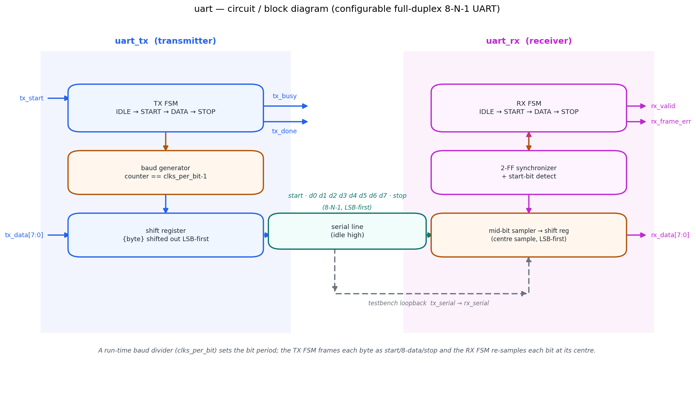
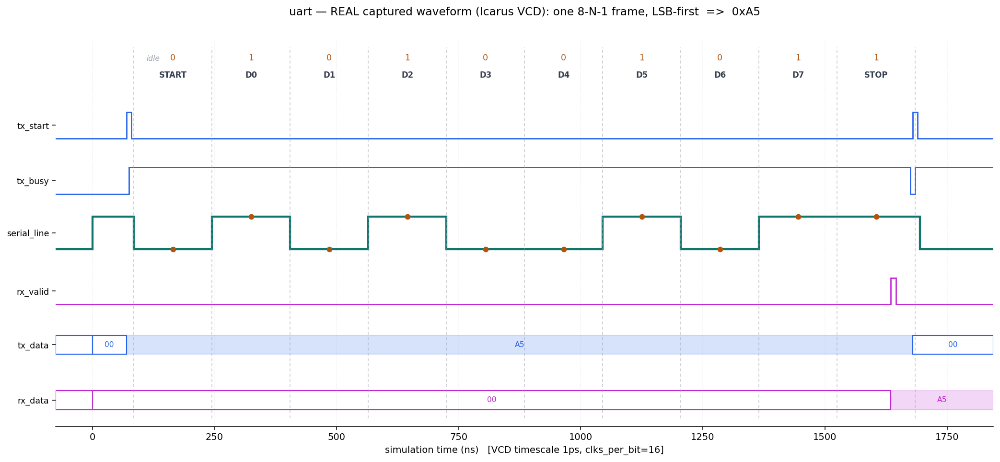

# Day 5 — Configurable UART (TX + RX)

A full-duplex **UART** (Universal Asynchronous Receiver/Transmitter) in
SystemVerilog with a fully self-checking testbench. The UART is the simplest and
most ubiquitous serial link in the building — consoles, GPS modules, Bluetooth
bridges, bootloaders and debug ports all speak it. This design implements the
classic **8-N-1** framing (8 data bits, No parity, 1 stop bit), **LSB-first**,
with a **run-time programmable baud-rate divider** so a single instance can talk
at any line rate derived from the system clock.

The hard part of a UART is not the shift register — it is *timing recovery*. The
receiver has no clock from the transmitter; it must find the start bit and then
sample each following bit near its **centre** so it is robust to the inevitable
skew between the two ends. This receiver waits half a bit period after the start
edge, then samples every `clks_per_bit` cycles, so every sample lands mid-bit.

---

## Features

- **8-N-1 framing, LSB-first**: `start(0) | d0..d7 | stop(1)`, line idle-high.
- **Run-time programmable baud rate** via `clks_per_bit` (system clocks per bit),
  read continuously — no recompile to change line rate.
- **Full duplex**: independent `uart_tx` and `uart_rx` blocks in one wrapper, so
  transmit and receive can run simultaneously.
- **Mid-bit sampling** in the receiver (half-bit offset after the start edge)
  for skew tolerance, with a **two-flop synchronizer** on the incoming line.
- **Framing check**: `rx_frame_err` flags a stop bit that was not high.
- Clean handshakes: level `tx_busy`, single-cycle `tx_done`, single-cycle
  `rx_valid`.
- **Parameterized** data width (`DATA_BITS`) and divider width (`DIV_WIDTH`).
- Reset-safe (line parked idle-high, receiver disarmed) and lint-friendly
  (`` `default_nettype none ``, no latches).

---

## Parameters

| Parameter   | Default | Description                                     |
|-------------|---------|-------------------------------------------------|
| `DATA_BITS` | 8       | Data bits per frame (LSB-first)                 |
| `DIV_WIDTH` | 16      | Width of the `clks_per_bit` baud divider input  |

## Ports (`uart` wrapper)

| Port           | Dir | Width       | Description                                            |
|----------------|-----|-------------|--------------------------------------------------------|
| `clk`          | in  | 1           | System clock                                           |
| `rst_n`        | in  | 1           | Active-low asynchronous reset                          |
| `clks_per_bit` | in  | `DIV_WIDTH` | System clocks per bit period (baud divider), `>= 2`    |
| `tx_start`     | in  | 1           | Pulse high (while `!tx_busy`) to send `tx_data`        |
| `tx_data`      | in  | `DATA_BITS` | Byte to transmit (LSB-first)                           |
| `tx_serial`    | out | 1           | Transmit serial line (idle high)                       |
| `tx_busy`      | out | 1           | High for the whole transmitted frame                   |
| `tx_done`      | out | 1           | One-cycle strobe at the end of the stop bit            |
| `rx_serial`    | in  | 1           | Receive serial line (idle high)                        |
| `rx_data`      | out | `DATA_BITS` | Received byte (valid with `rx_valid`)                  |
| `rx_valid`     | out | 1           | One-cycle strobe when a byte has been received         |
| `rx_frame_err` | out | 1           | Stop bit was not high (asserted with `rx_valid`)       |

### Frame format (8-N-1, LSB-first)

| Cell   | Line | Notes                                    |
|--------|------|------------------------------------------|
| idle   | 1    | line rests high between frames           |
| start  | 0    | falling edge arms the receiver           |
| d0..d7 | data | data bits, **least-significant first**   |
| stop   | 1    | returns the line high; checked by RX     |

---

## Block diagram (ASCII)

```
        uart_tx (transmitter)                          uart_rx (receiver)
   ┌───────────────────────────┐                  ┌───────────────────────────┐
tx_start ─▶│  TX FSM             │              │  RX FSM               │──▶ rx_valid
           │  IDLE→START→DATA→STOP│             │  IDLE→START→DATA→STOP  │──▶ rx_frame_err
           │  baud gen (cpb ctr) │              │  2-FF sync + start det │
tx_data ─▶ │  shift reg (LSB 1st)│──serial──┐   │  mid-bit sampler       │──▶ rx_data
           └──────────┬──────────┘  (idle   │   │  shift reg (LSB 1st)   │
              tx_busy/tx_done         high)  └──▶└────────────────────────┘
                                    start·d0..d7·stop
```

---

## Circuit / block diagram



*Schematic of the built circuit: the transmit datapath (blue — baud generator,
`IDLE→START→DATA→STOP` FSM, LSB-first shift register) drives the serial line
(teal), which the receive datapath (magenta — two-flop synchronizer, start
detect, mid-bit sampler, RX FSM) turns back into a byte. The dashed link is the
testbench loopback (`tx_serial → rx_serial`). Hand-drawn with matplotlib
(`gen_block.py`) — a structural diagram, not a simulator screenshot.*

---

## Simulation timing



*A **real captured waveform**: this image is rendered directly from `uart.vcd`,
the VCD produced by running the testbench under **Icarus Verilog**
(`make icarus`). A Python VCD parser (`gen_waveform.py`) extracts the first
transmitted byte and plots it with matplotlib — every level and every hex value
comes from the VCD, it is **not** a hand-drawn mock-up.*

The window shows the first frame — `tx_data = 0xA5` at `clks_per_bit = 16`
(bit period = 160 ns at the 10 ns system clock, start bit at t ≈ 85 ns):

- `tx_start` pulses, `tx_busy` rises for the whole frame.
- `serial_line` leaves idle-high, drops for the **start** bit, then carries the
  eight data bits **LSB-first**. The ▼ dots mark where the receiver samples each
  bit at its centre: `D0..D7 = 1,0,1,0,0,1,0,1`, which reassembles LSB-first to
  **0xA5**.
- The **stop** bit returns the line high; `rx_valid` then strobes for one cycle
  and `rx_data` latches **0xA5** — a clean loopback of the transmitted byte.

---

## How it works

- **Baud generation.** Both blocks own a counter that rolls over at
  `clks_per_bit - 1`, marking one bit period. Because the period is an input,
  the line rate is fully run-time programmable and independent of the framing
  logic.
- **Transmit FSM.** `IDLE → START → DATA → STOP`. On `tx_start` the byte is
  latched; `START` holds the line low for one bit; `DATA` drives
  `shreg[bit_idx]` (LSB-first) for eight bit periods; `STOP` holds the line high
  and pulses `tx_done`. `tx_busy` is simply "state ≠ IDLE".
- **Receive timing recovery.** The line is first passed through a **two-flop
  synchronizer** (`rx_sync`). On the start-bit falling edge the FSM waits
  `(clks_per_bit-1)/2` cycles to the **middle of the start bit** and re-centres
  its counter there. From that instant, sampling every `clks_per_bit` cycles
  lands each subsequent sample at the **centre** of its bit cell — the standard
  robust UART sampling scheme.
- **Assembly & framing.** Sampled bits shift into `shreg` LSB-first, so `d0`
  becomes bit 0. After the eighth data bit the FSM samples the **stop** bit; if
  it is not high, `rx_frame_err` is asserted alongside the one-cycle `rx_valid`.
- **Full duplex.** The wrapper wires one `uart_tx` and one `uart_rx` to the same
  clock/reset and `clks_per_bit`, so send and receive are fully independent.

---

## Files

| File                     | Description                                               |
|--------------------------|-----------------------------------------------------------|
| `uart.sv`                | RTL: `uart_tx`, `uart_rx`, and the full-duplex `uart` top |
| `tb_uart.sv`             | Self-checking testbench (TX→RX loopback + golden model)   |
| `Makefile`               | Run targets for common simulators                         |
| `gen_waveform.py`        | VCD → PNG renderer (produces the captured waveform)       |
| `gen_block.py`           | Draws the circuit / block diagram                         |
| `docs/uart_block.png`    | Circuit / block diagram (matplotlib)                      |
| `docs/uart_waveform.png` | Real captured waveform (from the Icarus VCD)              |

---

## Run the simulation

```bash
# Icarus Verilog (open source) — used to capture the waveform above
make icarus

# Verilator (open source)
make verilator

# Synopsys VCS
make vcs

# Siemens Questa / ModelSim
make questa
```

Expected output ends with:

```
Checks performed : 732
Errors           : 0
RESULT: *** PASS ***
```

A `uart.vcd` waveform is also produced for viewing in GTKWave. To regenerate the
PNG from that VCD:

```bash
python3 gen_waveform.py uart.vcd docs/uart_waveform.png
```

> Verified: run under **Icarus Verilog** — **732 checks, 0 errors,
> `RESULT: *** PASS ***`.**

---

## What the testbench checks

The DUT's own transmit line is wired straight back to its own receive line
(`tx_serial → rx_serial`), so every byte is really shifted out one bit at a time
and re-assembled by the receiver over the actual serial wire. Because a UART
moves a byte verbatim, the golden model is trivial and independent of the DUT
internals:

> the byte the receiver reports must equal the byte handed to the transmitter.

Each transmitted byte verifies:

1. **Data integrity** — `rx_data` equals the byte sent (`tx_data`).
2. **Framing** — `rx_frame_err` is low (the stop bit was high).
3. **`tx_busy`** asserts once a transfer starts.

Continuous monitors additionally check that **`rx_valid`** and **`tx_done`** are
each **single-cycle** strobes, and post-reset checks confirm the line idles high
with `tx_busy`/`rx_valid` low.

Stimulus covers the directed patterns `0x00, 0xFF, 0xA5, 0x01, 0x80, 0x55,
0x7E, 0xC3` at **four baud dividers** (`clks_per_bit` = 8, 10, 12, 16) and then
**210 randomized** bytes with the divider randomized across that set — **732
checks** in total, with a global timeout backstop and a VCD dump.
