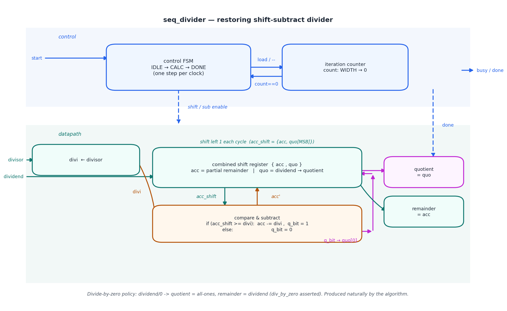
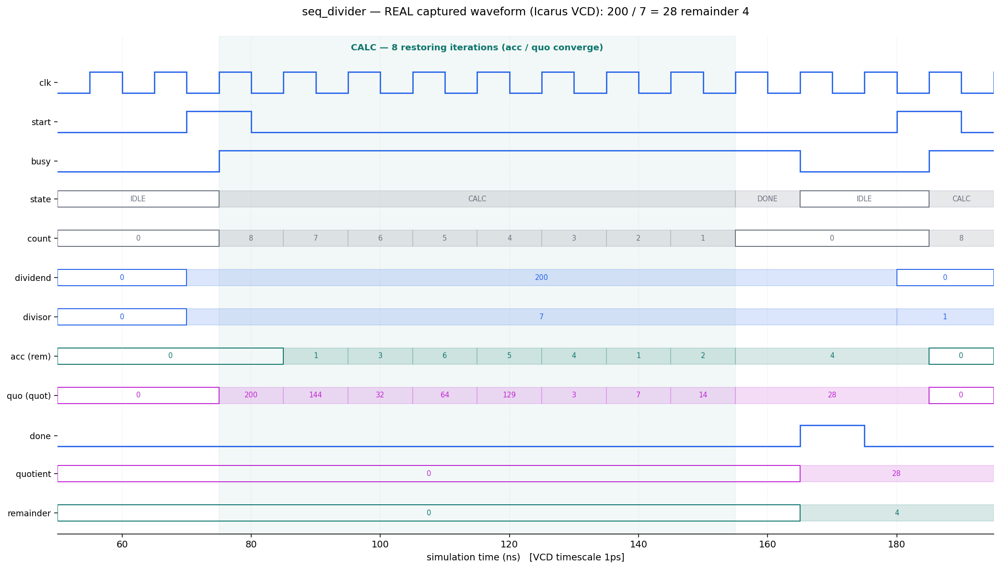

# Day 6 — Parameterized Sequential Integer Divider

An N-bit **unsigned integer divider** in SystemVerilog with a fully
self-checking testbench. Division is the one basic arithmetic operation that has
no cheap single-cycle combinational form — a full-width array divider is huge
and slow — so real hardware almost always does it **sequentially**, one bit per
clock, behind a `start / busy / done` handshake. This design implements the
classic **restoring shift-subtract** algorithm: a compact datapath (one
subtractor + a shift register) driven by a small multicycle FSM, producing both
the **quotient** and the **remainder** of `dividend / divisor`.

The interesting part is watching it converge: each clock shifts one more
dividend bit into the partial remainder, compares against the divisor, and
conditionally subtracts — so after exactly `WIDTH` cycles the quotient bits have
all been decided and the accumulator holds the remainder.

---

## Features

- **Restoring shift-subtract** algorithm, **one iteration per clock** — `WIDTH`
  cycles per division, independent of the operand values.
- **Quotient *and* remainder** from a single combined `{acc, quo}` shift
  register (no separate wide multiplier/divider array).
- Clean **multicycle handshake**: pulse `start`, `busy` stays high for the run,
  `done` strobes for one cycle when `quotient`/`remainder` are valid.
- **Documented divide-by-zero policy** (matches RISC-V `DIVU`/`REMU`):
  `x / 0 → quotient = all-ones, remainder = x`, with a `div_by_zero` status
  flag. The algorithm produces this result naturally, with no special-casing.
- **Parameterized** operand width (`WIDTH`).
- Reset-safe (async active-low reset) and lint-friendly
  (`` `default_nettype none ``, no latches, single flip-flop bank).

---

## Parameters

| Parameter | Default | Description                    |
|-----------|---------|--------------------------------|
| `WIDTH`   | 8       | Operand width in bits (`>= 2`) |

## Ports

| Port          | Dir | Width   | Description                                          |
|---------------|-----|---------|------------------------------------------------------|
| `clk`         | in  | 1       | System clock                                         |
| `rst_n`       | in  | 1       | Active-low asynchronous reset                        |
| `start`       | in  | 1       | Pulse high (while `!busy`) to begin a division       |
| `dividend`    | in  | `WIDTH` | Numerator                                            |
| `divisor`     | in  | `WIDTH` | Denominator                                          |
| `quotient`    | out | `WIDTH` | `dividend / divisor` (valid with `done`)             |
| `remainder`   | out | `WIDTH` | `dividend % divisor` (valid with `done`)             |
| `busy`        | out | 1       | High while a division is running                     |
| `done`        | out | 1       | One-cycle strobe when the result is ready            |
| `div_by_zero` | out | 1       | Divisor was zero (asserted alongside `done`)         |

---

## Block diagram (ASCII)

```
   control:   start ─▶┌──────────────────┐  load/--  ┌───────────────────┐
                      │  FSM             │◀────────▶│ iteration counter  │
                      │ IDLE→CALC→DONE   │  count==0 │ count: WIDTH → 0   │──▶ busy/done
                      └────────┬─────────┘           └───────────────────┘
                       shift/sub enable │
   datapath:                            ▼
   dividend ─▶┌──────────────────────────────────────┐
              │  combined shift register { acc , quo }│──▶ quotient (= quo)
   divisor ─▶ │  acc = partial remainder              │──▶ remainder (= acc)
     (divi)   │  quo = dividend → quotient            │
              └───────┬───────────────▲───────────────┘
              acc_shift│               │ acc'          ▲
                       ▼               │               │ q_bit → quo[0]
              ┌──────────────────────────────┐         │
              │ compare & subtract           │─────────┘
              │ acc>=divi ? acc-=divi,q=1 : q=0│
              └────────────────────────────────┘
```

---

## Circuit / block diagram



*Schematic of the built circuit, split into a **control** band (blue — the
`IDLE→CALC→DONE` FSM and the iteration down-counter) and a **datapath** band
(teal — the combined `{acc, quo}` shift register and the orange compare/subtract
unit, with the magenta quotient-bit feedback into `quo[0]`). Hand-drawn with
matplotlib (`gen_block.py`) — a structural diagram, not a simulator screenshot.*

---

## Simulation timing



*A **real captured waveform**: rendered directly from `seq_divider.vcd`, the VCD
produced by running the testbench under **Icarus Verilog** (`make icarus`). A
Python VCD parser (`gen_waveform.py`) extracts the first division — including
the DUT's *internal* `acc` and `quo` registers — and plots it with matplotlib.
Every value shown comes from the VCD; it is **not** a hand-drawn mock-up.*

The window shows `200 / 7 = 28 remainder 4` (WIDTH = 8):

- `start` pulses; `busy` rises and the FSM enters **CALC** for exactly **8**
  iterations (`count` counts down `8 → 1`).
- The partial remainder `acc` converges through `0 → 1 → 3 → 6 → 5 → 4 → 1 → 2
  → 4`, and the combined register `quo` resolves to the quotient as dividend
  bits shift out and quotient bits shift in, ending at **28**.
- When the last iteration completes, the FSM enters **DONE**, `done` strobes for
  one cycle, and the outputs latch: `quotient = 28`, `remainder = 4` — exactly
  `200 = 28*7 + 4`.

---

## How it works

- **Combined register.** The dividend is loaded into `quo`; `acc` starts at 0.
  Conceptually they form one `2*WIDTH`-bit register that shifts left one place
  per clock — dividend bits leave the top of `quo` and enter the bottom of
  `acc`, while decided quotient bits enter the bottom of `quo`.
- **One restoring step per clock.** Each CALC cycle computes
  `acc_shift = {acc, quo[MSB]}`; if `acc_shift >= divisor` it subtracts the
  divisor and shifts a **1** into the quotient, otherwise it leaves `acc`
  untouched and shifts in a **0**. Because `acc` is always driven back below the
  divisor, the remainder fits in `WIDTH` bits (one guard bit on `acc` covers the
  pre-compare shift).
- **Multicycle control.** The FSM latches operands on `start`, spends exactly
  `WIDTH` cycles in CALC (tracked by a down-counter), then spends one cycle in
  DONE to register the outputs and pulse `done`. `busy` is simply "not IDLE".
- **Divide-by-zero.** With `divisor == 0` every compare passes (`x >= 0`), so
  `quo` fills with ones and the dividend shifts intact into `acc` — the result
  is `quotient = all-ones`, `remainder = dividend`, and `div_by_zero` is raised.
  No extra logic is needed; the policy falls out of the algorithm.

---

## Files

| File                              | Description                                        |
|-----------------------------------|----------------------------------------------------|
| `seq_divider.sv`                  | RTL design under test                              |
| `tb_seq_divider.sv`               | Self-checking testbench (golden `/` and `%` model) |
| `Makefile`                        | Run targets for common simulators                  |
| `gen_waveform.py`                 | VCD → PNG renderer (produces the captured waveform)|
| `gen_block.py`                    | Draws the circuit / block diagram                  |
| `docs/seq_divider_block.png`      | Circuit / block diagram (matplotlib)               |
| `docs/seq_divider_waveform.png`   | Real captured waveform (from the Icarus VCD)       |

---

## Run the simulation

```bash
# Icarus Verilog (open source) — used to capture the waveform above
make icarus

# Verilator (open source)
make verilator

# Synopsys VCS
make vcs

# Siemens Questa / ModelSim
make questa
```

Expected output ends with:

```
Checks performed : 1028
Errors           : 0
RESULT: *** PASS ***
```

A `seq_divider.vcd` waveform is also produced for viewing in GTKWave. To
regenerate the PNG from that VCD:

```bash
python3 gen_waveform.py seq_divider.vcd docs/seq_divider_waveform.png
```

> Verified: run under **Icarus Verilog** — **1028 checks, 0 errors,
> `RESULT: *** PASS ***`.**

---

## What the testbench checks

The golden model is the language's own integer `/` and `%` operators, entirely
independent of the DUT's shift-subtract datapath. For every `(dividend,
divisor)` pair the testbench precomputes the expected quotient and remainder
and, after `done`, checks:

1. **Quotient** equals `dividend / divisor`.
2. **Remainder** equals `dividend % divisor`.
3. **`div_by_zero`** equals `(divisor == 0)`.

For the divide-by-zero case the golden model uses the documented policy
(quotient = all-ones, remainder = dividend). A continuous monitor additionally
verifies that **`done`** is a **single-cycle** strobe and that `busy` is low when
it fires; a post-reset check confirms `busy`/`done` are low out of reset.

Stimulus covers the directed corners — **divide by 1**, **divide by self**,
**zero dividend**, **maximum operands** (`0xFF / 2`, `0xFF / 0xFE`, …), exact
multiples, and the **divide-by-zero** policy — followed by **320 randomized**
`(dividend, divisor)` pairs (divisor sometimes zero, exercising the policy path),
for **1028 checks** in total, with a global timeout backstop and a VCD dump.
