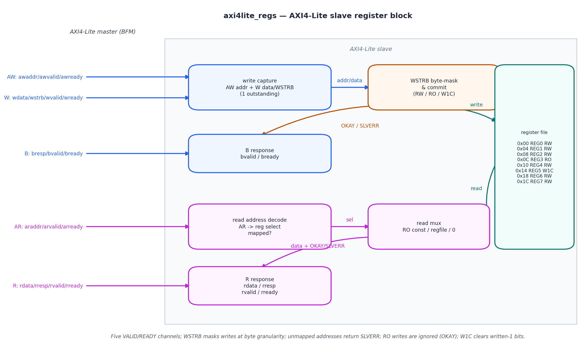
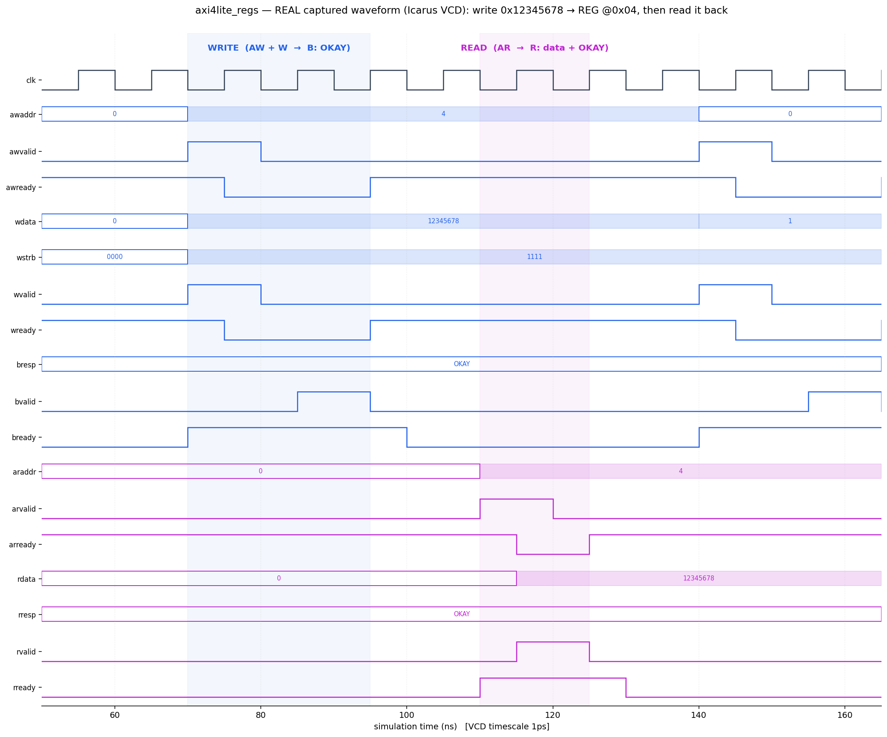

# Day 7 — AXI4-Lite Slave Register Block

An **AXI4-Lite slave** in SystemVerilog fronting a small internal register file,
with a fully self-checking testbench built around a task-based **AXI4-Lite
master BFM**. AXI4-Lite is the standard control-plane bus on essentially every
modern SoC — it is how a CPU reaches the configuration/status registers of every
peripheral (timers, GPIO, DMA, accelerators). A correct slave is mostly about
getting the **five VALID/READY handshakes** right, honouring the **write byte
strobes (WSTRB)**, and returning sensible **OKAY / SLVERR** responses.

This design implements all five channels (AW / W / B / AR / R), carries one
outstanding transaction per direction (the usual lightweight AXI4-Lite style),
and backs them with a register file that mixes **RW**, **read-only (RO)** and
**write-1-to-clear (W1C)** registers plus an **unmapped-address error** region.

---

## Features

- **Full AXI4-Lite** slave: AW, W, B, AR, R channels, each with a proper
  `VALID`/`READY` handshake and correct backpressure.
- **WSTRB byte strobes**: writes update only the strobed bytes of RW/W1C
  registers (partial writes), verified per byte.
- **OKAY / SLVERR responses**: mapped accesses return `OKAY`; any unmapped
  address returns `SLVERR` (read data driven to 0).
- **Mixed register semantics** in one block:
  - **RW** scratch registers,
  - a **read-only** ID register (reads a constant, writes accepted but ignored),
  - a **write-1-to-clear** status register (writing a 1 clears that bit).
- **Parameterized** address/data width and register count.
- Reset-safe (async active-low reset), lint-friendly
  (`` `default_nettype none ``, no latches), single flip-flop bank per channel.

---

## Parameters

| Parameter    | Default | Description                                        |
|--------------|---------|----------------------------------------------------|
| `ADDR_WIDTH` | 8       | Byte-address width of the AW/AR channels           |
| `DATA_WIDTH` | 32      | Data width (classic AXI4-Lite is 32)               |
| `NUM_REGS`   | 8       | Number of word registers (power of 2)              |

## Ports (AXI4-Lite channels)

| Group | Port      | Dir | Width          | Description                          |
|-------|-----------|-----|----------------|--------------------------------------|
| clk   | `clk`     | in  | 1              | System clock                         |
| rst   | `rst_n`   | in  | 1              | Active-low asynchronous reset        |
| AW    | `awaddr`  | in  | `ADDR_WIDTH`   | Write address                        |
| AW    | `awvalid` | in  | 1              | Write address valid                  |
| AW    | `awready` | out | 1              | Write address ready                  |
| W     | `wdata`   | in  | `DATA_WIDTH`   | Write data                           |
| W     | `wstrb`   | in  | `DATA_WIDTH/8` | Write byte strobes                   |
| W     | `wvalid`  | in  | 1              | Write data valid                     |
| W     | `wready`  | out | 1              | Write data ready                     |
| B     | `bresp`   | out | 2              | Write response (`OKAY`/`SLVERR`)     |
| B     | `bvalid`  | out | 1              | Write response valid                 |
| B     | `bready`  | in  | 1              | Write response ready                 |
| AR    | `araddr`  | in  | `ADDR_WIDTH`   | Read address                         |
| AR    | `arvalid` | in  | 1              | Read address valid                   |
| AR    | `arready` | out | 1              | Read address ready                   |
| R     | `rdata`   | out | `DATA_WIDTH`   | Read data                            |
| R     | `rresp`   | out | 2              | Read response (`OKAY`/`SLVERR`)      |
| R     | `rvalid`  | out | 1              | Read data valid                      |
| R     | `rready`  | in  | 1              | Read data ready                      |

### Register map

| Offset | Name | Type | Reset        | Behaviour                                        |
|--------|------|------|--------------|--------------------------------------------------|
| 0x00   | REG0 | RW   | 0x00000000   | general read/write scratch                       |
| 0x04   | REG1 | RW   | 0x00000000   | general read/write scratch                       |
| 0x08   | REG2 | RW   | 0x00000000   | general read/write scratch                       |
| 0x0C   | REG3 | RO   | —            | read-only ID: reads `0xDEADBEEF`, writes ignored |
| 0x10   | REG4 | RW   | 0x00000000   | general read/write scratch                       |
| 0x14   | REG5 | W1C  | 0xA5A5A5A5   | write-1-to-clear (per strobed byte)              |
| 0x18   | REG6 | RW   | 0x00000000   | general read/write scratch                       |
| 0x1C   | REG7 | RW   | 0x00000000   | general read/write scratch                       |
| ≥0x20  | —    | —    | —            | **unmapped** → `SLVERR` (read data = 0)          |

---

## Block diagram (ASCII)

```
   master                     AXI4-Lite slave
   ─────                ┌──────────────────────────────────────────┐
   AW ─▶│               │ write capture ─▶ WSTRB mask & commit ─────┼─▶┐
   W  ─▶│               │ (1 outstanding)     (RW/RO/W1C)           │  │  ┌───────────┐
   B  ◀─│               │        └─── OKAY/SLVERR ──▶ B response     │  └─▶│ register  │
                        │                                            │     │  file     │
   AR ─▶│               │ read decode ─▶ read mux (RO const/reg/0)──┼──◀──│ RW/RO/W1C │
   R  ◀─│               │        └─── data + OKAY/SLVERR ─▶ R resp   │     └───────────┘
                        └──────────────────────────────────────────┘
```

---

## Circuit / block diagram



*Schematic of the built circuit: the write path (blue — AW/W capture → orange
WSTRB byte-mask & commit → register file, with the B response) and the read
path (magenta — AR decode → read mux → R response), around the teal register
file with its RW/RO/W1C map. Hand-drawn with matplotlib (`gen_block.py`) — a
structural diagram, not a simulator screenshot.*

---

## Simulation timing



*A **real captured waveform**: rendered directly from `axi4lite_regs.vcd`, the
VCD produced by running the testbench under **Icarus Verilog** (`make icarus`).
A Python VCD parser (`gen_waveform.py`) extracts the first two transactions and
plots all five AXI4-Lite channels; every level and hex value comes from the VCD,
it is **not** a hand-drawn mock-up.*

The window shows a **write followed by a read** of REG1 (`0x04`):

- **WRITE (blue):** `awaddr = 0x04` / `awvalid` and `wdata = 0x12345678` /
  `wstrb = 1111` / `wvalid` handshake against `awready`/`wready`; the slave then
  drives `bvalid` with `bresp = OKAY`, taken when `bready` is high.
- **READ (magenta):** `araddr = 0x04` / `arvalid` handshakes against `arready`;
  the slave returns `rvalid` with `rdata = 0x12345678` and `rresp = OKAY` — the
  value just written reads back exactly.

---

## How it works

- **Write path.** `awready`/`wready` are asserted whenever the slave is idle and
  has no pending response. The AW and W beats are captured (in either order);
  once both are in, the slave commits the write and raises `bvalid`. `awready`
  and `wready` drop while a response is pending, giving correct backpressure.
- **WSTRB masking.** On commit, each asserted `wstrb[b]` writes byte `b` of the
  targeted register; de-asserted strobes leave that byte unchanged. RW registers
  take the new bytes; the W1C register instead *clears* the bits written as 1;
  the RO register ignores the data entirely (still `OKAY`).
- **Read path.** `arready` is asserted whenever the R channel is free. On an AR
  handshake the slave registers the read result (`0xDEADBEEF` for the RO index,
  the register contents for RW/W1C, `0` for unmapped) and raises `rvalid` until
  `rready` is seen.
- **Responses.** The address decode compares the (word-aligned) address against
  `NUM_REGS`: in range → `OKAY`, out of range → `SLVERR` on the corresponding
  B/R channel.

---

## Files

| File                                 | Description                                          |
|--------------------------------------|------------------------------------------------------|
| `axi4lite_regs.sv`                   | RTL design under test (AXI4-Lite slave)              |
| `tb_axi4lite_regs.sv`                | Self-checking testbench + AXI4-Lite master BFM       |
| `Makefile`                           | Run targets for common simulators                    |
| `gen_waveform.py`                    | VCD → PNG renderer (produces the captured waveform)  |
| `gen_block.py`                       | Draws the circuit / block diagram                    |
| `docs/axi4lite_regs_block.png`       | Circuit / block diagram (matplotlib)                 |
| `docs/axi4lite_regs_waveform.png`    | Real captured waveform (from the Icarus VCD)         |

---

## Run the simulation

```bash
# Icarus Verilog (open source) — used to capture the waveform above
make icarus

# Verilator (open source)
make verilator

# Synopsys VCS
make vcs

# Siemens Questa / ModelSim
make questa
```

Expected output ends with:

```
Checks performed : 416
Errors           : 0
RESULT: *** PASS ***
```

An `axi4lite_regs.vcd` waveform is also produced for viewing in GTKWave. To
regenerate the PNG from that VCD:

```bash
python3 gen_waveform.py axi4lite_regs.vcd docs/axi4lite_regs_waveform.png
```

> Verified: run under **Icarus Verilog** — **416 checks, 0 errors,
> `RESULT: *** PASS ***`.**

---

## What the testbench checks

A task-based AXI4-Lite **master BFM** (`axi_write` / `axi_read`) drives all five
channels with correct handshakes. A **golden register model** — a plain array
with the same reset values and the same RW/RO/W1C/unmapped semantics — is updated
in lock-step with every accepted write, and every read/response is scoreboarded
against it:

1. **Read data** equals the golden model value (register contents, the RO
   constant, or 0 for unmapped).
2. **Write response** is `OKAY` for mapped addresses, `SLVERR` for unmapped.
3. **Read response** is `OKAY` for mapped addresses, `SLVERR` for unmapped.

Because the BFM waits on the real `VALID`/`READY` handshakes, any handshake the
slave got wrong would stall the BFM and trip the global timeout — so protocol
correctness is exercised implicitly on every transaction.

Directed tests cover write-then-read of every RW register, **strobe-masked
partial writes** (only the selected bytes change), a **zero-strobe** write (no
change), the **read-only** register (writes ignored, reads return the constant),
the **write-1-to-clear** register (bits clear on a written 1), and
**unmapped-address** reads and writes (SLVERR). Then **240 randomized**
read/write transactions run with a mix of mapped/unmapped addresses and random
strobes — **416 checks** in total, with a global timeout backstop and a VCD dump.
