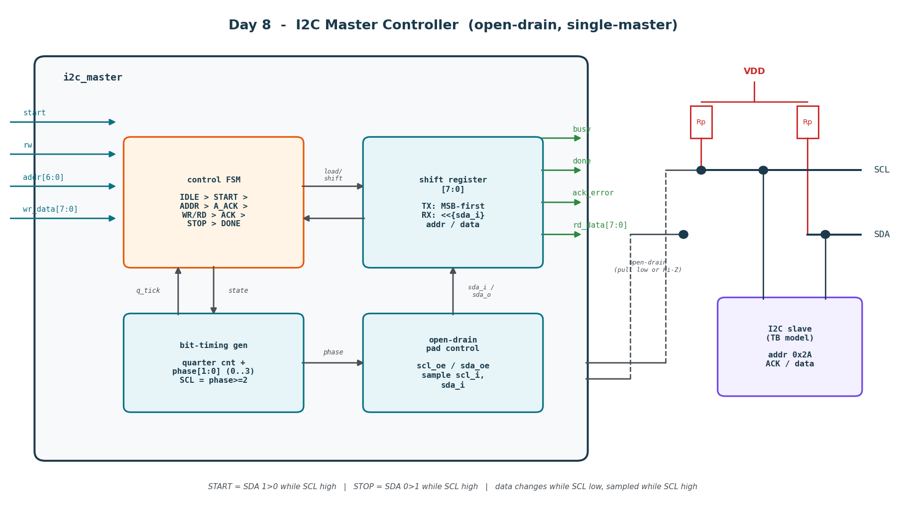
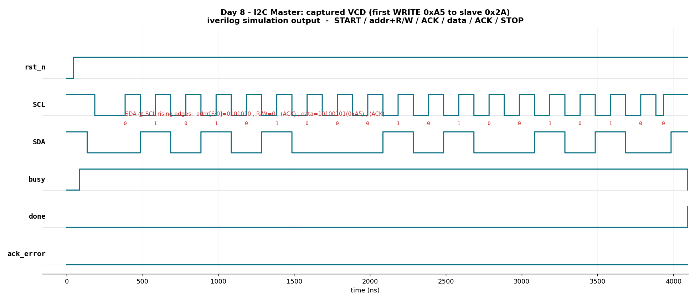

# Day 8 — I2C Master Controller

A single-master **I2C controller** in SystemVerilog that performs one-byte
**read** and **write** transactions to a 7-bit-addressed slave, driven by a
fully self-checking testbench built around a behavioral, open-drain **I2C slave
model**. I2C is the ubiquitous two-wire control bus for sensors, EEPROMs, RTCs,
PMICs and countless other peripherals; unlike SPI (Day 3) or UART (Day 5) it is
a **shared, bidirectional, open-drain** bus with in-band addressing and
per-byte acknowledgement — which is exactly what makes a correct master
non-trivial.

The core is a true open-drain master: it **never forces a line high**. It only
pulls SCL/SDA low (`*_oe = 1`) or releases them (`*_oe = 0`) to be pulled high
by external resistors, and it **samples SCL back in**, so a slave holding SCL
low (**clock stretching**) transparently pauses the whole state machine.

---

## Features

- **Full single-byte transaction engine**: `START → address+R/W̅ → ACK →
  (write byte → ACK | read byte → NACK) → STOP`.
- **True open-drain interface** (`scl_oe` / `sda_oe` + `scl_i` / `sda_i`) — the
  RTL drives low or releases only, matching real I2C pad behaviour. Resolve
  externally with `tri1` (pull-ups), as the testbench does.
- **Clock-stretch aware**: after releasing SCL the master waits until `scl_i`
  actually reads high before timing the high phase, so a stretching slave (or a
  slow rise) just stalls the FSM instead of corrupting timing.
- **Classic 4-phase-per-bit timing** generated from the system clock: SDA is
  set while SCL is low (phase 0) and is sampled while SCL is high (phase 2).
- **ACK/NACK handling**: latched `ack_error` flag if a required ACK is missing
  (unaddressed slave or a slave that NACKs a data byte); the master aborts
  cleanly to STOP.
- **Parameterized** system-clock and SCL frequency → automatically sized
  quarter-bit divider (`QUARTER = CLK_FREQ_HZ / (4·SCL_FREQ_HZ)`).
- Reset-safe (async active-low reset), lint-friendly
  (`` `default_nettype none ``, no inferred latches, single FSM flop bank).

---

## Parameters

| Parameter     | Default     | Description                                          |
|---------------|-------------|------------------------------------------------------|
| `CLK_FREQ_HZ` | `2_000_000` | System-clock frequency feeding the bit-timing divider |
| `SCL_FREQ_HZ` | `100_000`   | Target SCL (bus) frequency; standard-mode I2C = 100 kHz |

The divider derives `QUARTER = CLK_FREQ_HZ / (4·SCL_FREQ_HZ)` system clocks per
phase (clamped to ≥ 1), so the SCL period is `4·QUARTER` system clocks.

## Ports

| Signal      | Dir | Width | Description                                                    |
|-------------|-----|-------|----------------------------------------------------------------|
| `clk`       | in  | 1     | System clock                                                   |
| `rst_n`     | in  | 1     | Async active-low reset                                         |
| `start`     | in  | 1     | Pulse high for one cycle to launch a transaction               |
| `rw`        | in  | 1     | `0` = write `wr_data`, `1` = read one byte                     |
| `addr`      | in  | 7     | 7-bit slave address                                            |
| `wr_data`   | in  | 8     | Byte transmitted on a write                                    |
| `rd_data`   | out | 8     | Byte received on a read (valid when `done` pulses)             |
| `busy`      | out | 1     | High for the whole transaction                                 |
| `done`      | out | 1     | One-cycle pulse when the transaction completes                 |
| `ack_error` | out | 1     | Latched: a required ACK was missing (address or data NACK)     |
| `scl_i`     | in  | 1     | Sampled SCL (used for clock-stretch detection)                 |
| `scl_oe`    | out | 1     | `1` = pull SCL low, `0` = release (Hi-Z, pulled high)          |
| `sda_i`     | in  | 1     | Sampled SDA                                                    |
| `sda_oe`    | out | 1     | `1` = pull SDA low, `0` = release (Hi-Z, pulled high)          |

Open-drain convention: the emitted line level `v` is `oe = ~v`, i.e. `oe = 1`
drives a `0`, `oe = 0` releases the line for the external pull-up.

---

## Block diagram



```
            command                     ┌──────────── i2c_master ────────────┐
   start ─────────────────────────────▶│                                     │
   rw    ─────────────────────────────▶│   control FSM  ◀── q_tick ── timing │
   addr[6:0] ─────────────────────────▶│  IDLE→START→ADDR→A_ACK              │
   wr_data[7:0] ──────────────────────▶│   →WR/RD→ACK→STOP→DONE   phase[1:0]  │
                                        │        │            │               │
                                        │   shift reg[7:0]  open-drain pad     │───▶ scl_oe / sda_oe
   busy / done / ack_error ◀────────────│   (TX MSB / RX)   ctrl (scl/sda)     │◀─── scl_i / sda_i
   rd_data[7:0] ◀───────────────────────│                                     │
                                        └─────────────────────────────────────┘
                                             │ scl_oe/sda_oe          ▲ scl_i/sda_i
                             VDD                                       │
                              │   Rp        Rp                         │
                              ├──/\/\──┬────/\/\──┐                     │
              SCL ────────────┴────────┼──────────┼──── (open-drain, wired-AND)
              SDA ─────────────────────┴──────────┴──── ┌──────────────┐
                                                        │  I2C slave   │
                                                        │  (TB model)  │
                                                        └──────────────┘
```

Both lines are **wired-AND**: any device pulling low wins; the bus is high only
when every device releases. START is `SDA 1→0` while SCL is high; STOP is
`SDA 0→1` while SCL is high.

---

## How it works

1. **START** — from the idle (both lines released/high) state the master pulls
   SDA low while SCL is still high, then pulls SCL low to begin clocking.
2. **Address phase** — the byte `{addr[6:0], rw}` is shifted out MSB-first. SDA
   is updated while SCL is low and the slave samples it on each SCL rising edge.
3. **Address ACK** — the master releases SDA and reads `sda_i` during the 9th
   SCL-high period. A low means ACK; a high means **NACK** → `ack_error` is
   latched and the master jumps straight to STOP.
4. **Data phase**
   - *Write*: the master shifts `wr_data` out MSB-first, then reads the slave's
     ACK for the byte.
   - *Read*: the master releases SDA, the slave drives 8 bits (master samples on
     SCL-high), then the master drives a **NACK** (leaves SDA high) to end the
     single-byte read.
5. **STOP** — with SCL low the master keeps SDA low, releases SCL, then releases
   SDA (`SDA 0→1` while SCL high) to free the bus; `done` pulses and `busy`
   drops.

Timing uses a quarter-bit counter and a 2-bit `phase` counter. `SCL` is low in
phases 0–1 and high (released) in phases 2–3. Whenever the master has released
SCL but `scl_i` still reads low, `stretch` freezes the counters — this is the
clock-stretching hook and also tolerates slow rise times.

---

## Simulation timing



*Real waveform captured from the Icarus Verilog run (`i2c_master.vcd`), rendered
with a small Python VCD parser + matplotlib — **not** a hand-drawn diagram and
**not** a simulator GUI screenshot. It shows the first transaction: reset
release, then a **write of `0xA5` to slave `0x2A`**. The red annotations are the
actual SDA values decoded at each SCL rising edge — `0101010`(addr = 0x2A) +
`0`(R/W̅ = write) + ACK + `10100101`(`0xA5`) + ACK — followed by STOP, `done`
pulsing and `busy` dropping. `ack_error` stays low because the slave ACKs.*

The block diagram above (`docs/i2c_master_block.png`) is a hand-drawn schematic
of the architecture (also produced with matplotlib), included per the project
convention of showing the built circuit.

---

## Running

From inside `Day8/`:

```bash
make            # Icarus Verilog (default): compile + run the self-checking TB
make vcs        # Synopsys VCS
make questa     # Mentor Questa / ModelSim
make verilator  # Verilator (needs --timing; TB uses a procedural bus model)
make wave       # regenerate docs/*.png from the captured VCD
make waves      # open the VCD in GTKWave
make clean
```

This design was simulated with **Icarus Verilog** (`iverilog -g2012` + `vvp`).
The run passes:

```
 checks run : 37
 errors     : 0
 RESULT: *** PASS ***
```

---

## What the testbench checks

The testbench builds a pulled-up two-wire bus with `tri1 scl` / `tri1 sda` and
attaches a **behavioral open-drain I2C slave model** (address `0x2A`) alongside
the master. Acting as the golden reference it verifies:

- **Directed write** (`0xA5`) — slave captures exactly the byte the master sent,
  `ack_error` stays low.
- **Directed read** (`0x3C`) — master's `rd_data` equals the byte the slave
  drove, `ack_error` stays low.
- **Unaddressed transfer** — a transaction to a non-matching address must set
  `ack_error` (address NACK) and terminate cleanly.
- **Randomized write+read pairs** (8 iterations) — for each, the slave-captured
  write byte and the master-returned read byte both match the expected values.

Every check runs through `expect_eq` / `expect_bit` into an error counter; the
run prints `RESULT: *** PASS ***` only when all **37** checks pass, and a
global timeout (`$fatal`) guards against a hung bus.
