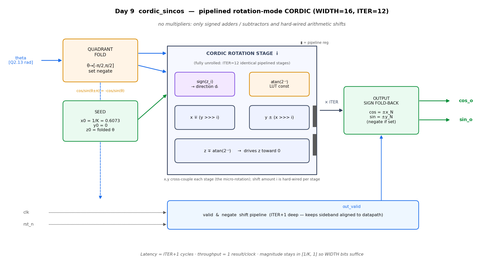
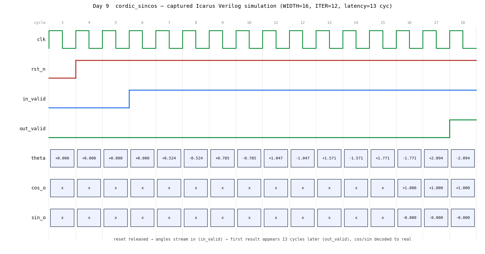

# Day 9 — Pipelined CORDIC Sine/Cosine Engine (`cordic_sincos`)

A fully-pipelined, fixed-point **CORDIC** (COordinate Rotation DIgital Computer)
engine that computes `cos(theta)` and `sin(theta)` for an input angle in radians,
delivering **one result every clock** after a fixed pipeline latency.

CORDIC is the classic way to evaluate trig functions in hardware **without any
multipliers** — it uses only signed adders/subtractors and hard-wired shifts.
That property makes it a staple of DSP datapaths, software-defined radio (NCO /
mixer phase rotation), motor-control (Park/Clarke transforms), robotics, and
graphics/vector-rotation hardware.

---

## Circuit / block diagram



*Micro-architecture: a quadrant-fold front end seeds `x0 = 1/K, y0 = 0,
z0 = folded θ` into a chain of `ITER` identical, fully-unrolled rotation stages.
Each stage decides its rotation direction from `sign(z)`, applies a hard-wired
`>>> i` shift and a signed add/sub on `x`/`y`, and subtracts the constant
`atan(2⁻ⁱ)` from `z`. A `valid`/`negate` sideband pipeline stays aligned with the
datapath; the output stage folds the sign back in.*

---

## Features

- **Rotation-mode CORDIC** for simultaneous `cos`/`sin` from one angle.
- **Fully pipelined & unrolled** — accepts a new angle every cycle; latency
  `ITER + 1` cycles; throughput 1 result/clock.
- **Multiplier-free** datapath: signed add/sub + arithmetic shifts only.
- **Full [-π, π] input range** via a quadrant-folding pre-rotation stage
  (rotation-mode CORDIC natively converges only for |θ| ≲ 1.743 rad).
- **Gain pre-compensation** — the seed is pre-scaled by `1/K = 0.60725…`, so no
  output rescaling / extra multiply is needed.
- **Parameterizable** word width and iteration/precision count; the `atan(2⁻ⁱ)`
  LUT is generated from exact real constants at elaboration, so it tracks any
  `WIDTH`/`FRAC` choice automatically.
- **Reset-safe** (synchronous, active-low) and lint-clean under
  `` `default_nettype none ``.

### Fixed-point format

Signed two's-complement `Q2.FRAC` with `FRAC = WIDTH-3`
(1 sign bit + 2 integer bits + `FRAC` fractional bits), representing the range
`[-4.0, +4.0)`. This holds angles up to ±π and the `[-1, 1]` sine/cosine outputs
with head-room. At the default `WIDTH = 16`, that is `Q2.13` with an LSB of
`2⁻¹³ ≈ 1.22e-4`.

---

## Parameters

| Parameter | Default | Description |
|-----------|---------|-------------|
| `WIDTH`   | `16`    | Fixed-point word width in bits (≥ 8). Format is `Q2.(WIDTH-3)`. |
| `ITER`    | `12`    | Number of CORDIC rotation stages = pipeline depth of the rotator (≤ 24 and ≤ `FRAC`). More iterations ⇒ higher accuracy and longer latency. |

Derived: `FRAC = WIDTH-3` (fractional bits), pipeline latency `= ITER+1` cycles.

---

## Ports

| Port        | Dir | Width   | Description |
|-------------|-----|---------|-------------|
| `clk`       | in  | 1       | Clock. |
| `rst_n`     | in  | 1       | **Synchronous**, active-low reset (clears the `valid` pipeline). |
| `in_valid`  | in  | 1       | Assert to inject the angle on `theta` this cycle. |
| `theta`     | in  | `WIDTH` | Input angle, signed `Q2.FRAC` radians, expected in `[-π, π]`. |
| `out_valid` | out | 1       | High when `cos_o`/`sin_o` carry the result of a previously injected angle (latency-aligned). |
| `cos_o`     | out | `WIDTH` | `cos(theta)`, signed `Q2.FRAC`. |
| `sin_o`     | out | `WIDTH` | `sin(theta)`, signed `Q2.FRAC`. |

---

## ASCII block diagram

```
                +-------------------+
   theta  ----->|  QUADRANT FOLD    |  z0, negate
 [Q2.13 rad]    |  θ -> [-π/2, π/2]  |----------------+
                +-------------------+                 |
                +-------------------+                 v
                |  SEED             |   x0=1/K   +----------------------------------+
                |  x0=1/K, y0=0     |----------->|   ITER unrolled CORDIC stages    |
                |  z0=folded θ      |   y0=0     |                                  |
                +-------------------+            |  d_i = (z_i >= 0) ? +1 : -1      |
                                                 |  x <- x - d_i*(y >>> i)          |
       clk,rst_n ...............................>|  y <- y + d_i*(x >>> i)          |
                                                 |  z <- z - d_i*atan(2^-i)  [LUT]  |
                +----------------------+         +----------------------------------+
   in_valid --->| valid & negate       |                    | x_N, y_N, negate
                | shift pipeline        |                    v
                | (ITER+1 deep)         |         +-----------------------+
                +----------------------+-------->| OUTPUT SIGN FOLD-BACK  |---> cos_o
                              out_valid           | cos=±x_N, sin=±y_N    |---> sin_o
                                                  +-----------------------+
```

---

## How it works

**1. Quadrant fold (convergence).** Rotation-mode CORDIC only converges when the
residual angle stays within about ±1.743 rad. To accept the full `[-π, π]`
range, the input is folded into `[-π/2, π/2]`:

```
theta >  π/2 : z0 = theta - π,  negate = 1
theta < -π/2 : z0 = theta + π,  negate = 1
otherwise    : z0 = theta,       negate = 0
```

because `cos(a ± π) = -cos(a)` and `sin(a ± π) = -sin(a)`.

**2. Seed.** Set `x0 = 1/K`, `y0 = 0`, `z0 = folded θ`, where
`K = Π sqrt(1 + 2⁻²ⁱ) ≈ 1.64676` is the CORDIC gain. Pre-loading `1/K`
cancels the gain so the outputs land directly in `[-1, 1]`.

**3. Rotate.** Each of the `ITER` stages performs one micro-rotation that drives
`z` toward 0:

```
d_i = (z_i >= 0) ? +1 : -1
x_{i+1} = x_i - d_i·(y_i >>> i)
y_{i+1} = y_i + d_i·(x_i >>> i)
z_{i+1} = z_i - d_i·atan(2⁻ⁱ)
```

After `ITER` stages, `z → 0`, leaving `x_N → cos(θ)` and `y_N → sin(θ)`.
Because the running vector magnitude only travels from `1/K ≈ 0.607` up to `1.0`,
no accumulator bit-growth is required — `WIDTH` bits suffice throughout.

**4. Sign fold-back.** If `negate` was set during folding, the output stage
returns `-x_N`, `-y_N`.

Every stage is registered, so a fresh angle can be launched each clock and its
result emerges `ITER+1` cycles later, with `out_valid` tracking it through a
parallel `valid`/`negate` shift pipeline.

---

## Simulation timing



*Captured from a **real Icarus Verilog run** (`make icarus` → VCD → rendered with
a Python VCD parser + matplotlib — this is not a hand-drawn mock-up). After
`rst_n` releases, angles stream in on `theta` (0, π/6, −π/6, π/4, −π/4, π/3, …
shown decoded to real). The datapath is pipelined, so the first requested result
appears when `out_valid` rises 13 cycles (`ITER+1`) later: for the leading
`theta = 0` input the engine returns `cos_o = +1.000`, `sin_o = −0.000`, exactly
as expected. Bus cells are the raw `Q2.13` codes decoded back to real values.*

---

## What the testbench checks

`tb_cordic_sincos.sv` is **self-checking against a golden model** — the exact
`$cos`/`$sin` IEEE-754 results converted into the DUT's `Q2.13` format:

- **Directed corner angles:** `0`, `±π/6`, `±π/4`, `±π/3`, `±π/2` (the raw
  convergence boundary), points just past `±π/2` (exercising the quadrant fold),
  `±2π/3` (folded angles), and near `±π`.
- **Randomized stimulus:** 500 angles uniformly across `[-π, π]`.
- **Full-throughput streaming:** all stimulus is applied back-to-back with
  `in_valid` held high; because the pipeline preserves order, golden results are
  pushed as angles are driven and popped as `out_valid` fires.
- **Per-result tolerance check:** each `cos_o`/`sin_o` must be within `TOL_FX`
  LSBs of golden; the worst-case error over the whole run is reported.
- **Timeout** guards against a stalled pipeline; a **VCD** is dumped for waveviewing.

On success it prints the exact string:

```
RESULT: *** PASS ***
```

### Latest local run (Icarus Verilog)

```
CORDIC sin/cos  WIDTH=16  ITER=12  FRAC=13  latency=13 cyc
angles checked : 515
tolerance      : 12 LSB (0.001465)
worst error    : 7 LSB (0.000854)
mismatches     : 0
RESULT: *** PASS ***
```

515 angles checked, worst-case error 7 LSBs (≈ 8.5e-4), zero mismatches.

---

## Run it

From inside `Day9/`:

```bash
make icarus      # Icarus Verilog (used to capture the waveform above)
# or
make verilator   # Verilator
make vcs         # Synopsys VCS
make questa      # Siemens Questa / ModelSim
```

Regenerate the images from a fresh VCD:

```bash
make icarus
python3 docs/render_waveform.py cordic_sincos.vcd docs/cordic_sincos_waveform.png
python3 docs/render_block_diagram.py
```

---

## Files

| File | Description |
|------|-------------|
| `cordic_sincos.sv`      | Synthesizable pipelined CORDIC RTL. |
| `tb_cordic_sincos.sv`   | Self-checking testbench (golden `$sin`/`$cos` model). |
| `Makefile`              | Run targets for Verilator / VCS / Questa / Icarus. |
| `docs/cordic_sincos_block.png`     | Block / circuit diagram (above). |
| `docs/cordic_sincos_waveform.png`  | Captured simulation waveform. |
| `docs/render_waveform.py`          | VCD → PNG renderer. |
| `docs/render_block_diagram.py`     | Block-diagram generator. |
