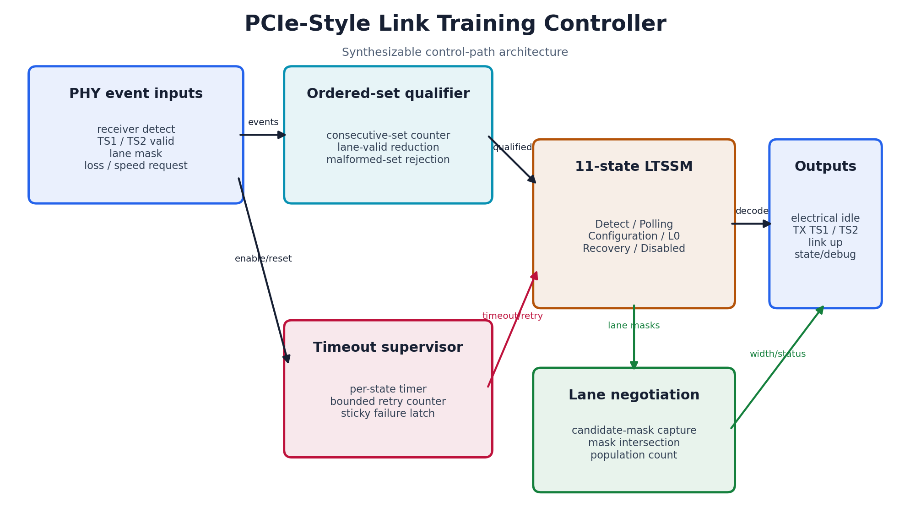
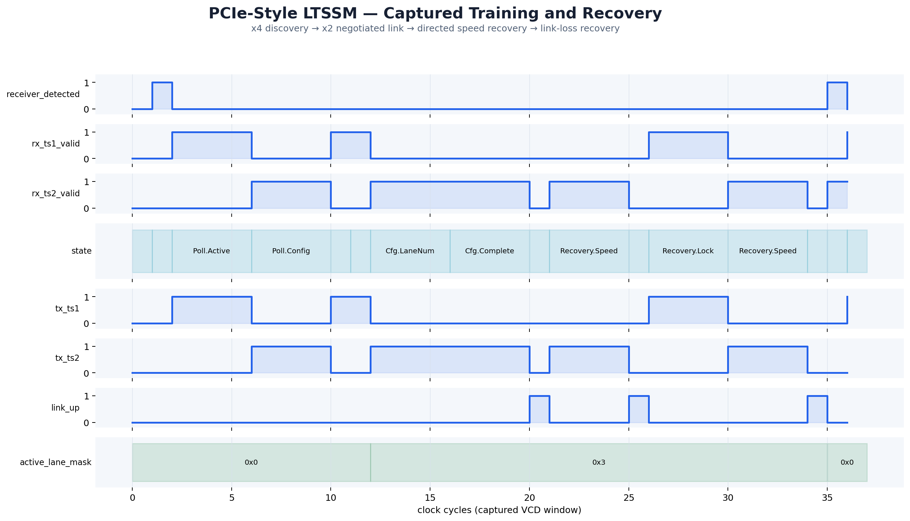

# Day 48 — PCIe-Style Link Training and Status State Machine

A parameterized multi-lane link-training controller modeled on the architectural
shape of a PCI Express LTSSM. It sequences receiver detection, TS1/TS2 ordered-set
qualification, link-width negotiation, normal operation, directed speed changes,
receiver-lock recovery, and bounded timeout retries. The block deliberately stays
at the logical training layer: serialization, 8b/10b or 128b/130b coding, and analog
receiver detection belong in the PHY.

This project is motivated by current high-speed-I/O RTL roles, where robust state
machines, lane negotiation, timeout recovery, and verification-friendly observability
are recurring design responsibilities.

## Features

- Eleven-state training/recovery controller with explicit L0 and fail-safe Disabled
  states.
- Consecutive TS1/TS2 qualification rejects isolated or malformed ordered sets.
- Multi-lane width negotiation computes the intersection between detected and
  accepted lanes, then exports both the active-lane mask and link width.
- Bounded per-attempt timer and retry counter prevent permanent training hangs.
- Separate link-loss and directed-speed-change recovery paths.
- Hot reset clears negotiated link state and restarts at Detect without requiring a
  power reset.
- Synthesizable, reset-safe RTL with parameter legality checks in simulation.

## Circuit diagram



*Architectural circuit diagram of the implemented controller, showing ordered-set
qualification, timeout/retry supervision, lane-mask negotiation, the state machine,
and registered status outputs. This is a documentation diagram, not a simulator
screenshot.*

## Parameters

| Parameter | Default | Meaning |
|---|---:|---|
| `LANES` | 4 | Maximum physical lane count |
| `TS_REQUIRED` | 4 | Consecutive ordered sets required for qualification |
| `TIMEOUT_CYCLES` | 32 | Maximum cycles permitted in a training state |
| `MAX_RETRIES` | 2 | Retraining attempts before fail-safe disable |
| `LANE_W` | derived | Width of the negotiated-width output |
| `TS_W` | derived | Ordered-set counter width |
| `TIMER_W` | derived | Training timer width |
| `RETRY_W` | derived | Retry counter width |

## Ports

| Port | Dir | Width | Meaning |
|---|---|---:|---|
| `clk` | in | 1 | Controller clock |
| `rst_n` | in | 1 | Asynchronous active-low reset |
| `enable_i` | in | 1 | Enables link training |
| `hot_reset_i` | in | 1 | Restarts training and clears negotiated state |
| `receiver_detected_i` | in | 1 | PHY reports a detected far-end receiver |
| `rx_ts1_valid_i` | in | 1 | A valid TS1 ordered set was received |
| `rx_ts2_valid_i` | in | 1 | A valid TS2 ordered set was received |
| `rx_lane_mask_i` | in | `LANES` | Lanes contributing the received ordered set |
| `link_loss_i` | in | 1 | Loss-of-lock indication while in L0 |
| `directed_speed_change_i` | in | 1 | Requests the speed-recovery sequence |
| `tx_electrical_idle_o` | out | 1 | Requests PHY electrical idle |
| `tx_ts1_o`, `tx_ts2_o` | out | 1 | Selects the training ordered set to transmit |
| `link_up_o` | out | 1 | Asserted only in L0 |
| `training_failed_o` | out | 1 | Sticky retry exhaustion indication |
| `active_lane_mask_o` | out | `LANES` | Negotiated active lanes |
| `negotiated_width_o` | out | `LANE_W` | Population count of active lanes |
| `retry_count_o` | out | `RETRY_W` | Current bounded retry count |
| `state_o` | out | 4 | Encoded state for debug and verification |

## ASCII block diagram

```text
 receiver detect ───────────────┐
 TS1/TS2 valid + lane mask ──┐  │   +-----------------------+
                             v  v   |                       |
                     +-------------------+                 |
                     | ordered-set       |                 |
                     | qualifier/counter |---- qualified --+--+
                     +-------------------+                    |
                                                              v
 enable/hot reset/link loss/speed change ───────────> +---------------+
 timeout/retry exhaustion ───────────────────────────> |     LTSSM     |
                                                      +-------+-------+
                                                              |
                    +-------------------+       +--------------+-------+
 lane masks ──────> | width negotiation |       | TS1/TS2/idle/link-up |
                    +---------+---------+       | output decode        |
                              |                 +----------------------+
                              v
                  active lane mask + width
```

## How it works

`Detect` waits for the PHY to see a far-end termination. `Polling.Active` then sends
TS1 ordered sets and requires four consecutive valid TS1 observations; any gap resets
the qualifier. `Polling.Configuration` repeats the process with TS2.

The three configuration states first capture the candidate lane mask, then intersect
it with the partner's accepted mask and count the resulting lanes. Two TS2-qualified
phases complete lane numbering and configuration before the controller enters `L0`.
The negotiated mask remains registered through recovery.

In `L0`, loss of receiver lock enters `Recovery.ReceiverLock`, which reacquires TS1
before using TS2 in `Recovery.Speed`. A directed speed change starts directly in the
speed phase. Each non-L0 training state has a bounded timer. Expiration restarts at
Detect and increments the retry counter; exhaustion latches `training_failed_o` and
forces Disabled until the link is disabled or hot-reset.

## Simulation timing



*Waveform rendered from the VCD captured during the real Icarus Verilog simulation.
It shows receiver detection, TS1/TS2 qualification, x4-to-x2 lane negotiation, entry
to L0, and both directed-speed and link-loss recovery.*

## Running

```bash
make icarus
make verilator
make vcs
make questa
```

Each target compiles the same RTL and self-checking testbench with the selected
simulator. The Icarus run writes `pcie_ltssm.vcd`.

## What the testbench checks

The testbench maintains an independent cycle-by-cycle golden state, counter, timeout,
retry, lane-mask, and width model. Every clock it compares all externally visible
state and decoded outputs against that model. Directed tests cover x4 discovery with
x2 down-training, entry to L0, directed speed change, link-loss recovery, hot reset,
and retry exhaustion. An 80-cycle randomized phase perturbs ordered sets, lane masks,
receiver detection, and recovery requests. A global simulation timeout catches
deadlock, and success is reported only as `RESULT: *** PASS ***`.
