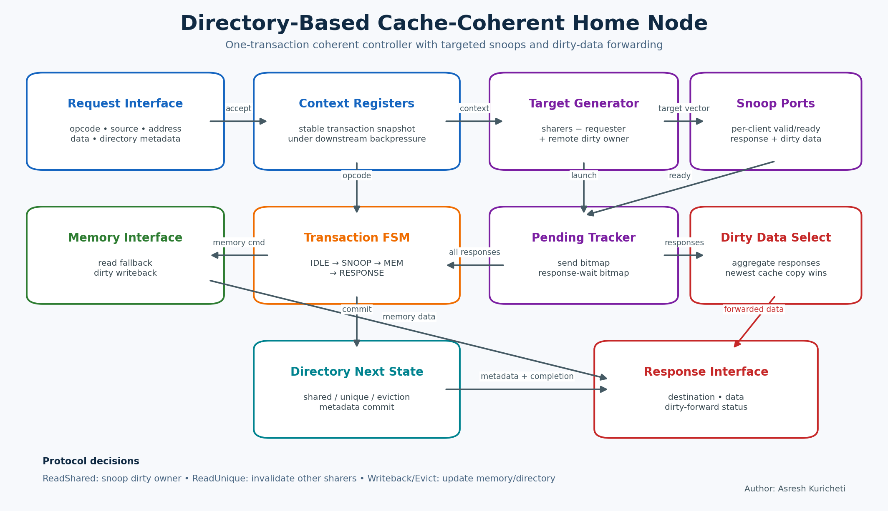
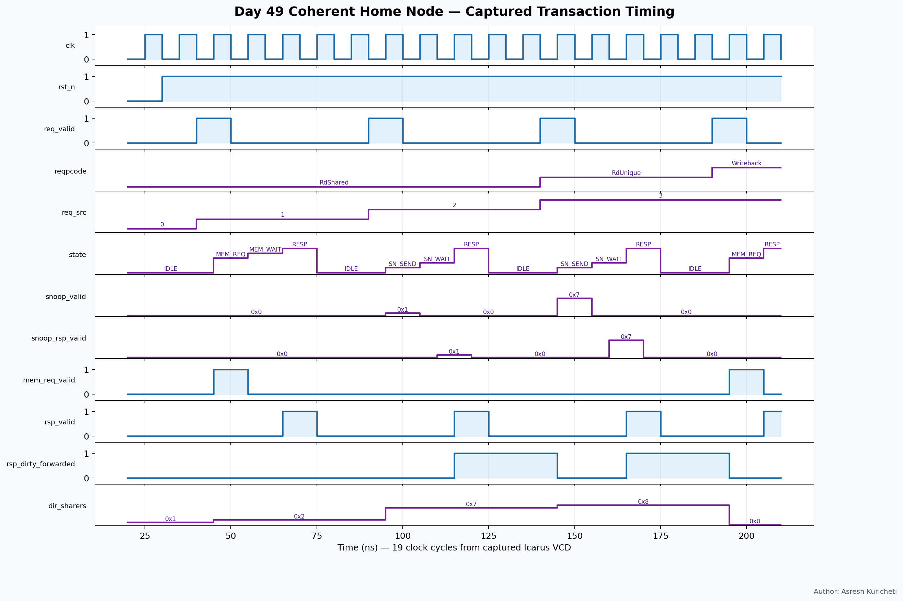

<!-- Author: Asresh Kuricheti -->
# Day 49 — Directory-Based Cache-Coherent Home Node

This project implements a transaction controller for the home node of a small
directory-based coherent memory system. It accepts shared reads, ownership reads,
dirty writebacks, and clean evictions; derives targeted snoops from directory
metadata; aggregates snoop responses; forwards the newest dirty cache data when
available; falls back to memory otherwise; and emits the next directory state.

The architecture is inspired by the responsibilities of coherent interconnect home
nodes in protocols such as AMBA CHI and CXL.cache without claiming wire-level
compliance with either standard. It is motivated by current high-value RTL roles in
coherent CPU/GPU interconnects and HBM subsystems, where transaction tracking,
buffering, flow control, and cache/memory protocol design are core skills.

## Features

- Four request classes: ReadShared, ReadUnique, Writeback, and Evict.
- Directory-driven targeted snoop fanout rather than unconditional broadcast.
- Independent per-client snoop request handshakes and a pending-response vector.
- Dirty-owner data forwarding that avoids a stale memory read.
- Memory read fallback and dirty writeback command generation.
- Atomic response plus next-directory-state interface.
- Parameterized client count, address width, data width, and client-ID width.
- Backpressure on request, snoop, memory, and response channels.
- One in-flight transaction, making ordering and directory update commit explicit.

## Circuit diagram



*Architectural circuit diagram of the implemented transaction controller. It shows
the request context registers, snoop target generation, per-client pending tracker,
dirty-data selector, memory path, control FSM, and directory next-state logic. This
is a documentation diagram, not a simulator screenshot.*

## Parameters

| Parameter | Default | Meaning |
|---|---:|---|
| `NUM_CLIENTS` | 4 | Number of coherent requesters and snoop targets |
| `ADDR_W` | 32 | Address width |
| `DATA_W` | 64 | Cache-line payload width in this teaching model |
| `CLIENT_W` | derived | Client identifier width |

## Ports

| Port group | Direction | Meaning |
|---|---|---|
| `clk`, `rst_n` | in | Clock and asynchronous active-low reset |
| `req_*` | in/out | Decoupled request plus current directory metadata |
| `snoop_*` | out/in | Per-client snoop request and response vectors |
| `mem_req_*` | out/in | Backpressured memory read/write command |
| `mem_rsp_*` | in | Memory read response |
| `rsp_*` | out/in | Completion response to the requesting client |
| `dir_*` | out | Directory metadata committed with the response |
| `busy_o`, `state_o` | out | Transaction occupancy and debug state |

### Detailed request fields

| Port | Width | Meaning |
|---|---:|---|
| `req_opcode_i` | 2 | 0 ReadShared, 1 ReadUnique, 2 Writeback, 3 Evict |
| `req_src_i` | `CLIENT_W` | Requesting client |
| `req_addr_i` | `ADDR_W` | Cache-line address |
| `req_data_i` | `DATA_W` | Writeback payload |
| `req_sharers_i` | `NUM_CLIENTS` | Current directory sharer vector |
| `req_owner_valid_i`, `req_owner_i` | 1 + `CLIENT_W` | Current exclusive owner |
| `req_dirty_i` | 1 | Directory says the owner may hold newer data |

## ASCII block diagram

```text
 request + directory metadata
             |
             v
  +-----------------------+      +-----------------------+
  | request context regs  |----->| directory next-state  |----> dir update
  +-----------+-----------+      +-----------------------+
              |
      +-------+------------------------+
      |                                |
      v                                v
 +----------------+    targets   +----------------------+   snoops
 | transaction FSM|------------->| send/wait bitmaps    |---------->
 +-------+--------+              +----------+-----------+
         |                                  |
         |                         responses| + dirty data
         |                                  v
         |                         +--------------------+
         +------------------------>| dirty-data selector|
         |                         +---------+----------+
         |                                   |
         v                                   v
 +----------------+                  +---------------+
 | memory command |<---------------->| response mux  |----> requester
 +----------------+                  +---------------+
```

## How it works

On request acceptance, the controller snapshots the request and its directory entry.
A shared read snoops only a different dirty owner. A unique read invalidates every
other sharer and also includes a separately identified owner. Each snoop target has
its own request handshake bit; accepted requests move to a response-pending bitmap.

When all snoop responses return, any dirty response wins the data selection because
it is newer than memory. If no dirty cache supplied data, reads issue a memory
request and wait for the memory response. Writeback and dirty-evict operations issue
a memory write and complete after command acceptance. Clean evictions bypass memory.

The final response and directory update are presented atomically. Shared reads add
the requester as a clean sharer. Unique reads leave only the requester as a dirty
owner. Writeback and eviction remove the requester and clear ownership when it was
the recorded owner. Backpressure holds all registered transaction context stable.

## Simulation timing



*Waveform rendered from the VCD captured during the real Icarus Verilog simulation.
It covers reset, a memory-backed shared read, a dirty-owner forwarded shared read, a
multi-target ReadUnique invalidation, a dirty writeback, and a clean eviction.*

## Use cases

- Home-node or directory-controller front ends in coherent CPU, GPU, and accelerator
  fabrics.
- CXL.cache- or CHI-inspired protocol experimentation before adding packet encoding.
- Coherent chiplet fabrics that need targeted snoops across die-to-die links.
- Last-level-cache controllers coordinating private-cache ownership and memory.
- HBM-attached coherent accelerators where dirty forwarding saves memory bandwidth.

## Running

```bash
make icarus
make verilator
make vcs
make questa
```

Each target builds the same RTL and self-checking testbench. The Icarus run writes
`coherent_home_node.vcd`.

## What the testbench checks

The testbench computes an independent golden transaction result from each opcode,
requester, sharer vector, owner, and dirty bit. It checks exact snoop targets,
invalidate semantics, address stability, memory command type and payload, response
destination/data/source, and every field of the committed directory update.
Directed scenarios cover memory fallback, dirty-owner forwarding, multi-sharer
invalidation, dirty writeback, and clean eviction. Forty randomized transactions
vary every protocol field. Per-transaction and global timeouts catch deadlock; only
a fully matching run prints `RESULT: *** PASS ***`.

## Author

Asresh Kuricheti
