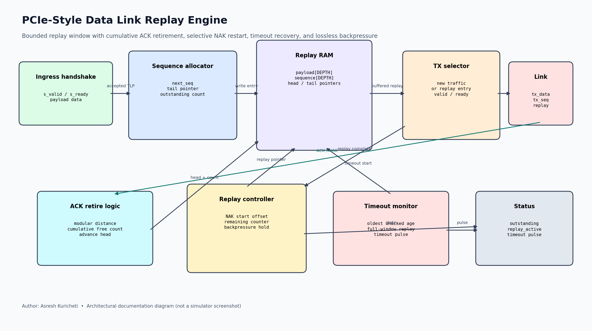
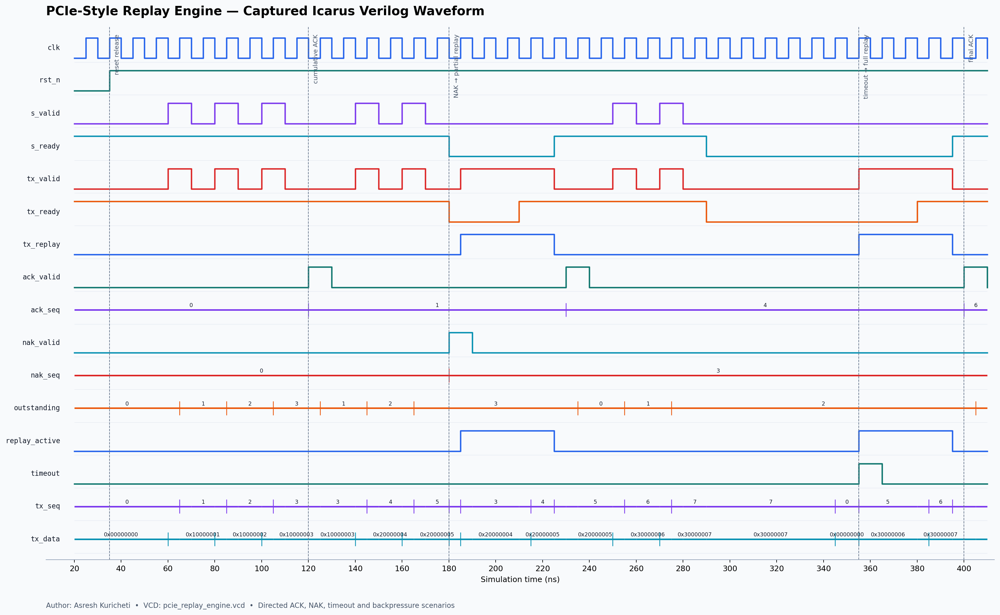

<!-- Author: Asresh Kuricheti -->
# Day 50 — PCIe-Style Data Link Replay Engine

This project implements the reliability window behind a high-speed serial-link
transmitter. Each accepted transaction-layer payload receives a monotonically
increasing sequence number and is retained in a circular replay RAM until a
cumulative ACK retires it. A NAK restarts transmission at the named outstanding
sequence, while an ACK timeout replays the complete unacknowledged window.

The interface deliberately abstracts framing, LCRC generation, DLLPs, and PHY
encoding so the project can focus on the difficult control-plane behavior: modular
sequence arithmetic, circular-buffer ownership, cumulative retirement, selective
replay, timeout recovery, and lossless ready/valid backpressure. It is a
PCIe-inspired teaching implementation, not a wire-compatible PCI Express block.

Current high-value RTL postings motivated this choice. NVIDIA's coherent
high-speed-interconnect role calls out PCIe, CXL, AXI, CHI, link-layer stacks,
high-bandwidth datapaths, performance, and power optimization. Micron's HBM digital
design role emphasizes scalable parameterized RTL, pipelines, FIFOs, arbitration,
CDC/RDC, and verification. This replay engine exercises that same combination of
transaction tracking, buffering, flow control, recovery, and verification rigor.

## Features

- Parameterized payload width, sequence width, replay depth, and timeout.
- Power-of-two circular replay RAM with independent head and tail pointers.
- Half-range-safe modular sequence-number membership tests across wrap-around.
- Cumulative ACK retirement of one or many entries in a single cycle.
- NAK-directed replay from any sequence still inside the outstanding window.
- Timeout-directed replay from the oldest unacknowledged transaction.
- Stable replay data and metadata under downstream backpressure.
- Simultaneous cumulative ACK and new transmission when a full window frees space.
- Explicit occupancy, replay-active, and timeout-event observability.
- Reset-safe state with elaboration checks for invalid parameter combinations.

## Circuit diagram



*Architectural diagram of the implemented circuit, showing the ingress handshake,
sequence allocator, replay RAM, ACK retirement datapath, replay controller, timeout
monitor, and transmit selector. This is a documentation diagram, not a simulator
screenshot.*

## Parameters

| Parameter | Default | Meaning |
|---|---:|---|
| `DATA_W` | 64 | Payload width stored per abstract transaction |
| `SEQ_W` | 12 | Modular sequence-number width |
| `REPLAY_DEPTH` | 8 | Maximum unacknowledged transactions; power of two |
| `TIMEOUT_CYCLES` | 32 | Idle cycles before replaying the outstanding window |
| `PTR_W` | derived | Circular RAM pointer width |
| `COUNT_W` | derived | Occupancy and replay-count width |
| `TIMER_W` | derived | Replay-timeout counter width |

`REPLAY_DEPTH` must not exceed half of the modular sequence space. That constraint
makes subtraction-based window membership unambiguous even when sequence numbers
wrap from their maximum value back to zero.

## Ports

| Port | Direction | Width | Meaning |
|---|---|---:|---|
| `clk` | in | 1 | Rising-edge clock |
| `rst_n` | in | 1 | Asynchronous active-low reset |
| `s_valid_i`, `s_ready_o` | in/out | 1 | New-payload ready/valid handshake |
| `s_data_i` | in | `DATA_W` | New transaction payload |
| `tx_valid_o`, `tx_ready_i` | out/in | 1 | Link-side ready/valid handshake |
| `tx_data_o` | out | `DATA_W` | New or replayed payload |
| `tx_seq_o` | out | `SEQ_W` | Assigned sequence number |
| `tx_replay_o` | out | 1 | Marks a retransmission rather than new traffic |
| `ack_valid_i`, `ack_seq_i` | in | 1 + `SEQ_W` | Cumulative ACK through the supplied sequence |
| `nak_valid_i`, `nak_seq_i` | in | 1 + `SEQ_W` | Replay request beginning at the supplied sequence |
| `outstanding_o` | out | `COUNT_W` | Stored, unacknowledged transaction count |
| `replay_active_o` | out | 1 | Replay walk is active |
| `timeout_replay_pulse_o` | out | 1 | One-cycle timeout-replay event |

## ASCII block diagram

```text
 new payload
 valid/ready
     |
     v
+--------------+   sequence + write   +------------------+
| sequence     |---------------------->| circular replay  |
| allocator    |                       | RAM + head/tail  |
+------+-------+                       +----+--------+----+
       |                                    |        |
       | new traffic                        |        | replay entry
       |                                    |        |
       +----------------------------+       |        v
                                    v       |  +------------+    link
ACK(seq) ---> [cumulative retire] ---> head |  | TX selector| -------->
                                             |  +------+-----+
NAK(seq) ---> [window offset] ---------------+         ^
                                                       |
oldest age -> [timeout monitor] -> replay controller ---+
```

## How it works

### New transmission and allocation

When both sides handshake a new payload, the engine transmits it immediately,
writes the payload and current sequence number into the tail entry, advances the
tail, increments occupancy, and advances the modular sequence counter. New traffic
stalls while replay is active because the link output is then owned by the replay
walker. Link backpressure propagates to `s_ready_o`, so no accepted payload can be
lost.

### Cumulative ACK retirement

The engine subtracts the oldest stored sequence from `ack_seq_i`. If the modular
distance is smaller than the outstanding count, the ACK lies inside the active
window. The head advances by distance plus one and that many entries are retired in
one cycle. An ACK outside the active window is ignored. A valid ACK also terminates
an in-progress replay because every surviving entry was already transmitted before
the replay began.

### NAK replay

The same bounded modular-distance test locates a NAK inside the outstanding window.
The replay pointer starts at `head + distance`, and the remaining counter covers
that entry through the current tail. Every replay beat carries its original payload
and original sequence number with `tx_replay_o` asserted. Pointer and remaining
count advance only on a real `tx_valid_o && tx_ready_i` transfer, keeping the output
stable through arbitrary backpressure.

### Timeout recovery

While entries remain unacknowledged and replay is idle, an age timer counts cycles
without retirement or replay progress. Expiration raises a one-cycle status pulse
and starts a full replay at the oldest entry. ACK, first allocation into an empty
window, NAK, timeout start, and replay progress reset the timer so recovery is tied
to forward progress rather than wall-clock traffic unrelated to the window.

## Simulation timing



*Waveform rendered from the VCD captured during a real Icarus Verilog run. It shows
reset release, new sequence allocation, cumulative ACK retirement, a partial replay
starting at a NAKed sequence, stable replay output under backpressure, a timeout,
full-window replay, and final retirement.*

## Use-case examples

- PCIe or CXL.io endpoint/controller prototypes that need reliable Data Link Layer
  retry behavior below a transaction engine.
- Chiplet die-to-die links that retain packets until the remote die confirms receipt.
- Ethernet, storage, or proprietary SerDes adapters with bounded go-back-N recovery.
- GPU and accelerator fabrics where a replay window protects high-bandwidth traffic
  without forcing software-visible retries.
- FPGA protocol exercisers that inject ACK loss, NAKs, and downstream stalls to
  validate link recovery behavior before ASIC integration.
- Safety-oriented control links that need deterministic buffered retransmission and
  explicit timeout telemetry.

In a complete PCIe transmit path, this engine would sit after Transaction Layer
Packet formation and before Data Link framing/LCRC insertion. ACK/NAK DLLP decoding
would drive its retirement inputs, while negotiated flow-control credits would
qualify the link-side ready signal.

## Running

```bash
make icarus
make verilator
make vcs
make questa
```

All targets compile the same RTL and self-checking SystemVerilog testbench. The
Icarus run writes `pcie_replay_engine.vcd` and prints
`RESULT: *** PASS ***` only after every directed and randomized check succeeds.

## What the testbench checks

The testbench maintains an independent ordered model of payloads and assigned
sequence numbers. Directed tests verify multi-entry cumulative ACK retirement,
NAK replay beginning in the middle of a window, complete timeout replay, output
stability during backpressure, and simultaneous ACK/new traffic at full occupancy.
Forty-eight randomized actions vary payloads, occupancy, cumulative ACK positions,
and NAK start positions while a reduced test sequence width forces wrap-around.
After every operation,
the scoreboard checks payload, sequence, replay classification, and exact occupancy.
A global timeout catches deadlock, and any mismatch immediately prints
`RESULT: *** FAIL ***`; only a fully matching run prints the required pass banner.

## Author

Asresh Kuricheti
