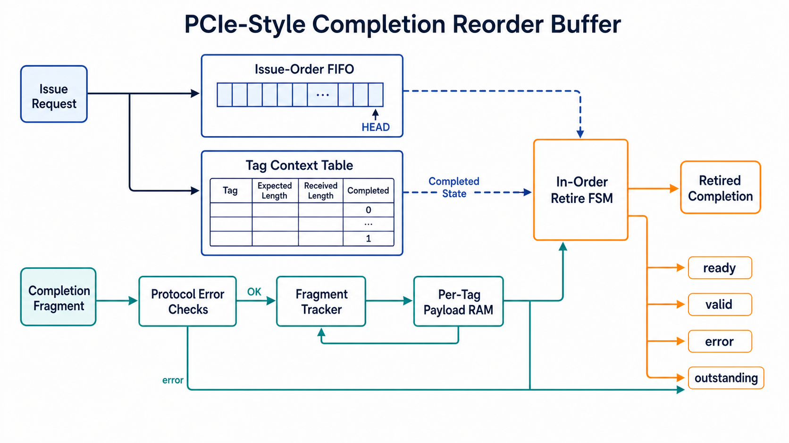
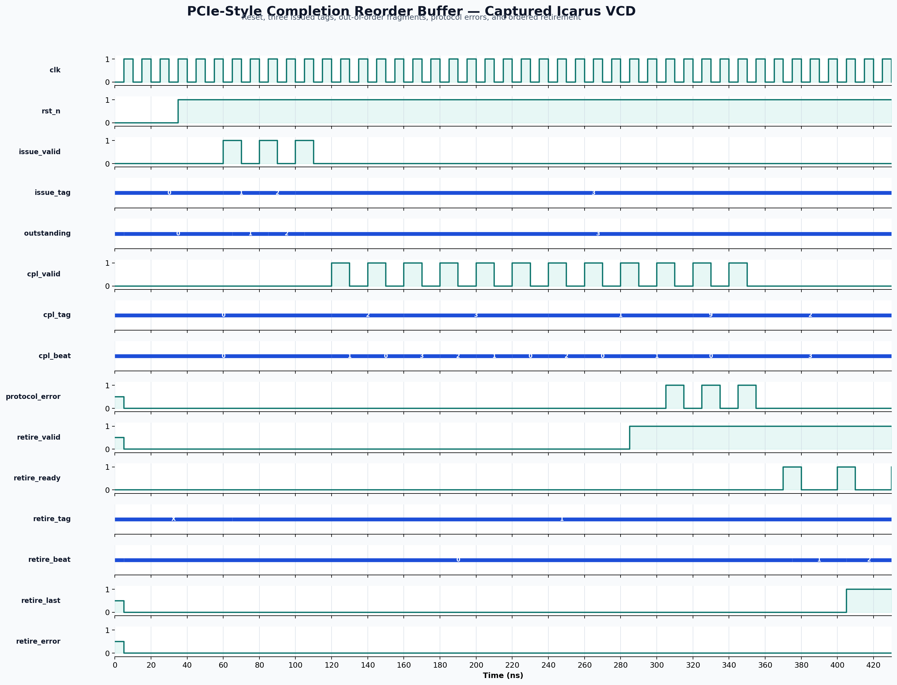

<!-- Author: Asresh Kuricheti -->
# Day 51 — PCIe-Style Completion Reorder Buffer

This project implements a tagged completion buffer for a PCIe-style requester.
Requests enter in issue order, while completion fragments may return in any tag or
beat order. The block tracks every live tag independently, stores fragments in a
per-tag payload RAM, detects malformed traffic, and releases only the oldest fully
completed request. The result is an ordered ready/valid stream suitable for a CPU,
DMA engine, accelerator, or protocol bridge that cannot consume out-of-order
responses.

The interface intentionally abstracts PCIe packet headers, byte enables, split
completion byte counts, and credit accounting. It focuses on the reusable RTL
problem underneath them: finite tag ownership, sparse fragment assembly,
head-of-line retirement, error accumulation, and lossless backpressure. It is a
PCIe-inspired educational block, not a wire-compatible PCI Express endpoint.

Current high-value RTL roles motivated the project. NVIDIA's high-speed I/O role
calls for PCIe/UFS/Ethernet/USB protocol microarchitecture, RTL, performance and
timing ownership; its coherent-interconnect role highlights PCIe, CXL, AXI, CHI,
link-layer stacks, and high-throughput datapaths. Micron's HBM digital-design role
emphasizes parameterized RTL, pipelines, FIFOs, arbitration, memory systems,
CDC/RDC, and verification. A completion reorder buffer combines those exact
transaction-tracking, storage, ordering, and flow-control concerns.

## Features

- Parameterized data width, tag width, issue-window depth, and beats per request.
- Independent context per tag with expected length, received bitmap, completion
  state, and sticky completion-error state.
- Out-of-order arrival across tags and within a multi-beat completion.
- Strict issue-order retirement, even when younger tags finish first.
- Per-tag payload RAM with a stable output during arbitrary backpressure.
- Duplicate-fragment, inactive-tag, and out-of-range-beat detection.
- Sticky error accumulation across all fragments of a request.
- Same-cycle issue and final retirement without corrupting occupancy.
- Reset-safe context invalidation and elaboration-time parameter checks.

## Circuit diagram



*Architecture diagram of the implemented circuit. It shows the issue-order FIFO,
tag context table, fragment validation/tracking, per-tag payload RAM, and in-order
retirement datapath. This is a generated documentation diagram, not a simulator
screenshot.*

## Parameters

| Parameter | Default | Meaning |
|---|---:|---|
| `DATA_W` | 32 | Width of each completion payload beat |
| `TAG_W` | 5 | Request/completion tag width |
| `MAX_OUTSTANDING` | 8 | Maximum live requests; must be a power of two |
| `MAX_BEATS` | 4 | Maximum beats per request; must be a power of two |
| `TAGS` | derived | Number of tag contexts, `2**TAG_W` |
| `PTR_W` | derived | Issue-order FIFO pointer width |
| `COUNT_W` | derived | Outstanding-request counter width |
| `BEAT_W` | derived | Completion beat-index width |
| `LEN_W` | derived | Encoded expected-length width |

## Ports

| Port | Direction | Width | Meaning |
|---|---|---:|---|
| `clk` | in | 1 | Rising-edge clock |
| `rst_n` | in | 1 | Asynchronous active-low reset |
| `issue_valid_i`, `issue_ready_o` | in/out | 1 | Request-allocation handshake |
| `issue_tag_i` | in | `TAG_W` | Unique tag allocated to the request |
| `issue_beats_i` | in | `LEN_W` | Expected payload length, 1 through `MAX_BEATS` |
| `cpl_valid_i`, `cpl_ready_o` | in/out | 1 | Completion-fragment handshake |
| `cpl_tag_i` | in | `TAG_W` | Tag naming the request context |
| `cpl_beat_i` | in | `BEAT_W` | Zero-based fragment position |
| `cpl_data_i` | in | `DATA_W` | Fragment payload |
| `cpl_error_i` | in | 1 | Error associated with this fragment |
| `retire_valid_o`, `retire_ready_i` | out/in | 1 | Ordered output handshake |
| `retire_tag_o` | out | `TAG_W` | Tag of the oldest completed request |
| `retire_beat_o` | out | `BEAT_W` | Current ordered beat position |
| `retire_data_o` | out | `DATA_W` | Retired completion payload |
| `retire_last_o` | out | 1 | Final beat of the current request |
| `retire_error_o` | out | 1 | Sticky error result for the whole request |
| `outstanding_o` | out | `COUNT_W` | Number of issued, not-yet-retired requests |
| `protocol_error_pulse_o` | out | 1 | One-cycle malformed-fragment indication |

## ASCII block diagram

```text
 issue request
 tag + length
      |
      +--------------------+------------------------+
      v                    v                        |
+-------------+     +--------------+                |
| issue-order |     | tag context  |                |
| FIFO        |     | active/len/  |                |
+------+------+     | bitmap/error |                |
       |            +------+-------+                |
       | head tag          ^                        |
       |                   | valid fragment         |
       v                   |                        |
+--------------+    +------+-------+    +-----------+----+
| in-order     |<---| completion   |--->| per-tag        |
| retire FSM   |    | checks       |    | payload RAM    |
+------+-------+    +--------------+    +----------------+
       |
       v
 ordered completion stream
```

## How it works

### Request allocation

An issue handshake appends the tag to a circular FIFO and initializes that tag's
context with its expected length. Allocation is rejected when the window is full,
the tag is already live, or the requested length is outside the supported range.
The FIFO stores only ordering metadata; payload data lives in the indexed tag RAM.

### Fragment assembly and checking

Completion ingress is always ready. The tag selects a context and the beat index
selects both a received-bitmap bit and payload-RAM word. An inactive tag, a beat
beyond the request's expected length, or a duplicate bitmap bit raises
`protocol_error_pulse_o` and cannot overwrite stored data. Every accepted fragment
sets its bitmap bit and ORs its error status into the context. When the resulting
bitmap covers every expected beat, the tag becomes complete.

### In-order retirement

Only the tag at the issue-order FIFO head can drive `retire_valid_o`. A younger tag
may be completely assembled but remains buffered until every older request leaves.
The retirement beat counter walks payload RAM in ascending order. On the final
ready/valid transfer, the block clears that tag's ownership, pops the FIFO, and
decrements occupancy. Because state advances only on a handshake, tag, beat, data,
last, and error remain stable while the consumer is stalled.

## Simulation timing



*Waveform rendered from the VCD captured during a real Icarus Verilog run. The
selected interval shows multiple requests outstanding, younger tags receiving
out-of-order fragments, the oldest tag becoming complete, malformed-fragment error
pulses, and ordered retirement beginning under output backpressure.*

## Use-case examples

- PCIe requester logic that reassembles split completions and presents reads to a
  CPU or DMA datapath in submission order.
- CXL.io and chiplet bridges that translate tagged, out-of-order responses into a
  simpler ordered internal protocol.
- NVMe and storage accelerators with many outstanding reads and variable return
  latency across queues or flash channels.
- GPU, AI, and HBM subsystems that merge responses from parallel memory partitions
  without exposing nondeterministic completion order downstream.
- Network-on-chip endpoints that use transaction IDs internally but feed a legacy
  in-order master interface.
- Verification scoreboards and FPGA protocol exercisers that need synthesizable
  tag tracking plus explicit duplicate/unknown-response telemetry.

In a full PCIe endpoint, this block would sit after completion-header decoding and
credit enforcement. A production implementation would extend each context with
requester ID, lower address, byte count, poison/unsupported-request status, timeout
tracking, and host-visible error reporting.

## Running

```bash
make icarus
make verilator
make vcs
make questa
```

All targets compile the same RTL and self-checking SystemVerilog testbench. The
Icarus run writes `pcie_completion_reorder_buffer.vcd` and prints
`RESULT: *** PASS ***` only after every directed and randomized check succeeds.

## What the testbench checks

The testbench keeps an independent per-tag golden payload model plus the original
issue order. Directed traffic completes younger tags first, delivers beats in
reverse order, injects a sticky completion error, and confirms that no tag bypasses
the incomplete head. It deliberately sends duplicate, inactive-tag, and
out-of-range fragments and checks the error pulse. Eight randomized batches vary
lengths, payloads, tag reuse, error placement, completion order, beat order, and
retirement backpressure. Every retired beat is checked for tag, position, data,
last, and request-level error; occupancy is checked after every allocation and
retirement. A global timeout catches deadlock, and only a fully matching run prints
`RESULT: *** PASS ***`.

## Career relevance

- [NVIDIA ASIC Design Engineer, High Speed IO](https://nvidia.wd5.myworkdayjobs.com/en-US/NVIDIAExternalCareerSite/job/ASIC-Design-Engineer--High-Speed-IO_JR2020595)
- [NVIDIA Senior Design Engineer, Coherent High Speed Interconnect](https://nvidia.wd5.myworkdayjobs.com/nvidiaexternalcareersite/job/us-ca-santa-clara/senior-design-engineer--coherent-high-speed-interconnect_jr2016641)
- [Micron MTS Digital Design Engineer, HBM](https://careers.micron.com/careers/job/40623857)

## Author

Asresh Kuricheti
